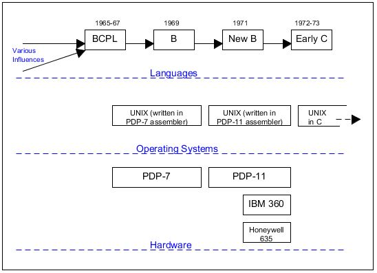
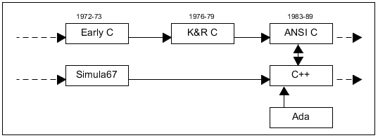
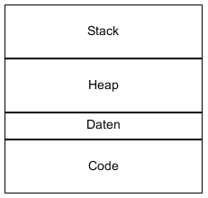
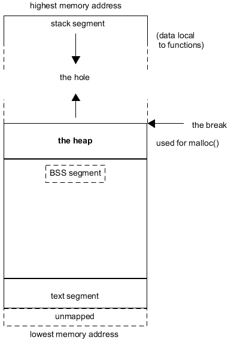
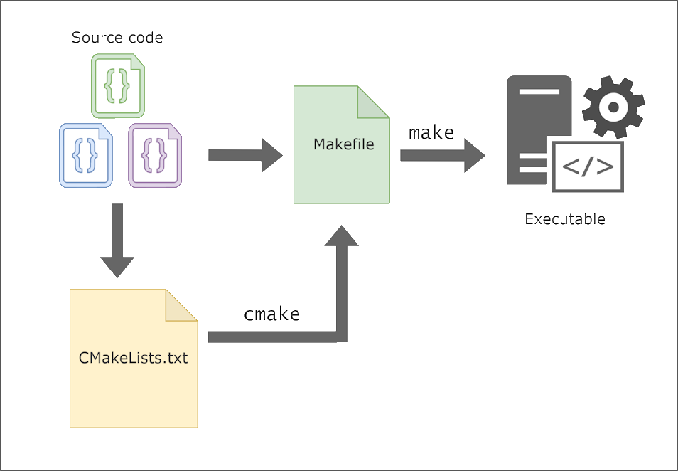
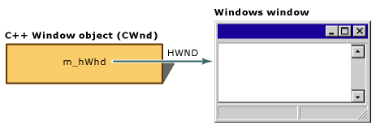
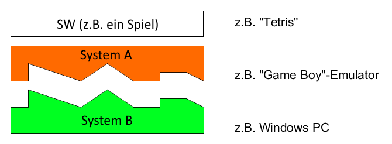
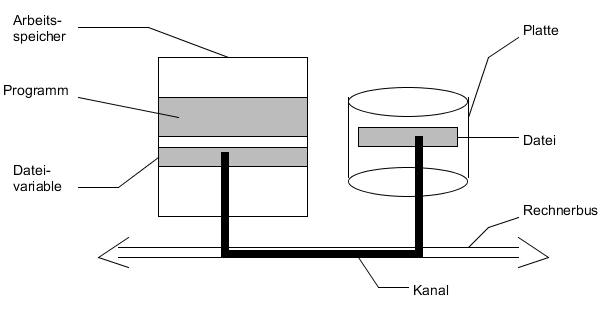
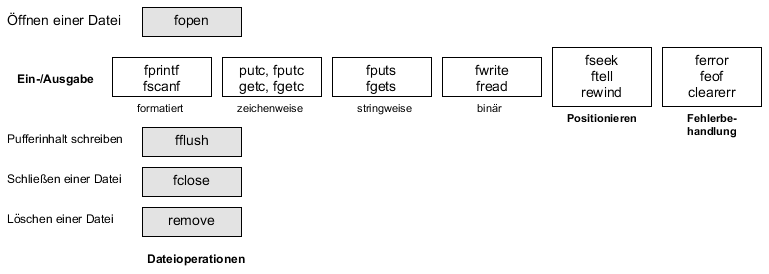
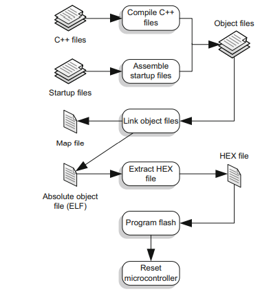

{::options parse_block_html="true" /}  

[Back](../)  

&nbsp;

# C und C++
---  

&nbsp;

### 1. Basics    
&nbsp;&nbsp;&nbsp;&nbsp;&nbsp; [<font size="-1">1.1 Eigenschaften von C</font>](#ch1-1)  
&nbsp;&nbsp;&nbsp;&nbsp;&nbsp; [<font size="-1">1.2 C und C++</font>](#ch1-2)  
&nbsp;&nbsp;&nbsp;&nbsp;&nbsp;&nbsp;&nbsp;&nbsp;&nbsp;&nbsp; [<font size="-1">1.2.1 'Object Oriented Programming'</font>](#ch1-2-1)  
&nbsp;&nbsp;&nbsp;&nbsp;&nbsp; [<font size="-1">1.3 L- und R-Werte</font>](#ch1-3)  
&nbsp;&nbsp;&nbsp;&nbsp;&nbsp; [<font size="-1">1.4 Auswertungsreihenfolge</font>](#ch1-4)  
&nbsp;&nbsp;&nbsp;&nbsp;&nbsp; [<font size="-1">1.5 Headers und Libraries</font>](#ch1-5)  
&nbsp;&nbsp;&nbsp;&nbsp;&nbsp; [<font size="-1">1.6 Memory Management - 'Heap' vs 'Stack'</font>](#ch1-6)  
&nbsp;&nbsp;&nbsp;&nbsp;&nbsp; [<font size="-1">1.7 Die Funktion `main`</font>](#ch1-7)  
&nbsp;&nbsp;&nbsp;&nbsp;&nbsp; [<font size="-1">1.8 Übersicht Datentypen</font>](#ch1-8)  
&nbsp;&nbsp;&nbsp;&nbsp;&nbsp; [<font size="-1">1.9 Threads und Prozesse</font>](#ch1-9)  
&nbsp;&nbsp;&nbsp;&nbsp;&nbsp; [<font size="-1">1.10 Benutzerdefinierte Datentypen</font>](#ch1-10)  
&nbsp;&nbsp;&nbsp;&nbsp;&nbsp;&nbsp;&nbsp;&nbsp;&nbsp;&nbsp; [<font size="-1">1.10.1 `typedef`</font>](#ch1-10-1)  
&nbsp;&nbsp;&nbsp;&nbsp;&nbsp;&nbsp;&nbsp;&nbsp;&nbsp;&nbsp; [<font size="-1">1.10.2 `enum`</font>](#ch1-10-2)  
&nbsp;&nbsp;&nbsp;&nbsp;&nbsp;&nbsp;&nbsp;&nbsp;&nbsp;&nbsp; [<font size="-1">1.10.3 `struct`</font>](#ch1-10-3)  
&nbsp;&nbsp;&nbsp;&nbsp;&nbsp;&nbsp;&nbsp;&nbsp;&nbsp;&nbsp; [<font size="-1">1.10.4 `union`</font>](#ch1-10-4)  
&nbsp;&nbsp;&nbsp;&nbsp;&nbsp; [<font size="-1">1.11 Precompiled Header</font>](#ch1-11)  
&nbsp;&nbsp;&nbsp;&nbsp;&nbsp; [<font size="-1">1.12 'Header Guard' (oder 'Include Guard')</font>](#ch1-12)  
&nbsp;&nbsp;&nbsp;&nbsp;&nbsp; [<font size="-1">1.13 'Calling Convention' (`__stdcall`)</font>](#ch1-13)  
&nbsp;&nbsp;&nbsp;&nbsp;&nbsp; [<font size="-1">1.14 [c++] Namespaces</font>](#ch1-14)  
&nbsp;&nbsp;&nbsp;&nbsp;&nbsp; [<font size="-1">1.15 [c++] `extern c`</font>](#ch1-15)  
&nbsp;&nbsp;&nbsp;&nbsp;&nbsp; [<font size="-1">1.16 [c++] 'Forward Declaration'</font>](#ch1-16)  
&nbsp;&nbsp;&nbsp;&nbsp;&nbsp; [<font size="-1">1.17 Function 'Prototype' and Visibility in C</font>](#ch1-17)  
&nbsp;&nbsp;&nbsp;&nbsp;&nbsp; [<font size="-1">1.18 Präprozessor/Compiler/Linker</font>](#ch1-18)  
&nbsp;&nbsp;&nbsp;&nbsp;&nbsp;&nbsp;&nbsp;&nbsp;&nbsp;&nbsp; [<font size="-1">1.18.1 Basics + Compiler </font>](#ch1-18-1)  
&nbsp;&nbsp;&nbsp;&nbsp;&nbsp;&nbsp;&nbsp;&nbsp;&nbsp;&nbsp; [<font size="-1">1.18.2 Präprozessor </font>](#ch1-18-2)  
&nbsp;&nbsp;&nbsp;&nbsp;&nbsp;&nbsp;&nbsp;&nbsp;&nbsp;&nbsp; [<font size="-1">1.18.3 Linker </font>](#ch1-18-3)  
&nbsp;&nbsp;&nbsp;&nbsp;&nbsp;&nbsp;&nbsp;&nbsp;&nbsp;&nbsp; [<font size="-1">1.18.4 make / cmake / qmake </font>](#ch1-18-4)  
&nbsp;&nbsp;&nbsp;&nbsp;&nbsp;&nbsp;&nbsp;&nbsp;&nbsp;&nbsp; [<font size="-1">1.18.5 gcc, g++, etc </font>](#ch1-18-5)  
&nbsp;&nbsp;&nbsp;&nbsp;&nbsp; [<font size="-1">1.19 'Name Mangling' (or 'Name decoration')</font>](#ch1-19)  
&nbsp;&nbsp;&nbsp;&nbsp;&nbsp; [<font size="-1">1.19 'Name Mangling' (or 'Name decoration')</font>](#ch1-19)  
&nbsp;&nbsp;&nbsp;&nbsp;&nbsp; [<font size="-1">1.20 Single quotes vs. double quotes</font>](#ch1-20)  

### 2. Arrays
&nbsp;&nbsp;&nbsp;&nbsp;&nbsp; [<font size="-1">2.1 Basics</font>](#ch2-1)  
&nbsp;&nbsp;&nbsp;&nbsp;&nbsp; [<font size="-1">2.2 Übergabe von Arrays</font>](#ch2-2)  

### 3. Pointer
&nbsp;&nbsp;&nbsp;&nbsp;&nbsp; [<font size="-1">3.1 Referencing and Dereferencing</font>](#ch3-1)  
&nbsp;&nbsp;&nbsp;&nbsp;&nbsp; [<font size="-1">3.2 Addition und Subtraktion</font>](#ch3-2)  
&nbsp;&nbsp;&nbsp;&nbsp;&nbsp; [<font size="-1">3.3 Call-by-Value</font>](#ch3-3)  
&nbsp;&nbsp;&nbsp;&nbsp;&nbsp; [<font size="-1">3.4 Call-by-Reference</font>](#ch3-4)  
&nbsp;&nbsp;&nbsp;&nbsp;&nbsp; [<font size="-1">3.5 Pointer auf Pointer</font>](#ch3-5)  
&nbsp;&nbsp;&nbsp;&nbsp;&nbsp; [<font size="-1">3.6 Pointer auf Funktionen</font>](#ch3-6)  
&nbsp;&nbsp;&nbsp;&nbsp;&nbsp; [<font size="-1">3.7 'void' Pointer in C</font>](#ch3-7)  
&nbsp;&nbsp;&nbsp;&nbsp;&nbsp; [<font size="-1">3.8 [c++] Smart Pointer</font>](#ch3-8)  

&nbsp;&nbsp;&nbsp;&rarr; Pointer vs. Arrays   
&nbsp;&nbsp;&nbsp;&nbsp;&nbsp;&nbsp;&nbsp;&nbsp; [<font size="-1"> Basics</font>](#ch_pva_1)  
&nbsp;&nbsp;&nbsp;&nbsp;&nbsp;&nbsp;&nbsp;&nbsp; [<font size="-1"> Das Schlüsselwort `const` bei Pointern und Arrays</font>](#ch_pva_2)  

### 4. char-Arrays / char-Pointer
&nbsp;&nbsp;&nbsp;&nbsp;&nbsp; [<font size="-1">4.1 char-Arrays und Pointern auf Zeichenketten</font>](#ch4-1)  
&nbsp;&nbsp;&nbsp;&nbsp;&nbsp; [<font size="-1">4.2 Initialisierung von char-Arrays</font>](#ch4-2)  
&nbsp;&nbsp;&nbsp;&nbsp;&nbsp; [<font size="-1">4.3 Storage for Strings in C</font>](#ch4-3)  
&nbsp;&nbsp;&nbsp;&nbsp;&nbsp; [<font size="-1">4.4 Relevant Functions</font>](#ch4-4)  
&nbsp;&nbsp;&nbsp;&nbsp;&nbsp;&nbsp;&nbsp;&nbsp;&nbsp;&nbsp; [<font size="-1">4.4.1 'memcpy()'</font>](#ch4-4-1)  
&nbsp;&nbsp;&nbsp;&nbsp;&nbsp;&nbsp;&nbsp;&nbsp;&nbsp;&nbsp; [<font size="-1">4.4.2 'memset()'</font>](#ch4-4-2)  
&nbsp;&nbsp;&nbsp;&nbsp;&nbsp;&nbsp;&nbsp;&nbsp;&nbsp;&nbsp; [<font size="-1">4.4.3 'strcpy()'</font>](#ch4-4-3)  
&nbsp;&nbsp;&nbsp;&nbsp;&nbsp;&nbsp;&nbsp;&nbsp;&nbsp;&nbsp; [<font size="-1">4.4.4 'strcmp()'</font>](#ch4-4-4)  
&nbsp;&nbsp;&nbsp;&nbsp;&nbsp;&nbsp;&nbsp;&nbsp;&nbsp;&nbsp; [<font size="-1">4.4.5 'strcat()'</font>](#ch4-4-5)  
&nbsp;&nbsp;&nbsp;&nbsp;&nbsp;&nbsp;&nbsp;&nbsp;&nbsp;&nbsp; [<font size="-1">4.4.6 'strlen()'</font>](#ch4-4-6)  

### 5. Programmsyntax und -semantik   
&nbsp;&nbsp;&nbsp;&nbsp;&nbsp; [<font size="-1">5.1 Der Bedingungsoperator `A ? B : C`</font>](#ch5-1)  
&nbsp;&nbsp;&nbsp;&nbsp;&nbsp; [<font size="-1">5.2 `switch - case`</font>](#ch5-2)  
&nbsp;&nbsp;&nbsp;&nbsp;&nbsp; [<font size="-1">5.3 Das Schlüsselwort `extern`</font>](#ch5-3)  
&nbsp;&nbsp;&nbsp;&nbsp;&nbsp; [<font size="-1">5.4 Das Schlüsselwort `static`</font>](#ch5-4)  
&nbsp;&nbsp;&nbsp;&nbsp;&nbsp; [<font size="-1">5.5 `printf` Formatierungszeichen</font>](#ch5-5)  
&nbsp;&nbsp;&nbsp;&nbsp;&nbsp; [<font size="-1">5.6 `True` and `False` in C</font>](#ch5-6)  
&nbsp;&nbsp;&nbsp;&nbsp;&nbsp; [<font size="-1">5.7 [c++] Konstruktoren</font>](#ch5-7)  
&nbsp;&nbsp;&nbsp;&nbsp;&nbsp; [<font size="-1">5.8 Das Schlüsselwort `pragma`</font>](#ch5-8)  
&nbsp;&nbsp;&nbsp;&nbsp;&nbsp; [<font size="-1">5.9 [c++] `Handle`</font>](#ch5-9)  
&nbsp;&nbsp;&nbsp;&nbsp;&nbsp; [<font size="-1">5.10 'Exceptions' - `Try / Catch`</font>](#ch5-10)  
&nbsp;&nbsp;&nbsp;&nbsp;&nbsp; [<font size="-1">5.11 [c++] 'reinterpret_cast' type casting</font>](#ch5-11)  
&nbsp;&nbsp;&nbsp;&nbsp;&nbsp; [<font size="-1">5.12 [c++] 'Compile Time Constants': 'constexpr'</font>](#ch5-12)  
&nbsp;&nbsp;&nbsp;&nbsp;&nbsp; [<font size="-1">5.13 Zeichenkonstanten</font>](#ch5-13)  

### 6. Bibliotheken, API's und *make*   
&nbsp;&nbsp;&nbsp;&nbsp;&nbsp; [<font size="-1">6.1 Static Library Basics</font>](#ch6-1)  
&nbsp;&nbsp;&nbsp;&nbsp;&nbsp; [<font size="-1">6.2 [Win API] `#define DECLARE_HANDLE(n)`</font>](#ch6-2)  
&nbsp;&nbsp;&nbsp;&nbsp;&nbsp; [<font size="-1">6.3 [Win API] `HWND` (Fenster Handle)</font>](#ch6-3)  
&nbsp;&nbsp;&nbsp;&nbsp;&nbsp; [<font size="-1">6.4 [c++] 'STL: The Standard Template Library' (Container-Klasse)</font>](#ch6-4)  
&nbsp;&nbsp;&nbsp;&nbsp;&nbsp; [<font size="-1">6.5 [make] Call 'Makefile' in Subdirectory</font>](#ch6-5)  
&nbsp;&nbsp;&nbsp;&nbsp;&nbsp; [<font size="-1">6.6 String</font>](#ch6-6)  
&nbsp;&nbsp;&nbsp;&nbsp;&nbsp; [<font size="-1">6.7 Code examining tools</font>](#ch6-7)  

### 7. How To's & Special Syntax   
&nbsp;&nbsp;&nbsp;&nbsp;&nbsp; [<font size="-1">7.1 Emulation</font>](#ch7-1)  
&nbsp;&nbsp;&nbsp;&nbsp;&nbsp; [<font size="-1">7.2 Code optimization turned off for debugging in 'Release' version</font>](#ch7-2)  
&nbsp;&nbsp;&nbsp;&nbsp;&nbsp; [<font size="-1">7.3 Digital Filter Implementation</font>](#ch7-3)  
&nbsp;&nbsp;&nbsp;&nbsp;&nbsp; [<font size="-1">7.4 Access file in .exe directory</font>](#ch7-4)  
&nbsp;&nbsp;&nbsp;&nbsp;&nbsp; [<font size="-1">7.5 Hash Tables</font>](#ch7-5)  
&nbsp;&nbsp;&nbsp;&nbsp;&nbsp; [<font size="-1">7.6 Datei Schreiben/Lesen in C</font>](#ch7-6)  
&nbsp;&nbsp;&nbsp;&nbsp;&nbsp; [<font size="-1">7.7 X-Macros in C</font>](#ch7-7)  
&nbsp;&nbsp;&nbsp;&nbsp;&nbsp; [<font size="-1">7.8 [c++] Embedded C++: Build process</font>](#ch7-8)  
&nbsp;&nbsp;&nbsp;&nbsp;&nbsp; [<font size="-1">7.9 Bit-Felder</font>](#ch7-9)  

### 8. Warnings and Errors  
&nbsp;&nbsp;&nbsp;&nbsp;&nbsp; [<font size="-1">8.1 'Warning': no previous prototype for 'function'</font>](#ch8-1)  
&nbsp;&nbsp;&nbsp;&nbsp;&nbsp; [<font size="-1">8.2 'Segmentation Fault'</font>](#ch8-2)  

&nbsp;

---  

&nbsp;

# Basics

&nbsp;

<a name="ch1-1"></a>
### 1.1 Eigenschaften von C

C ist eine relativ "maschinennahe" Sprache. C arbeitet mit denselben Objekten wie der Prozessor, nämlich mit **Zahlen** und **Adressen**. Auch Zeichen  werden als Zahlen gesehen, boolesche Variablen gibt es nicht und die Aufzählungskonstanten von Aufzählungstypen entsprechen ganzen Zahlen. Letztlich arbeitet C mit  
- verschiedenen Integer-Datentypen,  
- verschiedenen Gleitpunkt-Datentypen,  
- zusammengesetzten Datentypen wie  
   - Strukturen,
   - Unionen,  
   - Bitfeldern,  
- sowie Adressen.  

Die Sprache C erlaubt eine **hardwarenahe Programmierung** unter anderem durch direkte Zugriffe auf Adressen im Speicher oder durch Bitoperationen. C-Compiler unterstützen oftmals auch - in nicht standardisierter Weise - den Zugriff auf Hardware-Register.

C enthält die Elemente der **Strukturierten Programmierung**. C hat ein **Typkonzept**, das allerdings **nicht streng** ist. Der Compiler selbst führt  viele **implizite Typwandlungen** u.a. bei Zuweisungen durch. Bei unverträglichen Datentypen werden allerdings keine automatischen Umwandlungen durchgeführt, sondern eine Fehlermeldung erzeugt.  
&nbsp;

**Declaration vs Definition**  
A *definition* is the special kind of declaration that creates an object; a *declaration* indicates a name that allows you to refer to an object created here or elsewhere. Let's review the terminology:  

|Term|Occurence|Definition|
|:---|:---|:---|
|Definition|Occurs in one place|Specifies the type of an object; reserves storage for it; is used to create new objects.  <br /> Example: `int my_array[100];`|  
|Declaration|Can occure multiple times|Describes the type of an object; is used to refer to objects defined elsewhere (e.g. in another file).  <br /> Example: `extern int my_array[];`|  

The declaration of an external object tells the compiler the type and name of the object, and that memory allocation is done somewhere else. Since you aren't allocating memory for the array at this point, you don't need to provide information on how big it is in total. You do have to provide the size of all array dimensions except the leftmost one — this gives the compiler enough information to generate indexing code.  

&nbsp;

**Parameter vs Argument** (of Function)  

|Term|Definition|Example|
|:---|:---|:---|
|*Parameter*|is a variable defined in a function definition or a function prototype declaration. Some people call this a "formal parameter."|`int power( int base, int n);` <br /> `base` and `n` are parameters.|
|*Argument*|is a value used in a particular call to a function. Some people call this an "actual parameter."|`i = power(10, j);` <br /> `10` and `j` are arguments. The argument can be different for the different calls of a function.|

&nbsp;

**Symbol Overloading in C**  

|Term |Definition |  
|:---|:---|  
|*static* | Inside a function, *variable retains its value between calls* <br /> At the function level, *visible only in this file*|  
|*extern* | Applied to a function definition, *has global scope* (and is redundant) <br /> Applied to a variable, *defined elsewhere*|  
|*void* | As the return type of a function, *doesn't return a value* <br /> In a pointer declaration, the type of a generic pointer <br /> In a parameter list, *takes no parameters*|  
|*\** | The multiplication operator <br /> Applied to a pointer, indirection <br /> In a declaration, a pointer |  
|*&* | Bitwise *AND* operator <br /> Address-Of operator |  
|*=* <br /> *==* | Assignment operator <br /> Comparison operator |  
|*\<=* <br /> *\<<=* | Less-than-or-equal-to operator <br /> Compound shift-left assignment operator |  
|*\<* | Less-than operator <br /> Left delimiter in *#include* directive |  
|*( )* | Enclose formal parameters in a function call <br /> Make a function call <br /> Provide expression precedence <br /> Convert (cast) a value t  a different type <br /> Define a macro with arguments <br /> Make a macro call with arguments <br /> Enclose the operand of the *sizeof* operator when it is a typename |

&nbsp;

**Initialisation vs Assignment**  

When we write  
```c
data_type variableName = someValue;
```
outside of a function, we are first declaring *variableName* to be a variable of the type *data_type*.  

Subsequently, an assignment of a value is being done so it's **initialising** it to *someValue*.
> This is a special type of **function**, a system function, known as **initialisation**.

&nbsp;

But writing  
```c
variableName = someValue;
```
outside of a function, means we are attempting to assign *someValue* to *variableName* outside the scope of any function, and outside the scope of an initialisation. This is not possible.  

> Code only executes from within called functions, with the exception of **initialisation**, which occurs during an initial assignment.

&nbsp;

<a name="ch1-2"></a>
### 1.2 C und C++

C++ ist eine Weiterentwicklung von C. C++ wurde entworfen, um zusätzlich zum klassischen C-Programmierstil  
- ein objektorientiertes Programmieren zu unterstützen  
- und ein **strenges Typkonzept für selbst definierte Datentypen. die Klassen**, zu realisieren, bei dem für einen Datentyp nur definierte Operationen zulässig sind. Hierbei darf der Compiler nur sehr eingeschränkte implizite Typwandlungen durchführen, ansonsten muss er Typverletzungen anzeigen.  

Während C als "Super-Assembler" für hardwarenahe Software entwickelt wurde, liegt die Zielrichtung bei der Entwicklung von C++ darin, dem Programmierer neue Sprachmittel wie z.B. Klassen in die Hand zu geben, um die Anwendungsprobleme zu formulieren.  

Der ANSI-C Standard revidierte ursprüngliche Inkompatibilitäten von C und C++, so dass C++ so nahe an C ist wie möglich. Eine hundertprozentige Kompatibilität ist jedoch nicht das Ziel, weil C++ eine höhere Typsicherheit anstrebt als C.  

&nbsp;

  
C in der Verwandschaftstafel höherer Programmiersprachen  

&nbsp;

  
Early C, UNIX und zugehörige Hardware

&nbsp;

  
Later C and C++  

&nbsp;

Sprachen und ihr Einsatzbereich:  
- `C` - systems programming, embedded systems
- `Objective C` - programming apps, IOS/OSX  
- `Ada` - real-time systems, aerospace, defense  
- `Cobol` - business programming  
- `Fortran` - scientific, parallel programming  
- `C++` - game programming  
- `Python` - scientific programming  

&nbsp;

&nbsp;

<a name="ch1-2-1"></a> **`Object-Oriented Programming`**  

> "Object-oriented programming is characterized by inheritance and dynamic binding. C++ supports inheritance through class derivation. Dynamic binding is provided by virtual class functions. Virtual functions provide a method of encapsualation the implementation details of an inheritance hierarchy."  

|Term |Definition |  
|:---|:---|  
|*Abstraction* |The process of refining away the unimportant details of an object, so that only the essential characteristics that describe it remain. Abstraction is a design activity. The other concepts are the OOP features that provide it. |  
|*Class* |A user defined type, just as *int* is a built-in type. The built-in types have well-defined operations (arithmetic etc.) on the, and the class mechanism must allow the programmer to specify operations on the class types he or she defines, too. Anything in a **class** is known as a **member** of the class. |  
|*Object* |A specifc variable of a class type, just as *j* may be a specific variable of type *int*. An **object** is also known as **instance** of a class. |  
|*Encapsulation* |Grouping together the types, data and functions that make up a class. In C, a header file provides a very weak example of encapsulation. It is a feeble example because it is a purely lexical convention, and the compiler knows nothing about the header file as a semantic unit. |  
|*Inheritance* |This is the big one - allowing one class to receive the data structures and functions described in a simpler base class. The derived class gets the operations and data of the base class, and can spezialize or customize them as needed. It can also add new data and function members. There's no example in C that suggests the concept of inheritance. C does not have anything resembling this feature. |  

Now C++ is a rather large language. As a concrete example, the size of a C compiler front-end might be around 40,000 lines; a C++ compiler front-end might be twice as big, or more.  

**Abstraction** is useful in software because it allows the programmer to:  
- hide irrelevant detail, and concentrate on essentials  
- present a "black box" interface to the outside world. The interface specifies the valid operations on the object, but does not indicate how the object will implement them internally  
- break a complicated system down into independent components. This in turn localizes knowledge, and prevents undisciplined interaction between components  
- reuse and share code  

C supports **abstraction** through allowing the user to define new types (*struct*, *enum*) that are almost as convenient as the predefined types (*int*, *char*, etc), and to use them in a similar way.  

**The Key Idea: A class**  
> A class is just  a user-defined type with all the operations on it.  
> A class is often implemented as a struct of data, grouped together with pointers-to-functions that operate on that data. The compiler imposes strong typing - ensuring that these functions are only invoked for objects of the class, and that no other functions are invoked for the objects.  

The C++ class accomplishes all this. It can be compared to a struct, and indeed can be conveniently implemented as a struct. The general form is:  
```cpp
class <classname> {
  <availability>: declaration
     ...
  <availability>: declaration
};
```
\<availability\> := *public*, *protected* or *private*

&nbsp;

**Other new concepts with C++**  

- *Exceptions*  
  Borrowed from Ada and also from Clu (an experimental language developed at MIT, in which the key idea is a *cluster*). These are for changing the flow of control for error-handling. They simplify some kinds of error-handling by automatically diverting processing to a part of the program that can process the error.
- Operators `new` and `delete`  
  The operators *new* and *delete*, to replace `malloc()` and `free()` function calls. The operators are slightly more convenient (the *sizeof* calculation is done implicitly for example, and the proper constructor/destructor is called). *new* truly creates an object, whereas *malloc* just allocates memory.
- *Call-by-reference*  
  C uses only call-by-value (except for arrays). C++ brings call-by-reference into the language.  

&nbsp;

<a name="ch1-3"></a>
### 1.3 L- und R-Werte  

Ausdrücke haben eine unterschiedliche Bedeutung, je nachdem, ob sie links oder rechts vom Zuweisungsoperator stehen. Im Beispiel  
> a = b  

steht der Ausdruck auf der rechten Seite für einen Wert, während der Ausdruck auf der linken Seite die Stelle angibt, an der der Wert zu speichern ist.

> Ein **Ausdruck** stellt einen **L-Wert** (**lvalue** oder **left value**) dar, wenn er sich auf ein **Speicherobjekt** bezieht. Ein solcher Ausdruck kann links und rechts des Zuweisungsoperators stehen.  

> Ein **Ausdruck** der keinen L-Wert darstellt, stellt einen **R-Wert** (**r-value** oder **right value**) dar. Er bezieht sich nicht auf ein **Speicherobjekt**. Er darf nur rechts des Zuweisungsoperators stehen. Einem R-Wert kann man also nichts zuweisen.  

Steht ein L-Wert rechts neben dem Zuweisungsoperator, so wird dessen Namen bzw. Adresse benötigt, um an der entsprechenden Speicherstelle den Wert der Variablen abzuholen.  

&nbsp;

````c  
int i;
int * ptr;
````

  
Beispiele für L- und R-Werte  

&nbsp;

> Bestimmte Operatoren können nur auf L-Werte angewandt werden. So kann man den Inkrementoperator **++** oder den Adressoperator **&** nur auf L-Werte anwenden.  

&nbsp;

<a name="ch1-4"></a>
### 1.4 Auswertungsreihenfolge  

Wie in der Mathematik spielt es bei C eine wichtige Rolle, in welcher Reihenfolge ein Ausdruck berechnet wird.  

1. Wie in der Mathematik werden als erstes **Teilausdrücke in Klammern** ausgewertet.  
2. Dann werden **Ausdrücke mit unären Operatoren** ausgewertet.  
   Unäre Operatoren werden von rechts nach links angewendet. Dies bedeutet, dass  
      2.1 zuerst die **Postfix-Operatoren** auf ihre Operanden  
      2.2 und dann die **Präfix-Operanden** auf ihre Operanden angewendet werden  
3. Anschließend werden Teilausdrücke mit **mehrstelligen Operatoren** ausgewertet  

<u> oder nochmals in Englisch:</u>  

A &nbsp;&nbsp;&nbsp; Declarations are read by starting with the name and then reading in precedence order.  
B &nbsp;&nbsp;&nbsp; The precedence, from high to low, is:  
&nbsp;&nbsp;&nbsp;&nbsp;&nbsp;   B.1 &nbsp;&nbsp;&nbsp; parentheses  grouping together parts of a declaration  
&nbsp;&nbsp;&nbsp;&nbsp;&nbsp;   B.2 &nbsp;&nbsp;&nbsp; the postfix operators:  
&nbsp;&nbsp;&nbsp;&nbsp;&nbsp;&nbsp;&nbsp;&nbsp;&nbsp;&nbsp;&nbsp;&nbsp;&nbsp;&nbsp;&nbsp;&nbsp; parentheses ( ) indicating a function, and  
&nbsp;&nbsp;&nbsp;&nbsp;&nbsp;&nbsp;&nbsp;&nbsp;&nbsp;&nbsp;&nbsp;&nbsp;&nbsp;&nbsp;&nbsp;&nbsp; square brackets [ ] indicating an array  
&nbsp;&nbsp;&nbsp;&nbsp;&nbsp;   B.3 &nbsp;&nbsp;&nbsp; the prefix operator: the asterisk denoting "pointer to"  
C &nbsp;&nbsp;&nbsp; If a `const` and/or `volatile` keyword is next to a type specifier (e.g. `int`, `long`,etc) it applies to the type specifier. Otherwise the `const` and/or `volatile` keyword applies to the pointer asterisk on its immediate left.  
&nbsp;

An example of solving a declaration using the rule above:  
```c
char* const *(*next)();
```

|Rule to apply |Explanation |  
|:---|:---|  
|A|First, go to the variable name, "next", and note that it is directly enclosed by parentheses.|  
|B.1|So we group it with what else is in the parentheses, to get "next is a pointer to..." |  
|B|Then we go outside the parentheses, and have a choice  of a prefix asterisk, or a postfix pair of parentheses.|  
|B.2|Rule B.2 tells us the highest precedence thing is the function parentheses at the right, so we have "next is a pointer to a function returning..."|  
|B.3|Then process the prefix "*" to get "pointer to".|  
|C|Finally, take the `char *const`, as a constant pointer to a character.|  

Then put it all together to read:  
> "`next` is a pointer to a function returning a pointer to a const pointer-to-char"  

and we are done.

&nbsp;

**Beispielausdrücke:**  

|Ausdruck |Beschreibung |  
|:---|:---|  
|`char **argv`|*argv*: Zeiger auf Zeiger auf char.|
|`int (*daytab)[13]`|*daytab*: Zeiger auf Vektor[13] mit int.|
|`int *daytab[13]`|*daytab*: Vektor[13] mit Zeiger auf int.| 
|`void *comb()`|*comp*: Funktion mit Resultat Zeiger auf void.|
|`void (*comp)`|*comp*: Zeiger auf Funktion mit Resultat void.|
|`char (*(*x())[])()`|*x*: Funktion mit Resultat Zeiger auf Vektor[] <br /> *m*:Zeiger auf Funktion mit Resultat char.|
|`char (*(*x[3])())[5]`|*x*: Vektor[3] mit Zeiger auf Funktion mit Resultat Zeiger auf Vektor[5] mit char.|

&nbsp;

<a name="ch1-5"></a>
### 1.5 Headers and Libraries  
Generally, a header file notifies the compiler of certain things (mostly their existence or declarations) so that the compiler can correctly build a single translation unit (such as a single C file).  

A library file is the actual executable code that does the work as specified in that header file. This is linked in by the linker to provide the actual functionality (the definitions rather than just the declarations).  

So, for example, you must have the line `#include <pthread.h>`  which tells the compiler all about the existence of the functions but doesn't actually provide the implementation of those things.  

In the Makefile, for this example, the `-lpthread` option tells the linker that it should locate a library based on the `pthread` name from which it can pull in the actual implementations, in order to form the final executable.  

Similarly, while `stdio.h` holds information about the I/O stuff, the actual code for it will be in the runtime library (though you rarely have to link that library specifically since the compiler will try to take care of it for you). Because you usually link with the compiler (i.e. the compiler invokes the linker for you), it knows that you're probably going to need the C run-time library. If you were to use the linker directly (such as by using the `ld` command), that probably wouldn't happen and you'd have to be explicit.  

&nbsp;

<u>Possibilities for including:</u>  
- Include file *xy.h* from parent directory  
`#include "../xy.h"`
- Include file *xy.h* from specified `include directories`  
  `#include <xy.h>`

With "...", the file is searched relative to the current directory, whereas with \<...\> the search only takes place in the system and specified 'include directories', which normally don't include the current directory.

&nbsp;

<a name="ch1-6"></a>
### 1.6 Memory Management - 'Heap' vs 'Stack'  
&nbsp;
**Two ways of object creation**  
&nbsp;
- via Pointer
  ```c
  Object *myObj = new Object;
  myObj->testFunc();
  ```

- via Object
  ```c
  Object myObj;
  myObj.testFunc();
  ```

Two ways of object creation are demonstrated. The main difference is the storage duration of the object. When doing `Object myObj;` within a block, the object is created with automatic storage duration, which means it will be destroyes automatically when it goes of scope. When you do `new Object;`. the object has dinamic storage duration, which means it stays alive until you explicitly `delete`. You should only use dynamic storage duration when you need it.  

The main two situations in which you might require dynamic allocation:  
1. You need the object to outlive the current scope. That specific object at that specific memory location, not a copy of it. If you are ok with copying/moving the object (most of the time should be), you should prefer an automatic object.  
2. You need  to allocate a lot of memory, which may easily fill up the stack (e.g. in case of a dynamic array).  

&nbsp;

**[-!-]** 
When you do absolutely require dynamic allocation, you should encapsulate it in a `Smart Pointer`. 'Smart Pointers' provide ownership semantics of dynamically allocated objects and provide the additional feature of automatic memory management: When the pointer is no longer in use, the memory it points to is deallocated.  
- Use `std::unique_ptr` when you don't intend to hold multiple reference to the same object. For example, use it for a pointer to memory which gets allocated on entering some scope and deallocated on exiting the scope.  
- Use `std::shared_ptr` when you do want to refer to your object from multiple places - and do not want it to be deallocated until all these references are themselves gone.  

&nbsp;  

**Comparison *Java* &harr; *C++***  
```java
// Java
Object obj1 = new Object();   // A new object is allocated by Java
Object obj2 = new Object();   // Another new object is allocated by Java
obj1 = obj2;  // 'obj1' now points to the object originally allocated for 'obj2'
```
The object originally allocated for 'obj1' is now "dead" - nothing points to it, so it will be reclaimed by the 'Garbarge Collector'. If either 'obj1' or 'obj2' is changed, the change will be reflected to the other.  
&nbsp;
```c
// C++ - via Pointer
Object *obj1 = new Object();   // A new object is allocated on the Heap
Object *obj2 = new Object();   // Another new object is allocated on the Heap
delete obj1;
```
Since C++ does not have a garbage collector, the last line would cause a 'memory leak', i.e. a piece of claimed memory that the app cannot use and that we have no way to reclaim.  
```c
obj1 = obj2;  // same as Java, 'obj1' points to 'obj2'
```
&nbsp;
```c
// C++ - via Object
Object obj1;   // A new object is allocated on the Stack
Object obj2;   // Another new object is allocated on the Stack
obj1 = obj2;  // This is different !!! The CONTENTS of 'obj2' is COPIED to 'obj1'
```
But the two objects are still different. Change one, the other remains unchanged. Also, the objects get automatically destroyed once the function returns.  
&nbsp;
> The best way to think of it is that - more or less - Java (implicitly) handles pointers to objects, while C++ may handle either pointers to objects or the objects themselves.  

&nbsp;

> **The heap is much slower than the stack, because the stack is very simple compared to the heap. Automatic storage variables (aka stack variables) have their destructors called once they go out of scope.**  

&nbsp;

***Heap* vs *Stack***  
&nbsp;  
  
Im **Code**-Segment liegt das Programm in Maschinencode. **Lokale Variablen** werden vom C-Compiler auf dem **Stack** angelegt, **globale (externe)** im **Daten-Segment** und **dynamische Variablen** im **Heap**. Auf dem Stack werden ferner die Rücksprungadressen und die Parameter einer Funktion abgelegt, wenn sie durch den Aufruf einer anderen Funktion oder durch den Aufruf von sich selbst unterbrochen wird.  

Eine **lokale Variable** wird beim Betreten des Blocks, in dem sie definiert ist, auf dem **Stack** da abgelegt, wo der **Stackpointer** gerade hinzeigt. Beim Verlassen des Blocks wird der Speicherplatz durch Verschieben des Stackpointers wieder freigegeben. Dadurch kann eine lokale Variable bei mehreren Aufrufen ein und derselben Funktion an verschiedenen Adressen liegen.  

Eine **lokale Variable**, die mit der Speicherklasse `static` definiert ist, wird nicht auf dem Stack abgelegt, sondern in dem Adressbereich, der für die globale Daten verwendet wird. Dennoch ist der Gültigkeitsbereich beschränkt auf den Block, in dem die Definition erfolgt ist.  

**Dynamische Variablen** werden im **Heap** mit Hilfe der Library-Funktion `malloc()` angelegt. Sie können nicht über einen Namen angesprochen werden. Der Pointer, den die Funktion `malloc()` liefert, ist die einzige Möglichkeit, auf die dynamische Variable zuzugreifen. Lebensdauer und Gültigkeit einer dynamischen Variablen unterliegen nicht den Blockgrenzen der Funktion, innerhalb der sie geschaffen wurde. Dynamische Variablen sind gültig und sichtbar bis zu ihrer expliziten Vernichtung durch die Library-Funktion `free()` bzw. bis zum Programmende.  

&nbsp;

> Die Namen der Variablen sind zur Laufzeit nicht mehr vorhanden. Der Compiler errechnet für Variablen, wie viel Speicherplatz sie benötigen und welche relative Adresse sie haben. Zur Laufzeit wird mit den Adressen der Variablen und nicht mit ihren Namen gearbeitet. Typinformationen sind in C nur für den Compiler wichtig. Im ausführbaren Programm sind im Falle von C keine Informationen über die Typen enthalten.  

&nbsp;  

Each thread gets a **stack**, while there's typically only one **heap** for the application (although it isn't uncommon to have multiple heaps for different types of allocation).  
- The OS allocates the stack for each system-level thread when the thread is created. Typically the OS is called by the language runtime to allocate the heap for the application.  
- The stack is attached to a thread, so when the thread exists the stack is reclaimed. The heap is typically allocated at application startup by the runtime, and is reclaimed when the application (technically: 'process') exists.  
- The size of the stack is set when a thread is created. The size of the heap is set on application startup, but can grow as space is needed (the allocator requests  more memory from the operating system).  

&nbsp;

**malloc, calloc, etc.**  
&nbsp;  
Just as the stack segment grows dynamically on demand, so the data segment contains an object that can do this, namely, the heap. The heap area is for dynamically allocated storage, that is, storage obtained through `malloc` (memory allocate) and accessed through a pointer.  
Everything in the heap is anonymous — you cannot access it directly by name, only indirectly through a pointer. The `malloc` (and friends: `calloc`, `realloc`, etc.) library call is the only way to obtain storage from the heap. The function `calloc` is like malloc, but clears the memory to zero before giving you the pointer. Don't think that the "c " in `c alloc()` has anything to do with C programming—it means "allocate zeroized memory". The function `realloc()` changes the size of a block of memory pointed to, either growing or shrinking it, often by copying the contents somewhere else and giving you back a pointer to the new location.  

  

Heap memory does not have to be returned in the same order in which it was acquired (it doesn't have to be returned at all), so unordered `malloc`/`free`'s eventually cause heap fragmentation. The heap must keep track of different regions, and whether they are in use or available to malloc.  

`Malloc`ed memory is always aligned appropriately for the largest size of atomic access on a machine, and a malloc request may be rounded up in size to some convenient power of two. Freed memory goes back into the heap for reuse, but there is no (convenient) way to remove it from your process and give it back to the operating system.  

The end of the heap is marked by a pointer known as **the "break"**. When the heap manager needs more memory, it can push the break further away using the system calls `brk` and `sbrk`. You typically don't call brk yourself explicitly, but if you malloc enough memory, brk will eventually be called for you. The calls that manage memory are:  
- `malloc` and `free` — get memory from heap and give it back to heap  
- `brk` and `sbrk` — adjust the size of the data segment to an absolute value/by an increment  

&nbsp;

Since C does not usually have garbage collection (automatic identification and deallocation of memory blocks no longer in use) these C programs have to be very careful in their use of `malloc()` and `free()`. There are two common types of heap problems:  
- freeing or overwriting something that is still in use (this is a "memory corruption")  
- not freeing something that is no longer in use (this is a "memory leak")  

These are among the hardest problems to debug. If the programmer does not free each malloced block when it is no longer needed, the process will acquire more and more memory without releasing the portions no longer in use. 

&nbsp;

<a name="ch1-7"></a>
### 1.7 Die Funktion `main`  
Es ist möglich der 'main'-Funktion eine Parameterliste zu übergeben.  
```c
// 'main' function header  
int main (int argc, char *argv[])
```

`args` - speichert die Anzahl der Parameter ('argument count')  
`argv` - speichert die Parameter an sich ('argument values')  

Es besteht also die Möglichkeit, Argumente als Parameter an unser Programm (die spätere .exe) zu übergeben, ähnlich wie bei Funktionen. Hierfür benötigt man ein erweitertes Grundgerüst ('argc' und 'argv' in main-Parameterliste).  

Nachdem man ein Programm kompiliert hat, kann man es über die Shell oder Eingabeauforderung mit Parametern starten. Folgendes Testprogramm gibt lediglich die Werte der Parameter 'argc' und 'argv' aus:  
```c
#include <stdio.h>  

int main(int argc, char* argv[]) {
  int i;
  printf("argc: %d\n", argc);
  for (i=0; i<argc; i++) {
    printf("argv[%d]: %s\n", i, argv[i]);
  }
  return 0;
}
```

In diesem Beispiel ist der Name der kompilierten Datei 'foo.exe'. ein Aufruf und die resultierende Ausgabe könnte wie folgt aussehen:  
```c
C:\> foo kurt hannes  
argc: 3
argv[0]: foo  
argv[1]: kurt  
argv[2]: hannes  
```

Der erste Wert des Parameter-Arrays 'argv' ist immer der Programmname selbst, in diesem Falle 'foo'. Dahinter folgen die wirklichen Parameter bzgl. des Programmaufrufs.

&nbsp;

<a name="ch1-8"></a>
### 1.8 Übersicht Datentypen  

|Type |Storage Size |Value range |  
|:---|:---:|:---:|  
|char |1 byte |-128 to 127 or 0 to 255 |  
|unsigend char |1 byte |0 to 255 |  
|signed char |1 byte |-128 to 127 |  
|int |2 or 4 bytes |-32.768 to 32.767 or -/+2.147.483.648 |  
|unsigned int |2 or 4 bytes |0 to 65.535 or 0 to 4.294.967.295 |  
|short |2 bytes |-32.768 to 32.767 |  
|unsigned short |2 bytes |0 to 65.535 |  
|long |4 bytes |-2.147.483.648 to 2.147.483.647 |  
|unsigned long |4 bytes |0 to 4.294.967.295 |  
|float |4 bytes |1.2E-38 to 3.4E+38 |  
|double |8 bytes |2.3E-308 to 1,7E+308 |  
|long double |10 bytes |3.4E-4932 to 1.1E+4932 |  

&nbsp;

**Advice on Signed/Unsigned**  

Operands with different types get converted when you do arithmetics. Everything is converted to the floatiest, longest operand, signed if possible without losing bits.  

> Avoid unnecessary complexity by minimizing your use of unsigned types. Specifically, don't use an unsigned type to represent a quantity just because it will never be negative. Use a signed type like 'int' and you won't have to worry about boundary cases in the detailed rules for promoting mixed types.  
> Only use unsigned types for bitfields or binary masks. Use casts in expressions, to make all the operands signed or unsigned, so the compiler does not have to chose the result type.

&nbsp;

**[c++] the *bool* type**  
C++ includes a built-in Boolean type bool that has two and only two possible values, **true** and **false**. In C++, the result of a Boolean test has the type **bool** and its value is either **true** or **false**. Using C++’s built-in Boolean type can improve the clarity of logic and simplify coding.  

The code below, for instance, uses C++’s built-in Boolean type **bool** in logical statements.  
```c
bool valid();
bool login();

void start_session();

void do_something() {
  // This Boolean test yields true or false.
  const bool session_is_ok = (valid() && login());
  
  // This tests if (session_is_ok == true).
  if(session_is_ok) {
    start_session();
  }
}
```

&nbsp;

<a name="ch1-9"></a>
### 1.9 Threads und Prozesse  

Both, processes and threads, are independent sequences of execution. The typical difference is that **threads (of the same process) run in a shared memory space, while processes run in separate memory space**.  

Im ersten Moment besteht kein Unterschied zwischen einem Prozess und einem Thread, denn letztendlich besteht ein Prozess mindestens aus einem Thread. Ferner endet ein Prozess, wenn sich alle Threads beenden. Somit ist der eine Prozess (dieser eine Prozess ist der erste Thread, auch *Main Thread* bzw. *Haupt-Thread* genannt) verantwortlich für die gleichzeitige Ausführung mehrerer Threads - da doch Threads auch nur innerhalb eines Prozesses ausgeführt werden. Der hauptsächliche Unterschied zwischen Threads und Prozessen besteht darin, dass Threads unabhängige Befehlsfolgen innerhalb eines Prozesses sind.  

Benefits von Threads:  
- gemeinsamer Speicherbereich aller Threads in einem Prozess (d.h. einfache Programmierung der Inter-Thread-Kommunikation)  
- Möglichkeit den einzelnen Threads Prioritäten zuzuordnen (d.h. ein Thread kann mit einer höheren Priorität laufen als ein anderer)  
- Ausnutzung mehrerer Prozessorkerne und damit Reduzierung der Gesamtrechenzeit  

Threads are not part of the C standard, so the only way to use threads is to include some library:  
- POSIX threads ('*pthreads*') in UNIX/Linux  
- *_beginthread* / *_beginthreadex* if you want to use the C runtime library (WIN32API)  
- *pthreads-win32* ('pthreads' implementation for Windows)

&nbsp;

<a name="ch1-10"></a>
### 1.10 Benutzerdefinierte Datentypen  

<a name="ch1-10-1"></a>
`typedef`  
Mit Hilfe dieses Schlüsselwortes können Sie einen Datentyp umbenennen. Dabei wird kein neuer Datentyp erzeugt, sondern lediglich ein bereits bestehender unter einem neuen Namen angesprochen. Die allgemeine Form der Anweisung lautet:  
```c  
typedef <Datentyp> <Neuer_Name>
```  

Der Datentyp muss ein in C gültiger Datentyp sin, wobei auch selbst definierte vom Typ 'struct' oder 'union' zulässig sind. Der neue Name muss in Übereinstimmung mit der Namenskonvention für Bezeichner gewählt werden.  

```c
// z.B.
typedef unsigned char UCHAR
typedef unsigned short USHORT
typedef unsigned long ULONG
typedef unsigned int UINT
```  

Wie diese Auflistung schon vermuten lässt, spricht die verbesserte Lesbarkeit des Programms für 'typedef'.  
&nbsp;  

**Difference between `typedef int x[10]` and `#define x  int[10]`**  
As mentioned above, there is a key difference between a typedef and macro text replacement. The right way to think about this is to view a typedef as being a complete "encapsulated" type — you can't add to it after you have declared it. The difference between this and macros shows up in two ways.  

You can extend a macro typename with other type specifiers, but not a typedef 'd typename. That is,  
```c
#define peach int
unsigned peach i; /* works fine */  

typedef int banana;
unsigned banana i; /* Bzzzt! illegal */
```
Second, a typedef 'd name provides the type for every declarator in a declaration.  
```c
#define int_ptr int *
int_ptr chalk, cheese; 
```
After macro expansion, the second line effectively becomes:  
```c
int * chalk, cheese; 
```
This makes chalk and cheese as different as chutney and chives: chalk is a pointer-to-an-integer, while cheese is an integer. In contrast, a typedef like this:  
```c
typedef char * char_ptr;
char_ptr Bentley, Rolls_Royce;
```
declares both Bentley and Rolls_Royce to be the same. The name on the front is different, but they are both a pointer to a char.  
&nbsp;

**What `typedef struct foo { ... foo; } foo;` Means**  

```c
typedef struct my_tag {int i;} my_type;
        struct my_tag variable_1;
my_type variable_2; 
```
The typedef introduces the name `my_type` as a shorthand for "`struct my_tag {int i}`", but it also introduces the structure tag `my_tag` that can equally be used with the keyword `struct`. If you use the same identifier for the type and the tag in a typedef, it has the effect of making the keyword "`struct`" optional, which provides completely the wrong mental model for what is going on. Unhappily, the syntax for this kind of struct typedef exactly mirrors the syntax of a combined struct type and variable declaration. So although these two declarations have a similar form,  

```c
typedef struct fruit {int weight, price_per_lb } fruit; /*statement 1 */
        struct veg {int weight, price_per_lb } veg;     /*statement 2 */
```
very different things are happening. Statement 1 declares a structure tag "fruit" and a structure typedef "fruit" which can be used like this:  
```c
struct fruit mandarin;  /* uses structure tag "fruit" */
       fruit tangerine; /* uses structure type "fruit" */ 
```
Statement 2 declares a structure tag "veg" and a variable veg. Only the structure tag can be used in further declarations, like this:  
```c
struct veg potato;
```
It would be an error to attempt a declaration of `veg cabbage`. That would be like writing: 
```c
int i;
i j;
```
&nbsp;

**Use `typedefs` especially for:**  
- types that combine arrays, structs, pointers, or functions.  
- portable types. When you need a type that's at least (say) 20-bits, make it a typedef. Then when you port the code to different platforms, select the right type, `short`, `int`, `long`, making the change in just the typedef, rather than in every declaration.  
- casts. A typedef can provide a simple name for a complicated type cast. E.g.  
  ```c
      typedef int (*ptr_to_int_fun)(void);
      char * p;
                     = (ptr_to_int_fun) p;
  ```

&nbsp;

<a name="ch1-10-2"></a>
`enum`  
Aufzählungstypen sind gedacht für Integer-Variablen, die nicht jeden beliebigen Wert annehmen dürfen, sondern auf eine begrenzte Anzahl von Werten beschränkt sind. Diese Werte werden über Namen angesprochen. Die allgemeine Form einer 'enum'-Anweisung lautet:  

```c
enum <Name> {element_1, element_2, ..., element_n} <Variablenliste> 
```  

Die Angabe des Namens \<Name\> für den Aufzählungstyp kann entfallen, falls eine \<Variablenliste\> angegeben wird. Allerdings können dann später neue Variablen dieses Typs nicht mehr definiert werden. Wird ein Name angegeben, dann kann auf die Variablenliste verzichtet werden, da sich später noch beliebig viele Variablen dieses Aufzählungstyps definieren lassen. Folgende Anweisung deklariert einen Aufzählungstyp mit dem Namen 'Wochentag':  

```c
enum Wochentag {SON, MON, DIE, MIT, DON, FRE, SAM}
// SON enstpricht 0, SAM entspricht 6
```

Jedes Namenssymbol steht für einen ganzzahligen Wert, wobei jedes Namenssymbol um den Wert 1 größer ist das das vorhergehende. Anfangswert für das erste Symbol beträgt standardmäßig 0. Auch eigene Werte sind möglich:  

```c
enum Himmelsrichtung {NORD, OST=90, SUED=180, WEST=270}
```

Für eine Variable des Typs 'Himmelsrichtung' stehen genau vier Werte (von NORD bis WEST) zur Auswahl. Variablen der jeweiligen Aufzählungstypen stehen nach den beiden aufgeführten enum-Anweisungen allerdings noch nicht zur Verfügung, denn beide beschränken sich auf die Deklaration eines neuen Datentyps. Damit geben sie dem Compiler bekannt, wie der Aufzählungstyp aufgebaut ist, reservieren aber noch keinen Speicherplatz. Dazu bedarf es einer Variablendefinition. Diese kann man gleich bei der Deklaration vornehmen, indem man nach der schließenden geschweiften Klammer den Namen einer oder mehrerer Variablen angibt.  

```c
// definiert die Variable 'Heute' vom Typ 'Wochentag'
enum Wochentag Heute;
```

An die Variable 'Heute' kann jederzeit eines der 7 Elemente aus der Deklarationsliste zugewiesen werden.  

```c
// MON ist keine Zeichenkette, sondern steht für den Wert 1
Heute = MON;
```

**Nutzung der enum-Strings zur Laufzeit**  
> Enumerations in C are numbers that have convenient names inside your code. They are not strings, and the names assigned to them in the source code are not compiled into your program, and so they are not accessible at runtime.  

The only way to get what you want is to create an array that translates the enumeration value into a string:  
```c
const char* dayNames[] = {"Sunday", "Monday", "Tuesday", /* ... etc ... */ };

/* ... */

printf("%s", dayNames[TheDay]);
```

&nbsp;

<a name="ch1-10-3"></a>
`struct`   
Wenn eine Serie zusammenhängender Daten bearbeitet werden soll, erweisen sich Arrays und Pointer als geeignet. Beide unterliegen  aber der Einschränkung, dass alle Elemente vom gleichen Datentyp sein müssen. C bietet Ihnen für diesen Zweck die Struktur, mit der Sie ein Konglomerat unterschiedlicher Datentypen zu einem Datenobjekt zusammenfassen und dabei auf einzelne Elemente zugreifen können.  

Da jedes 'struct' in ihrem Aufbau völlig einzigartig sein kann, muss der Compiler vor dem Gebrauch einer Struktur über deren Zusammensetzung aufgeklärt werden. Dies geschieht in Form einer Deklaration, die quasi eine Schablone der betreffenden Struktur zur Verfügung stellt.  

```c
struct <Name> {
  Datentyp VariablenName;
  Datentyp VariablenName;
  ...
} <Variablenliste>
```

Wie schon bei den Aufzählungstypen kann auch bei der Deklaration von Strukturen entweder der \<Name\> oder die \<Variablenliste\> fehlen. Verzichten Sie auf die Angabe des Strukturnamens, dann nehmen Sie eine sog. 'anonyme Deklaration' vor. In diesem Fall stehen nur die Variablen zur Verfügung, die Sie bei der Deklaration durch Angabe in der Variablenliste definieren.  

Erst bei der Definition einer Variablen vom Typ 'struct' reserviert der Compiler ausreichend Platz, um dann alle Elemente der Struktur unterzubringen.  

```c
struct adresse {
  char strasse [50];
  int ulTel;
  ...
}

// Variablen-Definition vom Typ 'adresse'
struct adresse Kunde, Lieferant;

// Zugriff auf einzelne Elemente
Lieferant.ulTel = 297225;

// Oder über Zeiger
struct adresse *pAdresse;
pAdresse = &Lieferant;
pAdresse->ulTel = 7460688;
```
&nbsp; 

> Hat man eine Strukturvariable (hier z.B. `Lieferant`), so erhält man die Komponente `ulTel` über den **Punktoperator** durch `Lieferant.ulTel`.  

> Hat man einen Pointer (hier `pAdresse`) auf eine Strukturvariable, so erhält man die Komponente `ulTel` von `Lieferant` über den **Pfeiloperator** durch `pAdresse->ulTel`.

&nbsp; 

Das Initialisieren von Komponentenvariablen, die **Zeichenketten** darstellen (im Beispiel: `strasse`) kann nicht durch einfache Zuweisung mit `=` erfolgen, sondern es muss stattdessen die Stringverarbeitungsfunktion `strcpy()` verwendet werden.  
```c
strcpy(Kunde.strasse, "Neuer Weg");
```


&nbsp;

**Using struct in multiple .c/.cpp files**  
  
- Case 1: Sharing the definition of a struct  
- Case 2:Sharing a global instance of a struct  

(1) If you are trying to **share the definition of a struct** among several compilation units (.c/.cpp files), the common way is the following: Place the definition of your struct in a header file. If the struct contains any methods (i.e. it is rather a class with all member public by default in cpp), you can implement them in the belonging .c/.cpp file, or, if they are lightweight, directly within the struct (which makes them inline by default).  
```c
// myStruct.h
...
struct myStruct {
  int x;
  void f1(){...}
  void f2(){...}
}
...
```
```c
// myStruct.c/.cpp
#include "myStruct.c"

// 'Implementation of 'f2()' goes here
void myStruct::f2(){...}
...
```
You can  use your struct in as many cpp files as you like, simply `#include myStruct.h`.
&nbsp;

(2) If, on the other hand, you are trying to **share a global instance of the struct** across several compilation units, do the following:
```c
// header file 'globals.h'
typedef struct {
  ...
} node;

extern node root_node;
```
This will announce that an instance is available with *external linkage* - in other words that a variable exists but is initialized elsewhere. In C, structures have no linkage, only objects and functions do.  

Then provide an implementation/definition in a source file  
```c
// any source file
#include <globals.h>
...
node root_node;
```
Now you can include 'globals.h' in any source file where 'root_node' is accessed.  

&nbsp;

**'Struct' as function parameter**  

Es ist weit verbreitet, den Typ von Strukturen durch die Verwendung von `typedef` unter einem eigenen Namen einzuführen. Auf diese Weise entfällt die Notwendigkeit, bei der Definition von Variablen oder beim Einsatz von `sizeof` das Schlüsselwort `struct` anzugeben.  

Für die Namensvergabe mittels `typedef` besteht bei Strukturen eine Kurzform:  
```c
typedef struct {
  ...
} <struct_name>
```
Diese Deklaration hält sich erst garnicht mit der Vergabe eines Namens für die Struktur auf, sondern macht sie dank `typedef` gleich als Datentyp \<struct_name\> verfügbar.  

Beispiel:  
```c
// test.h
typedef struct {
  int aa;
  ...
} ABC;

extern ABC XYZ;

void passValue(ABC *DEF, int a);
void doSomething();
```
```c
// test.c
ABC XYZ;

void passValue(ABC *DEF, int a) {
  DEF->aa = a;
  ...
}

void doSomething() {
  ...
  ...
  passValue(&XYZ, 10);
}
```
&rarr; s. auch Kapitel **2.2 Putting an array inside a *struct*** (to use it as a function parameter) 

&nbsp;

**Linked list of *structs***  

One way to make a struct contain a pointer to its own type, as needed for lists, trees, and many dynamic data structures:  
```c
/* struct that points to the next struct */
struct node_tag { 
  int datum;
  struct node_tag *next;
};
struct node_tag  a,b;
a.next = &b;
a.next->next=NULL;
```

&nbsp;

**

&nbsp;

<a name="ch1-10-4"></a>
`union`  
Bei einer 'Union' handelt es sich um ein Datenobjekt, dessen Speicherplatz von mehreren Variablen verschiedenen Typs genutzt werden kann.  

Während für Variablen vom Typ der Struktur  
```c
struct conv {
  short sNumber;  
  char cByte[2];
}
```

so viel Speicherplatz angefordert wird, dass die beiden Variablen 'sNumber' und 'cByte' <u>nebeneinander</u> Platz finden, müssen sich bei der Union  

```c
union conv {
  short sNumber;
  char cByte[2];
}
```

'sNumber' und 'cByte' den <u>gleichen</u> Speicherplatz teilen. Der Speicherbedarf einer 'Union' richtet sich also nicht nach der Gesamtgröße aller Elemente, sondern nach dem Platzbedarf des größten Elementes.  

Zur Initialisierung von 'Union' darf nur **ein** Wert verwendet werden, dessen Datentyp mit jenem des ersten Elementes übereinstimmt.  

Die Eigenschaft einer 'Union' mehrere Variablen innerhalb des gleichen Speicherbereiches zu versammeln, eröffnet die Möglichkeit, diesen Speicherabschnitt unter 'verschiedenen Gesichtspunkten' zu betrachten. Z.B. können vier Byte wahlweise als float, long, oder als char-Array mit 4 Elementen betrachtet werden.

&nbsp;

<a name="ch1-11"></a>
### 1.11 Precompiled Header  

In computer programming, a *precompiled header* is a (C or C++) header file that is compiled into an intermediate form, that is <u>faster to process for the compiler</u>.  

Usage of *precompiled headers* may significantly reduce compilation time, especially when applied to large header files or header failes that include many other header files.

&nbsp;

<a name="ch1-12"></a>
### 1.12 *Header Guard* (oder 'Include Guard')  

> "*Header Guards* are little pieces of code that protect the contents of a header file from being included more than once."  

Header guards are implemented through the use of preprocessor directives. The C/C++ preprocessor directives all start with the `#` character. You are already familiar with some ('#include' / '#define'). The preprocessor performs some simple textual replacements on a file before handing it off to the compiler.  

Some of the preprocessor directives are conditional. The `#ifdef SYMBOL` directive is true when *SYMBOL* has been defined in the code seen so far. If the directive is true, then the statements that come between the `#ifdef` and `#endif` directive later on will be used in the program. If the `#ifdef` is false, then the statements from that point on will be ignored and not sent to the compiler.  

Header guards are implemented by using three preprocessor directives in a header file. Two are placed at the beginning of the file, before any pertinent code. The last is placed at the end of the file. The first header guard line is of the form  
```c
#ifndef MY_SYMBOL_H
```  
and is followed immediately by the line  
```c
#define MY_SYMBOL_H
```

The line  
```c
#endif /* MY_SYMBOL_H */
```
is placed at the end of the file.  

The symbol used is not crucial, but it must be unique. It is traditional to use all capital letters for the symblo. Only letters, numbers and the underscore character can be used in the symbols. No other punctuation is allowed. A very common symbol is to use the name of the header file, converting the `.h` suffix to a `_H`.

&nbsp;

<a name="ch1-13"></a>
### 1.13 *Calling Convention* (`__stdcall`)  
```c
#define CALLBACK __stdcall
#define WINAPI __stdcall
#define WINAPIV __cdecl
#define APIENTRY WINAPI
```
All functions in C/C++ have a particular calling convention. The point of a calling convention is to establish how data is passed between the caller and callee and who is responsible for operations such as cleaning out the call stack.  

The most popular calling conventions on windows are  
- __stdcall, Pushes parameters on the stack, in reverse order (right to left); Callee cleans the call stack
- __cdecl, Pushes parameters on the stack, in reverse order (right to left); Caller cleans the call stack
- __clrcall, Load parameters onto CLR expression stack in order (left to right)
- __fastcall, Stored in registers, then pushed on stack
- __thiscall, Pushed on stack; this pointer stored in ECX

&nbsp;

<a name="ch1-14"></a>
### 1.14 [c++] Namespaces  

In C++, namespaces provide a method for preventing name conflicts in large projects.

Symbols declared inside a namespace block are placed in a named scope that prevents them from being mistaken for identically-named symbols in other scopes. Multiple namespace blocks with the same name are allowed. All declarations within those blocks are declared in the named scope.  

1) Named namespace definition for the namespace ns_name:
   `namespace ns_name { declarations }`  
2) Namespace names (along with class names) can appear on the left hand side of the scope resolution operator, as part of qualified name lookup:
   `ns_name::name`  
3) using-directive: From the point of view of unqualified name lookup of any name after a using-directive and until the end of the scope in which it appears, every name from ns_name is visible as if it were declared in the nearest enclosing namespace which contains both the using-directive and ns_name:  
   ``using ns_name::name;``  

&nbsp;

Examples:

```c
namespace Q {
  namespace V { // V is a member of Q, and is fully defined within Q
// namespace Q::V { // C++17 alternative to the above two lines
    class C { void m(); }; // C is a member of V and is fully defined within V
                           // C::m is only declared
    void f(); // f is a member of V, but is only declared here
  }
  void V::f() // definition of V's member f outside of V
              // f's enclosing namespaces are still the global namespace, Q, and Q::V
  {
      extern void h(); // This declares ::Q::V::h
  }
  void V::C::m() // definition of V::C::m outside of the namespace (and the class body)
                 // enclosing namespaces are the global namespace, Q, and Q::V
  {
  }
}
```

- **(!) Define alias for namespace** (e.g. in *defs.h*)  (for use in multiple files):
  ```c
  ...
  #define APPL_BEGIN_NAMESPACE namespace appl {
  #define APPL_END_NAMESPACE }
  ...
  ```
&nbsp;

**Anonymous namespace**  
```c
namespace {
  const led led_b5 {
    // ...
  };
}
```
A unnamed namespace is called an *anonymous namespace*. **An anonymous namespace limits the scope of anything within itself to file-level.** A file-local anonymous namespace guarantees unique names for otherwise same-named symbols occurring in different files. The anonymous namespace may be considered superior to C-style ***static***. In fact, some developers consider the anonymous namespace to be the preferred mechanism for file-level scope localization and reduction of naming ambiguity in C++ projects.

&nbsp;

**Nested namespaces**  
C++17 introduced support for a new proclamation of nested namespace definitions. This can reduce typing effort when defining multiple layers of nested namespaces. Consider, for instance, the traditional definition of a made-up nested namespace called `X::Y::Z`.  
```c
// A traditional namespace definition.
namespace X {
  namespace Y {
    namespace Z {
      int value;
    }
  }
}
```

As of C++17, the definition of a nested namespace such as `X::Y::Z` can be written equivalently as
```c
// A C++17 nested namespace definition.
namespace X::Y::Z {
  int value;
}
```

&nbsp;

<a name="ch1-15"></a>
### 1.15 [c++] `extern c`  

[&rarr;&nbsp;&nbsp; How to mix C and C++](https://isocpp.org/wiki/faq/mixing-c-and-cpp)  

&nbsp;

`extern "C"` makes a function-name in C++ have C linkage (compiler does not mangle the name) so that client C code can link to (use) your function using a C compatible header file that contains just the declaration of your function. Your function definition is contained in a binary format (that was compiled by your C++ compiler) that the client C linker will then link to using the C name.  

Since C++ has overloading of function names and C does not, the C++ compiler cannot just use the function name as a unique id to link to, so it mangles the name by adding information about the arguments. A C compiler does not need to mangle the name since you can not overload function names in C. When you state that a function has `extern "C"` linkage in C++, the C++ compiler does not add argument/parameter type information to the name used for linkage.  

Just so you know, you can specify `extern "C"` linkage to each individual declaration/definition explicitly or use a block to group a sequence of declarations/definitions to have a certain linkage:  
```c
extern "C" void foo(int);
extern "C"
{
   void g(char);
   int i;
}
```
&nbsp;

Furthermore  
- `extern "C"` is a linkage-specification
- Every compiler is required to provide "C" linkage
- A linkage specification shall occur only in namespace scope
- Only function names and variable names with external linkage have a language linkage
- Two function types with distinct language linkages are distinct types even if otherwise identical
- Linkage specs nest, inner one determines the final linkage
- `extern "C"` is ignored for class members
- At most one function with a particular name can have "C" linkage (regardless of namespace)
-`static` inside `extern "C"` is valid; an entity so declared has internal linkage, and so does not have a language linkage
- Linkage from C++ to objects defined in other languages and to objects defined in C++ from other languages is implementation-defined and language-dependent. Only where the object layout strategies of two language implementations are similar enough can such linkage be achieved  

> C compiler does not use mangling which c++'s does. So if you want call a c interface from a c++ program, you have to clearly declared that the c interface as `"extern c"`.

&nbsp;

In C code, one often sees this:  
```c
#ifdef __cplusplus
extern "C" {
#endif

// all of your legacy C code here

#ifdef __cplusplus
}
#endif
```
What this accomplishes is that it allows you to use that C header file with your C++ code, because the macro `"__cplusplus"` will be defined. But you can also still use it with your legacy C code, where the macro is NOT defined, so it won't see the uniquely C++ construct.

&nbsp;

<a name="ch1-16"></a>
### 1.16 [c++] *Forward Declaration*  

Two ways of including a class:
1. including header file: `#include A.h`
2. use *forward declaration*: `class A;`  

When you forward declare a type, all the compiler knows is that this type exists. It knows nothing about its size, members or methods. This is why it's called an **incomplete type**. Therefore you cannot use the type to declare a member or a base class since the compiler would need to know the layout of the type.  

a) What you <u>can</u> do with an incomplete type  
   - Declare a member to be a pointer or a reference  
     `class Foo { A *pt; A &pt; }`  
   - Declare functions or methods which accept/return incomplete types  
     `void f1(A); a f2();`  
   - Define functions or methods which accept/return pointers/references to the incomplete type  
     `void f3(A*, A&) {...}; A& f4() {...}; A* f5() {...};`  

b) What you <u>can't</u> do with an incomplete type  
   - Use it as a base class  
     `class Foo: A {...}     // compiler error`
   - Use it to declare a member  
     `class Foo { A m; }     // compiler error`
   - Define functions or methods using this type  
     `void f1(A a) {...}     // compiler error`
     `A f2() {...}           // compiler error`
   - Use its methods or fields  

&nbsp;

Advantages of 'forward declaration'  
  - Reduced compile time  
  - No namespace pollute  
  - (In some cases) may reduce the size of your generated binaries  
  - Recompilation time can be reduced  
  - Avoiding potential clash of preprocessor names  

&nbsp;

<a name="ch1-17"></a>
### 1.17 Function 'Prototype' and Visibility in C  

Whenever you define a C function, its name is globally visible by default. You can prefix the function name with the redundant *extern* keyword or leave it off, and the effect is the same. The function is visible to anything that links with that object file. If you want to restrict access to the function, you are obliged to specify the *static* keyword.  

```c
function apple () { /* visible everywhere */}
extern function pear () { /* visible everywhere */}

static function turnip () { /* not visible outside this file */ }
```

If you have a function that is used in only one .c file, you can put its declaration and definition in the same .c file (and you should define it as `static`). In fact, if the definition appears before any calls, you can omit the separate declaration - the definition itself acts as a declaration.  

In practice, almost everyone tends to define functions without adding extra storage-class specifiers, so global scope prevails.  

&nbsp;

<a name="ch1-18"></a>
### 1.18 Präprozessor/Compiler/Linker in C/C++  

<a name="ch1-18-1"></a>
**Basics + Compiler**  
&nbsp;  
Die Quelldateien werden vom **Compiler** getrennt übersetzt - eine Quelldatei ist eine Übersetzungseinheit. Für jede Quelldatei wird eine *Object*-Datei mit Maschinencode erzeugt. Dieser Maschinencode ist nicht ablauffähig, zum einen, weil die Library-Funktionen noch fehen, zum anderen, weil die Adressen von Funktionen und Variablen anderer Dateien noch nicht bekannt sind.  

Die Aufgabe des **Linkers** ist es nun, die Querbezüge zwischen den Dateien herzustellen. Er bindet die erforderlichen Library-Routinen und das Laufzeitsystem hinzu und bildet einen Adressraum für das Gesamtprogramm, sodass jede Funktion und globale Variable an einer eindeutigen Adresse liegt. Der Linker baut damit einen virtuellen Adressraum des Programms auf, der aus virtuellen (logischen) Adressen besteht, die einfach der Reihe nach durchgezählt werden.  

In diesem **virtuellem Adressraum** hat jede Funktion und jede globale Variable ihre eigene Adresse. Überschneidungen, dass mehrere Funktionen oder globale Variablen an derselben Adresse liegen, darf es nicht geben. Der Linker erzeugt das ausführbare Programm.  
&nbsp;  

- `CFLAGS`  
  'CFLAGS' are the name of environment variables or of Makefile variables that can be set to **specify additional switches to be passed to a compiler** in the process of building computer software. These variables are usually set inside a Makefile and are **appended to the command line** when the compiler is invoked.  
  &nbsp;  
  So the line in the Makefile 
  ```c
  DEF_CFLAGS += -DWITH_FLEXRAY
  ```
  is the equivalent ot putting
  ```c
  #define WITH_FLEXRAY 1
  ```
  at the top of all .c and .h files in your project.  
  Inside your code you can then tell the preprocessor (or precompiler) which code to forward to the compiler  
  ```c
  #ifdef (WITH_FLEXRAY)
    ...
  #endif
  ```

&nbsp;

<a name="ch1-18-2"></a>
**Präprozessor**  
&nbsp;  
Der Präprozessor gehört zum Compiler und verändert den Quelltext nach Anweisungen, welche im Quelltext (oder Makefile) festgelegt werden. Wie das Stichwort 'Prä' verrät, wird der Präprozessor <u>vor</u> der eigentlichen Kompilierung ausgeführt. D.h. der Präprozessor verändert vor dem Kompilieren den Quelltext, danach wird der neue Quelltext kompiliert.  

Die folgenden Aufgaben werden durch den Präprozessor der Reihe nach vor Beginn des Kompilierlaufs ausgeführt:  
- Falls erforderlich, Ersetzung von Zeilenende-Steuerzeichen in einer Datei durch das Zeichen new-line. Entfernen des Fortsetzungszeichens `\` und Zusammenfügen der Zeilen der Präprozessor-Anweisungen.  
- Zerlegung eines Programms in Präprozessor-Token, die durch Whitespace-Zeichen getrennt sind. Dabei wird ein Kommentar durch ein Leerzeichen (Blank) ersetzt.  
- Bearbeiten der Präprozessor-Direktiven (Einfügen von Dateien, Ersetzen von Text (Makros)). Wird mit `include` eine Datei eingefügt, so werden in ihr alle bisher erfolgten Schritte nachgeholt.  
- Ersetzen von Erstzdarstellungen in Zeichenkonstanten und konstanten Zeichenketten durch die entsprechenden Zeichen.  
- Zusammenfügen von  benachbarten Zeichenketten.  

&nbsp;

Die häufigste Nutzung des Präprozessors besteht im Einschleusen anderer Dateiinhalte:  
```c
#include <stdio.h>

int main(void) {
  printf("Hello World!");
  return 0;
}
```

Der Präprozessor ersetzt die Zeile `#include <stdio.h>` mit dem Inhalt der Header-Datei 'stdio.h' in der unter anderem die Funktion 'printf()' deklariert wird.  

&nbsp;

Die Anweisungen **'#if', '#ifdef', '#ifndef', '#else' und '#endif'** werden für die **bedingte Kompilierung** verwendet. z.B.  
```c
#ifdef WIN32
  #include <window.h>
#else
  #include <unistd.h>
#endif
```
In diesem Beispiel prüft der C-Präprozessor, ob ihm ein Makro namens 'WIN32' bekannt ist. Ist das der Fall, wird der Dateiinhalt von \<windows.h\> eingeschleust, ansonsten der von \<unistd.h\>.  
> **Bedingte Kompilierung** bedeutet, dass zur Kompilierzeit anhand von Ausdrücken und Symbolen entschieden wird, welcher Teil des Source Code kompiliert werden soll. Diese Ausdrücke können bereits im MAKEFILE gesetzt werden (s.u. 'CFLAGS').  

&nbsp;

<a name="ch1-18-3"></a>
**Linker**  
&nbsp;  

... tbd ...

&nbsp;

<a name="ch1-18-4"></a>
**make / cmake / qmake**  
  
The build process can be done manually, but it can become difficult as you start working on larger projects. This is where tools like `cmake` (or `qmake`) and `make` can help you automate the process. Both of these tools allow you to go from source code to executables.  

*CMake* and *Make* are especially helpful when it comes to automation and save you time by putting all the commands required to build the program in either a `Makefile` or `CMakeLists.txt` file without having to type them out every time.

*Make* is a tool that controls the generation of executables and other non–source files of a program from the program’s source files. It obtains the instructions on how to build the program from a file called the *Makefile*.

On the other hand, *CMake* requires a `CMakeLists.txt` file and targets cross-platform builds. This means that the resulting files are made for a specific operating systems. It allows compiler-independent builds, testing, packaging, and installation of software. **It’s important to note that CMake produces build files (e.g. the *Makefile*) for other systems; however, it’s not a build system itself.** CMake can generate a Makefile, and then the generated Makefile can be used with Make in the platform being worked on:  

  

**Bevor es CMake gab, musste für jede Plattform und für jeden Compiler und Linker manuell ein eigenes Makefile geschrieben werden. CMake automatisiert diesen Prozess mittels plattformunabhängiger Bauanweisungen für Makefiles.** Das Werkzeug kann bequem über eine grafische Oberfläche bedient werden.  

&nbsp;

**qmake**  

*qmake* is a build system tool shipped with *Qt library* that simplifies the build process across different platforms.  

The qmake specification is written in `.pro` (“project”) files. This is an example of the simplest possible `.pro` file:

```
SOURCES = hello.cpp
```

By default, this will create a `Makefile` that would build an executable from the single source code file `hello.cpp`.

To build the binary (executable in this case), you need to run qmake first to produce a Makefile and then `make` (or `nmake`, or `mingw32-make` depending on your toolchain) to build the target.

In a nutshell, **a qmake specification is nothing more than a list of variable definitions mixed with optional control flow statements**. Each variable, in general, holds a list of strings. Control flow statements allow you to include other qmake specification files, control conditional sections, and even call functions.  

  


&nbsp;

<a name="ch1-18-5"></a>
**gcc, g++, etc**  

*GCC (GNU Compiler Collection)* refers to all the different languages that are supported by the GNU compiler.  

`gcc`: GNU C compiler
`g++`: GNU C++ compiler

The main differences:  
1. `gcc` will compile: `*.c\*.cpp` files as C and C++ respectively.
2. `g++` will compile: `*.c\*.cpp` files but they will all be treated as C++ files.
3. Also if you use `g++` to link the object files it automatically links in the std C++ libraries (`gcc` does not do this).
4. `gcc` compiling C files has fewer predefined macros.
5. `gcc` compiling `*.cpp` and `g++` compiling `*.c\*.cpp` files has a few extra macros.

`gcc` and `g++` are actually **compiler-drivers** of the *GNU Compiler Collection* (which was once upon a time just the GNU C Compiler).

Even though they automatically determine which backends (`cc1`, `cc1plus`, ...) to call depending on the file-type, unless overridden with `-x language`, they have some differences.

**The probably most important difference in their defaults is which libraries they link against automatically.**

According to GCC's online documentation, `g++` is equivalent to `gcc -xc++ -lstdc++ -shared-libgcc` (the 1st is a compiler option, the 2nd two are linker options). This can be checked by running both with the `-v` option (it displays the backend toolchain commands being run).

&nbsp;

<a name="ch1-19"></a>
### 1.19 'Name Mangling' (or 'Name decoration')  

In compiler construction 'name mangling' is a technique used to solve various problems caused by the need to resolve various names for programming entities in many modern programming languages. It provides a way of encoding  additional information in the name of a function, structure, class or another datatype in order to pass more semantic information from the compilers to linkers.  

Any object code produced by compilers is usually linked with other pieces of object code (produced by the same or another compiler) by a type of program called a linker. The linker needs a great deal of information on each program entity. For example, to correctly link a function it needs its name, the number of arguments anf their typed, and so on.  

C++ compilers are the most widespread users of 'name mangling'. The first C++ compilers were implemented as translators to C source code, which would be compiled by a C compiler to object data. Because of this, symbol names had to conform to C identifier rules. C++ has also complex language features, such as classes, templates, namespaces and operator overloading, that alter the meaning of specific symbols based on context or usage. Meta-data about these features can be disambiguated by mangling (or decorating) the name of a symbol.  

```c
int f(void) { return 1; }
int f(int) { return 0; }
void g(void) { int i = f(); }
```
The C++ compiler will encode the type information in the symbol name, the result being sth like:
```c
int __f_v(void) { return 1; }
int __f_i(int) { return 0; }
void __g_v(void) { int i = __f_i(); }
```
Even though its name is unique, 'g()' is still mangled: name mangling applies to <u>all</u> symbols.

&nbsp;

**`nm` command (Unix)**  

The `nm` command ships with a number of later versions of Unix and similar operating systems. `nm` is used to examine binary files (including libraries, compiled object modules, shared object files and standalone executables) and to display the contents of those files or meta-information stored in them, specifically the `symbol table`.  

`nm` is used as an aid for debugging, to help resolve problems arising from name conflicts and C++ 'name mangling'.  

```c
// Example:
// File name 'test.c'

int global_var;
int global_var_init = 26;
static int static_var;
static int static_var_init = 25;

static int static_function() {...}
int global_function2() {int x; int y;}
int global_function(int p) {static int local_stat_vars;}

#ifdef __cplusplus
  extern "C"
#endif

void non_mangled_functions() {...}
int main (void) {global_var = 1;static_var = 2;}
```

(a) Compiled with the gcc C compiler, the output of `nm test.o` is
```
0 0 0 0 0 0 0 a    T    global_function
0 0 0 0 0 0 2 5    T    global_function2
0 0 0 0 0 0 0 4    C    global_var
0 0 0 0 0 0 0 0    D    global_var_init
0 0 0 0 0 0 0 4    b    local_static_var.1255
0 0 0 0 0 0 3 6    T    main
0 0 0 0 0 0 3 6    T    non_mangled_function
0 0 0 0 0 0 0 0    t    static_function
0 0 0 0 0 0 0 6    b    static_var
0 0 0 0 0 0 0 4    d    static_var_init
```

(b) When the C++ compiler is used, the output of `nm test.o` is
```
0 0 0 0 0 0 0 a    T    -z15global_functioni
0 0 0 0 0 0 2 5    T    -z16global_function2v
0 0 0 0 0 0 0 4    b    -ZL10static_var
0 0 0 0 0 0 0 0    t    -ZL15static_functionv
0 0 0 0 0 0 0 4    d    -ZL15static_var_init
0 0 0 0 0 0 0 8    b    -ZZ15global_functionE16Loc...
                   U    _gxx_personality_v0
0 0 0 0 0 0 0 0    B    global_var
0 0 0 0 0 0 0 0    D    global_var_init
0 0 0 0 0 0 3 6    T    main
0 0 0 0 0 0 3 6    T    non_mangled_function
```

The difference between the outputs also show an example of solving the name mangling problem by using `extern "c"` in C++ code.

Tag meaning:  
`"T"/"t"`: The symbol is in the text (code) section  
`"D"/"d"`: The symbol is in the initialized data section  
`"B"/"b"`: The symbol is in the uninitialized data section  
`"U"`: The symbol is undefined  

> To write output of `nm` command to file use command: `nm <binary> >& link.txt`  

&nbsp;

**`dumpbin` command (Windows)**  

The Microsoft COFF Binary File Dumper displays information about 'Common Object File Format' binary files. You can use `DUMPBIN` to examine COFF object files, standard libraries of COFF objects, executable files and dynamic-linked libraries (DLL's).  

**[-!-]** You can start this tool only from the Visual Studio command prompt. You cannot start it from a system command prompt or from File Explorer.  

To use `DUMPBIN`, use the following syntax:
```c
DUMPBIN [options] files ...
```

&nbsp;

<a name="ch1-20"></a>
### 1.20 Single quotes vs. double quotes  

> In C and in C++ single quotes identify a single character, while double quotes create a string literal.  

&nbsp;

`'a'` is a single a character literal, while `"a"` is a string literal containing an `'a'` and a null terminator (that is a 2 char array).  

<u>In other words:</u>  

`'a'` is an integer, representing the numerical value of the letter a in the machine’s character set.  

`"a"` is an array of characters, two characters long, consisting of `‘a’` followed by `‘\0’`.

&nbsp;

&nbsp;


# Arrays  

<a name="ch2-1"></a>
### 2.1 Basics  

In C gibt es im Gegensatz zu anderen Sprachen **kein Schlüsselwort array**. Der C-Compiler erkennt ein Array an den eckigen Klammern, die bei der Definition die Anzahl der Elemente enthalten. Die **Anzahl der Elemente** muss immer eine positive ganze Zahl sein. Sie kann gegeben sein durch eine Konstante oder einen konstanten Ausdruck, **nicht aber durch eine Variable**. Dies bedeutet, dass die Größe nicht dynamisch zugeordnet werden kann. Dennoch können Arrays mit einer zur Laufzeit berechneten Größe mit Hilfe der Funktion `malloc()` oder `calloc()` konstruiert werden.  
&nbsp;

Ein eindimensionaler Vektor (eindimensionales Array) wird folgendermaßen definiert:  
```c
int alpha[5];                         // Definition des Arrays alpha mit Platz für 5 int-Zahlen
```

Eine einfache Möglichkeit, einen Pointer auf ein Arrayelement zeigen zu lassen, besteht darin, auf der rechten Seite des Zuweisungsoperators den **Adressoperator &** wie folgt zu verwenden:  
```c
int * pointer;          //Definition des Pointers pointer  
pointer = &alpha[i-1]   // Pointer zeigt auf das i-te Arrayelement
```

Hat *i* den Wert 1, so zeigt der Pointer *pointer* auf das 1. Element des Arrays. Dieses hat den Index 0.  

> Der Name eines Arrays kann als konstanter Zeiger auf das erste Element des Arrays verwendet werden.  

&nbsp;

  
Pointer auf ein Array  

&nbsp;

Damit gibt es für das erste Element zwei gleichwertige Schreibweisen:
  - *alpha[0]*  
  - oder, mit Verwendung des Dereferenzierungsoperators, \*alpha  

Der Compiler rechnet intern nicht mit Indizes. Erhält er eine Array-Komponente, so rechnet er den Index sofort in einen Pointer um.  
&nbsp;

> Eine tückische Besonderheit von Arrays in C ist, dass beim Überschreiten des zulässigen Indexbereiches kein Kompilier- bzw. Laufzeitfehler erzeugt wird. So würde bei einem Array `int alpha[5]` die Anweisung `alpha[5] = 6` einfach die Speicherzelle direkt nach `alpha[4]` mit dem Wert 6 überschreiben.  


> Auf jeden Fall sollte man es sich bei Arrays zur Gewohnheit machen, immer mit symbolischen Konstanten wie z.B. `#define MAX 40` und nie mit literalen Konstanten wie z.B. `int fahrenheit [40]` zu arbeiten. Soll nämlich der Wert in einer nächsten Version des Programms bis 100 Grad Celsius betragen, so müsste man doch  an vielen Stellen (z.B. in den Eingabeauforderungen und in den Kommentaren) Änderungen vornehmen, von denen leider gerne welche vergessen werden.  

&nbsp;

**Initiailsierung bei char-Arrays**  

```c
char zeichenkette[50];                // Definition des Arrays 'zeichenkette' mit Platz für 50 characters
memset(alpha, '\0', sizeof(alpha));   // Best Use: Alle Elemente zu Anfang mit '/O' befüllen !
```

> Bei `char` Arrays, nach Erstellen des Arrays, die einzelnen Zellen mit dem Wert `/0` (`null terminator`) initialisieren! 
> Somit werden die als leer erkannt und Abfragen geben auch nur die Speicherzellen zurück die Character enthalten.

&nbsp;

<a name="ch2-2"></a>
### 2.2 Übergabe von Arrays  

Bei der Übergabe eines Arrays an eine Funktion wird als aktueller Parameter der Arrayname übergeben. Der Arrayname stellt dabei einen Pointer auf das erste Element des Arrays dar.  

> Der formale Parameter für die Übergabe eines eindimensionalen Arrays kann ein offenes Array sein - oder wegen der Pointereigenschaft des Arraynamens - auch ein Pointer auf den Komponententyp des Arrays.  

```c
#include <stdio.h>
#define GROESSE 3

void init (int *, int);
void ausgabe(int[], int);

int main (void)
{
  int i [GROESSE];
  init (i, GROESSE);
  ausgabe (i, GROESSE);
  return 0;  
}

void init (int *alpha, int dim)   // hier ist alpha ein Pointer
{
  ...
}

void ausgabe (int alpha[], int dim)   // hier ist alpha vom Typ eines offenen Arraynamens
{
  ...
}
```

&nbsp;

**Putting an array inside a *struct***  
```c
struct s_tag { int a[100]; }
```
You can now treat the array as a first-class type. You can copy the entire array with an assignment statement, pass it to a function by value, and make it the return type of a function.  
```c
struct s_tag orange, lime, lemon;

struct s_tag twofold (struct s_tag s) {
  int j;
  for (j=0; j<100; j++) s.a[j] *= 2;
  return s;
}

main () {
  int i;
  for (i=0; i<100; i++) lime.a[i] = 1;
  lemon = twofold(lime);
  orange = lemon; /* assigns entire struct */
}
```
You typically don't want to assign an entire array very often, but you can do it by burying it in a struct.

&nbsp;

&nbsp;


# Pointer  

<a name="ch3-1"></a>
### 3.1 Referencing and Dereferencing

`Referencing` means taking the address of an existing variable (using `&`) to set a pointer variable. In order to be valid, a pointer has to be set to the address of a variable of the same type as the pointer, without the asterisk (`*`).  
```c
int c1;  
int *p1;
c1 = 5;  
p1 = &c1;   // "p1 reference c1"
```

> `&` is the reference operator and can be read as `address of`.  

&nbsp;

``Dereferencing`` a pointer means using the `*` operator (*asterisk* character) to access the value stored at a pointer.  The value stored at the address of the pointer must be a vlue of the same type of variable the pointer 'points' to, but there is no guarantee this is the case unless the pointer was set correctly. The type of variable the pointer points to is the type less the outermost asterisk.  
```c
int n1;
n1 = *p1;  // reading access, i.e. n1 is now 5
*p1 = 7;   // writing access, i.e. c1 is now 7
```

> `*` is the dereference operator and can be read as `value pointed by`.  

&nbsp;

Die Definition des Zeigers **ip**

```c
int *ip;
```

soll als Muster verstanden werden; sie besagt, dass der Ausdruck **\*ip** ein **int**-Wert ist. Die Syntax einer Variablenvereinbarung imitiert die Syntax von Ausdrücken, in denen die Variable auftreten könnte.  

Beachten Sie auch, dass daraus folgt, dass ein Zeiger jeweils nur auf eine bestimmte Art von Objekt zeigen darf: jeder Zeiger zeigt auf einen festgelegten Datentyp. (Es gibt eine Ausnahme: ein "Zeiger auf void" wird benutzt, um einen Zeiger beliebigen Typs anzunehmen, aber er darf nicht selbst zum Zugriff verwendet werden.)  

Zeigt **\*ip** auf die **-int**-Variable x, dann darf **\*ip** überall stehen, wo **x** stehen dürfte:

```c
*ip = *ip + 10;
```

erhöht **\*ip** (also **x**) um 10.  

Die unären Operatoren **\*** und **&** haben höheren Vorrang als arithmetische Operatoren, also holt die Zuweisung  

```c
y = *ip + 1;
```

den Wert auf den **ip** zeigt, addiert 1 und weist das Resultat an **y** zu; ebenso inkrementiert  

```c
*ip += 1;
++*ip;
(*ip)++;
```

den Wert, auf den **ip** zeigt. Im letzten Ausdruck sind die Klammern notwendig; ohne sie würde der Ausdruck den *Zeiger* **ip** inkrementieren und nicht das Objekt, auf das **ip** zeigt, da unäre Operatoren wie **\*** und **++** von rechts nach links zusammengefasst werden.  

&nbsp;

<a name="ch3-2"></a>
### 3.2 Addition und Subtraktion  

Wird ein Pointer vom Typ ``int *`` um 1 erhöht, so zeigt er um ein int-Objekt weiter. Wird ein Pointer  vom Typ `float *` um 1 erhöht, so zeigt er um ein float-Objekt weiter. Die Erhöhung um 1 bedeutet, dass der Pointer immer um ein Speicherobjekt vom Typ, auf den der Pointer zeigt, weiterläuft.  

&nbsp;

  

&nbsp;

Nach der Variablen *alpha* in obigem Bild können Variablen eines anderen Typs liegen. Der Pointer lässt sich nicht beirren, er läuft im *int*-Raster weiter.

&nbsp;

<a name="ch3-3"></a>
### 3.3 Call-by-Value  

In vielen Programmiersprachen werden im Normalfall Parameter an Funktionen mithilfe einer Kopie übergeben. Das wird als **call-by-value** bezeichnet. Das bedeutet, dass innerhalb der aufgerufenen Funktion mit der Kopie gearbeitet wird und sich Änderungen nicht auf den ursprünglichen Wert auswirken.

&nbsp;

<a name="ch3-4"></a>
### 3.4 Call-by-Reference

Manche Programmiersprachen wie z.B. C++ kennen außer der **call-by-value** Schnittstelle auch eine **call-by-reference** Schnittstelle. Eine call-by-reference Schnittstelle ermöglicht es, über Übergabeparameter nicht nur Werte in eine Funktion hinein, sondern auch aus ihr heraus zu bringen.  

&nbsp;

**[C]**

In C ist eine call-by-reference Schnittstelle als Sprachmittel nicht vorgesehen. Man kann das Verhalten einer call-by-reference Schnittstelle, nämlich Werte über die Parameterliste an den Aufrufer zu übergeben, auch mit der call-by-value Schnittstelle erreichen, indem man einen Pointer auf den aktuellen Parameter mit call-by-value übergibt.  

```c
#include <stdio.c>

void init (int * alpha)
{
  * alpha = 10;
}

int main (void)
{
  int a;
  init (&a);
  printf ("Der Wert von a ist %d", a);
  return 0;
}
```

Ausgabe: *Der Wert von a ist 10*

> Beim Aufruf von `init (&a)` wird die lokale Variable `alpha` angelegt. Sie wird mit dem Wert des aktuellen Parameters initialisiert, also mit der Adresse von a. Man kann sich das als Kopiervorgang vorstellen: `int * alpha = &a`   

&nbsp;

**[C++]**

Die **call-by-reference** Methode zum Übergeben von Argumenten an eine Funktion kopiert die Referenz eines Arguments in den formalen Parameter. Innerhalb der Funktion wird die Referenz verwendet, um auf das tatsächliche Argument zuzugreifen, das im Aufruf verwendet wird. Dies bedeutet, dass Änderungen am Parameter das übergebene Argument beeinflussen.

Um den Wert als Referenz zu übergeben, wird die Argumentreferenz wie bei jedem anderen Wert an die Funktionen übergeben. Dementsprechend müssen Sie die Funktionsparameter wie in der folgenden Funktion *swap ()* als Referenztypen deklarieren, die die Werte der beiden ganzzahligen Variablen austauscht, auf die ihre Argumente verweisen.

````c
void swap (int &x, int &y) {
   int temp;
   temp = x;
   x = y;    
   y = temp;

   return;
}

int main () {
   int a = 100;
   int b = 200;

   swap(a, b);

   return 0;
}
````

&nbsp;

<a name="ch3-5"></a>
### 3.5 Pointer auf Pointer  

|||
|:---:|:---:|
|\*ptr | Pointer zeigt auf eine Speicherstelle|
|\*\*ptr|  Pointer zeigt auf einen Pointer|
|||

Man hat einen Zeiger der auf einen Zeiger zeigt, der auf eine Variable zeigt und auf diese Variable zugreifen kann. Es wird dabei von *mehrfacher Indirektion* gesprochen. Am häufigsten werden Zeiger im Zusammenhang mit Arrays von Zeigern eingesetzt.  

```c
int matrix [zeile][spalte]
```

```c
int **matrix;
matrix = malloc(zeile * sizeof(int));        //Reservierung für Speicher für die Zeile

for (i=0; y<zeile; i++) {                    
  matrix[i] = malloc(spalte * sizeof(int));  //Reservierung für Speicher für die Spalte
  if (NULL == matrix[i]) {
    printf("Kein Speicher mehr!");
  }
}
```

  

&nbsp;

- **Äquivalenz zwischen Zeigern und mehrdimensionalen Arrays**:

|Zugriff auf|Möglichkeit 1|Möglichkeit 2|Möglichkeit 3|
|:---:|:---:|:---:|:---:|
|1.Zeile, 1.Spalte|\*\*matrix|\*matrix[0]|matrix[0][0]|
|i.Zeile, 1.Spalte|\*\*(matrix+i)|\*matrix[i]|matrix[i][0]|
|1.Zeile, i.Spalte|\*(*matrix+i)|\*matrix[0]+i|matrix[0][i]|
|i.Zeile, j.Spalte|\*(\*(matrix+i)+j)|\*matrix[i]+j|matrix[i][j]|  

Wie im Falle der eindimensionalen Arrays gilt auch für die mehrdimensionalen Arrays, dass der Name des Arrays auf das erste Element des Arrays verweist. Für unser obiges Beispiel bedeutet dies, dass *matrx* ein Zeiger auf das erste Element des als *int matrix[4][3]* deklarierten Arrays ist. Was aber genau ist das erste Element von *matrix*? Es ist nicht die int-Variable *matrix[0][0]*! Denken Sie daran, dass *matrix* ein Array von Arrays ist. Das erste Element ist daher *matrix[0]* - ein Array von drei int-Variablen (und eines der vier untergeordneten Arrays aus *matrix*).  

Wenn aber *matrix[0]* ein Array ist, stellt sich die Frage, ob *matrix[0]* selbst wieder auf etwas verweist. Und tatsächlich, *matrix[0]* zeigt auf das erste Element *matrix[0][0]*, d.h. es ist ein Zeiger! Denken Sie daran, dass der Name eines Arrays ohne Klammern ein Zeiger auf das erste Element darstellt. Der Ausdruck *matrix[0]* ist der Name des Arrays *matrix[0][0]* ohne das letzte Klammernpaar und damit ein Zeiger.  

Folgende Regel gilt für n-dimensionale Arrays:
- Der Array-Name gefolgt von n Klammernpaaren (wobei jedes Paar einen passenden Index einschließt) wird zu Array-Daten (genauer gesagt, zu den Daten aus dem spez. Array-Element) ausgewertet.
- Der Array-Name gefolgt von weniger als n Klammernpaaren wird zu einem Zeiger auf ein Array-Element ausgewertet.

&nbsp;

- **Zeiger kontra mehrdimensionale Arrays**  

Mit den Definitionen  

```c
int a[10][20];
int *b[10];
```

sind sowohl **a[3][4]** als auch **b[3][4]** legitime Verweise auf einen einzelnen **int**-Wert. Aber **a** ist ein echter zweidimensionaler Vektor: für 200 **int**-Werte ist Speicher bereitgestellt worden, und die übliche Rechteckformel 20x*zeile* + *spalte* wird angewendet, um das Element **a[*zeile*][*spalte*]** aufzufinden. Für **b** reserviert die (lokale) Definition jedoch nur Speicher für 10 Zeiger und initialisiert sie nicht; die Initialisierung muss explizit erfolgen, entweder statisch oder durch Ausführung von Anweisungen.  

Angenommen, jedes Element von **b** zeigt auf einen Vektor mit 20 Elementen, dann braucht man dazu Platz für 200 **int**-Werte und zusätzlich für 10 Zeiger. Der wichtige Vorteil des Zeigervektors ist, dass die Zeilen des Vektors verschieden lang sein können. Das heisst, nicht jedes Element von **b** muss auf einen Vektor mit 20 Elementen zeigen; manche Elemente könnten auf Vektoren mit 2 Elementen zeigen, andere auf Vektoren mit 50 und wieder andere überhaupt nicht auf Vektoren.  

&nbsp;

<a name="ch3-6"></a>
### 3.6 Pointer auf Funktionen  

Syntax for creating a non-const function pointer:  
```c
int (*fcnPtr) (int,int);
```

`fcnPtr` is a pointer to a function that has two 'int'-parameters and returns an integer. 'fcnPtr' can point to any function that matches this type.  

Function pointers can be initialized with a function:  
```c
fcnPtr = foo;       // 'foo()' is a function defined before
```  

> Common mistake is 'fcnPtr = foo()'. This would assign the return value from a call to function 'foo()'.

&nbsp;

- Note that the type (parameters and return type) of the function pointer must match the type of the function.  
- Unlike normal pointers, a function pointer points to code, not data. Typically a function pointer stores the start of executable code.  
- Unlike normal pointers, we do not allocate de-allocate memory using function pointers.  
- Like normal data pointers, **a function pointer can be passed as an argument** and can also be returned from a function.  
  ```c
  #include <stdio.h> 
  
  // Two simple functions 
  void fun1() { printf("Fun1\n"); } 
  void fun2() { printf("Fun2\n"); } 
    
  // A function that receives a simple function as parameter and calls the function 
  void wrapper(void (*fun)()) { 
      fun(); 
  } 
    
  int main() { 
      wrapper(fun1); 
      wrapper(fun2); 
      return 0; 
  }
  ```
- Many object oriented features in C++ are implemented using function pointers in C, e.g. *virtual functions*. *Class methods* are another example implemented using function pointers.

&nbsp;

**`typedef` for pointers to functions**  

The syntax for pointers to functions is ugly. `typedef` can be used to make pointers to functions look more like regular variables:  
```c
typedef bool (*validateFcn)(int,int);
```
This defines a typedef called 'validateFcn' that is a pointer to a function that takes two int's and returns a bool.  

Now instead of doing this:  
```c
bool validate (int x, int y, bool (*fcnPtr)(int,int));
```
you can do this:
```c
bool validate (int x, int y, validateFcn pfcn);
```

&nbsp;

<a name="ch3-7"></a>
### 3.7 'void' Pointer in C  

> A void pointer is a pointer that has no associated data type with it. A void pointer can hold address of any type and can be typecasted to any type.  

&nbsp;
Example:
```c
int a = 10; 
char b = 'x'; 
  
void *p = &a;  // void pointer holds address of int 'a' 
p = &b;        // void pointer holds address of char 'b' 
```
&nbsp;

- ``void`` pointers in C are used to implement generic functions in C.
  
- ``void`` pointers cannot be dereferenced. For example the following program doesn’t compile.  
  ```c
  #include<stdio.h> 
  int main() 
  { 
      int a = 10; 
      void *ptr = &a; 
      printf("%d", *ptr); 
      return 0; 
  }

  // -> Output: "Compiler Error: 'void*' is not a pointer-to-object type"
  ```
  The following program compiles and runs fine.
  ```c
  #include<stdio.h> 
  int main() 
  { 
      int a = 10; 
      void *ptr = &a; 
      printf("%d", *(int *)ptr); 
      return 0; 
  } 

  // -> Output: 10
  ```

&nbsp;  

<a name="ch3-8"></a>
### 3.8 Smart Pointer in C++  

In der modernen C++-Programmierung enthält die Standardbibliothek *intelligente Zeiger*,die verwendet werden, um sicherzustellen, dass Programme frei von Arbeitsspeicher- und Ressourcenverlusten sind und ausnahmesicher sind.  

Intelligente Zeiger werden im `std` Namespace im \<memory\> header file definiert. Sie sind entscheidend für das *RAII* oder *Resource Acquisition Is Initialization* Prinzip. Das wichtigste Ziel dieses Technik ist sicherzustellen, dass die Ressourcenerfassung zur gleichen Zeit erfolgt wie die Initialisierung des Objekts, damit alle Ressourcen für das Objekt in einer Codezeile erstellt und vorbereitet werden können. In der Praxis besteht das Hauptprinzip von *RAII* darin, den Besitz einer beliebigen Heap-Ressource zu übernehmen, — z. B. dynamisch zugeordnete Speicher- oder Systemobjekthandles — für ein im *Stack* zugeordnetes Objekt, dessen Destruktor den Code zum Löschen oder Freigeben der Ressource sowie den zugehörigen Bereinigungscode enthält.  

> **Wenn Sie einen Rohzeiger oder ein Ressourcenhandle für eine aktuelle Ressource initialisieren, sollten Sie den Zeiger in den meisten Fällen sofort einem intelligenten Zeiger zuweisen.** In modernem C++ werden Rohzeiger nur in kleinen Codeblöcken mit begrenztem Gültigkeitsbereich, in Schleifen oder Hilfsfunktionen verwendet, in denen Leistung ausschlaggebend ist und keine Verwirrung über den Besitzer entstehen kann.  

&nbsp;

Im folgenden Beispiel wird die Deklaration eines Rohzeigers mit der eines intelligenten Zeigers verglichen.

 ```c
void UseRawPointer()
{
    // Using a raw pointer -- not recommended.
    Song* pSong = new Song(L"Nothing on You", L"Bruno Mars"); 

    // Use pSong...

    // Don't forget to delete!
    delete pSong;   
}


void UseSmartPointer()
{
    // Declare a smart pointer on stack and pass it the raw pointer.
    unique_ptr<Song> song2(new Song(L"Nothing on You", L"Bruno Mars"));

    // Use song2...
    wstring s = song2->duration_;
    //...

} // song2 is deleted automatically here.
 ```

Wie im Beispiel gezeigt, ist ein *intelligenter Zeiger* eine Klassenvorlage, die auf dem *Stack* deklariert wird. Die Initialisierung erfolgt mit einem Rohzeiger auf ein auf dem *Stack* zugeordnetes Objekt. Nachdem der *intelligente Zeiger* initialisiert wurde, besitzt er den Rohzeiger. Dies bedeutet, dass der intelligente Zeiger für das Löschen des Arbeitsspeichers zuständig ist, den der Rohzeiger angibt. Der Destruktor des *intelligenten Zeigers* enthält den Aufruf zum Löschen, und weil der intelligente Zeiger auf dem *Stack* deklariert wurde, wird sein Destruktor aufgerufen, sobald der intelligente Zeiger ungültig wird, auch wenn eine Ausnahme irgendwo weiter oben im *Stack* ausgelöst wird.  

Greifen Sie auf den gekapselten Zeiger mit den vertrauten Zeigeroperatoren `->` und `*` zu, die von der Klasse des intelligenten Zeigers so überladen werden, dass der gekapselte Rohzeiger zurückgegeben wird.  

&nbsp;

Die Wirkungsweise eines intelligenten C++-Zeigers ähnelt dem Vorgehen bei der Objekterstellung in Sprachen wie C#: Sie erstellen das Objekt und überlassen es dann dem System, das Objekt zur richtigen Zeit zu löschen. Der Unterschied besteht darin, dass im Hintergrund keine separate Speicherbereinigung ausgeführt wird – der Arbeitsspeicher wird durch die C++-Standardregeln für den Gültigkeitsbereich verwaltet, sodass die Laufzeitumgebung schneller und effizienter ist.  

Das folgende Beispiel zeigt, wie ein *unique_ptr* intelligenter Zeigertyp aus der C++-Standardbibliothek verwendet werden kann, um einen Zeiger auf ein großes Objekt zu kapseln.  

```c
class LargeObject
{
public:
    void DoSomething(){}
};

void ProcessLargeObject(const LargeObject& lo){}
void SmartPointerDemo()
{    
    // Create the object and pass it to a smart pointer
    std::unique_ptr<LargeObject> pLarge(new LargeObject());

    //Call a method on the object
    pLarge->DoSomething();

    // Pass a reference to a method.
    ProcessLargeObject(*pLarge);

} //pLarge is deleted automatically when function block goes out of scope.
```

Dieses Beispiel verdeutlicht die folgenden wesentlichen Schritte für die Verwendung von *intelligenten Zeigern*.

1. Deklarieren Sie den *intelligenten Zeiger* als automatische (lokale) Variable. (Verwenden Sie nicht *new* oder *malloc* für den intelligenten Zeiger selbst.)  
2. Als Typparameter geben Sie den Typ an, auf den der gekapselte Zeiger zeigt.
3. Übergeben Sie einen rohen Zeiger an ein *new*-Objekt im intelligenten Zeigerkonstruktor. (Einige Hilfsfunktionen oder Konstruktoren für intelligente Zeiger übernehmen das für Sie.)  
4. Verwenden Sie die überladenen Operatoren `->` und `*` für den Zugriff auf das Objekt.  
5. Lassen Sie den *intelligenten Zeiger* das Objekt löschen.

&nbsp;

*Intelligente Zeiger* sind dafür konzipiert, im Hinblick auf Leistung und Arbeitsspeicher so effizient wie möglich sein. Beispielsweise ist der einzige Datenmember in `unique_ptr` der gekapselte Zeiger. Dies bedeutet, dass `unique_ptr` genau die gleiche Größe hat wie dieser Zeiger, entweder vier oder acht Bytes. Der Zugriff auf den gekapselten Zeiger mithilfe der Operatoren smart pointer overloaded `*` und `->` ist nicht wesentlich langsamer als der direkte Zugriff auf die rohen Zeiger.  

*Intelligente Zeiger* verfügen über eigene Memberfunktionen, auf die mithilfe der Punkt-Notation zugegriffen wird. Einige intelligente Zeiger der C++-Standardbibliothek verfügen beispielsweise über eine Reset-Memberfunktion, die den Besitz des Zeigers freigibt. Dies ist hilfreich, wenn Sie den Arbeitsspeicher des intelligenten Zeigers freigeben möchten, bevor dieser ungültig wird, wie im folgenden Beispiel gezeigt.  

```c
void SmartPointerDemo2()
{
    // Create the object and pass it to a smart pointer
    std::unique_ptr<LargeObject> pLarge(new LargeObject());

    //Call a method on the object
    pLarge->DoSomething();

    // Free the memory before we exit function block.
    pLarge.reset();

    // Do some other work...

}
```

&nbsp;

*Intelligente Zeiger* bieten in der Regel eine Möglichkeit, direkt auf ihren rohen Zeiger zuzugreifen. Intelligente Zeiger der C++-Standardbibliothek verfügen zu diesem Zweck über eine Memberfunktion `get` und `CComPtr` hat einen öffentlichen Klassenmember `p`. Wenn Sie direkten Zugriff auf den zugrunde liegende Zeiger bereitstellen, können Sie den intelligenten Zeiger verwenden, um Arbeitsspeicher in Ihrem eigenen Code zu verwalten, und Sie können den Rohzeiger weiterhin an Code übergeben, der keine intelligenten Zeiger unterstützt.  

```c
void SmartPointerDemo4()
{
    // Create the object and pass it to a smart pointer
    std::unique_ptr<LargeObject> pLarge(new LargeObject());

    //Call a method on the object
    pLarge->DoSomething();

    // Pass raw pointer to a legacy API
    LegacyLargeObjectFunction(pLarge.get());    
}
```

&nbsp;

#### Intelligente Zeiger der C++-Standardbibliothek  

Verwenden Sie vorrangig diese intelligenten Zeiger zum Kapseln von Zeigern auf einfache alte C++-Objekte.  

- `unique_ptr`  
Ermöglicht genau einen Besitzer für den zugrunde liegenden Zeiger. Verwenden Sie diesen Zeiger als Standardwahl für POCOs (*Plain Old CLR Objects*), es sei denn, Sie sind sicher, dass Sie einen `shared_ptr` benötigen. Kann zu einem neuen Besitzer verschoben werden, kann aber nicht kopiert oder freigegeben werden. Ersetzt `auto_ptr`, der veraltet ist. Ist vergleichbar mit `boost::scoped_ptr`. `unique_ptr` ist klein und effizient; die Größe ist ein Zeiger und unterstützt rvalue-Verweise für schnelles Einfügen und Abrufen aus C++-Standardbibliotheksauflistungen. Headerdatei: \<memory\>. Weitere Informationen finden Sie unter Vorgehensweise: Erstellen und Verwenden von `unique_ptr`-Instanzen und `unique_ptr`-Klasse.

- `shared_ptr`  
Intelligenter Zeiger mit Referenzzählung. Verwenden Sie diesen Zeiger, wenn Sie mehreren Besitzern einen Rohzeiger zuweisen möchten. Beispiel: Sie geben eine Kopie eines Zeigers von einem Container zurück, möchten aber das Original behalten. Der Rohzeiger wird erst gelöscht, wenn alle `shared_ptr`-Besitzer den Gültigkeitsbereich verlassen haben oder auf andere Weise nicht mehr Besitzer sind. Die Größe beträgt zwei Zeiger; einen für das Objekt und einen für den freigegebenen Kontrollblock, der den Referenzzähler enthält. Headerdatei: \<memory\>. Weitere Informationen finden Sie unter Vorgehensweise: Erstellen und Verwenden von `shared_ptr`-Instanzen und `shared_ptr`-Klasse.

- `weak_ptr`  
Spezielle intelligente Zeiger in Verbindung mit `shared_ptr`. Ein weak_ptr ermöglicht den Zugriff auf ein Objekt, das einer oder mehreren `shared_ptr`-Instanzen gehört, ist aber nicht an der Referenzzählung beteiligt ist. Verwenden Sie diesen Zeiger, wenn Sie ein Objekt beobachten möchten, dieses aber nicht gültig bleiben muss. Ist in einigen Fällen erforderlich, um Zirkelverweise zwischen `shared_ptr`-Instanzen zu unterbrechen. Headerdatei: \<memory\>. Weitere Informationen finden Sie unter Vorgehensweise: Erstellen und Verwenden von `weak_ptr`-Instanzen und `weak_ptr`-Klasse.

&nbsp;  

&nbsp;


## Pointer und Arrays  

<a name="ch_pva_1"></a>
### Basics

|Pointer|Array|  
|:---|:---|  
|Holds the address of data|Holds data|  
|Data is accessed indirectly, so you first retrieve the contents of the pointer, load that as an address (call it "L"), then retrieve its contents. <br /> If the pointer has a subscript `[i]` you instead retrieve the contents of the location 'i' units past "L"|Data is accessed directly, so for a[i] you simply retrieve the contents of the location i units past a.|  
|Commonly used for dynamic data structures.|Commonly used for holding a fixed number of elements of the same type of data.|  
|Commonly used with `malloc()`, `free()`|Implicitly allocated and deallocated|  
|Typically points to anonymous data|Is a named variable in its own right|  

&nbsp;

**When Arrays *Are* Pointers**  

|Rule|Description|  
|:---:|:---|  
|1|An array name **in an expression** (in contrast with a declaration) is treated by the compiler as a pointer to the first element of the array.|  
|2|A subscript is always equivalent to an offset from a pointer.|  
|3|An array name **in the declaration of a function parameter** is treated by the compiler as a pointer to the first element of the array|  

&nbsp;

<u>Rule 1+2:</u>  
```c
int a[10], *p, i=2;
```
then a[i] can equally be accessed in any of these ways:
```c
p=a;  
p[i];  

p=a;
*(p+i);

p=a+i;
*p;
```
In fact, it's even stronger than this. An array reference `a[i]` is always rewritten to `*(a+i)` by the compiler at compiletime. The C standard requires this conceptual behavior. Perhaps an easy way to follow this is to remember that square brackets `[]` represent a subscript operator, just as a plus sign represents the addition operator. The subscript operator takes an integer and pointer-to-type-T, and yields an object of type T. An array name in an expression becomes a pointer, and there you are: pointers and arrays are interchangeable in expressions because they all boil down to pointers in the end, and both can be subscripted.  
&nbsp;

<u>Rule 3:</u>  
The standard stipulates that a declaration of a parameter as "array of *type*" shall be adjusted to "pointer to *type*". In the specific case of a definition of a formal function parameter, the compiler is *obliged* to rewrite an array into a pointer to its first element. Instead of passing a copy of the array, the compiler just passes its address. Parameters that are functions are similarly treated as pointers, but let's just stick with arrays for now. The implicit conversion means that  
```c
my_function( int * turnip ) {...}
my_function( int turnip[] ) {...}
my_function( int turnip[200]){...}
```
are all completely equivalent. Therefore, `my_function()` can quite legally be called with an array, or really with a pointer, as its actual argument.

&nbsp;

**Interchangeability Summary**  
1. An array access `a[i]` is always "rewritten" or interpreted by the compiler as a pointer access `*(a+i);`  
2. Pointers are always just pointers; they are never rewritten to arrays. You can apply a subscript to a pointer; you typically do this when the pointer is a function argument, and you know that you will be passing an array in.  
3. An array declaration in the specific context (only) of a function parameter can equally be written as a pointer. An array that is a function argument (i.e., in a call to the function) is always changed, by the compiler, to a pointer to the start of the array.  
4. Therefore, you have the choice for defining a function parameter which is an array, either as an array or as a pointer. Whichever way you define it, you actually get a pointer inside the function.  
5. In all other cases, definitions should match declarations. If you defined it as an array, your extern declaration should be an array. And likewise for a pointer.  

&nbsp;


<a name="ch_pva_2"></a>
### Das Schlüsselwort `const` bei Pointern und Arrays  

Die mit *const* definierten Variablen besitzen - genau wie gewöhnliche Variablen - einen Wert, einen Typ, einen Namen und auch eine Adresse. Sie liegen also im adressierbaren Speicherbereich. Als Konstanten dürfen sie natürlich nicht auf der linken Seite der Zuweisung stehen.  

Die Formulierung mit *const* hat gegenüber der Formulierung mit *#define* unter anderem den Vorteil, auch auf zusammengesetzte Datentypen anwendbar zu sein. So bedeutet  
```c
const int feld [] = {1, 2, 3};
```

dass alle Feldelemente *feld[0]*, *feld[1]* und *feld[2]* Konstanten sind.  

Angenommen, ein *char*-Array sei definiert durch  
```c
char blick [] = "Er will es blicken";
```

Dann bedeutet  
```c
const char * text = blick;
```

nicht, dass der Pointer konstant ist, sondern dass der Pointer auf eine konstante Zeichenkette zeigt.   
```c
text[1] = 's';                          // Fehler! Nicht möglich.
text = "Jetzt blicke auch ich durch";   // Ist hier möglich!

blick[1] = 's';                         // wäre möglich, da array 'blick' 
                                        // nicht als 'const' angelegt wurde
```

Soll ein konstante Pointer eingeführt werden, so muss *const* vor dem Pointernamen stehen:
```c
char lili [] = "Ich liebe Lili";
char * const hugo = lili;

hugo[13] = 'o';             // Ist jetzt möglich!
hugo = "Ich liebe Susi";    // Fehler! Nicht mehr möglich.
```

Beim folgenden Beispiel bleibt *hugo* stets unzertrennlich mit *lili* verbunden, da zum einen der Pointer *hugo* konstant ist und auch die Zeichenkette als Konstante geschützt ist.  
```c
const char * const hugo = lili;
```

&nbsp;

**'const' pointer in an argument**  

```c
// throws an error
int test(const int* dummy)
{
   *dummy = 1;
   return 0;
}

// works (but, read below!!!)
int test(const int* dummy)
{
   *(char*)dummy = 1;
   return 0;
}
```

`const` is a **contract**. By receiving a `const int *` parameter, you "tell" the caller that you (the called function) will not modify the objects the pointer points to.  

The second example explicitly **breaks that contract** by casting away the const qualifier and then modifying the object pointed by the received pointer. Never ever do this.  
This "contract" is enforced by the compiler. `*dummy = 1` won't compile. The cast is a way to bypass that, by telling the compiler that you really know what you are doing and to let you do it.  

All the points above about `const` apply to any type (*int*, *char*, ***void***, ...).  
&nbsp;

For example:
```c
char* strcpy( char* dest, const char* src );
void* memcpy( void* dest, const void* src, std::size_t count );
```
``strcpy`` operates on char strings, ``memcpy`` operates on generic data.  
``dest`` is ``char *`` because in the buffer ``dest`` the function will put the copy. The function will modify the contents of this buffer, thus it is not const.  
``src`` is const ``char *`` because the function only reads the contents of the buffer ``src``. It doesn't modify it.  
The same applies for ``void *`` and ``const void *`` for ``memcpy``.  

> Only by looking at the declaration of the function, a caller can assert all the above. By contract ``strcpy`` will not modify the content of the second buffer passed as argument.

&nbsp;  

&nbsp;

# char-Arrays / char-Pointer  

<a name="ch4-1"></a>
### 4.1 *char*-Arrays und Pointern auf Zeichenketten

Prinzipiell hat man zur Speicherung von konstanten Zeichenketten zwei Möglichkeiten. Zum einen kann man ein *char*-Array definieren und dort die konstante Zeichenkette ablegen wie im folgenden Beispiel:  
```c
char buffer [] = "hello";
```

Zum anderen kann man die Speicherung der konstanten Zeichenkette, die ja eine Konstante darstellt, dem Compiler überlassen und sich nur durch den Rückgabewert der Zeichenkette einen Pointer auf das erste Element der Zeichenkette geben lassen, z.B. durch  
```c
char *pointer = "hello";
```

Hier wird der Pointer auf das 'h' von "hello" dem Pointer *pointer* zugewiesen. An dieser Operation sind nur Pointer beteiligt.  

Eine Stringvariable kann also durch die Pointernotation `char *pointer` oder als offenes Array `char buffer[]` bzew. als Array mit ausreichend festgelegter Größe definiert werden.  

Im Falle der Pointernotation zeigt der Pointer *pointer* auf eine konstante Zeichenkette, einen R-Wert.  
Die Komponenten des Arrays sind dagegen L-Werte! Im Falle des Arrays ist es damit möglich, Elemente des Arrays neu mit Werten zu belegen, z.B. durch  
```c
buffer [1] = 'a';
```
Dann lautet der gespeicherte String "hallo". Jedoch ist es nicht möglich, den Pointer *buffer*, der ein konstanter Pointer auf das erste Element des Arrays ist, woanders hinzeigen zu lassen.  

Im Falle der Pointernotation ist eine Änderung der konstanten Zeichenkette nicht vorgesehen, d.h. nicht erlaubt. Wie der Name schon sagt, soll ein konstante Zeichenkette ja konstant sein. Dafür hat man im Falle der Pointernotation die Freiheit, seinen Pointer ganz woandershin zeigen zu lassen.  

> Bei einem *char*-Array *buffer* kann der in ihm  gespeicherte String verändert werden. *buffer* ist ein konstanter Pointer auf das erste Element des Arrays und kann auf keine andere Adresse zeigen.  

> Zeigt eine Stringvariable vom Typ char* auf eine konstante Zeichenkette, so führt der Compiler  die Speicherung der Zeichenkette selbst durch. Die Zeichenkette kann nicht verändert werden aber die Zeigervariable vom Typ char* kann eine neue Adresse zugewiesen werden.  

&nbsp;

<a name="ch4-2"></a>
### 4.2 Initialisierung von char-Arrays

```c
char chain[50];                       // Definition des Arrays 'chain' mit Platz für 50 characters
memset(chain, '\0', sizeof(chain));   // Best Use: Alle Elemente zu Anfang mit '/O' befüllen !
```

> Bei `char` Arrays, nach Erstellen des Arrays, die einzelnen Zellen mit dem Wert `/0` (`null terminator`) initialisieren! 
> Somit werden die als leer erkannt und Abfragen geben auch nur die Speicherzellen zurück die Character enthalten.

&nbsp;

**Bei 2D char array**  
```c
char array[m][n];
memset(array, '\0', sizeof(array[0][0]) * m * n);
```
Where m and n are the width and height of the two-dimensional array.  

But there are two points one should know:

- this works only if `array` is really a "two-d array", i.e., was declared `T array[M][N];` for some type T.
- it works only in the scope where `array` was declared. If you pass it to a function, then the name `array` <u>decays to a pointer</u>, and `sizeof` will not give you the size of the array.

&nbsp;

<a name="ch4-3"></a>
### 4.3 Storage for Strings in C  

**Possibility 1: Strings using character pointers**  

Using character pointer, strings can be stored in two ways:  
1. **Read only string in a shared segment**. 
   When a string value is directly assigned to a pointer, in most of the compilers, it’s stored in a read-only block (generally in data segment) that is shared among functions.  
   ```c
    char *str = "GfG";
   ```
   In the above line “GfG” is stored in a shared read-only location, but pointer str is stored in a read-write memory. You can change str to point something else but you cannot change the value at present str. So this kind of string should only be used when we don’t want to modify a string at a later stage in the program.  
  &nbsp;
2. **Dynamically allocated in heap segment.**  
   Strings are stored like other dynamically allocated things in C and can be shared among functions.  
   ```c
    char *str;
    int size = 4; /*one extra for ‘\0’*/
    str = (char *)malloc(sizeof(char)*size);
    *(str+0) = 'G';
    *(str+1) = 'f'; 
    *(str+2) = 'G'; 
    *(str+3) = '\0'; 
   ```
 
&nbsp;

**Array of character pointers and allocation of memory as needed**  
```c
char *strings[10];

int main(int ac, char *av[]) {
    memset(strings, 0, 10 * sizeof(char *));

    for (int i = 0; i < 10; i += 1) {
        char ins[100];
        scanf("%100s", ins);

        strings[i] = malloc(strlen(ins) + 1);
        if (strings[i]) {
            strcpy(strings[i], ins);
        }
     }
  }
```

&nbsp;

**Return String from a function**  

```c
char *getString01()
{
  char *str = "GfG"; /* Stored in read only part of shared segment */
 
  /* No problem: remains at address str after getString() returns*/
  return str; 
} 

char *getString02()
{
  int size = 4;
  char *str = (char *)malloc(sizeof(char)*size); /*Stored in heap segment*/
  *(str+0) = 'G';
  *(str+1) = 'f'; 
  *(str+2) = 'G';
  *(str+3) = '\0'; 
   
  /* No problem: string remains at str after getString() returns */   
  return str; 
}  
 
int main()
{
  printf("%s", getString01()); 
  printf("%s", getString02());   
  getchar();
  return 0;
}
```

&nbsp;

**Possibility 2: Strings as character arrays**  

When strings are declared as character arrays, they are stored like other types of arrays in C. For example, if str[] is an standard variable then string is **stored in stack segment**, if it’s a *global* or *static* variable then **stored in data segment**.

You can use 2D array to store multiple strings. For 4 strings each of length 40.  
```c
#define NUMBER_OF_STRING 4
#define MAX_STRING_SIZE 40

char arr[NUMBER_OF_STRING][MAX_STRING_SIZE] =
{ "array of c string",
  "is fun to use",
  "make sure to properly",
  "tell the array size"
};
```
Now each arr[x] is a C string and each arr[x][y] is a character. You can use any function on arr[x] that works on string.

&nbsp;

**Return String from a function (!! Not working !!)**  

```c
char *getString()
{
  char str[] = "GfG"; /* Stored in stack segment */
 
  /* Problem: string may not be present after getString() returns */
  return str;
}    
int main()
{
  printf("%s", getString()); 
  getchar();
  return 0;
}
```
Use pointer here instead (&rarr; storage on the heap).

&nbsp;

<a name="ch4-4"></a>
### 4.4 Relevant Functions  

&nbsp;

<a name="ch4-4-1"></a>
`memcpy()`   
The C library function **void \*memcpy(void \*dest, const void \*src, size_t n)** copies **n** characters from memory area **src** to memory area **dest**.  

*Parameters*  
- **dest** − This is pointer to the destination array where the content is to be copied, type-casted to a pointer of type void*.  
- **src** − This is pointer to the source of data to be copied, type-casted to a pointer of type void*.  
- **n** − This is the number of bytes to be copied.  

*Requirements*  
```c
#include <string.h>
```

&nbsp;

<a name="ch4-4-2"></a>
`memset()`   
The C library function **void \*memset(void \*str, int c, size_t n)** copies the character **c** (an unsigned char) to the first **n** characters of the string pointed to, by the argument **str**.  

*Parameters*  
- **str** − This is a pointer to the block of memory to fill.  
- **c** − This is the value to be set. The value is passed as an int, but the function fills the block of memory using the unsigned char conversion of this value.  
- **n** − This is the number of bytes to be set to the value.  

*Requirements*  
```c
#include <string.h>
```

&nbsp;

<a name="ch4-4-3"></a>
`strcpy()`   
The C library function **char \*strcpy(char \*dest, const char \*src)** copies the string pointed to, by **src** to **dest**.  

*Parameters*  
- **dest** − This is the pointer to the destination array where the content is to be copied.  
- **src** − This is the string to be copied.  

*Requirements*  
```c
#include <string.h>
```

&nbsp;

<a name="ch4-4-4"></a>
`strcmp()`   
The C library function **int strcmp(const char \*str1, const char \*str2)** compares the string pointed to, by **str1** to the string pointed to by **str2**.  

*Parameters*  
- **src1** − This is the first string to be compared.  
- **src2** − This is the second string to be compared.  

*Requirements*  
```c
#include <string.h>
```

&nbsp;

<a name="ch4-4-5"></a>
`strcat()`   
The C library function **char \*strcat(char \*dest, const char \*src)** appends the string pointed to by **src** to the end of the string pointed to by **dest**.  

*Parameters*  
- **dest** − This is pointer to the destination array, which should contain a C string, and should be large enough to contain the concatenated resulting string.  
- **src** − This is the string to be appended. This should not overlap the destination.  

*Requirements*  
```c
#include <string.h>
```


*Example:* Concate multiple literals  
```c
char str[80];
strcpy(str, "these ");
strcat(str, "strings ");
strcat(str, "are ");
strcat(str, "concatenated.");
```
For the first parameter, you need to provide the destination buffer itself. The destination buffer must be a char array buffer.


&nbsp;

<a name="ch4-4-6"></a>
`strlen()`   
The C library function **size_t strlen(const char \*str)** computes the length of the string **str** up to, but not including the terminating null character.  

*Parameters*  
- **src** − This is the string whose length is to be found.  

*Requirements*  
```c
#include <string.h>
```

&nbsp;

&nbsp;

# Programmsyntax und -semantik

<a name="ch5-1"></a>
### 5.1 Der Bedingungsoperator `A ? B : C`
Eine echte Rarität  in der Programmiersprache C ist der Bedingungsoperator. Er ist  nämlich der einzige Operator, der drei Operanden verarbeitet. In einem **bedingten Ausdruck**  ``A ? B : C`` wird zuerst der Ausdruck A ausgewertet. Ist der Rückgabewert von Ausdruck A ungleich 0, also wahr, so wird der Ausdruck B ausgewertet. Das Ergebnis von B ist dann der Rückgabewert des Bedingungsoperators. Ist jedoch der Ausdruck von A gleich 0, also falsch, so wird der Ausdruck C ausgewertet.  

````c  
1 == 1 ? 0 : 1      /* Rückgabewert: 0 */
0 ? 0 : 1           /* Rückgabewert: 1 */
````  

Der Ausdruck ist also gleichbedeutend mit
````c  
if (A) return B;
else return C;
````  

&nbsp;  

<a name="ch5-2"></a>
### 5.2 `switch - case`
[...] Besonders schön lesbar wird der Code, wenn man die ganzzahligen Konstanten im *switch* durch symbolische Konstanten ersetzt, deren Bedeutung dem Leser sofort klar ist. Das Definieren der symbolischen Konstanten kann durch *#define* oder noch besser durch *enum* realisiert werden.  

```c
#include <stdio.h>

int main (void)
{
  enum color {RED, GREEN, BLUE};      // (1)
  enum color col = GREEN;             // (2)
  switch (col)
  {
    case RED:
      ...
    case GREEN:
      ...
    case BLUE:
      ...
    default:
      ...
  }  
}
```

Das Programm nutzt zur Aufzählung von Konstanten den Datentyp *enum color*. Bei *(1)* werden den Konstanten *RED, GREEN* und *BLUE* die Integerwerte 0, 1 und 2 zugewiesen. Nun wird bei *(2)* eine Variable  *col* vom Typ *enum color* angelegt und der Wert *GREEN* zugewiesen. Ausgeführt werden in der darauf folgenden switch-Anweisung die Anweisung bei *case: GREEN*.  

&nbsp;  

<a name="ch5-3"></a>
### 5.3 Das Schlüsselwort ``extern``  

In C gibt es die so genannte `One definition rule`. Sie besagt, dass jedes Teil, egal ob Variable oder Funktion nur ein einziges Mal definiert werden darf. Es darf aber beliebig viele Deklarationen darauf geben, solange nur alle Deklarationen mit der Definition in den Datentypen übereinstimmen.  

Man nutzt das ganze dann so:  
In <u>einer</u> \*.c Datei wird eine Variable definiert  
```c
//globals.c  
int var_test = 100;
```
und beliebig viele andere \*.c Dateien können sich auf diese Variable beziehen.  
Dafür schreibt man, passenderweise (hier in eine Datei 'globals.h'):  
```c
//globals.h  
extern int var_test;
```
Die ist dann in jedem Sourcefile (\*.c) mit `#include globals.h` einzubinden, in dem auf die Variable 'var_test' zugegriffen werden soll.  

Am besten fasst man die Definitionen von globalen Variablen in einer zentralen C-Datei zusammen (relativ zum Programm oder Modul) und verwendet externe Deklarationen in Headerdateien, die dann mit '#include' eingebunden werden, wo immer man die Deklarationen benötigt.  

&nbsp;  

**'extern' bei structs**  
In C, structures have no linkage, only objects and functions do. So you can write this:  
```c
// header file 'globals.h'  
typedef struct
{
  ...  
} node;

extern node root_node;
```

Then provide an implementation/definition in one source file   
```c
// any source file  
#include <globals.h>

node root_node;
```
Now you can include 'globals.h' in any source file where 'root_node' is needed.  

&nbsp;  

<a name="ch5-4"></a>
### 5.4 Das Schlüsselwort ``static``  

Das Schlüsselwort 'static' hat in C eine Doppelbedeutung.  

Im <u>Kontext einer Variablendeklaration</u> innerhalb einer Funktion sagt dieses Schlüsselwort, dass diese **Variable auf einer festen Speicheradresse gespeichert wird** (Variable wird nicht auf dem *Stack*, sondern im Speicherbereich der globalen Variablen). Daraus ergibt sich die Möglichkeit, dass eine Funktion, die mit 'static'-Variablen arbeitet, beim nächsten Durchlauf die informationen erneut nutzt, die in der Variable gespeichert wurden (wie in einem Gedächtnis).  

Auch <u>vor Funktionen sowie Variablen außerhalb von Funktionen</u> kann das Schlüsselwort 'static' stehen. Das bedeutet, dass auf die Funktion/Variable **nur in der Datei in der sie steht zugegriffen werden kann**.  

In C functions are global by default. The 'static' keyword before a function makes it static.  
Access to static functions is restricted to the file where they are declared.Therefore, when we want to restrict access to functions, we make them static. As a consequence, usually there is no declaration in the header file anymore but in the .c file only.  
```c
static int fun(void);
...
static int fun(void)
{
    ...
}
```
Making functions 'static' can also confer performance benefits in the presence of compiler optimizations. Because a static function cannot be called from anywhere outside of the current translation unit, the compiler controls all the call points to it.  

When you declare (and define) a function as 'static' in the header file, each translation unit that includes that header file gets its own internal copy of the function. Even though these functions look absolutely the same, they are still separate, completely independent functions. The fact that they have the same name and consist of the same code means nothing to the compiler.  

`'Functions defined but not used'` warning is only issued for functions with internal linkage, i.e. functions that are declared as 'ststic'. If you don't reference these functions in their translation unit, these functions are known to be unused and the warning is generated.

&nbsp;

**'static' bei Klassenmembern [C++]**  
In Sprachen mit Klassen kann es Klassenfunktionen geben, die etwas mit der Klasse zu tun haben, aber keinerlei Daten von Instanzen dieser Klasse benötigen. Auch kann es Klassen und Variablen geben, bei denen es aus technischen Gründen nicht sinnvoll ist, mehr als eine Instanz anzulegen.  
Zu diesem Zweck können Deklarationen von Membervariablen und -funktionen mit dem Schlüsselwort 'static' versehen werden.  

Statische Variablen und Methoden werden aufgrund ihres Zweckes ohne Klasseninstanz aufgerufen, so dass häufig auch keine Instanz zur Verfügung steht, über die man die Methode  aufrufen könnte. Um dennoch auf sie zugreifen zu können, ruft man die Methode über den Namen der Klasse auf:  
```c
<Klassenname>::<Methode> (<Argumente>);
```

&nbsp;  

<a name="ch5-5"></a>
### 5.5 ``printf`` Formatierungszeichen  

```c
printf ("<text> %<format>\n", <Wert>);
```

Die Formatierung bei *printf* wird mittels Formatierungszeichen realisiert. Häufig benutzte Zeichen sind:  
- *%d* &nbsp; Decimal signed integer (also *%i*)
- *%u* &nbsp; unsigned integer
- *%o* &nbsp; Octal integer
- *%x* &nbsp; Hex integer (also *%X*)
- *%ld* &nbsp; Decimal signed long
- *%ul* &nbsp;unsigned long
- *%c* &nbsp; Character
- *%s* &nbsp; String
- *%f* &nbsp; double/floating
- *%e* &nbsp; double (also *%E*)
- *%g* &nbsp; double (also *%G*)
- *%p* &nbsp; Zeiger

Die Flags müssen nach einem *%* stehen.  
Es können in einem Befehl mehrere Flags verwendet werden. Die entsprechende Anzahl Werte (*\<Wert\>*) ist dann, durch Kommas getrennt, anzufügen.  

**Genauigkeit:** `%8.2f`  
Das heißt z.B., dass ein Bereich von 8 Zeichen für ein float/double-Ausgabe reserviert werden soll. Die letzten beiden Stellen werden für die Nachkommastellen reserviert.  

`%#08x`, z.B. ``printf("%#08x\n", 7);`` &rarr; Output: `0x000007`  

d.h. das *0x* zählt zu den 8 Characters der Ausgabe! Für 8 Digits nach dem *0x* muss es `%#010x` heißen.

&nbsp;  

<a name="ch5-6"></a>
### 5.6 `True` and `False` in C  

The C programming language doesn't have a concept of a boolean variable, i.e. a type class that can be either `true` or `false`. Why bother when you can use numerical values:  
> In C 'true' is represented by any numerical value not equal to 0 and 'false' is represented by 0.  

This fact is usually well hidden and can be ignored, but it does allow you to write  
```c
  int a;
  ...
  if (a != 0)
  // just as
  if (a)
```  

Other possibilities:
1. Just include `<stdbool.h>` if your system provides it. That defines a number of macros, including `bool`, `false`, and `true` (defined to `_Bool`, `0`, and `1` respectively).

2. 'Creating' an enum *boolean* int type via `typedef`  
   ```c
    typedef int bool;
    enum { false, true };
   ```

3. 'Creating' an enum *boolean* type via `typedef`  
   ```c
    typedef enum {FALSE = 0, TRUE} bool;
   ```

&nbsp;  

<a name="ch5-7"></a>
### 5.7 Konstruktor in C++  

```cpp
QwinHost::QWinHost(QWidget *parent, Qt::WindowFlags f) : QWidget(parent, f), wndproc(0), own_hwnd(false) { 
  ...
}
```  

Memberlisten:  
Initialisieren Sie Klassenmember aus Konstruktorargumenten durch die Verwendung einer Memberinitialisierungsliste. Bei dieser Methode wird die direkte Initialisierung verwendet, die effizienter als die Verwendung von Zuweisungsoperatoren im Konstruktortextteil ({...}) ist.

&nbsp;  

<a name="ch5-8"></a>
### 5.8 Das Schlüsselwort ``pragma``  

- `#pragma once`  
   In the C and C++ programming languages, **pragma once** is a non-standard but widely supported preprocessor directive designed to cause the current source file to be included only once in a single compilation. Thus, ``#pragma once`` serves the same purpose as **include guards**, but with several advantages, including: less code, avoidance of name clashes, and sometimes improvement in compilation speed. On the other hand, ``#pragma once`` is not necessarily available in all compilers and its implementation is tricky and might not always be reliable.  
   
&nbsp;  

<a name="ch5-9"></a>
### 5.9 `Handle` in C++  

A *handle* is a pointer or index with no visible type attached to it. Usually you see something like:  
```c
typedef void* HANDLE;
HANDLE myHandleToSomething = CreateSomething();
```
e.g. HANDLE is a typedef defined in the *winnt.h* file in Visual Studio (Windows)

So in your code you just pass HANDLE around as an opaque value.  
In the code that uses the object, it casts the pointer to a real structure type and uses it:  

```c
int doSomething(HANDLE s, int a, int b) {
     Something* something = reinterpret_cast<Something*>(s);
     return something->doit(a, b);
 }
```
A handle can be anything from an integer index to a pointer to a resource in kernel space. The idea is that they provide an abstraction of a resource, so you don't need to know much about the resource itself to use it.  

For instance, the HWND in the Win32 API is a handle for a Window. By itself it's useless: you can't glean any information from it. But pass it to the right API functions, and you can perform a wealth of different tricks with it. Internally you can think of the HWND as just an index into the GUI's table of windows (which may not necessarily be how it's implemented, but it makes the magic make sense).  

A Handle can be useful for saving states (among others). If u have data in a structure like an *std::vector*. Your object may be at different memory locations at different times during execution of a program, which means your pointer to that memory will change values. With a handle it never changes, it always references your object. Imagine saving a state of a program (like in a game) - you wouldn't save out a pointer location to data and later import the data again and try to get that address in memory. You can however save out a Handle with your data, and import the data and handle.  

> The key thing is that when you have a "handle", you neither know nor care how that handle actually ends up identifying the thing that it identifies, all you need to know is that it does.  

&nbsp; 

<a name="ch5-10"></a>
### 5.10 'Exceptions' - `Try / Catch`  

C++ bietet einen Mechanismus, der es ermöglicht einen Block von Anweisungen gegen Abstürze zu sichern. Alle darin auftretenden Ausnahmefehler werden einem Behandlungsblock zugeleitet.  

Der gesicherte Anweisungsblock wird durch das Schlüsselwort `try` eingeleitet. Der Fehlerbehandlungsblock beginnt mit `catch`.  

```c
try {...}    // zu sichernder Code
catch {...}  // Code zur Fehlerbehandlung
```

Man nennt einen solchen Fehler `Exception`. Tritt eine solche Ausnahme in einem try-Block auf, dann wird die Verarbeitung in dem behandelnden catch-Block fortgesetzt.  

**Wirkungskreis**  
Eine Ausnahmebehandlung wirkt nicht nur auf den Block selbst, sondern auch auf alle innerhalb des Blocks aufgerufenen Funktionen. Dadurch kann die Fehlerbehandlung an einer zentralen Stelle durchgeführt werden.  
Außerdem kann zusätzlich an jeder Stelle des Programms eine Ausnahmebehandlung stattfinden. Sobald es zu einem Fehler kommt, wird die nächste `catch`-Anweisung verwendet, die auf den Ausnahmetyp passt. Um die nächste Ausnahmebehandlung zu finden, wird die Aufrufreihenfolge rückwärts durchlaufen. Dadurch wird immer die Ausnahmebehandlung verwendet, die der Fehlerstelle am nächsten ist.  

&nbsp;

**`throw` - Eigene Ausnahmen erzeugen**  
Besonders interessant ist es, eigene Ausnahmesituationen zu definieren. Der Befehl `throw` erzeugt eine solche Ausnahme. Er bricht die Verarbeitung sofort ab und springt direkt in die passende Ausnahmebehandlung.  
```c
void TuWas(int prob) {
  ...
  if (prob > 0) {
    throw 0;
  }
}

int main() {
  try {
    ...
    TuWas(1)
  }
  catch(int a) {
    if (a==0) {...}
  }
}
```
Der Befehl `throw` in der Funktion 'TuWas()' löst eine Ausnahme aus, wenn der Parameter 'prob' größer als 0 ist. Die Verarbeitung wird im 'catch'-Block fortgesetzt. Hat der 'catch'-Block 'int' als Parameter, bearbeitet er nur Ausnahmen, die durch einen 'throw'-Befehl mit einer Zahl als Argument ausgelöst wurden. Um andere Parameter zu bearbeiten, wurde einfach ein weiterer 'catch'-Block mit einem (oder mehreren) anderen Parametertyp(en) angehängt.  

&nbsp;

**Fehlerklassen**  
Man kann auch eigene Klassen erstellen, die als Parameter für 'catch' verwendet werden können.  
```c
#include <iostream>
using namespace std;

class KeineDatenMehr {
  public:
    KeineDatenMehr(int a) {
      nr=a;
    }
    void MeldeFehler() {
      cout << nr;
    }
  private:
    int nr;  
}

void TuWas (int prob) {
  if (prob == 0) {
    throw KeineDatenMehr(0);
  }
}

int main () {
  try { TuWas(0); }
  catch(KeineDatenMehr &fehler) {
    fehler.MeldeFehler();
  }
}
```
In der Fehlerklasse lassen sich Informationen über die Fehlerursache hinterlegen. Außerdem können in der Fehlerklasse Funktionen zur Fehlerbehandlung eingebaut werden.  

&nbsp;

**Polymorphie**  
Um verschiedene Fehlersituationen zu behandeln, bietet es sich an, eine Basisklasse für alle Fehlerklassen zu schreiben. Darin implementiert man, was allen Fehlersituationen gemeinsam ist. Vorteil ist, dass nur ein 'catch'-Block nötig ist um alle Fehlertypen abzufangen.  
```c
#include <iostream>
using namespace std;

class meaCulpa {
  public:
    virtual void MeldeFehler()=0;
};
class KeineDatenMehr : public meaCulpa {
  public:
      KeineDatenMehr(int a) {nr=a;}
      void MeldeFehler() {...}
  private:
      int nr;
};

class QuelleFehlt : public meaCulpa {
  public:
    QuelleFehlt() {}
    void MeldeFehler() {...}
};

void TuWas (int prob) throw (KeineDatenMehr, QuelleFehlt) {
  if (prob == 0) {
    throw KeineDatenMehr(8);
  }
  if (prob == 1 ) {
    throw QuelleFehlt();
  }
}

int main () {
  try {
    TuWas(0);
  }
  catch(meaCulpa &fehler) {
    fehler.MeldeFehler();
  }
}
```
Wie immer bei der Polymorphie wird ein Zeiger auf das übergebene Objekt verwendet, um die virtuelle Funktion aufzurufen. Das Objekt kennt sich selbst und ruft über die eigene VTable die zugehörige Funktion 'MeldeFehler()' auf.  
Im Code-Beispiel wurde der Funktion 'TuWas()' eine Deklaration hinzugefügt, die anzeigt, welche Ausnahmen sie auslöst. Diese Informationen sollen darauf hinweisen, dass die Funktion 'throw'-Befehle enthält. Der Compiler würde einen Fehler werfen, wenn die Funktion versucht, eine Ausnahme auszulösen, die in der Deklaration nicht angekündigt ist.  

&nbsp; 

<a name="ch5-11"></a>
### 5.11 [c++] 'reinterpret_cast' type casting  

*reinterpret_cast<>* is a type of casting operator used in C++. It converts between types by **reinterpreting the underlying bit pattern**.  

- It is used to convert **<u>a pointer</u> of some data type into <u>a pointer</u> of another data type**, even if the data types before and after conversion are different.  
- It **does not check** if the pointer type and data pointed by the pointer is same or not.  

```c
data_type *var_name = reinterpret_cast <data_type *>(pointer_variable);
```

&nbsp;

Example:

```c
#include <iostream>
using namespace std;
 
int main()
{
    int* p = new int(65);
    char* ch = reinterpret_cast<char*>(p);

    cout << *p << endl;     // 65
    cout << *ch << endl;    // A
    cout << p << endl;      // 0x1609c20
    cout << ch << endl;     // A

    return 0;
}
```

&nbsp;

**Purpose for using *reinterpret_cast<>***   

1. *reinterpret_cast* is a very special and dangerous type of casting operator. And is suggested to use it using proper data type, i.e. pointer data type should be same as original data type.
2. It can typecast any pointer to any other data type.
3. It is used when we want to work with bits.
4. If we use this type of cast then it becomes a non-portable product. So, it is suggested not to use this concept unless required.
5. It is only used to typecast any pointer to its original type.
6. Boolean value will be converted into integer value i.e., 0 for false and 1 for true.

&nbsp;

***reinterpret_cast<>*** vs ***static_cast<>***  

When you convert for example `int(12)` to `unsigned float (12.0f)` your processor needs to invoke some calculations as both numbers have different bit representation. This is what **`static_cast`** stands for.  

On the other hand, when you call **`reinterpret_cast`** the CPU does not invoke any calculations. **It just treats a set of bits in the memory like if it had another type.** So when you convert `int*` to `float*` with this keyword, the new value (after pointer dereferecing) has nothing to do with the old value in mathematical meaning (ignoring the fact that it is undefined behavior to read this value).  

&nbsp;

**Use Case**  

One case when `reinterpret_cast` is necessary is when interfacing with *opaque* data types. This occurs frequently in vendor APIs over which the programmer has no control. Here's a contrived example where a vendor provides an API for storing and retrieving arbitrary global data:  

```c
// vendor.h
typedef struct _Opaque * VendorGlobalUserData;
void VendorSetUserData(VendorGlobalUserData p);
VendorGlobalUserData VendorGetUserData();
```

To use this API, the programmer must cast their data to `VendorGlobalUserData` and back again. `static_cast` won't work, one must use `reinterpret_cast`:  

```c
// main.cpp
#include "vendor.hpp"
#include <iostream>
using namespace std;

struct MyUserData {
    MyUserData() : m(42) {}
    int m;
};

int main() {
    MyUserData u;

        // store global data
    VendorGlobalUserData d1;
//  d1 = &u;                                          // compile error
//  d1 = static_cast<VendorGlobalUserData>(&u);       // compile error
    d1 = reinterpret_cast<VendorGlobalUserData>(&u);  // ok
    VendorSetUserData(d1);

        // do other stuff...

        // retrieve global data
    VendorGlobalUserData d2 = VendorGetUserData();
    MyUserData * p = 0;
//  p = d2;                                           // compile error
//  p = static_cast<MyUserData *>(d2);                // compile error
    p = reinterpret_cast<MyUserData *>(d2);           // ok

    if (p) { cout << p->m << endl; }
    return 0;
}
```
&nbsp;

<a name="ch5-12"></a>
### 5.12 [c++] 'Compile Time Constants': 'constexpr'

In embedded C++ programming for example, the registers in a program are defined with C++’s generalized constant expression syntax using the ***constexpr*** keyword.  

Example:  
```c
namespace mcal {
  // Compile-time constant register addresses.
  namespace reg {
    // The address of portb.
    constexpr std::uint8_t portb = 0x25U;
    
    // The values of bit0 through bit7.
    constexpr std::uint8_t bval0 = 1U;
    constexpr std::uint8_t bval1 = 1U << 1U;
    constexpr std::uint8_t bval2 = 1U << 2U;
    constexpr std::uint8_t bval3 = 1U << 3U;
    constexpr std::uint8_t bval4 = 1U << 4U;
    constexpr std::uint8_t bval5 = 1U << 5U;
    constexpr std::uint8_t bval6 = 1U << 6U;
    constexpr std::uint8_t bval7 = 1U << 7U;
  }
}
```

A generalized constant expression, denoted with the keyword **constexpr**, is guaranteed to be a compile-time constant. In general, using **constexpr** is considered superior to the preprocessor **#define** because generalized constant expressions have clearly defined type information.  

An alternative for ensuring that an integral value is a compile-time constant is with a static constant member of a class type - (the older) **static const**.   

Using *compile-time constants* almost always facilitates optimization in C++. For example, for a class the constructor code is equivalent the following:  
```c
const led led_b5 {
  0x25, // Address of portb.
  0x20 // Bit-value of portb.5.
};
```
Since the constructor’s parameters are compile-time constants, the compiler can directly initialize *led_b5*’s member variables without using the stack or
intermediate CPU registers. This efficient kind of optimization is called ***constant folding***, and is often useful in real-time C++ programming.  

> **Constant folding** is the process of recognizing and evaluating constant expressions <u>at compile time rather than computing them at runtime</u>.  

&nbsp;

The code below depicts various ways to use the **constexpr** keyword to make compile-time constants.  
```c
// A compile-time constant version number.
constexpr unsigned int version = 3U;
// A compile-time floating-point value.
constexpr float pi = 3.1415926535’8979323846F;
```
The **constexpr** keyword can make compile-time constants from a wider variety of things than the original **const** keyword.

&nbsp;

<a name="ch5-13"></a>
### 5.13 Zeichenkonstanten  

Eine *Zeichenkonstante* ist ganzzahlig und wird als ein Einzelzeichen innerhalb von Anführungszeichen geschrieben, wie etwa **'x'**. Der Wert einer Zeichenkonstanten ist der numerische Wert des Zeichens im Zeichensatz der Maschine. Beispielsweise hat die Zeichenkonstante **'0'** für die Ziffer Null im ASCII-Zeichensatz den Wert 48, was nichts mit dem numerischen Wert **0** zu tun hat. Schreibt man **'0'** anstelle eines numerischen Werts wie 48, der vom Zeichensatz abhängig ist, so ist das Programm unabhängig vom jeweiligen numerischen Wert und leichter zu lesen. Zeichenkonstanten können in numerischen Operationen genau wie andere Integer-Werte verwendet werden; sie werden jedoch am häufigsten zu Vergleichen mit anderen Zeichen verwendet.  

> Gewisse Zeichen können in Zeichenkonstanten und in konstanten Zeichenketten mit Hilfe von Ersatzdarstellungen wie etwa **\\n** (Zeilentrenner) angegeben werden. **Diese Ersatzdarstellungen sehen zwar wie zwei Zeichen aus, stellen aber nur ein Zeichen dar.** 

Darüber hinaus kann ein beliebiges, byte-großes Bit-Muster mit  
`'\ooo'`  
dargestellt werden, dabei ist *'ooo'* eine Folge von ein bis drei oktalen Ziffern (0...7), oder mit  
`'\xhh`  
dabei ist *hh* eine Folge von einer oder mehreren hexadezimalen Ziffern (0...9, a...f, A...F).  

Somit könnte wir folgendes schreiben:  
```
#define VTAB '\013'   /* ASCII Vertikal-Tabulator */
#define BELL '\007'   /* ASCII Klingelzeichen */
```
oder auch hexadezimal:  
```
#define VTAB '\xb'   /* ASCII Vertikal-Tabulator */
#define BELL '\x7'   /* ASCII Klingelzeichen */
```

Liste aller Ersatzdarstellungen:  

|Ersatzdarstellung|Beschreibung|  
|:---:|---|  
|**\\a**|Klingelzeichen|  
|**\\b**|*backspace*|  
|**\\f**|Seitenvorschub|  
|**\\n**|Zeilentrenner|  
|**\\r**|Wangenrücklauf|  
|**\\t**|Tabulatorzeichen|  
|**\\v**|Vertikal-Tabulator|  
|**\\\\**|Gegenschrägstrich|  
|**\\?**|Fragezeichen|  
|**\\'**|Anführungszeichen|  
|**\\"**|Doppelanführungszeichen|  
|**\\ooo**|oktale Zahl|  
|**\\xhh**|hexadezimale Zahl|  

Die Zeichenkonstante **'\0'** steht für das Zeichen mit Wert 0, das sogenannte Nullzeichen (**NUL**). **'\0'** wird oft statt **0** geschrieben, um zu betonen, dass sich ein bestimmter Ausdruck mit Zeichen befasst, der numerische Wert ist aber trotzdem  Null.  

&nbsp;

&nbsp;

# Bibliotheken, API's und *make*  

<a name="ch6-1"></a>
### 6.1 *Static* Library Basics  

Eine Library (Bibliothek) ist eine Anwendung von Funktionen, die bereits in kompilierter Form vorliegen. Sie besteht aus zwei Teilen: dem Archiv und dem Interface in Form von Headern. Hier wird vorerst nur auf statische Libraries für den C-Compiler eingegangen werden. In der Regel enden sie auf die Dateinamenerweiterung `.a` (Linux/Unix).

- Zunächst wird der Quellcode benötigt, d.h. eine \*.c-Datei mit den Funktionen, aber keine 'main'-Funktion
- Da eine Library lediglich kompiliert und assembliert, aber nicht gelinkt werden soll, muss das beim Compileraufruf berücksichtigt werden. Der Kommandozeilenschalter dafür ist `-c`, z.b.  
  ```c
  $gcc -c -ggdb -02 libfunc01.o libfunc01.c
  ```
- Typdefinitionen und programmglobale Variablen sind am Besten in der Header-Datei aufgehoben
- Wenn Funktionen in der Code-Datei Zeiger zurückgeben, dann müssen dafür modulglobale Variablen, d.h. innerhalb einer gesamten Programmdatei (Speicherung im Datensegment des Speichers).
- Das Archivierungsprogramm `ar` wird dazu verwendet, um die kompilierten Objektfiles zu einer 'Library' zusammenzufügen:
  ```c
  $ ar -rcs libmylib.a libfunc01.o
  ```
- Den Inhalt der frisch erzeugten Library kann man sich mit 'nm' anzeigen lassen:
  ```c
  $ nm -s libmylib.a
  ```
&nbsp;

**Fertige Library**  
Es existieren jetzt zwei Dateien, die zum Export der Library benötigt werden:  
1. 'mylib.h', in der das Interface dokumentiert ist
2. 'libmylib.a', die Library selber in kompilierter Form

Hat man die Library jetzt in seinem Projektordner vorliegen, muss man für die Verwendung die Library mit linken, z.B.
```c
$ gcc -ggdb -02 -o ... -mylib
```

`-mylib` := sagt dem Linker, dass er die Library 'libmylib.a' beim Linken verwenden soll (alle Libraries haben das Prefix 'lib', welches hier nicht angegeben werden darf!)


&nbsp; 

<a name="ch6-2"></a>
### 6.2 [Win API] `#define DECLARE_HANDLE(n)`  
```c
#define DECLARE_HANDLE(n) typedef struct n##__{int i;}*n

DECLARE_HANDLE(HWND);
```
> "##" means connect the parameter.

So the macro equals:
`typedef struct HWND__{int i;}*HWND`

The main purpose of this construct is to prevent the misuse of handles. If all handles are simply *void \** or *int* or *long long* or some other basic type, there is nothing to prevent you from using one instead of another. A pointer to a struct HWND__ and pointer to struct HBITMAP__ isn't the same thing, so if you have a the following code:  
```c
HWND hwnd;
HBITMAP hbmp;

hbmp = GetBitmap(...);
hwnd = hbmp;    // gives compiler error. 
```
It's a fairly classic technique to ensure that you get unique types for something that the API supplier don't want to provide the true declaration for. 

Handles don't actually point to anything in memory; they are just used to refer to objects (files, resource, semaphores, windows) when making calls to the Windows API. While they're nothing more than just indexes into kernel's object tables, the developers decided that they make it a pointer to an unused structure which would make them "opaque" and cause less confusion between other types. The *DECLARE_HANDLE* is a function macro that does just that - declaring opaque types for handles.

&nbsp; 

<a name="ch6-3"></a>
### 6.3 [Win API] `HWND` (Fenster Handle)  

Handle `HWND` is declared in *windef.h*:  
```c
#if WINAPI_FAMILY_PARTITION(WINAPI_PARTITION_APP)

DECLARE_HANDLE            (HWND);
DECLARE_HANDLE            (HHOOK);

#endif /* WINAPI_FAMILY_PARTITION(WINAPI_PARTITION_APP) */ 
```

HWND is a "handle to a window" and is part of the Win32 API . HWNDs are essentially pointers (IntPtr) with values that make them (sort of) point to a window-structure data. As they are only intPtr, type safety is not automatically given. To prevent misuse, the following is done &rarr; see [chapter 6.2](#ch6-2) above.   

&nbsp;

- Beziehung zwischen einem C++-Fensterobjekt und einem `HWND`
  Das Window- Objekt ist ein Objekt der C++- ``CWnd`` Klasse (oder einer abgeleiteten Klasse), die vom Programm direkt erstellt wird. Dies geschieht als Reaktion auf den Konstruktor-und dekonstruktoraufruf Ihres Programms. Das Windows- Fenster hingegen ist ein **undurchsichtiges Handle für eine interne Windows-Datenstruktur**, die einem Fenster entspricht und Systemressourcen beansprucht, wenn Sie vorhanden sind. Ein Windows-Fenster wird durch ein "Fenster Handle" ( ``HWND`` ) identifiziert und wird erstellt, nachdem das- ``CWnd`` Objekt durch einen- ``Create`` Member der-Klasse erstellt wurde ``CWnd`` . Das Fenster kann entweder durch einen Programm Rückruf oder durch eine Benutzeraktion zerstört werden. Das Fenster Handle wird in der m_hWnd Member-Variable des Window-Objekts gespeichert. In der folgenden Abbildung wird die Beziehung zwischen dem C++-Fenster Objekt und dem Windows-Fenster angezeigt.  

    

- Funktion *EnumWindows*  
  Function enumerates all top-level windows currently on the screen by passing the handle to each window to an application-defined callback function. *EnumWindows* continues until the last top-level window is enumerated or the callback function returns FALSE.  
  ```c
  BOOL WINAPI EnumWindows (WNDENUMPROC lpEnumFunc,..., LPARAM lParam); 
                                  (1)                      (2)
  ```
  (1) A pointer to an application-defined callback function (&rarr; 'EnumWindowsProc')  
  (2) An application-defined value to be passed to the callback function  

- Funktion *EnumWindowsProc*  
  A user defined function used with function *EnumWindows* (&rarr; argument (1)). It receives top-level window handles. *EnumWindowsProc* is a placeholder for the application-defined function name.  
  ```c
  BOOL CALLBACK EnumWindowsProc (HWND hwnd,..., LPARAM lParam); 
                                  (1)                      (2)
  ```
  (1) A handle to a top-level window  
  (2) The application-defined value given in *EnumWindows*  

&nbsp; 

<a name="ch6-4"></a>
### 6.4 *The C++ Standard Template Library* ('Container-Klasse')  

> STL := The Standard Template Library (STL) is a set of C++ template classes to provide common programming data structures and functions such as lists, stacks, arrays, etc. It is a library of container classes, algorithms, and iterators. It is a generalized library and so, its components are parameterized.  

&nbsp;

Flowchart of Adaptive Containers and Unordered Containers  
  

Flowchart of Sequence conatiners and ordered containers  
  

&nbsp;

**Template classes**

- `map`

  Der Container `map` nimmt zwei Arten von Elementen auf, der Erste ist der Suchschlüssel (oder 'key') und der Zweite ist das eigentliche Datenelement, das durch den Schlüssel gefunden werden soll. So werden bei der Definition eines Map-Containers zwei Typen angegeben: der Erste für den Schlüssel, der Zweite für den Wert. Die eckigen Klammern werden von der `map` so überladen, dass der Schlüssel dazwischen angegeben wird. Der gesamte Ausdruck bezeichnet dann das Datenelement.  

  ```c
  #include <string>
  #include <maps>

  int main () {
    map <string, string> Kennzeichen;
    Kennzeichen["HH"] = 'Hansestadt Hamburg';
  }
  ```
  &nbsp;

  **Functions**  

  - *find()*  
     Wollen Sie prüfen, ob es ein Element überhaupt gibt, sollten Sie die Elementfunktion 'find()' verwenden:
     ```c
     if (Kennzeichen.find("KI")==Kennzeichen.end()) {
       cout << "Nicht gefunden!" << endl;
     }
     ```
  - *size()*  
     Returns the number of elements in the map.  
  - *pair insert(keyvalue, mapvalue)*  
    Adds a new element to the map.  
  - *erase(iterator position)*  
    Removes the element at the position pointed by the iterator.  
  - *erase(const g)*  
    Removes the key value ‘g’ from the map.  

&nbsp; 

<a name="ch6-5"></a>
### 6.5 [make] Call 'Makefile' in Subdirectory  

If you're looking to perform more tasks within 'some_directory', you need to add a semi-colon and append the other commands as well. Note that you cannot use newlines as they are interpreted by 'make' as the end of the rule, so any newlines you use for clarity needs to be escaped by a backslash.  
```c
all: 
    echo "I'm in some_dir"; \
    gcc -Wall -o myTest myTest.c
```

Note also that the semicolon is necessary between every command even though you add a backslash and a newline. This is due to the fact that the entire string is parsed as a single line by the shell. You should use '&&' to join commands, which means they only get executed if the preceding command was successful.  
```c
all: 
    echo "I'm in some_dir" && \
    gcc -Wall -o myTest myTest.c
```

This is especially crucial when doing destructive work, such as clean-up, as you'll otherwise destroy the wrong stuff.  

A common usage is to call 'make' in the subdirectory, the rule would look like this:
```c
all: 
    $(MAKE) -C some_dir all
```
which will change into 'some_dir' and execute the 'Makefile' in there with the target 'all'. As a best practice use '$(MAKE)' instead of calling 'make' directly, as it'll take care to call the right make instance, as well as provide slightly different behaviour when running using certain switches, such as '-t'.  

For the record:  
'make' always echoes the commandit executed (unless explicitly suppressed), even if it has no output, which is what you're seeing.

&nbsp;

<a name="ch6-6"></a>
### 6.6 String  

Um String-Funktionen nutzen zu können, muss die Bibliothek *string.h* eingebunden werden.  
&nbsp;

#### **<font size="+1">Kopieren</font>**  

|Funktion|Bedeutung|  
|---|---|  
|[memcpy()](#ch6-6-1)|Kopiert einen Speicherblock|  
|[memmove()](#ch6-6-2)|Verschiebt einen Speicherblock|  
|[strcpy()](#ch6-6-3)|Kopiert einen String|  
|[strncpy()](#ch6-6-4)|Kopiert eine angegeben Anzahl von Zeichen eines Strings|  

&nbsp;

#### **<font size="+1">Aneinanderhängen</font>**  

|Funktion|Bedeutung|  
|---|---|  
|[strcat()](#ch6-6-5)|Einen String an einen anderen String anhängen|  
|[strncat()](#ch6-6-6)|Eine angegeben Anzahl von Zeichen eines Strings an einen anderen String anhängen|  

&nbsp;

#### **<font size="+1">Vergleichen</font>**  

|Funktion|Bedeutung|  
|---|---|  
|[memcmp()](#ch6-6-7)|Zwei Speicherblöcke vergleichen|  
|[strcmp()](#ch6-6-8)|Zwei Strings vergleichen|  
|[strncmp()](#ch6-6-10)|Eine angegeben Anzahl von Zeichen zweier Strings vergleichen|  
|[strxfrm()](#ch6-6-11)|Einen String den lokalen Einstellungen entsprechend transformieren|

&nbsp;

#### **<font size="+1">Suchen</font>**  

|Funktion|Bedeutung|  
|---|---|  
|[memchr()](#ch6-6-12)|Ein Zeichen in einem Speicherblock finden|  
|[strchr()](#ch6-6-13)|Das erste Auftreten eines Zeichens in einem String finden|  
|[strcspn()](#ch6-6-14)|Die Anzahl von Zeichen eines Strings vor dem Auftreten des ersten einer Liste von vorgegebenen Zeichen|  
|[strpbrk()](#ch6-6-15)|Das erste autretende Zeichen aus einer Liste von Zeichen finden|  
|[strrchr()](#ch6-6-16)|Das letzte Auftreten eines Zeichens in einem String finden|  
|[strspn()](#ch6-6-17)|Den Länge des längsten zusammenhängenden Blocks in einem String aus einer Liste von vergegeben Zeichen|  
|[strstr()](#ch6-6-18)|Einen Teilstring in einem anderen String finden|  
|[strtok()](#ch6-6-19)|Einen String in Token unterteilen|  

&nbsp;

#### **<font size="+1">Andere Funktionen</font>**  

|Funktion|Bedeutung|  
|---|---|  
|[memset()](#ch6-6-20)|Einen Speicherblock mit bestimmten Zeichen auffüllen|  
|[strerror()](#ch6-6-21)|Den String mit einer Fehlermeldung zu einem Fehlercode bekommen|  
|[strlen()](#ch6-6-22)|Die Länge eines Strings bestimmen|  

&nbsp;

&nbsp;

<a name="ch6-6-1"></a>  
**memcpy()**  
memcpy() kopiert einen Speicherblock. Der zu kopierende Speicherblock wird byteweise kopiert und erstellt eine binäre Kopie von dessen Inhalt.  

<u>Signatur:</u>
```c
#include <string.h>
void * memcpy( void * target, void const * source, size_t size );
```
**target**: Zielspeicherblock (mindestens `size` Byte groß)  
**source**: Quellspeicherblock (mindestens `size` Byte groß)  
**size**: Anzahl zu kopierender Bytes (Der Typ `size_t` entspricht i.d.R. Int))  

**Return value**: Die Rückgabe entspricht `target`.  

<u>Fehlerquellen:</u>  
Die Anzahl Bytes, die zu kopieren sind, müssen kleiner oder gleich der Größe der Quell- und Zielspeicherblöcke sein. Weiterhin dürfen sich die Speicherblöcke nicht überlagern.  

<u>Beispiel:</u>  
```c
#include <string.h>
 
char const * source = "Hello World\n";
char target[20];
 
int main( void )
{
  memcpy( target, source, 1 + strlen( source ) );
 
  printf( "Ziel: %s\n", target )
 
  return EXIT_SUCCESS; 
}
```

&nbsp;

<a name="ch6-6-2"></a>  
**memmove()**  
memmove() verschiebt einen Speicherblock der Größe `size` von `source` an `target`. Quelle und Ziel dürfen sich überlappen, die Quelle wird nicht überschrieben. Der zu kopierende Speicherblock wird byteweise kopiert und erstellt eine binäre Kopie von dessen Inhalt, unabhängig vom Datentyp.  

<u>Signatur:</u>
```c
#include <string.h>
void * memmove( void * target, const void * source, size_t size );
```
**target**: Zielspeicherblock (mindestens `size` Byte groß)  
**source**: Quellspeicherblock (mindestens `size` Byte groß)  
**size**: Anzahl zu kopierender Bytes (Der Typ `size_t` entspricht i.d.R. Int))  

**Return value**: Die Rückgabe entspricht `target`.  

<u>Fehlerquellen:</u>  
Die Anzahl Bytes, die zu kopieren sind, müssen kleiner oder gleich der Größe der Quell- und Zielspeicherblöcke sein.  

<u>Beispiel:</u>  
```c
#include <stdio.h>
#include <string.h>
 
int main ()
{
  char str[20] = "Moin User!";
  memmove( str+5, str, 12 );
  puts( str );
  return 0;
}
```

&nbsp;

<a name="ch6-6-3"></a>  
**strcpy()**  
strcpy kopiert einen String.  

<u>Signatur:</u>
```c
#include <string.h>
char * strcpy ( char * destination, const char * source );
```
**destination**: Ziel des Kopiervorganges, enthält nach der Ausführung den selben String wie `source`   
**source**: Ausgangsstring, der kopiert werden soll.  

**Return value**: Die Rückgabe entspricht `destination`.  

<u>Fehlerquellen:</u>  
Wichtig ist, dass destination groß genug ist, um source aufzunehmen. Andernfalls wird in einen ungültigen Speicherbereich geschrieben.  

<u>Beispiel:</u>  
```c
#include <stdio.h>
#include <string.h>
 
int main ()
{
  char source[] = "proggen.org";
  char destination[] = "hier wird der andere String hin kopiert";
 
  strcpy( destination, source );
 
  printf( "%s\n", destination );
 
  return 0;
}
```

&nbsp;

<a name="ch6-6-4"></a>  
**strncpy()**  
Kopiert einen String bis zum ersten Nullbyte oder bis `size` Bytes kopiert wurden. Ist der Quellstring zu klein, so wird der Zielstring bis `size` mit Nullbytes aufgefüllt.  

<u>Signatur:</u>
```c
#include <string.h>
char * strncpy( char * target, const char * source, size_t size );
```
**target**: Ziel des Kopiervorganges, enthält nach der Ausführung den selben String wie `source`   
**source**: Ausgangsstring, der kopiert werden soll.  
**size**: Anzahl zu kopierender Chars (Der Typ size_t entspricht i.d.R. unsigned Int)  

**Return value**: Die Rückgabe entspricht `target`.  

<u>Fehlerquellen:</u>  
Ist `size` kleiner als die Länge des Quellstrings, so werden genau `size` Bytes kopiert. Der Zielstring wird nicht mit einem Nullbyte abgeschlossen. Dies muss gegebenenfalls durch den Programmierer nachgeholt werden, wie es im Beispiel mit dem zweiten „Moin“-String geschieht.  

<u>Beispiel:</u>  
```c
#include <stdio.h>
#include <string.h>
 
int main ()
{
  char source[] = "Moin User!";
  char target[] = "01234567890123456789";
  char moin[20];
 
  strncpy( target, source, 20 );  // kopiert nur 11 Zeichen (source inklusive Nullbyte)
  printf( "'%s'\n", target );
 
  strncpy( moin, source, 4 );
  moin[4] = '\0';
  printf( "'%s'\n", moin );
 
  return 0;
}
```

&nbsp;

<a name="ch6-6-5"></a>  
**strcat()**  
Mit der Funktion strcat werden zwei Strings verkettet.  

<u>Signatur:</u>
```c
#include <string.h>
char * strcat ( char * destination, const char * source );
```
**destination**: destination ist der ursprüngliche String, der um `source` erweitert wird   
**source**: `source` wird inklusive '\0' ans Ende von `destination` kopiert. Das Nullbyte von `destination` wird dabei überschrieben.  

**Return value**: Die Rückgabe entspricht `destination`.  

<u>Fehlerquellen:</u>  
`destination` muss groß genug sein, um `source` aufnehmen zu können. Andernfalls schreibt man in einen ungültigen Speicherbereich. Um dies zu vermeiden kann man anstatt von strcat die Funktion strncat() verwenden.  

<u>Beispiel:</u>  
```c
#include <stdio.h>
#include <string.h>
 
int main ()
{
 
  char str[12];
  char s1[] = "proggen";
  char s2[] = ".org";
 
  strcpy (str, s1);
  strcat (str, s2);
 
  printf ("%s\n", str);
 
  return 0;
 
}
```

&nbsp;

<a name="ch6-6-6"></a>  
**strncat()**  
strncat() fügt einem String eine wählbare Anzahl von Zeichen von eines zweiten Strings an. Das Nullbyte des ersten Strings wird gesucht und mit dem zweiten String überschrieben. Nachdem die angebene Zahl von Zeichen des zweiten Strings kopiert wurden, wird abschließend ein neues Nullbyte gesetzt.  

<u>Signatur:</u>
```c
#include <string.h>
void * strncpy( char * target, char * source, size_t size );
```
**target**: Zielspeicherblock (mindestens zusätzliche `size` Byte als der bereits enthaltende String)   
**source**: Quellspeicherblock  
**size**: Anzahl maximal zu kopierender Bytes (Der Typ `size_t` entspricht i.d.R. unsigned Int))  

**Return value**: Die Rückgabe entspricht `target`.  

<u>Fehlerquellen:</u>  
Ist der `target`-String kleiner als die Länge des bisherigen Strings und den angefügten `size` Bytes, so wird in fremde Speicherbereiche geschrieben, so dass das Programm abstürzen kann oder andere Daten überschreibt, so dass das Programm beim Zugriff auf die überschriebenen Daten abstürzen kann.  

<u>Beispiel:</u>  
```c
#include <string.h>      // definiert strncat
 
#include <stdio.h>       // definiert printf
#include <stdlib.h>      // definiert EXIT_SUCCESS
 
char const * source = " World\n";
char target[20] = "Hallo";
 
int main( void )
{
  strncat( target, source, 6 );
 
  printf( "Zusammengefügt: \"%s\"\n", target );
 
  return EXIT_SUCCESS;
}
```

&nbsp;

<a name="ch6-6-7"></a>  
**memcmp()**  
memcmp() vergleicht zwei Speicherbereiche über eine wählbare Größe. Der Rückgabewert ist 0, wenn die Speicherbereiche gleich sind.  

<u>Signatur:</u>
```c
#include <string.h>
void * memcmp( void const * first, void const * second, size_t size );
```
**first**: Speicherblock (mindestens der Größe `size`)   
**source**: zu vergleichender Speicherblock (mindestens der Größe `size`)  
**size**: Anzahl maximal zu vergleichender Bytes (Der Typ `size_t` entspricht i.d.R. Int))  

**Return value**: Ein Integer, das wie folgt interpretiert wird  

|Rückgabewert|Bedeutung|
|---|---|
|0|Die verglichenen Zeichen hatten identische Werte|
|> 0|Die verglichenen Zeichen waren nicht identisch, der erste unterschiedliche Wert war bei `first` größer als bei `second`|
|< 0|Die verglichenen Zeichen waren nicht identisch, der erste unterschiedliche Wert war bei `first` kleiner als bei `second`|

<u>Fehlerquellen:</u>  
Ist size größer als einer der beiden zu vergleichenden Speicherblöcke findet ein lesender Zugriff auf Speicherbereiche statt, die nicht dem Programm zugeordnet sind. Dies endet daher häufig in einem Programmabsturz.  

<u>Beispiel:</u>  
```c
#include <string.h>      // definiert memcmp
 
#include <stdio.h>       // definiert printf
#include <stdlib.h>      // definiert EXIT_SUCCESS
 
char const * string = "programming is fun";
char const * identical = "programming is fun";
char const * greater = "programming is the best";
char const * less = "programming is boring";
 
int main( void )
{
  int length = strlen( string );
 
  printf( "%s - %s: %d\n", identical, string, memcmp( identical, string, length ) );
  printf( "%s - %s: %d\n",   greater, string, memcmp(   greater, string, length ) );
  printf( "%s - %s: %d\n",      less, string, memcmp(      less, string, length ) );
 
  return EXIT_SUCCESS;
}
}
```
<u>Ausgabe:</u>  
```
programming is fun - programming is fun: 0
programming is the best - programming is fun: 1
programming is boring - programming is fun: -1
```

&nbsp;

<a name="ch6-6-8"></a>  
**strcmp()**  
Die Funktion wird verwendet um zu prüfen, ob zwei Strings die gleichen Zeichen enthalten.  

<u>Signatur:</u>
```c
#include <string.h>
int strcmp (const char * str1, const char * str2);
```
**str1**: string, wird mit str2 verglichen   
**str2**: string, wird mit str1 verglichen  

**Return value**: 0, wenn die Strings gleich sind, andernfalls ein anderer Wert  

|Rückgabewert|Bedeutung|
|---|---|
|0|Die verglichenen Zeichen sind identisch|
|> 0|Die verglichenen Zeichen waren nicht identisch, der erste unterschiedliche Wert war bei `str1` größer als bei `str2`|
|< 0|Die verglichenen Zeichen waren nicht identisch, der erste unterschiedliche Wert war bei `str1` kleiner als bei `str2`|

<u>Fehlerquellen:</u>  
Beide Strings müssen mit einem Nullbyte enden, da es sonst zu falschen Ergebnissen kommt.  

<u>Beispiel:</u>  
```c
#include <stdio.h>
#include <string.h>
 
void result (int diff);
 
int main ()
{
  char str[]              = "proggen.org";
  char same_as_str[]      = "proggen.org";
  char smaller_than_str[] = "a_proggen.org";
  char bigger_than_str[]  = "z_proggen.org";
  int diff;
 
  diff = strcmp (str, same_as_str);
  result (diff);
 
  diff = strcmp (str, smaller_than_str);
  result (diff);  
 
  diff = strcmp (str, bigger_than_str);
  result (diff);
 
  return 0;
}
 
void result (int diff)
{
  if (diff == 0)
    printf ("Strings sind gleich.\n");
  else if (diff > 0)
    printf ("Der erste String ist groeßer.\n");
  else
    printf ("Der zweite String ist groeßer.\n");
}
```
<u>Ausgabe:</u>  
```
Strings sind gleich.
Der erste String ist groeßer.
Der zweite String ist groeßer.
```

&nbsp;

<a name="ch6-6-10"></a>  
**strncmp()**  
strncmp() vergleicht zwei Strings bis maximal zum angegebenen Zeichen oder in einem der beiden Strings ein Nullbyte gefunden wurde.  

<u>Signatur:</u>
```c
#include <string.h>
void * strncmp( char const * first, char const * second, size_t size );
```
**first**: erster String   
**second**: zweiter String  
**size**:  Anzahl maximal zu vergleichender Zeichen (Der Typ `size_t` entspricht i.d.R. unsigned Int))  

**Return value**:    

|Rückgabewert|Bedeutung|
|---|---|
|0|Die verglichenen Strings sind bis zum angegebenen Zeichen identisch|
|> 0|Die verglichenen Strings sind nicht identisch, das erste unterschiedliche Zeichen war bei `first` größer als bei `second`|
|< 0|Die verglichenen Strings sind nicht identisch, der erste unterschiedliche Zeichen war bei `first` kleiner als bei `second`|

<u>Fehlerquellen:</u>  
Wurde bei einem Strings das Nullbyte vergessen und ist `size` größer als der jeweilige String ohne Nullbyte, so findet ein lesender Zugriff auf Speicherbereiche statt, die nicht dem Programm zugeordnet sind. Dies endet daher häufig in einem Programmabsturz.  

<u>Beispiel:</u>  
```c
#include <string.h>      // definiert strncmp
 
#include <stdio.h>       // definiert printf
#include <stdlib.h>      // definiert EXIT_SUCCESS
 
char const * string = "Hello World";
char const * identical = "Hello hautaklyttn";
char const * greater = "Salut";
char const * less = "Hallo";
 
int main( void )
{
  int const length = 5;
 
  printf( "%s - %s: %d\n", identical, string, strncmp( identical, string, length ) );
  printf( "%s - %s: %d\n",   greater, string, strncmp(   greater, string, length ) );
  printf( "%s - %s: %d\n",      less, string, strncmp(      less, string, length ) );
 
  return EXIT_SUCCESS;
}
```
<u>Ausgabe:</u>  
```
Hello hautaklyttn - Hello World: 0
Salut - Hello World: 11
Hallo - Hello World: -4
```

&nbsp;

<a name="ch6-6-11"></a>  
**strxfrm()**  
Die Funktion strxfrm() transformiert einen NULL-terminierten C-String gemäß den lokalen Einstellungen. Dadurch kann der String sicher per strcmp() mit einem anderen verglichen werden. Der transformierte String wird in einem neuen String gespeichert.  

<u>Signatur:</u>
```c
#include <string.h>
size_t strxfrm(char *str1, const char *str2, size_t num);
```
**str1**: Enthält nach Ausführung den transformierten String   
**str2**: Zu transformierender String  
**num**: Maximale Anzahl zu transformierender Zeichen  

**Return value**: Die Funktion gibt die Länge das transformierten Strings zurück ( '\0' wird nicht mitgezählt). Ist der Rückgabewert größer oder gleich `num`, dann ist `str1` undefiniert.  

&nbsp;

<a name="ch6-6-12"></a>  
**memchr()**  
memchr() sucht ein Zeichen (char) in einem Speicherbereich.  

<u>Signatur:</u>
```c
#include <string.h>
void const * memchr( void const * block, int value, size_t size );
void       * memchr( void       * block, int value, size_t size );
```
**block**: Zeiger auf den Speicherblock, der durchsucht werden soll   
**value**: Zeichen, dass gesucht werden soll. Das Zeichen wird als Integer-Datentypen übergeben, tatsächlich werden allerdings nur die unteren 8 Bit gesucht. Es sollte also ein char übergeben werden.  
**size**:  Gibt an, wie groß der zu durchsuchende Speicherblock ist(Der Typ `size_t` entspricht i.d.R. Int))  

**Return value**: Zeiger auf das gefundene Element oder NULL  

<u>Fehlerquellen:</u>  
Ist der zu durchsuchende Speicherblock kleiner als durch `size` angegeben, so findet ein lesender Zugriff auf Speicherbereiche statt, die nicht dem Programm zugeordnet sind. Dies endet daher häufig in einem Programmabsturz.  

<u>Beispiel:</u>  
```c
#include <string.h>      // definiert memchr
 
#include <stdio.h>       // definiert printf
#include <stdlib.h>      // definiert EXIT_SUCCESS
 
char const * included = "Hello hautaklyttn";
char const * notIncluded = "Salut";
 
int main( void )
{
  /*
  ** In C darf (void *) auf beliebige Zeigertypen gesetzt werden.
  ** Da wir ein (char *) als Block eingeben, werden wir entsprechend ein (char *)
  ** zurückbekommen.
  */
 
  char * pos = memchr( included, 104, strlen( included ) );  // 'h' als ascii
 
  if( pos ) printf( "%s: 'h' gefunden an Position: %d\n", included, pos - included );
  else      printf( "%s: kein 'h' gefunden\n", included );
 
  pos = memchr( notIncluded, 'h', strlen( notIncluded ) );
 
  if( pos ) printf( "%s: 'h' gefunden an Position: %d\n", notIncluded, pos - notIncluded );
  else      printf( "%s: kein 'h' gefunden\n", notIncluded );
 
  return EXIT_SUCCESS;
}
```
<u>Ausgabe:</u>  
```
Hello hautaklyttn: 'h' gefunden an Position: 6
Salut: kein 'h' gefunden
```

&nbsp;

<a name="ch6-6-13"></a>  
**strchr()**  
strchr() sucht ein Zeichen (char) in einem Speicherbereich.  

<u>Signatur:</u>
```c
#include <string.h>
char const * strchr( char const * string, int value );
```
**string**: Zeiger auf den Speicherblock, der durchsucht werden soll   
**value**: Zeichen, dass gesucht werden soll. Das Zeichen wird als Integer-Datentypen übergeben, tatsächlich werden allerdings nur die unteren 8 Bit gesucht. Es sollte also ein char übergeben werden.  
**size**:  Gibt an, wie groß der zu durchsuchende Speicherblock ist(Der Typ `size_t` entspricht i.d.R. Int))  

**Return value**: Zeiger auf das gefundene Element oder NULL  

<u>Fehlerquellen:</u>  
Wird das Nullbyte am Ende des Strings vergessen, so endet die Suche nicht am Ende des Strings und es findet ein lesender Zugriff auf Speicherbereiche statt, die nicht dem Programm zugeordnet sind. Dies endet daher häufig in einem Programmabsturz.  

<u>Beispiel:</u>  
```c
#include <string.h>      // definiert strchr
 
#include <stdio.h>       // definiert printf
#include <stdlib.h>      // definiert EXIT_SUCCESS
 
char const * string = "Hello hautaklyttn";
 
int main( void )
{
  char const * pos = strchr( string, 'h' );
 
  if( pos ) printf( "%s: 'h' gefunden an Position: %d\n", string, pos - string );
  else      printf( "%s: kein 'h' gefunden\n", string );
 
  pos = strchr( string, 'x' );
 
  if( pos ) printf( "%s: 'x' gefunden an Position: %d\n", string, pos - string );
  else      printf( "%s: kein 'x' gefunden\n", string );
 
  return EXIT_SUCCESS;
}
}
```
<u>Ausgabe:</u>  
```
Hello hautaklyttn: 'h' gefunden an Position: 6
Hello hautaklyttn: kein 'x' gefunden
```

&nbsp;

<a name="ch6-6-14"></a>  
**strcspn()**  
strcspn() sucht nach dem ersten Auftreten eines Zeichens. Es kann eine ganze Folge von Zeichen gleichzeitig gesucht werden, die gesuchten Zeichen werden in Form eines Strings an die Funktion übergeben. Wird eins der Zeichen im Suchstring entdeckt, so endet die Suche und es wird die Position des gefundenen Zeichens zurückgegeben.

Wird kein Zeichen gefunden, so gibt strcspn() die Länge des Strings zurück: Es wurde das Null-Byte gefunden.  

<u>Signatur:</u>
```c
#include <string.h>
size_t strcspn( char const * string, char const * characters );
```
**string**: Zeiger auf den Speicherblock, der durchsucht werden soll   
**characters**: Eine Zeichenkette mit Zeichen, die im `string` gesucht werden.  

**Return value**: Ein `size_t`, das die Position des Zeichens im Suchstring angibt, das auch in `characters` auftaucht.  

<u>Fehlerquellen:</u>  
Beide Strings müssen mit einen Nullbyte enden.  

<u>Beispiel:</u>  
```c
#include <stdio.h>
#include <string.h>
#include <stdlib.h>
 
int main ()
{
  char str[] = "http://www.proggen.org/drawer/page.html";
  char regardServer[] = ".:/";
  char ignoreServer[] = ":/";
 
  char * keys = regardServer;
  char * description;
 
  int l = strlen( str );
  int pos = -1, oldpos;
 
  while( pos < l )
  {
    oldpos = pos + 1;
    pos = oldpos + strcspn( &str[oldpos], keys );
    char item = str[pos];
    str[pos] = '\0';
 
    switch( item )
    {
      case ':':
            description = "Protocol";
            pos += 2; // ignore the '//';
            break;
      case '.':
            description = "Server";
            break;
      case '/':
            if( keys == regardServer )         // TopLevel-Domain vor dem ersten Verzeichnis
            {
              keys = ignoreServer;             // nach dem ersten Verzeichnis kommt keine Server-Information mehr, Punkte gehören nun zum File oder Verzeichnis
              description = "TopLevelDomain";
            }
            else
              description = "Drawer";
            break;
      case '\0':
            if( keys == regardServer )         // TopLevel-Domain vor dem ersten Verzeichnis
            {
              keys = ignoreServer;             // nach dem ersten Verzeichnis kommt keine Server-Information mehr, Punkte gehören nun zum File oder Verzeichnis
              description = "TopLevelDomain";
            }
            else
              description = "File";
            break;
    }
 
    printf( "%s: %s (Position: %d-%d/%d)\n", description, &str[oldpos], oldpos, pos, l );
    if( !pos ) break;
  }
 
  return EXIT_SUCCESS;
}
```
<u>Ausgabe:</u>  
```
Protocol: http (Position: 0-6/39)
Server: www (Position: 7-10/39)
Server: proggen (Position: 11-18/39)
TopLevelDomain: org (Position: 19-22/39)
Drawer: drawer (Position: 23-29/39)
File: page.html (Position: 30-39/39)
```

&nbsp;

<a name="ch6-6-15"></a>  
**strpbrk()**  
strpbrk() sucht nach dem ersten Auftreten eines Zeichens. Es kann eine ganze Folge von Zeichen gleichzeitig gesucht werden, die gesuchten Zeichen werden in Form eines Strings an die Funktion übergeben. Wird eins der Zeichen im Suchstring entdeckt, so endet die Suche und es wird die Position des gefundenen Zeichens zurückgegeben.

Wird kein Zeichen gefunden, so gibt strpbrk() NULL zurück.  

<u>Signatur:</u>
```c
#include <string.h>
char const * strpbrk( char const * string, char const * characters );
char       * strpbrk( char       * string, char const * characters );
```
**string**: Zeiger auf den Speicherblock, der durchsucht werden soll   
**characters**: Eine Zeichenkette mit Zeichen, die im `string` gesucht werden.  

**Return value**: Ein Zeiger auf das gefundene Zeichen (char \*) oder NULL, falls kein Zeichen gefunden wurde.  

<u>Fehlerquellen:</u>  
Beide Strings müssen mit einen Nullbyte enden.  

<u>Beispiel:</u>  
```c
#include <string.h>      // definiert strpbrk
 
#include <stdio.h>       // definiert printf
#include <stdlib.h>      // definiert EXIT_SUCCESS
 
int main( void )
{
  char * string   = "Programmieren lernen auf proggen.org";
  char   vowels[] = "aeiou";
 
  printf( "Selbstlaute in '%s': ", string );
 
  while( 1 )
  {
    string = strpbrk( string, vowels );  // Nächsten Selbstlaut finden
 
    if( string )
      printf( "%c ", *string );
    else
      break;
 
    string++;                            // gefundenen Selbstlaut überspringen
  }
  printf( "\n" );
 
  return EXIT_SUCCESS;
}
```
<u>Ausgabe:</u>  
```
Selbstlaute in 'Programmieren lernen auf proggen.org': o a i e e e e a u o e o
```

&nbsp;

<a name="ch6-6-16"></a>  
**strrchr()**  
strrchr() sucht das letzte Auftreten eines Zeichens (char) in einem Speicherbereich.  

<u>Signatur:</u>
```c
#include <string.h>
char const * strrchr( char const * string, int value );
char       * strrchr( char       * string, int value );
```
**string**: Zeiger auf den Speicherblock, der durchsucht werden soll   
**value**: Zeichen, dass gesucht werden soll. Das Zeichen wird als Integer-Datentypen übergeben, tatsächlich werden allerdings nur die unteren 8 Bit gesucht. Es sollte also ein char übergeben werden.  

**Return value**: Zeiger auf das gefundene Element oder NULL.  

<u>Fehlerquellen:</u>  
Wird das Nullbyte am Ende des Strings vergessen, so endet die Suche nicht am Ende des Strings und es findet ein lesender Zugriff auf Speicherbereiche statt, die nicht dem Programm zugeordnet sind. Dies endet daher häufig in einem Programmabsturz.  

<u>Beispiel:</u>  
```c
#include <string.h>      // definiert strrchr
 
#include <stdio.h>       // definiert printf
#include <stdlib.h>      // definiert EXIT_SUCCESS
 
char const * string = "Hello proggen.org";
 
int main( void )
{
  char const * pos = strchr( string, 'o' );               // Vorwärtssuche
 
  if( pos ) printf( "%s: -> 'o' gefunden an Position: %d\n", string, pos - string );
  else      printf( "%s: -> kein 'o' gefunden\n", string );
 
  pos = strrchr( string, 'o' );                           // Rückwärtssuche
 
  if( pos ) printf( "%s: <- 'o' gefunden an Position: %d\n", string, pos - string );
  else      printf( "%s: <- kein 'o' gefunden\n", string );
 
  pos = strrchr( string, 'x' );                           // Rückwärtssuche
 
  if( pos ) printf( "%s: <- 'x' gefunden an Position: %d\n", string, pos - string );
  else      printf( "%s: <- kein 'x' gefunden\n", string );
 
  return EXIT_SUCCESS;
}
```
<u>Ausgabe:</u>  
```
Hello proggen.org: -> 'o' gefunden an Position: 4
Hello proggen.org: <- 'o' gefunden an Position: 14
Hello proggen.org: <- kein 'x' gefunden
```

&nbsp;

<a name="ch6-6-17"></a>  
**strspn()**  
strspn() prüft wieviele Zeichen im String aus den gewünschten Zeichen besteht. Es kann eine ganze Folge von Zeichen gleichzeitig gesucht werden; die gesuchten Zeichen werden in Form einer Zeichenkette an die Funktion übergeben. Die Position des ersten Zeichens, das **nicht** in der Zeichenkette erlaubter Zeichen enthalten ist, wird zurückgeben.  

<u>Signatur:</u>
```c
#include <string.h>
size_t strspn( char const * string, char const * characters );
```
**string**: Zeiger auf den Speicherblock, der durchsucht werden soll   
**characters**: Eine Zeichenkette mit Zeichen, die vorne im `string` erwartet werden.  

**Return value**: Ein `size_t`, das die Position des ersten Zeichens im Suchstring angibt, das nicht in `characters` auftaucht.  

<u>Fehlerquellen:</u>  
Beide Strings müssen mit einen Nullbyte enden.  

<u>Beispiel:</u>  
```c
#include <string.h>      // definiert strspn
 
#include <stdio.h>       // definiert printf
#include <stdlib.h>      // definiert EXIT_SUCCESS
 
int main( void )
{
  char string[]     = "192.168.0.1";
  char characters[] = "0123456789";
  int pos;
 
  pos = strspn( string, characters );
  printf( "Die erste Zahl der IP-Adresse '%s' ist %d Ziffern lang.\n", string, pos );
 
  return EXIT_SUCCESS;
}
```
<u>Ausgabe:</u>  
```
Die erste Zahl der IP-Adresse '192.168.0.1' ist 3 Ziffern lang.
```

&nbsp;

<a name="ch6-6-18"></a>  
**strstr()**  
strstr() sucht einen Zeichenkette innerhalb eines Strings.  

<u>Signatur:</u>
```c
#include <string.h>
const char * strstr( char const * string, char const * pattern );
      char * strstr( char       * string, char const * pattern );
```
**string**: Zeiger auf den Speicherblock, der durchsucht werden soll   
**pattern**: Eine Zeichenkette, der im ersten gesucht wird.  

**Return value**: Der Adresse (char const \*) des ersten Auftretens des gesuchten Musters im String oder NULL, falls das Suchmuster nicht im String gefunden werden konnte. Der zurückgegebene Zeiger zeigt auf das erste Zeichen des Suchstrings im `string`. Es wird also kein neuer Speicher angefordert.  

<u>Fehlerquellen:</u>  
Beide Strings müssen mit einen Nullbyte enden. Wird der Speicher des strings freigegeben, wird auch der zurückgegebene Pointer ungültig.  

<u>Beispiel:</u>  
```c
#include <string.h>      // definiert strstr
 
#include <stdio.h>       // definiert printf
#include <stdlib.h>      // definiert EXIT_SUCCESS
 
int main ()
{
  char string[]  = "http://hautaklyttn.org";
  char pattern[] = "klyttn";
  char * pointer;
 
  pointer = strstr( string, pattern );
 
  if( pointer )
  {
    int length = pointer - string;
 
    printf( "String ab Pattern '%s' im String '%s': %s\n", pattern, string, pointer );
    printf( "Pattern gefunden ab dem %d Zeichen\n", length );
  }
  else 
    puts( "Suchmuster nicht gefunden" );
 
  return EXIT_SUCCESS;
}
```
<u>Ausgabe:</u>  
```
String ab Pattern 'klyttn' im String 'http://hautaklyttn.org': klyttn.org
Pattern gefunden ab dem 13 Zeichen
```

&nbsp;

<a name="ch6-6-19"></a>  
**strtok()**  
strtok() wird ein veränderbarer String übergeben und eine Zeichenkette von Trennzeichen (Delimiters). Die Aufgabe von strtok ist nun, alle Trennzeichen durch Null-Bytes zu ersetzen, so dass sie eigenständiger als String verwendbar sind, da jeder Teilstring am Ende ein Nullbyte trägt. Beim ersten Aufruf von strtok() wird der Funktion der zu zerlegende String übergeben. strtok() merkt sich intern die Adresse des Strings und die Position des zuletzt gefundenen Trennzeichen. Bei jedem folgenden Aufruf wird nun als String NULL übergeben, sowie die nun Trennzeichen. Die Trennzeichen können sich dabei von den zuvor verwendeten Trennzeichen unterscheiden.  

<u>Signatur:</u>
```c
#include <string.h>
char * strtok( char * string, char const * delimiters );
```
**string**: Zeiger auf den String, der in unterteilt werden soll   
**delimiters**: Zeichen, an denen der übergebene String unterteilt werden soll  

**Return value**: Zeiger auf das zuletzt im String gefundene Token oder NULL, falls keine weiteren Tokens gefunden werden konnten.  

<u>Fehlerquellen:</u>  
Der übergebene String wird in Unterstrings zerteilt, indem die Trennzeichen mit Nullbytes überschrieben werden. Der benutzte Speicherblock bleibt jedoch in einem Stück, er enthält entsprechend mehrere Teilstrings in einem Speicherblock. Muss der Speicherblock wieder freigegeben werden, so muss die Anfangsadresse des Strings, der in strtok() übergeben wird, sich gemerkt werden und diese Adresse als einzige wieder freigegeben werden. Die Unterstrings, die strtok() zurückliefert dürfen nicht freigegeben werden!  

<u>Beispiel:</u>  
```c
#include <string.h>      // definiert strtok
 
#include <stdio.h>       // definiert printf
#include <stdlib.h>      // definiert EXIT_SUCCESS
 
int main( void )
{
  char string[]     = "http://www.proggen.org/drawer/page.html";
  char delimiter1[] = ":";
  char delimiter2[] = "./";
  char * token;
 
  printf ("Zerlege URL: %s\n", string );
  token = strtok( string, delimiter1 );
  while( token )
  {
    printf("Token: %s\n", token);
    token = strtok( NULL, delimiter2 );
  }
 
  printf( "Ausgabe zerlegter String: %s\n", string );
 
  return EXIT_SUCCESS;
}
```
<u>Ausgabe:</u>  
```
Zerlege URL: http://www.hautaklyttn.org/drawer/page.html
Token: http
Token: www
Token: hautaklyttn
Token: org
Token: drawer
Token: page
Token: html
Ausgabe zerlegter String: http
```

&nbsp;

<a name="ch6-6-20"></a>  
**memset()**  
Initialisiert bzw. überschreibt einen Speicherblock mit dem übergebenen Wert `value`. Obwohl ein Integer übergeben wird, werden nur die unteren 8 Bit als Wert übernommen. Dies entspricht einem unsigned Char, welches byteweise in den Speicher geschrieben wird.  

<u>Signatur:</u>
```c
#include <string.h>
char * memset( char * target, int value, size_t size );
```
**target**: Zielspeicherblock bzw. C-String   
**value**: Byte, dass zum überschrieben benutzt wird  
**size**: Anzahl zu kopierender Chars (Der Typ `size_t` entspricht i.d.R. Int))  

**Return value**: Die Rückgabe entspricht `target`.  

<u>Beispiel:</u>  
```c
#include <stdio.h>
#include <string.h>
 
int main ()
{
  char target[21] = "01234567890123456789";
 
  memset( target, '0', 20 );
  printf( "'%s'\n", target );
 
  return 0;
}
```
<u>Ausgabe:</u>  
```
'00000000000000000000'
```

&nbsp;

<a name="ch6-6-21"></a>  
**strerror()**  
Die Funktion strerror nimmt einen Fehlercode der Standardbibliothek, den man mit errno erhält und liefert eine dazu passende kurze Fehlerbeschreibung zurück.  

<u>Signatur:</u>
```c
#include <string.h>
char * strerror ( int errnum );
```
**errnum**: Fehlernummer   

**Return value**: String mit Fehlerbeschreibung  

<u>Fehlerquellen:</u>  
Der zurückgelieferte String ist in einem statischen Array gespeichert und sollte vom Programm nicht überschrieben werden. Der Inhalt des Strings auf den der Zeiger zeigt ändert sich beim nächsten Aufruf von strerror. Wenn man den Fehlerstring später noch braucht, sollte man ihn sich kopieren.  

<u>Beispiel:</u>  
```c
#include <stdio.h>
#include <string.h>
 
int main ()
{
#include <stdio.h>
#include <stdlib.h>
#include <errno.h>
#include <string.h>
 
int main( void )
{
  FILE * file = fopen( "nicht-existierende-datei", "r" );
  if( file )
    fclose( file );
  else
    printf( "Fehler: %s\n", strerror(errno) );
 
  return EXIT_SUCCESS; 
}
```
<u>Ausgabe:</u>  
```
Fehler: No such file or directory
```

&nbsp;

<a name="ch6-6-22"></a>  
**strlen()**  
Die Funktion strlen wird verwendet um die Länge eines Strings zu bestimmen. Wichtig ist, dass das letzte Zeichen des Strings '\0' ist, da strlen die Zeichen bis zum Nullbyte liest.  

<u>Signatur:</u>
```c
#include <string.h>
size_t strlen ( const char * str );
```
**str**: String, dessen Zeichen gezählt werden sollen  

**Return value**: Anzahl der Zeichen des übergebenen Strings  

<u>Fehlerquellen:</u>  
Enthält der String kein Nullzeichen, so sucht strlen solange weiter, bis es an ein Nullzeichen kommt. Es kann also auch passieren, dass strlen einen falschen Wert zurückgibt, wenn der String nicht korrekt mit '\0' beendet wird.  

<u>Beispiel:</u>  
```c
#include <stdio.h>
#include <string.h>
 
int main ()
{
 
  char str[] = "proggen.org";
  int anz;
 
  anz = strlen (str);
 
  printf ("%d Zeichen\n", anz);
 
  return 0;
 
}
```
<u>Ausgabe:</u>  
```
11 Zeichen
```

&nbsp;

&nbsp;

<a name="ch6-7"></a>
### 6.7 Code examining tools  

**Tools to Examine Source**  

|Tool|Where to find it|What it does|
|:---|:---|:---|
|cb|Comes with the compiler|C program beautifier. Run your source through this filter to put it in a standard layout and indentation.|  
|indent||Does the same things *cb* does. Comes from AT&T.|  
|cdecl||Unscrambles C declarations.|  
|cflow|Comes with the compiler|Prints the caller/callee relationships of a program|  
|cscope|Comes with the compiler|An interactive ASCII-based C program browser. We use it in the OS group to check the impact of changes to header files. It provides quick answers to questions like: "How many commands use libthread?" or "Who are all the kmem readers?"|  
|ctags|/usr/bin|Creates a tags file for use in vi editor. A tags file speeds up examining program source by maintaining a table of where most objects are located.|  
|lint|Comes with the compiler|A C program checker.|  
|sccs|/usr/css/bin|A source code version control system.|  
|vgrind|/usr/bin|A formatter for printing nice C listings|  

&nbsp;

**Tools to Examine Executables**  

|Tool|Where to find it|What it does|
|:---|:---|:---|  
|dis|/usr/ccs/bin|Object code disassembler|  
|dump - Lv|/usr/ccs/bin|Prints dynamic linking information|  
|ldd|/usr/bin|Prints the dynamic libraries this file needs|  
|nm|/usr/ccs/bin|Prints the symbol table of an object file|  
|strings|/usr/bin|Looks at the strings embedded in a binary. Useful for looking at the error messages a binary can generate, built-in file  ames, and (sometimes) symbol names or version and copyright information.|  
|sum|/usr/bin|Prints checksum and block count for a file. Answers questions like: "Are two executables the same version?" "Did the transmission go OK?"|  
|truss|/usr/bin|The SVr4 version of `trace`. This tool prints out the system calls that an executable makes. Use it to see what a binary is doing, and why it's stuck or failing. This is a great help!|  
|ps|/usr/bin|Displays process characteristics.|  
|ctrace|Comes with compiler|Modifies your source to print lines as they are executed. A great tool for small programs!|  
|debugger|Comes with compiler|Interactive debugger.|  
|file|/usr/bin|Tells you what a file contains (e.g., executable, data, ASCII, shell script, archive, etc.).|  

&nbsp;

&nbsp;

# How To's

<a name="ch7-1"></a>
### 7.1 Emulation <font size="-1">(hier 'Prozessor Emulation')</font>  

Basic Idea  
> "Emulation is realised by handling the behaviour of the processor and the individual components.  
> You build each individual piece of the system in SW and then connect the pieces much like wires do in hardware."  
 
&nbsp;

Two ways of processor emulation:  
1. **Dynamic Recompilation**  
2. **Interpretation**   

&nbsp;

**(1) Dynamic Recompilation**  
With dynamic recompilation, you iterate over the code much like interpretation, but instead of executing opcodes, you build a list of operations. Once you reach a branch instruction, you compile this list of operations to machine code for your host platform, then you cache this compiled code and execute it. Then, when you hit a given instruction group again, you only have to execute the code from the cache.  

**(2) Interpretation**  

  

An emulator is a computer program that mimics the internal design and functionality of a computer system (*System A*). It allows users to run software designed for this specific system (*System A*) to run on a totally different computer system or architecture (*System B*).  

In case of an emulator, we chose not to re-implement the desired game for our native system. Instead, we re-create the environment with a computer program which allows us to run the original machine code (so the Assembly code!) of the game. A benefit of this is that it won't just allow us to run that one game, but also any other application developed for that platform.  

For start writing an emulator, it is important to find as much information as possible about the system you want to emulate. How much memory and registers are used, with what size? What architecture is used? Get hold of technical documents that describe the *instruction set*.  

*Interpretational Emulation* bedeutet  
- den (oftmals kleinen) Speicher des zu emulierenden Geräts in eine Variable (Array) zu packen, d.h. aus  
  ``4k memory`` wird `unsigned char memory[4096];`  
- das gleiche gilt für Register, d.h. aus  
  `8-bit GP register` wird `unsigned char reg[16];`  
- oder für Grafik-Speicher, d.h. aus  
  `2048 pixels (64*32)` wird `unsigned char gfx[64*32];`  
- bestimmte Register und spezielle Counter überführen, d.h. aus  
  `Index Register I` wird `unsigned short I;`  
  `program counter pc` wird `unsigned short pc;`  
  `16 levels of stack` wird `unsigned short stack[16];`  
  ``stack pointer sp`` wird `unsigned short sp;`  
- für das *instruction set* des Prozessors:  
  Bereitstellen von Funktionen oder 'switch-case'-Anweisungen, d.h. ein Mappen der Ursprungs-Assembly-Befehle auf Code in Hochsprache (z.B. C) des *Systems B*.  

Das heisst der spätere Ablauf auf dem Zielsystem wäre dann:  
   1. Laden des Ursprungs-Assembly-Codes in Memory-Array  
   2. Lesen des opcodes in Array entsprechend des Wertes des program counters (pc)  
   3. Übersetzen/Ausführen des jeweils entsprechenden Codes in C auf Zielsystem  
   4. Compiler übersetzt den Code in Assembler ausführbar auf *System B*  
   5. Ausführung auf *System B* 

&nbsp; 

<a name="ch7-2"></a>
### 7.2 Code optimization turned off for debugging in 'Release' version  
When we compile a program, we often need to choose one of possible "configurations". Visual Studio creates two of those for a new C++ project, called "Debug" and "Release". As their names imply, the first one is mostly intended to be used during development and debugging, while the other should be used to generate the final binary of the program to be distributed to the external users. Each of these configurations actually sets multiple parameters of the project and you can change them.  
Debug configuration is all about having the optimizations disabled (which allows full debugging functionality and also makes the compilation time short), while Release has the optimizations enabled (which obviously makes the program run faster).  

Some bugs just don't happen in Debug, e.g. due to uninitialized memory containing consistent 0xCCCCCCCC instead of garbage data, or a race condition between threads not occurring because of a different time it takes to execute certain functions. In any case, sometimes we need to **investigate bugs occurring in Release configuration**. Not all hope is lost then, because in Visual Studio the debugger still works, just not as reliably as in Debug. So here the following line of code comes handy:  

```c
#pragma optimize("", off)
```

The custom Microsoft preprocessor macro above, put at the beginning of a .cpp file or just before your function of interest, disables all the compiler optimizations from this point until the end of the file. This is making its debugging nice and smooth, while the rest of the program behaves as before.  

&nbsp; 

<a name="ch7-3"></a>
### 7.3 Digital Filter Implementation  

**IIR Tiefpass (Tiefpass 1.Ordnung)**  
Er verhält sich (mit Ausnahme dass er digital ist) wie ein analoger RC-Tiefpass (aus Widerstand und Kondensator). Es ist sehr schnell berechnet und gut wenn hochfrequente Störungen aus einem Eingabesignal entfernt werden sollen. Zwei Parameter werden benötigt, deren Summe aber 1 ergeben muss. Je höher coeff[1], desto stärker werden Störungen entfernt, desto langsamer ändert sich aber auch die Ausgabe des Filters. Je höher coeffs[0], desto schneller reagiert die Ausgabe, aber es kommt auch mehr Rauschen durch.  

<details><summary markdown="span">IIR FILTER</summary>  
  ```c  
    #include <stdlib.h>

    // This is the only variable that this filter needs, the coefficients below are constant.
    real_t old_value;

    // The coefficients of our filter. We use a simple 1st order low pass here,
    // so we have two values. The sum of both must be 1. You can add more weight
    // to the new value or to the old value (which includes the all the previously
    // calculated filter results).

    real_t coeffs[2] = {
      0.5,  // The weight of the new value
      0.5   // The weight of the old value
    };

    // Here we initialise our IIR filter.
    
    void filter_init() {
      old_value = 0.0;
    }

    // This function is called every cycle. Calculates the new output value and
    // saves it in last_value for the next cycle.
    
    // @param double new_value
    // @return double
 
    real_t filter(real_t new_value) {
      // Calculate y = a0 * x(k-0) + a1 * x(k-1)
    return old_value = coeffs[0] * new_value + coeffs[1] * old_value;
    }
  ```
</details>

&nbsp;

**Moving Average**  
Ein Moving Average Filter (oder Sliding Window Filter) bildet den Mittelwert über die letzten N Eingabewerte. Wie der IIR Filter oben ist er schnell berechnet, reagiert aber schneller bei moderater Rauschunterdrückung. Nachteil: Er braucht Speicher, was auf kleinen Mikrocontrollern ein Problem sein könnte. Der Algorithmus berechnet einfach die Summe der Vergangenheitswerte geteilt durch die Anzahl an Vergangenheitswerten (Mittelwert eben). Mit einem kleinen Trick rechnen wir das nicht immer wieder aus, stattdessen speichern wir die Summe in einer Variable. Wenn ein neuer Eingabewert kommt, so subtrahieren wir den ältesten Wert und addieren den neuen. Danach müssen wir diese Summe noch durch die Anzahl an Elementen teilen und haben das neue Ergebnis. Erstmal die Floating Point Variante:  

<details><summary markdown="span">MOVING AVERAGE (FLOAT)</summary>  
  ```c
  
    // The size of our filter. We specify it in bits
    #define FILTER_SIZE (8)
    
    real_t filter_buffer[FILTER_SIZE];
    
    // Here we store the sum of all history values
    real_t filter_sum;
    
    // This is the actual position of the ring buffer.
    real_t *filter_position;
    
    // Here we initialise our filter. In this case we only set the
    // initial position and set all buffer values to zero.
    void filter_init() {
      register int i;
      filter_sum = 0;
      filter_position = filter_buffer;
      // alternatively memset(filter_buffer, 0, sizeof(filter_buffer) * sizeof(unsigned int))
      for(i=0; i<FILTER_SIZE; i++) filter_buffer[i] = 0;
    }
    
    // This function is called every cycle. It adds substracts the oldest value from
    // the sum, adds the new value to the sum, overwrites the oldest value with the
    // new value and increments the ring buffer pointer (with rewind on overflow).

    // @param double new_value
    // @return double

    real_t filter(real_t new_value) {
      // Substract oldest value from the sum
      filter_sum -= *filter_position;
    
      // Update ring buffer (overwrite oldest value with new one)
      *filter_position = new_value;
    
      // Add new value to the sum
      filter_sum += new_value;
    
      // Advance the buffer write position, rewind to the beginning if needed.
      if(++filter_position >= filter_buffer + FILTER_SIZE) {
        filter_position = filter_buffer;
      }
    
      // Return sum divided by FILTER_SIZE, which is faster done by right shifting
      // The size of the ring buffer in bits. ( filter_sum / 2^bits ).
      return filter_sum / FILTER_SIZE;
    }
  ```
</details>  

&nbsp;

Nun das Selbe mit Integern. Vor allem wenn keine Floating Point Einheit im Controller ist spart das viel Zeit. Beim Dividieren kann ebenfalls eingespart werden, indem man statt /2 zu rechnen jeweils ein mal die Bits der Zahl nach rechts schiebt. Das lässt sich also für alle Puffergrößen von 2^BITS machen. Der Ringbuffer im Beispiel hat 8 Werte, und mit summe >> 3 haben wir die Summe durch 8 geteilt.  

<details><summary markdown="span">MOVING AVERAGE (INTEGER)</summary>  
  ```c

  // The size of our filter. We specify it in bits
  #define FILTER_SIZE_IN_BITS (3)
  #define FILTER_SIZE ( 1 << (FILTER_SIZE_IN_BITS) )
  
  uint16_t filter_buffer[FILTER_SIZE];
  
  // Here we store the sum of all history values
  uint32_t filter_sum;
  
  // This is the actual position of the ring buffer.
  uint16_t *filter_position;
  
  // Here we initialise our filter. In this case we only set the
  // initial position and set all buffer values to zero.
  void filter_init() {
    register int i;
    filter_sum = 0;
    filter_position = filter_buffer;
    // alternatively memset(filter_buffer, 0, sizeof(filter_buffer) * sizeof(unsigned int))
    for(i=0; i<FILTER_SIZE; i++) filter_buffer[i] = 0;
  }
  
  // This function is called every cycle. It adds substracts the oldest value from
  // the sum, adds the new value to the sum, overwrites the oldest value with the
  // new value and increments the ring buffer pointer (with rewind on overflow).

  // @param double new_value
  // @return double
  real_t filter(real_t new_value) {
    // Substract oldest value from the sum
    filter_sum -= *filter_position;
  
    // Update ring buffer (overwrite oldest value with new one)
    *filter_position = (uint16_t) new_value;
  
    // Add new value to the sum
    filter_sum += (uint16_t) new_value;
  
    // Advance the buffer write position, rewind to the beginning if needed.
    if(++filter_position >= filter_buffer + FILTER_SIZE) {
      filter_position = filter_buffer;
    }
  
    // Return sum divided by FILTER_SIZE, which is faster done by right shifting
    // The size of the ring buffer in bits. ( filter_sum / 2^bits ).
    return (real_t) (filter_sum >> FILTER_SIZE_IN_BITS);
  }
  ```
</details> 

&nbsp;

**FIR Filter**  
Die folgenden Quelltexte sind Implementationen eines zyklisch aufgerufenen FIR Filters. Wie beim Moving Average Filter (der ein FIR-Filter ist) müssen auch hier die Vergangenheitswerte gespeichert werden. Zudem gibt es einen Speicherbereich mit Koeffizienten, der genau so groß ist wie der Wertepuffer. Alles was der Filteralgorithmus tun muss, ist jeden gespeicherten Vergangenheitswert mit dem dazugehörigen Koeffizienten zu multiplizieren und all diese Produkte zum Endergebnis aufzuaddieren. Die Anzahl und Werte der Koeffizienten bestimmen dabei, was der Filter tut. Er kann Tiefpass, Hochpass, Bandpass, Bandsperre und vieles mehr sein. FIR Filter sind ein derart scharfes Messer im Schrank der Signalverarbeitung, dass Prozessoren darauf ausgelegt werden sie schnell berechnen zu können. Vor allem in DSPs sieht man daher **MAC-Operationen (Multiply and Accumulate)**, d.h. in einem Schritt multiplizieren sie zwei Zahlen und addieren das Ergebnis zu einer Summe hinzu. Abhängig von den Features eines Controllers sollte dann auch besser von C auf Assembly ausgewichen werden (z.B. gibt es auch Prozessoren, die die MAC-Operation rechnen und im selben Schritt das nächste Wert-Koeffizient-Paar anvisieren, usw. usw.). Besser lesbar ist jedoch dieses Beispiel in C. Die Koeffizienten habe ich so gewählt, dass dieser FIR identisch mit dem Moving Average Filter ist. Es ist auch ein leicht nachvollziehbares Beispiel: Statt zum Schluss **Summe / N** zu rechnen wird hier jeder Vergangenheitswert mal **1/N** gerechnet. "Da kommt das Selbe raus." Für andere Filterkoeffizienten lohnt sich ein Blick in die **Signal Toolbox von GNU Octave**. (Die Software ist kostenlos).  

Erstmal mit Fließkommazahlen: Der Algorithmus ist recht selbsterklärend, zwei Sachen seien aber noch angemerkt:  

- Wir füllen den Ringpuffer rückwärts, denn dann sind die Vergangenheitswerte zum Rechnen bereits richtig geordnet. D.h. der vorherige Wert ist eins nach vorn, der davor zwei nach vorn usw.  

- Wir rechnen in zwei Schleifen, damit wir uns die Abfrage, ob wir am Ende des Ringpuffer-Speichers angekommen sind, in der Schleife erspart bleibt. Es kommt richtig raus wenn wir erst bis zum Ende des Puffers arbeiten, dann die Pufferposition rücksetzen und bis zum Ende der Koeffizienten rechnen.  

<details><summary markdown="span">FIR FILTER</summary>  
  ```c

    #include <stdlib.h>
    
    // The size of our filter.
    #define FIR_FILTER_SIZE (8)
    
    // These are coefficients of the FIR filter. In this case the size is 8 and
    // all values are 1/8. This means it works exactly like a sliding window
    // (moving average) filter.
    real_t fir_coeffs[FIR_FILTER_SIZE] = {
      (1.0/8), (1.0/8), (1.0/8), (1.0/8),
      (1.0/8), (1.0/8), (1.0/8), (1.0/8)
    };
    
    // This is the history buffer of the values. It is used as a ring buffer.
    real_t fir_buffer[FIR_FILTER_SIZE];
    

    // This is the actual position of the ring buffer.
    real_t *fir_position = NULL;
    
    // Here we initialise our FIR filter. In this case we only set the
    // initial position and set all buffer values to zero.
    void filter_init() {
      fir_position = fir_buffer;
      int i;
      for(i=0; i<FIR_FILTER_SIZE; i++) {
        fir_buffer[i] = 0;
      }
    }
    
    // This function is called every cycle. It adds the new value (e.g. read from
    // an analog input) and accumulates the products of all history values with
    // their corresponding coefficient.
    // @param double new_value
    // @return double
    real_t filter(real_t new_value) {
      // 1st coeff position is at pointer position fir_coeffs
      real_t *p_coeff  = fir_coeffs;
    
      // 1st buffer position is at the actual write position
      real_t *p_buffer = fir_position;
    
      // This is our function result
      real_t result = 0;
    
      // We overwrite the oldest value with the new value. This is now our 1st
      // position to start.
      *fir_position = new_value;
    
      // As the buffer has the same size as the coefficients, we can iterate to
      // the end of the buffer. The p_coeff pointer cannot overflow here.
      while(p_buffer < fir_buffer + FIR_FILTER_SIZE) {
        // Multiply and accumulate
        result += (*p_coeff) * (*p_buffer);
    
        // Next coeff, next buffer position
        p_coeff++;
        p_buffer++;
      }
    
      // Reset the pointer to the start of the ring buffer and iterate until the
      // p_coeff pointer reaches its end. After this we have MAC'ed all history
      // values with their corresponding coefficients.
      p_buffer = fir_buffer;
      while(p_coeff < fir_coeffs + FIR_FILTER_SIZE) {
        // MAC
        result += (*p_coeff) * (*p_buffer);
        // Increment buffer and coefficient position.
        p_coeff++;
        p_buffer++;
      }
    
      // To finish this, we advance our ring buffer write position and roll over
      // to the beginning if we reached the end of the memory block.
      // Note: We write backwards so that our history time is ascending. 
      if(--fir_position < fir_buffer) {
        fir_position = fir_buffer + FIR_FILTER_SIZE - 1;
      }
    
      // Return our filter result.
      return result;
    }
  ```
</details> 

&nbsp; 

<a name="ch7-4"></a>
### 7.4 Access file in .exe directory  

Paths beginning with "\\" are always relative to the current drive's root directory. If the current drive is "C:", then "settings\\settings.cfg" means "C:\\settings\\settings.cfg".  

Note that you can use "/" in order to avoid escaping everything. So you can use "settings/settigs.cfg".This will be relative to the user's current directory. Note however, that this doesn't necessarily correspond to the directory where the executables resides!  

If you need the directory of the executable, then you need to use a Windows API function to get it:
```c
#include <Windows.h>
...
HMODULE module = GetModuleHandleW(NULL);
WCHAR path[MAX_PATH];
GetModuleFileNameW(module, path, MAX_PATH);
```
Now if you want to open "settings/settings.cfg" relative to the directory of the executable create a pyth that starts with "path" and append "settings/settings.cfg" to it. To create a path of variable "path" and a text use "std::String"  
```c
std::string newPath = path + std::string("settings/settings.cfg")  
```

&nbsp; 

<a name="ch7-5"></a>
### 7.5 Hash Tables  
Hashing is a way to speed up access to an element in a table of data. Instead of searching the table serially, you get a jumpstart to the likeliest element to contain your value.  

This is achieved by loading the table carefully, and not in serial order. What you do instead is **apply some kind of transformation (known as a hashing function) on a data value from an element to be stored**. The hashing function will yield a value in the range 0…tablesize-1, and that becomes the index where you try to store that record.  

If the slot is already taken, search forward from that point in the table for the next empty slot. Alternatively, you can set up a linked list hanging off that element, and simply add it to the end (either end, by the way). Or you can even hang a second hash table off the element.  

When you look up a data item, you don't need to start searching entries from element zero. Instead, again hash the value you want to locate, and start looking from that point in the table.  

> **Hashing** is a tried and tested table lookup optimization, and it's used everywhere in systems software: in databases, operating systems, and compilers.  

<details><summary markdown="span">Example: Hash calculation + storing in array</summary>  
  ```c

    #include <stdio.h>
    #include <string.h>
    #include <stdlib.h>

    #define FILE_HASH 2000
    #define SAME 0

    typedef struct _file {
        struct file* flink;
        char* fname;
    } file;

    file* file_hash_table[FILE_HASH];

    file* allocate_file(char* s) {
        file* f = malloc(sizeof(struct _file));
        f->fname = s;
        return f;
    }

    int hash_filename (char *s)
    {
        int length = strlen(s);
        // hash function
        return (length+4*(s[0]+4*s[length/2])) % FILE_HASH;
    }

    file* find_filename (char *s)
    {
        int hash_value = hash_filename(s);
        file* f;

        for (f = file_hash_table[hash_value]; f != NULL;f=f->flink) {
            if (strcmp(f->fname, s) == SAME) {
            return f;
            }
        }

        /* file not found, so make a new one: */
        f = allocate_file(s);
        f->flink = file_hash_table[hash_value];
        file_hash_table[hash_value] = f;

        return f;
    }

    int main()
    {
        // example entries
        char* c = "aelfoi";
        file* out = find_filename(c);
        c = "lalala";
        out = find_filename(c);

        for (int i=0; i<FILE_HASH; i++) {
            if (file_hash_table[i] != NULL) {
                char* name = file_hash_table[i]->fname;
                printf ("Hash: %u, String: %s\n", i, name);
            }
        }
        
        return 0;
    }
  ```
</details>  

&nbsp;

<details><summary markdown="span">Example: the **CRC32**</summary>  
  ```c

    // ----------------------------- crc32b --------------------------------

    /* This is the basic CRC-32 calculation with some optimization but no
    table lookup. The the byte reversal is avoided by shifting the crc reg
    right instead of left and by using a reversed 32-bit word to represent
    the polynomial.
      When compiled to Cyclops with GCC, this function executes in 8 + 72n
    instructions, where n is the number of bytes in the input message. It
    should be doable in 4 + 61n instructions.
      If the inner loop is strung out (approx. 5*8 = 40 instructions),
    it would take about 6 + 46n instructions. */

    unsigned int crc32b(unsigned char *message) {
      int i, j;
      unsigned int byte, crc, mask;

      i = 0;
      crc = 0xFFFFFFFF;
      while (message[i] != 0) {
          byte = message[i];            // Get next byte.
          crc = crc ^ byte;
          for (j = 7; j >= 0; j--) {    // Do eight times.
            mask = -(crc & 1);
            crc = (crc >> 1) ^ (0xEDB88320 & mask);
          }
          i = i + 1;
      }
      return ~crc;
    }
  ```
</details>  

&nbsp;  

<a name="ch7-6"></a>
### 7.6 Datei Schreiben/Lesen in C  

**Basics**   
&nbsp;  
C bietet selbst keine Sprachmittel für die Ein- und Ausgabe. Für die Ein- und Ausgabe werden stattdessen Bibliotheksfunktionen verwendet, die jedoch wie die Sprache selbst inzwischen standardisiert sind. Sie sind in der Datei `stdio.h` aufgeführt.  

Auf eine Datei wird in einem C-Programm über eine Dateivariable wie z.B. einen sogenannten **File-Pointer** oder über einen sogenannten **Handle** zugegriffen. Eine Datei liegt dabei normalerweise im Dateisystem und hat einen Namen, den das Dateisystem und auch derr Nutzer versteht, z.B. den Namen `TEST.DAT`. Zur Laufzeit wird dann die Verknüpfung zwischen der Dateivariablen und der Datei auf der Platte hergestellt.  

>Der Nutzer muss in seinem Programm beim Öffnen einer Datei sagen, welche Dateivariable des Programms er mit welcher Datei des Dateisystems verknüpfen möchte.  

Dies erfolgt z.B. durch eine Anweisung  
```c
fp = fopen("TEST.DAT", "w");
```
Hier wird mit der Standardfunktion `fopen()` eine Datei `TEST.DAT` zum Schreiben (`w` für write) geöffnet und mit der Dateivariablen `fp` verknüpft. `fp` stellt bildlich gesprochen den Kanal vom Programm zur Datei auf der Platte dar.  

  

Über diesen Kanal kann in dem oben skizzierten Fall ("w") nur geschrieben werden. Prinzipiell kann jedoch über einen Kanal gelesen oder geschrieben werden.

&nbsp;

**High-Level-Dateizugriffsfunktion**  
&nbsp;  
Die Standardbibliothek von C bietet für den Zugriff auf Dateien vier Klassen von Funktionen an:  
- Funktionen für die formatierte  Ein-/Ausgabe  
- Funktionen für die zeichenweise Ein-/Ausgabe
- Funktionen für die stringweise Ein-/Ausgabe
- Funktionen für die blockweise (binäre) Ein-/Ausgabe  

Außerdem gibt es noch:  
- Funktionen zum **Positionieren in Dateien**. Damit wird ein **wahlfreier (direkter) Zugriff** ermöglicht,
- Funktionen zur **Fehlerbehandlung**,  
- Funktionen für **Dateioperationen** wie z.B. Öffnen einer Datei, Schließen einer Datei, Wegschreiben gepufferter, aber noch nicht geschriebener Daten.  
&nbsp;  

Die folgenden Funktionen bzw. Makros sind geläufig:  

  

`fputc()` und `putc()` haben dieselbe Funktionalität. `fputc()` ist eine Funktion, `putc()` ist oftmals ein Makro. Entsprechendes gilt für `fgetc()` und `getc()`.  

`fwrite()` und `fread()` sind besonders gut für Dateien geeignet, sie aus vielen Sätzen gleicher Länge bestehen. Sie werden z.B. verwendet, um Strukturen binär in Dateien wegzuschreiben bzw. aus Dateien einzulesen.  

&nbsp;  

<a name="ch7-7"></a>
### 7.7 X-Macros in C  

**X-Macros** are based on the property of nested macros and the ability to define macros inside other macros. X-Macros are very powerful pre-processor technique in the sense that it can create a **self-maintaining and inter-dependent** piece of code. When the change of one part of a program leads to a change in another part, then the code is said to be inter-dependent.  

An X macro application consists of two parts:

- **The definition of the list’s elements:**
  ```c
  #define VARIABLES \
      X(value1, 1)  \
      .
      .
      .  \
      X(valueN, N)
  ```
- **Expansion(s) of the list to generate fragments of declarations or statements:**
  ```c
  #define X(name) int name;
      VARIABLES
  #undef X
  ```

The list is defined by a macro (here: VARIABLES) which generates no code by itself, but merely consists of a sequence of invocations of another macro (classically named “X”) with the elements’ data. Each expansion of VARIABLES is preceded by a definition of X with the syntax for a list element. The call of VARIABLES inside the expansion expands X for each element in the list.  

**Useful Example**: *enum to string*  
Enums are replaced during compile-time by their respective integer. That means during run-time the enum names are not available anymore. To have the possibility to use the enum names during runtime, one can use X macros.  
```c
// Defining a macro with the values of colors.
#define COLORS \
    X(RED)     \
    X(BLACK)   \
    X(WHITE)   \
    X(BLUE)
  
// Creating an enum of colors by macro expansion.
enum colors {
    #define X(value) value,
        COLORS
    #undef X
};
  
// Function that takes the enum value and returns corresponding string value
char* toString(int idx)
{
    switch (idx) {
        #define X(color) \
            case color:  \
                return #color;
                COLORS
        #undef X
    }
}
  
// driver program.
int main(void)
{
    printf("%s", toString(1));  // Output: "BLACK"
    return 0;
}
```  

In the above code, any addition or removal of any constant from the COLORS macro will automatically reflect in the definition of the enum as well as to the *toString()* function. This is why X-Macros are used to produce self-maintaining codes. After macro expansion above code will look like the code below:

```c
enum colors {
    RED,
    BLACK,
    WHITE,
    BLUE
};
  
char* toString(enum colors value)
{
    switch (value) {
    case RED:
        return "RED";
    case BLACK:
        return "BLACK";
    case WHITE:
        return "WHITE";
    case BLUE:
        return "BLUE";
    }
}
```
&nbsp;
  
<a name="ch7-8"></a>
### 7.8 [c++] Embedded C++: Build process  
  
The workflow for building and flashing a C++ program is shown in the picture below  
  
  
  
The main steps include compiling the sources, linking the object files, extracting the HEX-file and flashing it in the microcontroller.  
  
The startup code `crt0.s` is assembled with the following command.  
```
avr-g++ -mmcu=atmega328p -x assembler crt0.s -c -o bin/crt0.o
```  
This command means:  
- Invoke the cross compiler avr-g++ as an assembler. Here and subsequently, we use the decorated name of g++ specially built for our target with the 8-bit microcontroller  
- Select the microcontroller architecture with the `-mmcu=atmega328p` flag  
- Assemble *crt0.s* using `-x assembler crt0.s -c -o bin/crt0.o`. This produces the object file *bin/crt0.o*

&nbsp;

The source file *led.cpp* is compiled with the following command:  
```
avr-g++ -mmcu=atmega328p -O2 -std=c++11 -I. -c led.cpp -o bin/led.o
```
This command means:  
- Invoke the cross compiler avr-g++ as a C++ compiler  
- Select the microcontroller architecture with the `-mmcu=atmega328p` flag  
- Use level 2 optimization (a medium-high level) with the `-O2` flag  
- Use the C++11 language standard with the `-std=c++11` flag  
- Include the current directory in the compiler’s default include path with the -I. flag. This is needed for finding the self-written header file *<cstdint>*  
- Compile led.cpp using `-c led.cpp -o bin/led.o`. This produces the object file *bin/led.o*
  
&nbsp; 
  
The following command links the program to create an absolute object file. Here, the compiled startup code in *bin/crt0.o* will be linked with *bin/led.o* to create the absolute object file *led.elf*.  
``` 
avr-g++ -mmcu=atmega328p -nostartfiles -nostdlib -Wl,-Tavr.ld,-Map,bin/led.map bin/led.o bin/crt0.o -o bin/led.elf
```
This command means:  
- Invoke the cross compiler avr-g++ as a linker
- Select the microcontroller architecture with the `-mmcu=atmega328p` flag
- Use the `-nostartfiles` flag to prevent the linker from linking with the compiler’s own startup files. We have provided our own startup code in *crt0.s*  
- Use the `-nostdlib` flag to eliminate any standard library object code since we do not use any standard library functions
- Use the memory definitions in the linker input file *avr.ld* and create an output memory map file *led.map* with the flags `-Wl,-Tavr.ld,-Map,led.map`  
- Link the object files *bin/led.o* and *bin/crt0.o*. This command creates the absolute object file *bin/led.elf* using `bin/led.o bin/crt0.o -o bin/led.elf`. **The absolute object file is in ELF binary format, the Executable and Linkable Format.**  
  
&nbsp;
  
The following command extracts the HEX-file from the absolute object file using the program *objcopy*. This command creates the executable HEX-file *bin/led.hex*:
```
avr-objcopy -O ihex bin/led.elf bin/led.hex
```
This command means:  
- Invoke object copy *avr-objcopy*
- Create an output HEX-file in a well-known 16-bit text-based hexadecimal file format with the `-O ihex` flags  
- Extract *bin/led.hex* from *bin/led.elf* supplying the input filename and output filename as `bin/led.elf bin/led.hex`  

We should now have the HEX-file *bin/led.hex* that contains the executable code of the LED program. It is a short, text-based file that should be similar to the one shown in the listing below.  
```
:040000000E94020058
:1000040011241FBEC0E0D8E0DEBFCDBF0E941100A6
:100014000E941D000E9426000E943700FFCF11E0BD
:10002400A0E0B1E0ECE9F0E002C005900D92A03050
:10003400B107D9F7089511E0A2E0B1E001C01D9223
:10004400A230B107E1F7089510E0C6E6D0E004C09D
:100054002297FE010E943300C436D107C9F70895E0
:1000640040000590F491E02D0994E0910001F0E046
:1000740090910101808189278083FCCFE0E0F1E049
:1000840085E2808380E281832D98E081E150F0E075
:080094008081806280830895E1
:040000030000006495
:00000001FF  
```
  
This executable HEX-file file can be flashed into the microcontroller’s program FLASH memory.

&nbsp;
  
**.elf file vs .hex file**  
> **ELF** is the full build output - it contains symbol information, debug information, etc in addition to the code itself. BIN and HEX are generated from the ELF.  

> **HEX** is a text representation of the image - it has addresses and checksums, so it can be "sparse". Intel HEX format is a file format that conveys binary information in ASCII text form. It is commonly used for programming microcontrollers, EEPROMs and other types of programmable logic devices and hardware emulators.

**ELF files** are Executable Linkable Format which consists of a symbol look-ups and relocatable table, that is, <u>it can be loaded at any memory address by the kernel and automatically, all symbols used, are adjusted to the offset from that memory address</u> where it was loaded into. Usually ELF files have a number of sections, such as 'data', 'text', 'bss', to name but a few...it is within those sections where the run-time can calculate where to adjust the symbol's memory references dynamically at run-time.  

&nbsp;
  
<a name="ch7-9"></a>
### 7.9 Bit-Felder  

Zur platzsparenden Abspeicherung von Daten werden in bestimmten Fällen mehrere Objekte in einem Maschinenwort zusammengefaßt. Ein Objekt ist dann durch ein oder mehrere Bits diese Maschinenwortes repräsentiert (Beispiele: Initialisierungwerte für peripere Bausteine, Tabelle der ASCII-Zeichen mit ihren Eigenschaften (alpha, digit, hexdigit, print, usw.)). Ganz kompakt kodiert man diese Informationen in einer Menge von Einzel-Bit-Werten in einer Variablen vom Datentyp **int** oder **char**.  

Dies geschieht üblicherweise, indem man *Bit-Masken* definiert, die den relevanten Bit-Positionen entsprechen. Die Zahlen müssen dabei Potenzen von 2 sein. Zusätzlich stehen für die Verarbeitung solcher Daten stehen die Operatoren für die bitweisen logischen Verknüpfungen zur Verfügung.  

```c
#define ALPHA 01 
#define DIGIT 02 
#define HEX 04 

int attr; 

attr |= ALPHA | HEX;              /* setzt Bits ALPHA und HEX */
attr &= ~(ALPHA | HEX);           /* löscht Bits ALPHA und HEX */ 
if ((attr & (ALPHA|HEX)) == 0) {  /* genau dann wahr, wenn ALPHA und HEX gleich 0 sind */
  ...
}
```

Alternativ dazu bietet C die Möglichkeit, Bitwerte in Maschinenworten direkt zu definieren in sogenannten **Bit-Feldern**. Dazu wird die **struct**-Anweisung in abgewandelter Form verwendet:  

```c
struct {    
  unsigned int is_alpha: 1;  /* Bit 0 */    
  unsigned int is_digit: 1;  /* Bit 1 */    
  unsigned int is_hex: 1;    /* Bit 2 */                       
                     : 3;    /* 3 Bit freilassen */    
  unsigned int zei_satz: 2;  /* Bits 6 und 7 */ 
} attr;
```

Die Bitfeldvariable ist vom Typ **int**. Passen nicht alle Bitfelder in ein **int** Objekt, so wird dieses bis zur nächsten int Grenze erweitert. Die Zahl hinter dem **Doppelpunkt** ist die Anzahl der Bits dieser Komponente. Die Angabe nur eines Doppelpunktes ohne Komponentennamen ist erlaubt (namenlose Komponente) und kann als Platzhalter verwendet werden. Eine Bitbreite von 0 erzwingt die Fortsetzung des Bitfeldes auf der nächsten **int** Grenze.  

Der Zugriff erfolgt wie bei Strukturen, die Komponenten sind hier kleine ganze Zahlen ohne Vorzeichen. Die 3 Bitmanipulationen mit bitweisen logischen Operatoren von oben kann man mit Bitfeldern so formulieren:  

```c
attr.is_alpha = attr.is_hex = 1; 
attr.is_alpha = attr.is_hex = 0; 
if ((attr.is_alpha==0) && (attr.is_hex == 0)) {
  ...
}
```
  
&nbsp;

&nbsp;

# Warnings and Errors

&nbsp;  

<a name="ch8-1"></a>
### 8.1 'Warning: no previous prototype for \<function\>'  

> A function prototype is a declaration of a function that declares the types of íts parameters.

An empty argument list in a function delaration indicates that the number and type of parameters is not known. You must explictly indicate that the function takes no arguments by using the `void` keyword, e.g.  
```c
void screen_init(void);
```

&nbsp; 

<a name="ch8-2"></a>
### 8.2 'Segmentation Fault'  

Usually, segmentation faults are generated by an exception in the memory management unit. The usual cause is dereferencing (looking at the contents of the address contained in) a pointer with an uninitialized or illegal value. The pointer causes a memory reference to a segment that is not part of your address space, and the operating system steps in. A small program that will cause a segmentation fault is:  
```c
int *p=0;
*p = 17;   /* causes a segmentation fault */
```

&nbsp;

<u>Common immediate causes of segmentation fault:</u>
- dereferencing a pointer that doesn't contain a valid value
- dereferencing a null pointer (often because the null pointer was returned from a system routine, and used without checking)
- accessing something without the correct permission—for example, attempting to store a value into a read-only text segment would cause this error
- running out of stack or heap space (virtual memory is huge but not infinite)

&nbsp;

The common programming errors that (eventually) lead to something that gives a segmentation fault, in order of occurrence, are:  
1. **Bad pointer value errors**: using a pointer before giving it a value, or passing a bad pointer to a library routine. (Don't be fooled by this one! If the debugger shows that the segv occurred in a system routine, it doesn't mean that the system caused it. The problem is still likely to be in your code.) The third common way to generate a bad pointer is to access something after it has been freed. You can amend your free statements to clear a pointer after freeing what it points to:
   ```c
   free(p); 
   p = NULL;
   ```
   This ensures that if you do use a pointer after you have freed it, at least the program core dumps at once.  
   &nbsp;
2. **Overwriting errors**: writing past either end of an array, writing past either end of a malloc'd block, or overwriting some of the heap management structures (this is all too easy to do by writing before the beginning of a malloc'd block).  
   ```c
   p=malloc(256); 
   p[-1]=0; 
   p[256]=0;
   ```
   &nbsp;
3. **Free'ing errors**: freeing the same block twice, freeing something that you didn't malloc, freeing some memory that is still in use, or freeing an invalid pointer. A very common free error is to cdr down a linked list in a `for (p=start; p; p=p->next)` loop, then in the loop body do a `free(p)`. This leads a freed pointer to be dereferenced on the next loop iteration, with unpredictable results.  
&nbsp;

&nbsp;  

[Back](../)
