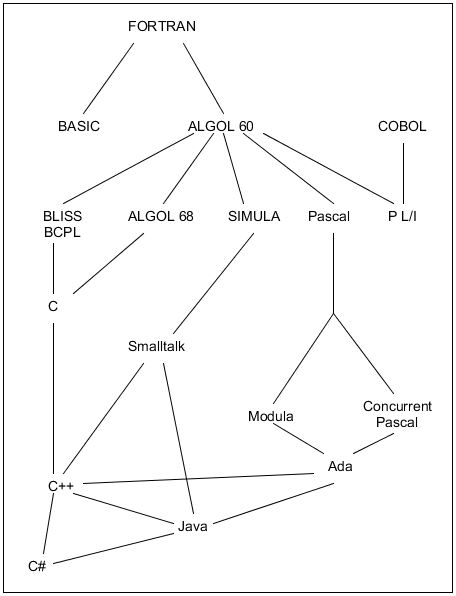
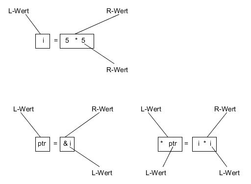
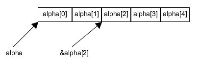
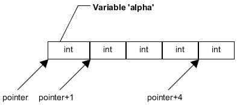

[Back](../)  

&nbsp;

# C und C++
---  

&nbsp;

## Overview

### 1. Basics    
&nbsp;&nbsp;&nbsp;&nbsp;&nbsp; [1.1 Eigenschaften von C](#ch1-1)  
&nbsp;&nbsp;&nbsp;&nbsp;&nbsp; [1.2 C und C++](#ch1-2)  
&nbsp;&nbsp;&nbsp;&nbsp;&nbsp; [1.3 L- und R-Werte](#ch1-3)  
&nbsp;&nbsp;&nbsp;&nbsp;&nbsp; [1.4 Auswertungsreihenfolge](#ch1-4)  
&nbsp;&nbsp;&nbsp;&nbsp;&nbsp; [1.5 Der Bedingungsoperator A ? B : C](#ch1-5)  
&nbsp;&nbsp;&nbsp;&nbsp;&nbsp; [1.6 switch - case](#ch1-6)  

### 2. Arrays
&nbsp;&nbsp;&nbsp;&nbsp;&nbsp; [2.1 Basics](#ch2-1)  
&nbsp;&nbsp;&nbsp;&nbsp;&nbsp; [2.2 Übergabe von Arrays](#ch2-2)  
&nbsp;&nbsp;&nbsp;&nbsp;&nbsp; [2.3 Übergabe von Zeichenketten](#ch2-3)  


## 3. Pointer
&nbsp;&nbsp;&nbsp;&nbsp;&nbsp; [3.1 Addition und Subtraktion](#ch3-1)  
&nbsp;&nbsp;&nbsp;&nbsp;&nbsp; [3.2 Call-by-Value](#ch3-2)  
&nbsp;&nbsp;&nbsp;&nbsp;&nbsp; [3.3 Call-by-Reference](#ch3-3)  

## 4. Pointer und Arrays   
&nbsp;&nbsp;&nbsp;&nbsp;&nbsp; [4.1 Vergleich von char-Arrays und Pointern auf Zeichenketten](#ch4-1)  
&nbsp;&nbsp;&nbsp;&nbsp;&nbsp; [4.2 Das Schlüsselwort const bei Pointern und Arrays](#ch4-2)

&nbsp;

---  

&nbsp;

# Basics

&nbsp;

<a name="ch1-1"></a>
### Eigenschaften von C

C ist eine relativ "maschinennahe" Sprache. C arbeitet mit denselben Objekten wie der Prozessor, nämlich mit **Zahlen** und **Adressen**. Auch Zeichen  werden als Zahlen gesehen, boolesche Variablen gibt es nicht und die Aufzählungskonstanten von Aufzählungstypen entsprechen ganzen Zahlen. Letztlich arbeitet C mit  
- verschiedenen Integer-Datentypen,  
- verschiedenen Gleitpunkt-Datentypen,  
- zusammengesetzten Datentypen wie  
   - Strukturen,
   - Unionen,  
   - Bitfeldern,  
- sowie Adressen.  

Die Sprache C erlaubt eine **hardwarenahe Programmierung** unter anderem durch direkte Zugriffe auf Adressen im Speicher oder durch Bitoperationen. C-Compiler unterstützen oftmals auch - in nicht standardisierter Weise - den Zugriff auf Hardware-Register.

C enthält die Elemente der **Strukturierten Programmierung**. C hat ein **Typkonzept**, das allerdings **nicht streng** ist. Der Compiler selbst führt  viele **implizite Typwandlungen** u.a. bei Zuweisungen durch. Bei unverträglichen Datentypen werden allerdings keine automatischen Umwandlungen durchgeführt, sondern eine Fehlermeldung erzeugt.

&nbsp;

<a name="ch1-2"></a>
### C und C++

C++ ist eine Weiterentwicklung von C. C++ wurde entworfen, um zusätzlich zum klassischen C-Programmierstil  
- ein objektorientiertes Programmieren zu unterstützen  
- und ein **strenges Typkonzept für selbst definierte Datentypen. die Klassen**, zu realisieren, bei dem für einen Datentyp nur definierte Operationen zulässig sind. Hierbei darf der Compiler nur sehr eingeschränkte implizite Typwandlungen durchführen, ansonsten muss er Typverletzungen anzeigen.  

Während C als "Super-Assembler" für hardwarenahe Software entwickelt wurde, liegt die Zielrichtung bei der Entwicklung von C++ darin, dem Programmierer neue Sprachmittel wie z.B. Klassen in die Hand zu geben, um die Anwendungsprobleme zu formulieren.  

Der ANSI-C Standard revidierte ursprüngliche Inkompatibilitäten von C und C++, so dass C++ so nahe an C ist wie möglich. Eine hundertprozentige Kompatibilität ist jedoch nicht das Ziel, weil C++ eine höhere Typsicherheit anstrebt als C.  

&nbsp;

  
C in der Verwandschaftstafel höherer Programmiersprachen  

&nbsp;

<a name="ch1-3"></a>
### L- und R-Werte  

Ausdrücke haben eine unterschiedliche Bedeutung, je nachdem, ob sie links oder rechts vom Zuweisungsoperator stehen. Im Beispiel  
> a = b  

steht der Ausdruck auf der rechten Seite für einen Wert, während der Ausdruck auf der linken Seite die Stelle angibt, an der der Wert zu speichern ist.

> Ein **Ausdruck** stellt einen **L-Wert** (**lvalue** oder **left value**) dar, wenn er sich auf ein **Speicherobjekt** bezieht. Ein solcher Ausdruck kann links und rechts des Zuweisungsoperators stehen.  

> Ein **Ausdruck** der keinen L-Wert darstellt, stellt einen **R-Wert** (**r-value** oder **right value**) dar. Er bezieht sich nicht auf ein **Speicherobjekt**. Er darf nur rechts des Zuweisungsoperators stehen. Einem R-Wert kann man also nichts zuweisen.  

Steht ein L-Wert rechts neben dem Zuweisungsoperator, so wird dessen Namen bzw. Adresse benötigt, um an der entsprechenden Speicherstelle den Wert der Variablen abzuholen.  

&nbsp;

````c  
int i;
int * ptr;
````

  
Beispiele für L- und R-Werte  

&nbsp;

> Bestimmte Operatoren können nur auf L-Werte angewandt werden. So kann man den Inkrementoperator **++** oder den Adressoperator **&** nur auf L-Werte anwenden.  

&nbsp;

<a name="ch1-4"></a>
### Auswertungsreihenfolge  

Wie in der Mathematik spielt es bei C eine wichtige Rolle, in welcher Reihenfolge ein Ausdruck berechnet wird.  

1. Wie in der Mathematik werden als erstes **Teilausdrücke in Klammern** ausgewertet.  
2. Dann werden **Ausdrücke mit unären Operatoren** ausgewertet.  
   Unäre Operatoren werden von rechts nach links angewendet. Dies bedeutet, dass  
      2.1 zuerst die **Postfix-Operatoren** auf ihre Operanden  
      2.2 und dann die **Präfix-Operanden** auf ihre Operanden angewendet werden  
3. Anschließend werden Teilausdrücke mit **mehrstelligen Operatoren** ausgewertet  

&nbsp;

<a name="ch1-5"></a>
### Der Bedingungsoperator A ? B : C
Eine echte Rarität  in der Programmiersprache C ist der Bedingungsoperator. Er ist  nämlich der einzige Operator, der drei Operanden verarbeitet. In einem **bedingten Ausdruck**  ``A ? B : C`` wird zuerst der Ausdruck A ausgewertet. Ist der Rückgabewert von Ausdruck A ungleich 0, also wahr, so wird der Ausdruck B ausgewertet. Das Ergebnis von B ist dann der Rückgabewert des Bedingungsoperators. Ist jedoch der Ausdruck von A gleich 0, also falsch, so wird der Ausdruck C ausgewertet.  

````c  
1 == 1 ? 0 : 1      /* Rückgabewert: 0 */
0 ? 0 : 1           /* Rückgabewert: 1 */
````  

Der Ausdruck ist also gleichbedeutend mit
````c  
if (A) return B;
else return C;
````  

&nbsp;  

<a name="ch1-6"></a>
### switch - case
[...] Besonders schön lesbar wird der Code, wenn man die ganzzahligen Konstanten im *switch* durch symbolische Konstanten ersetzt, deren Bedeutung dem Leser sofort klar ist. Das Definieren der symboischen Konstanten kann durch *#define* oder noch besser durch *enum* realisiert werden.  

```c
#include <stdio.h>

int main (void)
{
  enum color {RED, GREEN, BLUE};      // (1)
  enum color col = GREEN;             // (2)
  switch (col)
  {
    case RED:
      ...
    case GREEN:
      ...
    case BLUE:
      ...
    default:
      ...
  }  
}
```

Das Programm nutzt zur Aufzählung von Konstanten den Datentyp *enum color*. Bei Kommentar *(1)* werden den Konstanten *RED, GREEN* und *BLUE* die Integerwerte 0, 1 und 2 zugewiesen. Nun wird bei *(2)* eine Variable  *col* vom Typ *enum color* angelegt und der Wert *GREEN* zugewiesen. Ausgeführt werden in der darauf folgenden switch-Anweisung die Anweisung bei *case: GREEN*.  

&nbsp;

&nbsp;


# Arrays  

<a name="ch2-1"></a>
### Basics  

In C gibt es im Gegensatz zu anderen Sprachen **kein Schlüsselwort array**. Der C-Compiler erkennt ein Array an den eckigen Klammern, die bei der Definition die Anzahl der Elemente enthalten. Die **Anzahl der Elemente** muss immer eine positive ganze Zahl sein. Sie kann gegeben sein durch eine Konstante oder einen konstanten Ausdruck, **nicht aber durch eine Variable**. Dies bedeutet, dass die Größe nicht dynamisch zugeordnet werden kann. Dennoch können Arrays mit einer zur Laufzeit berechneten Größe mit Hilfe der Funktion `malloc()` oder `calloc()` konstruiert werden.  
&nbsp;

Ein eindimensionaler Vektor (eindimensionales Array) wird folgendermaßen definiert:  
```c
int alpha[5];     //Definition des Arrays alpha mit Platz für 5 int-Zahlen
```

Eine einfache Möglichkeit, einen Pointer auf ein Arrayelement zeigen zu lassen, besteht darin, auf der rechten Seite des Zuweisungsoperators den **Adressoperator &** wie folgt zu verwenden:  
```c
int * pointer;          //Definition des Pointers pointer  
pointer = &alpha[i-1]   // Pointer zeigt auf das i-te Arrayelement
```

Hat *i* den Wert 1, so zeigt der Pointer *pointer* auf das 1. Element des Arrays. Dieses hat den Index 0.  

> Der Name eines Arrays kann als konstanter Zeiger auf das erste Element des Arrays verwendet werden.  

&nbsp;

  
Pointer auf ein Array  

&nbsp;

Damit gibt es für das erste Element zwei gleichwertige Schreibweisen:
  - *alpha[0]*  
  - oder, mit Verwendung des Dereferenzierungsoperators, \*alpha  

Der Compiler rechnet intern nicht mit Indizes. Erhält er eine Array-Komponente, so rechnet er den Index sofort in einen Pointer um.  
&nbsp;

> Eine tückische Besonderheit von Arrays in C ist, dass beim Überschreiten des zulässigen Indexbereiches kein Kompilier- bzw. Laufzeitfehler erzeugt wird. So würde bei einem Array `int alpha[5]` die Anweisung `alpha[5] = 6` einfach die Speicherzelle direkt nach `alpha[4]` mit dem Wert 6 überschreiben.  


> Auf jeden Fall sollte man es sich bei Arrays zur Gewohnheit machen, immer mit symbolischen Konstanten wie z.B. `#define MAX 40` und nie mit literalen Konstanten wie z.B. `int fahrenheit [40]` zu arbeiten. Soll nämlich der Wert in einer nächsten Version des Programms bis 100 Grad Celsius betragen, so müsste man doch  an vielen Stellen (z.B. in den Eingabeauforderungen und in den Kommentaren) Änderungen vornehmen, von denen leider gerne welche vergessen werden.  

&nbsp;

<a name="ch2-2"></a>
### Übergabe von Arrays  

Bei der Übergabe eines Arrays an eine Funktion wird als aktueller Parameter der Arrayname übergeben. Der Arrayname stellt dabei einen Pointer auf das erste Element des Arrays dar.  

> Der formale Parameter für die Übergabe eines eindimensionalen Arrays kann ein offenes Array sein - oder wegen der Pointereigenschaft des Arraynamens - auch ein Pointer auf den Komponententyp des Arrays.  

```c
#include <stdio.h>
#define GROESSE 3

void init (int *, int);
void ausgabe(int[], int);

int main (void)
{
  int i [GROESSE];
  init (i, GROESSE);
  ausgabe (i, GROESSE);
  return 0;  
}

void init (int *alpha, int dim)   // hier ist alpha ein Pointer
{
  ...
}

void ausgabe (int alpha[], int dim)   // hier ist alpha vom Typ eines offenen Arraynamens
{
  ...
}
```

&nbsp;

<a name="ch2-3"></a>
### Übergabe von Zeichenketten

Da Zeichenketten vom Compiler intern als *char*-Arrays gespeichert werden, ist die Übergabe von Zeichenketten identisch mit der Übergabe von *char*-Arrays. Der formale Parameter einer Funktion, die eine Zeichenkette übergeben bekommt, kann vom Typ ``char*`` oder ``char[]`` sein.  

&nbsp;

&nbsp;


# Pointer  

<a name="ch3-1"></a>
### Addition und Subtraktion  

Wird ein Pointer vom Typ ``int *`` um 1 erhöht, so zeigt er um ein int-Objekt weiter. Wird ein Pointer  vom Typ `float *` um 1 erhöht, so zeigt er um ein float-Objekt weiter. Die Erhöhung um 1 bedeutet, dass der Pointer immer um ein Speicherobjekt vom Typ, auf den der Pointer zeigt, weiterläuft.  

&nbsp;

  

&nbsp;

Nach der Variablen *alpha* in obigem Bild können Variablen eines anderen Typs liegen. Der Pointer lässt sich nicht beirren, er läuft im *int*-Raster weiter.

<a name="ch3-2"></a>
### Call-by-Value  

In vielen Programmiersprachen werden im Normalfall Parameter an Funktionen mithilfe einer Kopie übergeben. Das wird als **call-by-value** bezeichnet. Das bedeutet, dass innerhalb der aufgerufenen Funktion mit der Kopie gearbeitet wird und sich Änderungen nicht auf den ursprünglichen Wert auswirken.

<a name="ch3-3"></a>
### Call-by-Reference

Manche Programmiersprachen wie z.B. C++ kennen außer der **call-by-value** Schnittstelle auch eine **call-by-reference** Schnittstelle. Eine call-by-reference Schnittstelle ermöglicht es, über Übergabeparameter nicht nur Werte in eine Funktion hinein, sondern auch aus ihr heraus zu bringen.  

&nbsp;

**[C]**

In C ist eine call-by-reference Schnittstelle als Sprachmittel nicht vorgesehen. Man kann das Verhalten einer call-by-reference Schnittstelle, nämlich Werte über die Parameterliste an den Aufrufer zu übergeben, auch mit der call-by-value Schnittstelle erreichen, indem man einen Pointer auf den aktuellen Parameter mit call-by-value übergibt.  

```c
#include <stdio.c>

void init (int * alpha)
{
  * alpha = 10;
}

int main (void)
{
  int a;
  init (&a);
  printf ("Der Wert von a ist %d", a);
  return 0;
}
```

Ausgabe: *Der Wert von a ist 10*

> Beim Aufruf von `init (&a)` wird die lokale Variable `alpha` angelegt. Sie wird mit dem Wert des aktuellen Parameters initialisiert, also mit der Adresse von a. Man kann sich das als Kopiervorgang vorstellen: `int * alpha = &a`   

&nbsp;

**[C++]**

Die **call-by-reference** Methode zum Übergeben von Argumenten an eine Funktion kopiert die Referenz eines Arguments in den formalen Parameter. Innerhalb der Funktion wird die Referenz verwendet, um auf das tatsächliche Argument zuzugreifen, das im Aufruf verwendet wird. Dies bedeutet, dass Änderungen am Parameter das übergebene Argument beeinflussen.

Um den Wert als Referenz zu übergeben, wird die Argumentreferenz wie bei jedem anderen Wert an die Funktionen übergeben. Dementsprechend müssen Sie die Funktionsparameter wie in der folgenden Funktion *swap ()* als Referenztypen deklarieren, die die Werte der beiden ganzzahligen Variablen austauscht, auf die ihre Argumente verweisen.

````c
void swap (int &x, int &y) {
   int temp;
   temp = x;
   x = y;    
   y = temp;

   return;
}

int main () {
   int a = 100;
   int b = 200;

   swap(a, b);

   return 0;
}
````


&nbsp;  

&nbsp;


# Pointer und Arrays  

<a name="ch4-1"></a>
### Vergleich von char-Arrays und Pointern auf Zeichenketten

Prinzipiell hat man zur Speicherung von konstanten Zeichenketten zwei Möglichkeiten. Zum einen kann man ein *char*-Array definieren und dort die konstante Zeichenkette ablegen wie im folgenden Beispiel:  
```c
char buffer [] = "hello";
```

Zum anderen kann man die Speicherung der konstanten Zeichenkette, die ja eine Konstante darstellt, dem Compiler überlassen und sich nur durch den Rückgabewert der Zeichenkette einen Pointer auf das erste Element der Zeichenkette geben lassen, z.B. durch  
```c
char *pointer = "hello";
```

Hier wird der Pointer auf das 'h' von "hello" dem Pointer *pointer* zugewiesen. An dieser Operation sind nur Pointer beteiligt.  

Eine Stringvariable kann also durch die Pointernotation `char *pointer` oder als offenes Array `char buffer[]` bzew. als Array mit ausreichend festgelegter Größe definiert werden.  

Im Falle der Pointernotation zeigt der Pointer *pointer* auf eine konstante Zeichenkette, einen R-Wert.  
Die Komponenten des Arrays sind dagegen L-Werte! Im Falle des Arrays ist es damit möglich, Elemente des Arrays neu mit Werten zu belegen, z.B. durch  
```c
buffer [1] = 'a';
```
Dann lautet der gespeicherte String "hallo". Jedoch ist es nicht möglich, den Pointer *buffer*, der ein konstanter Pointer auf das erste Element des Arrays ist, woanders hinzeigen zu lassen.  

Im Falle der Pointernotation ist eine Änderung der konstanten Zeichenkette nicht vorgesehen, d.h. nicht erlaubt. Wie der Name schon sagt, soll ein konstante Zeichenkette ja konstant sein. Dafür hat man im Falle der Pointernotation die Freiheit, seinen Pointer ganz woandershin zeigen zu lassen.  

> Bei einem *char*-Array *buffer* kann der in ihm  gespeicherte String verändert werden. *buffer* ist ein konstanter Pointer auf das erste Element des Arrays und kann auf keine andere Adresse zeigen.  

> Zeigt eine Stringvariable  vom Typ char* auf eine konstante Zeichenkette, so führt der Compiler  die Speicherung der Zeichenkette selbst durch. Die Zeichenkette kann nicht verändert werden aber die Zeigervariable vom Typ char* kann eine neue Adresse zugewiesen werden.  

&nbsp;

<a name="ch4-2"></a>
### Das Schlüsselwort `const` bei Pointern und Arrays  

Die mit *const* definierten Variablen besitzen - genau wie gewöhnliche Variablen - einen Wert, einen Typ, einen Namen und auch eine Adresse. Sie liegen also im adressierbaren Speicherbereich. Als Konstanten dürfen sie natürlich nicht auf der linken Seite der Zuweisung stehen.  

Die Formulierung mit *const* hat gegenüber der Formulierung mit *#define* unter anderem den Vorteil, auch auf zusammengesetzte Datentypen anwendbar zu sein. So bedeutet  
```c
const int feld [] = {1, 2, 3};
```

dass alle Feldelemente *feld[0]*, *feld[1]* und *feld[2]* Konstanten sind.  

Angenommen, ein *char*-Array sei definiert durch  
```c
char blick [] = "Er will es blicken";
```

Dann bedeutet  
```c
const char * text = blick;
```

nicht, dass der Pointer konstant ist, sondern dass der Pointer auf eine konstante Zeichenkette zeigt.   
```c
text[1] = 's';                          // Fehler! Nicht möglich.
text = "Jetzt blicke auch ich durch";   // Ist hier möglich!
```

Soll ein konstante Pointer eingeführt werden, so muss *const* vor dem Pointernamen stehen:
```c
char lili [] = "Ich liebe Lili";
char * const hugo = lili;

hugo[13] = 'o';             // Ist jetzt möglich!
hugo = "Ich liebe Susi";    // Fehler! Nicht mehr möglich.
```

Beim folgenden Beispiel bleibt *hugo* stets unzertrennlich mit *lili* verbunden, da zum einen der Pointer *hugo* konstant ist und auch die Zeichenkette als Konstante geschützt ist.  
```c
const char * const hugo = lili;
```

&nbsp;

[Back](../)
