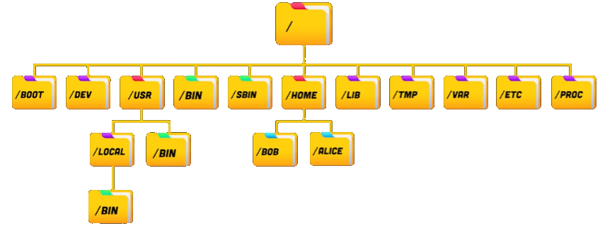
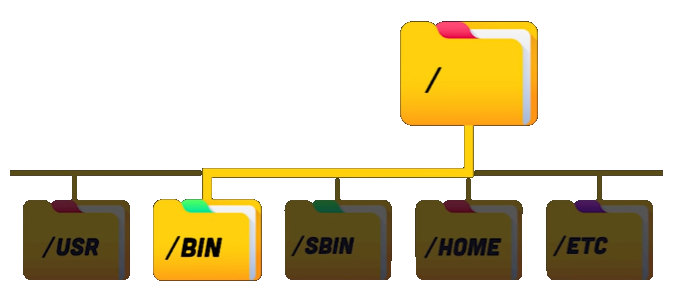
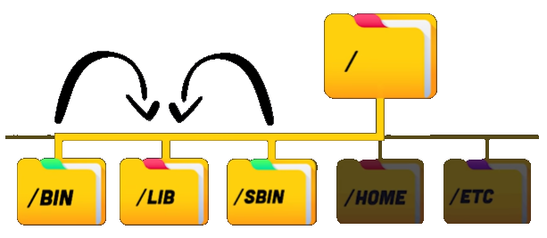
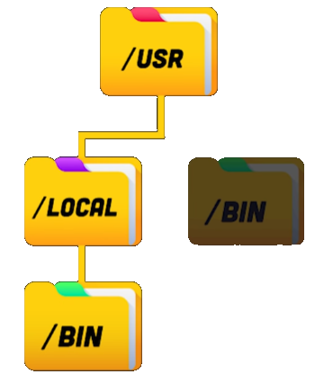
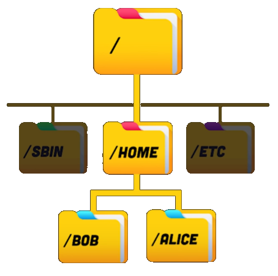

[Back](../)  

&nbsp;

# Linux
---  

&nbsp;

### 1. Basics    
&nbsp;&nbsp;&nbsp;&nbsp;&nbsp; [1.1 History](#ch1-1)  
&nbsp;&nbsp;&nbsp;&nbsp;&nbsp; [1.2 Directories Explained](#ch1-2)  
 
&nbsp;

---  

&nbsp;

# Basics  

&nbsp; 

### 1.1 History

&nbsp;

... tbd ...

&nbsp; 

### 1.2 Directories Explained  

&rarr; Info taken from <a href="https://www.youtube.com/watch?v=42iQKuQodW4">here.</a> Very good short video.  

The directory structure is written down in the *Filesystem Hierarchy Standard* (FHS 3).

&nbsp;

  

&nbsp;

&nbsp;

***/BIN* directory**  

- contains binaries/executables that are essential to the entire operating system (e.g. the *ls* command)
- you can run these commands on the command line at any time and place

&nbsp;

&nbsp;

***/SBIN* directory**  

- contains essential executables for the super user (root)
- should only be used by the root user

&nbsp;

&nbsp;

***/LIB* directory**

- contains libraries used by both the */bin* and the */sbin* folder

&nbsp;

&nbsp;

***/USR/BIN* directory**

- contains non-essential (for the operating system) installed binaries
- folder is intended for the user

&nbsp;

&nbsp;

***/USR/LOCAL/BIN* directory**

- contains binaries that the user compiled manually locally
- directory to provide a safe place that won't conflict with SW installed by a system package manager

&nbsp;

&nbsp;

***/ETC* directory**

  

- stands for *et cetera* or *editable text configuration*
- contains data files to customize the SW on your system
- contains mostly text-based config files to be modified in the editor

&nbsp;

&nbsp;

***/HOME/*\<name\> directory**

  

- contains a directory for every user registered at the system
- contains the files, configuration and SW for that user

&nbsp;

&nbsp;

***/BOOT* directory**

  

- contains the files needed to boot the system (e.g. the Linux Kernel)

&nbsp;

&nbsp;

***/DEV* directory**

  

- stands for *device files*
- here you can interface with HW or with drivers as if they were regular files
- one can create disk partitions here or interface the floppy drive

&nbsp;

&nbsp;

***/OPT* directory**

- contains optional or add-on SW
- one rarely interacts with this directory

&nbsp;

&nbsp;

***/VAR* directory**

- contains variable files that are changed as the operating system is being used
- contains files like logs or cache files

&nbsp;

&nbsp;

***/TMP* directory**

- contains temporary files that won't be persistent between reboots

&nbsp;

&nbsp;

***/PROC* directory**

- contains an illusionary file system that doesn't actually exist on disk
- is created in memory on the fly by the Linux Kernel to keep track of running processes