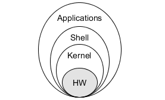
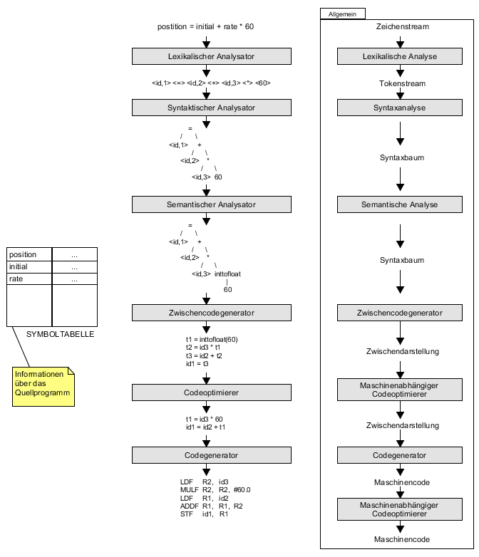

[Back](../)

&nbsp;

# Misc
---
Basics  
&nbsp;&nbsp;&nbsp;[Rechnerarchitektur](#link001)

&nbsp;

Compiler  
&nbsp;&nbsp;&nbsp;[Die Phasen eines Compilers](#link002)

---

&nbsp;

# Misc Basics

###  Rechnerarchitektur
  

- `Kernel`: Interacts with hardware to perform memory management, task scheduling and file management. Technically, the Kernel "is" the OS.  
- `Shells`: Textual command line shells. Processes user requests - commands are translated by the shell into something the Kernel can understand

&nbsp;

---  

&nbsp;

# Compiler

###  Die Phasen eines Compilers
  

&nbsp;

&nbsp;

[Back](../)
