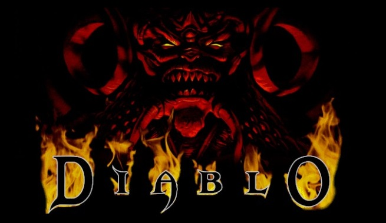

[Back](../../)

&nbsp;

# Diablo <font size="-1">(1996 - Blizzard North)</font>  

    

&nbsp;

### &rarr; Code walkthrough for compilable version of Diablo (*Devilution*) [here](./code_wt_devilution_main.md).  
---

&nbsp;

<font size="-1">&rarr; Code taken from <a href="https://github.com/diasurgical/devilution">here.</a></font>  

&nbsp;

## Code Walkthrough  

(only the "Main" function is covered here.)

**File**  
&nbsp;&nbsp;&nbsp;*diablo.cpp*  

**Function**:   
&nbsp;&nbsp;&nbsp;int APIENTRY **WinMain** <font size="-1">(HINSTANCE hInstance, HINSTANCE hPrevInstance, LPSTR lpCmdLine, int nCmdShow)</font>   

**Purpose**  
- Checking environment
- Initializes system
- Plays Intro
- Starts Main Menu
- Shut Down
&nbsp;

**Arguments**
- *hInstance*: A handle to the current instance of the application.
- *hPrevInstance*: Always null
- *lpCmdLine*: The command line for the application
- *nCmdShow*: Initial window state
&nbsp;  

*'APIENTRY WinMain (..)'*  
``APIENTRY`` is an alias for *WINAPI*. *WINAPI* itself is a definition for the type of *calling convention* used for windows API calls, the *__stdcall*. More info [here](../c_cpp.html#ch1-12).  
The ``WinMain`` char based function (alternative to `main()`) was introduced with Windows, in the early 1980's:  
```c
int CALLBACK WinMain(
    HINSTANCE   hInstance,
    HINSTANCE   hPrevInstance,
    LPSTR       lpCmdLine,
    int         nCmdShow
    );
```
where ``CALLBACK``, ``HINSTANCE`` and ``LPSTR`` are defined by the *\<windows.h\>* header (``LPSTR`` is just char*). With the Microsoft tool chain it makes the linker default to the GUI subsystem, which some see as an advantage. 


&nbsp;

**Walkthrough**  

```c
diablo_reload_process(HINSTANCE hInstance);
```
- Defined in *diablo.cpp*.  

...tbd...

```c
ShowCursor(FALSE);
```
- Windows function, *winuser.h*  

Displays or hides the Windows cursor.

```c
srand(GetTickCount());
```
- *stdlib* function  

*srand* seeds (=initializes) the random number generator. GetTickCount() returns system time with resolution 1 ms.

```c
InitHash();
```
- Defined in *encrypt.cpp*.  

Function initializes the hash table (``DWORD hashtable[5][256];``) with predefined numbers.  

```c
fault_get_filter();
```
- Defined in *fault.cpp*.  

Function returns value of *lpTopLevelExceptionFilter*.

```c
bNoEvent = diablo_get_not_running();
```
- Defined in *diablo.cpp*.  

Function checks if event "DiabloEvent" (created here by CreateEvent (NULL, FALSE, FALSE, "DiabloEvent") ) was already created, which means the game is already running and returns 0 in case it does already run.

```c
diablo_find_window(GAME_NAME)
```
- Defined in *diablo.cpp*.  

*GAME_NAME* is defined in *defs.h*: `#define GAME_NAME "DIABLO"`  
Function checks on operation system level (Windows) if the game is already running.  

```c
diablo_init_screen();
```
- Defined in *diablo.cpp*.  

Function centers the mouse cursor and inits values to 0.
Clears the in-game message board.

```c
diablo_parse_flags(lpCmdLine);
```
- Defined in *diablo.cpp*.  

Function parses the command line options and sets variables accordingly.

```c
init_create_window(nCmdShow);
```
- Defined in *init.cpp*.  

Function first tries to find (function `init_find_mom_parent()`) and close the *Windows* window with name "MOM Parent" (== *MS Office Shortcut Bar*) (function `init_kill_mom_parent()`). and tries to initialize the *Save* directory with checking for sufficient available space (function ``pfile_init_save_directory``() ).  
Next, memory is reserved for the WinAPI structure `WNDCLASSEXA wcex` and the structure is filled with game window related information. After that, the WinAPI function `RegisterClassEx(&wcex)` is called to register the window class. Final window creation step is to create the window with `CreateWindowEx(..)` and assign it to variable `hwnd`. WinAPI functions `ShowWindow(hWnd, SW_SHOWNORMAL)` and `UpdateWindow(hWnd)` display the window on screen. The init function for *DirectX* `dx_init(hwnd)` is called to set up the graphics pipeline and `BlackPalette()` to set the engines color palette. Function `snd_init(hWnd)` is called to set up the audio pipeline.  
Function `init_archives()` reserves memory for and assigns to struct ``fileinfo`` the char variables which hold the path to relevant files (e.g. ``diablo_exe_path`` and ``diabdat_mpq_path``). Afterwards depending on the game type ('SPAWN' == Diablo Spawn (freeware) / 'COPYPROT' == Copy Protection (Check for CD)) the paths are set inside the variables. Here also the check for copy protection takes place and error is thrown in case of missing ``diabdat.mpq`` file. Finally, function `init_disable_screensaver(TRUE)` is called to disable the Windows screensaver (if active).  

```c
ui_sound_init(nCmdShow);
```
- Defined in *effects.cpp*.  

Function calls function `priv_sound_init(sfx_UI)`, which initializes the ``sgSFX`` array.  

```c
UiInitialize();
```
- Defined in *diabloui.cpp* (in *DiabloUI*, orig. *DiabloUI.dll*)  

```c
play_movie("gendata\\logo.smk", TRUE);
```
- Defined in *movie.cpp*  

Function starts playback of the given movie (here: *Blizzard* Start-Logo).

```c
play_movie("gendata\\diablo1.smk", TRUE);
```
- Defined in *movie.cpp*  

Function starts playback of the given movie (here: *Diablo Intro-Movie*).  

```c
SRegSaveValue(APP_NAME, szValueName, 0, 0);
```
- Defined in *storm.cpp* (3rd Party, orig. *storm.dll*) 

```c
UiTitleDialog(7);
```
- Defined in *diabloui.cpp* (in *DiabloUI*, orig. *DiabloUI.dll*)  

```c
mainmenu_loop();
```
- Defined in *mainmenu_loop.cpp*.

First function that is called is `mainmenu_refresh_music()` which starts the mainmenu music track. Function `UiMainMenuDialog(gszProductName, &menu, effects_play_sound, 30)`  (*DiabloUI* function) loads the main menu (?) and depending on the user selection, the respective submenu function is started. 


```c
UiDestroy();
```
- Defined in *diabloui.cpp* (in *DiabloUI*, orig. *DiabloUI.dll*)  


```c
SaveGamma();
```
- Defined in *palette.cpp*  

Function saves presently set gamma value to file on disc.

