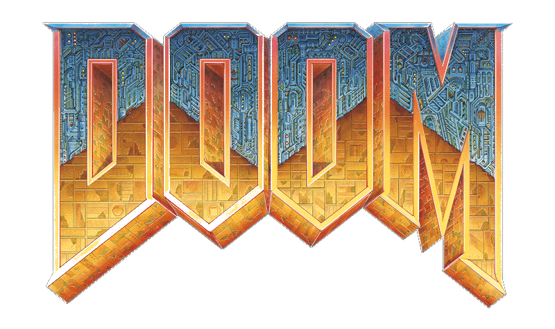
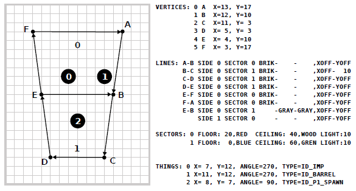
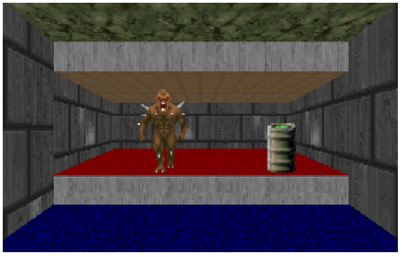
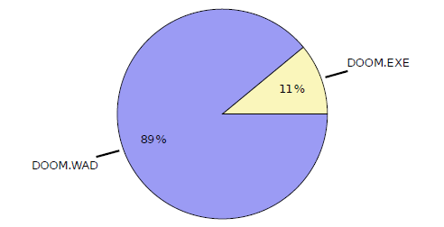
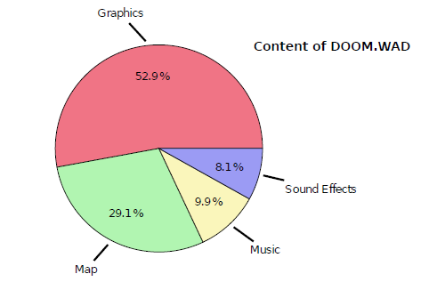
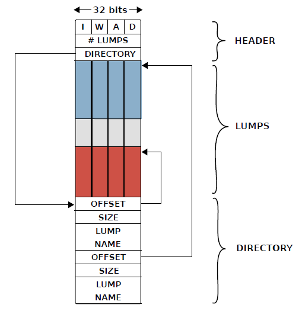
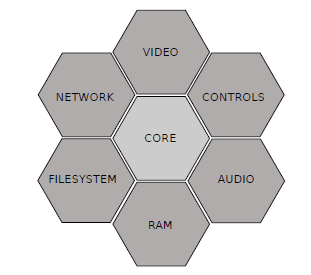
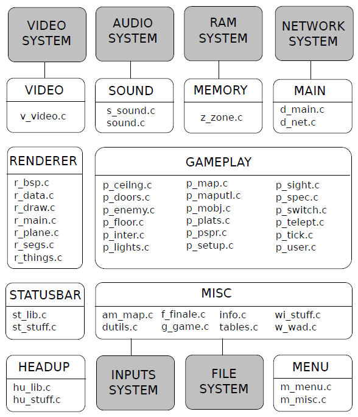
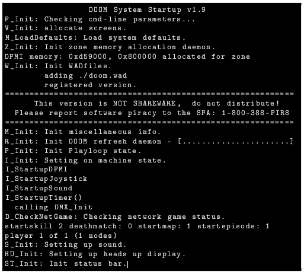

[Back](../../)

&nbsp;

# Doom <font size="-1">(1993 - id Software)</font>  

---

    

&nbsp;

<font size="-1">&rarr; Information taken from "Game Engine Black Book DOOM" (F.Sanglard)  </font>  
&nbsp;

<font size="-1">&rarr; Code taken from <a href="https://github.com/id-Software/DOOM">here.</a></font>  

&nbsp;

## Architecture  

### Maps  

Maps were designed in a top-down view. The one limitation was that walls were perpendicular to floors and both floors and ceilings were horizontal so maps were drawn in 2D. A designer worked with five types of element: `VERTEX`, `LINE`, `SIDEDEF`, `SECTOR`, and `THING`.  

  

A `SECTOR` is a closed area surrounded by `LINE`s with a specified floor height, floor texture, ceiling height, ceiling texture, and light level. A sector can be concave, but lines cannot cross each other.  

A `LINE` can either be a solid wall or a portal between two `SECTOR`s. The difference is in the number of `SIDEDEF`s associated with it. A wall has only one `SIDEDEF` on its right side and is fully opaque. A portal has two `SIDEDEF`s and can usually be partially seen though.  

A `SIDEDEF` describes one side of a `LINE`. To accommodate texturing of both the walls and portals, it can have up to three textures. The middle texture is used by walls for the full area they cover. A `SIDEDEF` can also have a lower and an upper texture for portals connecting `SECTOR`s with different ceiling/floor heights. If the portal leads to a sector with higher floor, the lower texture is used to render the "step". If the `SECTOR` connects to a `SECTOR` with a lower ceiling, the upper texture is used to render the "down step". To help alignment of doors and buttons, `SIDEDEF` textures can have a vertical/horizontal offset.  

A `THING` is much simpler in comparison. It only features a 2D-coordinate X,Y, an angle, and an identifier controlling its type. At the bare minimum a map must have one playerspawning location `THING`.   

  

The resulting scene in the figure above is ugly but the mismatched colors hopefully help to discern the different elements. All `LINE`s are walls except for E-B which has two `SIDEDEF`s and is therefore a portal. All walls use the `BRIK` middle texture except for the portal which uses `GRAY` for both top and bottom.  

`SECTOR` #0 uses a `RED` floor texture and a `WOOD` ceiling texture. The height of the floor is 20 and its ceiling is at 40. `SECTOR` #1 uses a `BLUE` floor texture and a `GREEN` ceiling texture. Its floor is at 0 and ceiling at 60. Both sectors have the same light level (10).  

Notice the portal `E-B` which does not have a mid-texture but an upper and a lower texture. These were used to draw the up-step and down-step towards sector #0.  

Also notice wall `D-E` on which the mid-texture vertical offset is not correctly set, resulting in a vertical tear when connecting with wall `E-F`. Wall `B-C`’s vertical offset is properly set and has no visual artifact. None of the walls use a horizontal offset, but the corresponding field is labeled `XOFF` to show its location.  

&nbsp;

### WAD archives: Where’s All the Data?  

While Wolfenstein 3D shipped with a `WOLF3D.EXE` engine and a multitude of `.WL6` files, DOOM had only two relevant files. After installation, besides a few TXT files and network drivers, the gaming experience was entirely contained in the engine `DOOM.EXE` and all assets contained in `DOOM.WAD`.  

  

  

The goal of the `WAD` format was partly to replace the OS filesystem but mostly to embrace the modding community. In a `WAD`, each asset is stored in a "lump". The `WAD` is made of three parts with a header, the lump content, and a directory at the end.  

```c
typedef struct {
    char magicNumber [4]; // " IWAD " or " PWAD "
    int32_t numDirectories ; // # lumps in directory
    int32_t directoryOffset ; // Offset to directory
} header ;

typedef struct {
    int32_t offset ; // Offset to lump
    int32_t size ; // Size of the lump
    char name [8]; // Name of the lump
} directoryEntry ;
```



The archive format was manipulated via two tools. `lumpy` took a blob and packed it inside a lump, inside a WAD. `wadlink` took several WADs and created/appended them into a single WAD. The structure allows easily adding or removing lumps, since adding a lump only requires moving the small directory at the end and updating the header offset.  

`DOOM.EXE` had a command-line parameter allowing modders to load their own WADs in order to overwrite `DOOM.WAD` lump entries. This mechanism permitted to customize almost everything. A custom WAD containing an `E1M1` lump could be used via a simple `doom -file mylevel.wad` command.  

&nbsp;

### API 

To be able to run on different operating systems Doom has a common *"core"* that is platform independent. To perform I/O, the *core* would tap into sub-systems specific to the platform they targeted.  

  
DOOM’s core and its I/O platform-dependent systems. Notice the similarities with the design of an operating system.

In the case of the video system, it would be using the VGA hardware on MS-DOS but the `NSWindow` API on NeXT . A naive implementation would have required a function pointer acting as a layer of indirection to dispatch each I/O call. A better solution leveraged C’s linking stage.  

While building a C program, all compilation units (`.c` files) are compiled independently. At the end of the compilation step, all `.c` files have been transformed into object (`.o`) files. Object files may reference each other but because they were created independently, they have "holes" called "unresolved symbols". To generate an executable, all objects are given to a linker which will recognize unresolved symbols from all objects and patch the holes.  

Taking the example of `s_sound.c` which is part of the core and looking at `s_sound.o`, we can see this translation unit uses functions such as `I_PlaySong` and `I_StartSound` which are defined in the platform-specific sound system.  

Asking nm for undefined symbols shows an object file’s "holes".  

```c
$ nm -u s_sound .o | grep I_

U _I_Error
U _I_GetSfxLumpNum
U _I_PauseSong
U _I_PlaySong
U _I_RegisterSong
U _I_ResumeSong
U _I_SetChannels
U _I_SetMusicVolume
U _I_SoundIsPlaying
U _I_StartSound
U _I_StopSong
U _I_StopSound
U _I_UnRegisterSong
U _I_UpdateSoundParams
```

After the linker is done, there are no more unresolved symbols. The final executable is ready to run.  

&nbsp;

### Source Code Architecture  

  

In white are the core components. In grey are the I/O systems which require platformspecific code.  
On DOS these are provided by six extra files: `i_main.c`, `i_ibm.c`, `planar.asm`, `i_ibm_a.asm`, `i_sound.c`, and `i_cyber.c`.  

Notice the prefixed file names in the figure above. Since C has no namespaces, these prefixes are also applied to function names. `I_` stands for "implementation-specific", `P_` gameplay, `R_` is for renderer and so on.  

The beauty of this architecture is that once the platform-specific systems are written, there is zero overhead to writing code that runs on multiple platforms. Most of the code goes into the core and the platform-specific code needs not be touched any more.  

Because portability was not an afterthought but an integral part of the development process, DOOM’s code layering is never violated. This rigorous design partly explains why DOOM has been ported to so many systems: there is very little code to write.  

&nbsp;

### Startup  

The developers did not try to hide what was going on during startup. DOOM’s openness needed no splash screen. The text mode messages show the player what is going on behind the scenes (figure below). For each initializer a line is output to the extent that the DOS screen on the right closely mirrors the source code in `D_DoomMain`.  

The startup step was fairly fast except for the excruciating renderer initialization in `R_Init` which took forever to complete. It featured not only a line but also a progress bar made up of dots which often required up to a minute to complete on the full version depending on the machine’s hard drive access time.  

  

&nbsp;

---

&nbsp;

## Code Walkthrough  

Exploring a source code repository always starts with finding out what the OS will select as the entry point. 99% of the time it means finding the `int main(int,char**)` function.  

In the case of DOOM there is one entry point per OS and they are all in implementation specific `(I_*)` files. For DOS it is in `i_main.c`. Regardless of the platform, all entry points converge on the core main function named `D_DoomMain` located in `d_main.c`.  

```c
    # include "doomdef.h"

    void main ( int argc , char ** argv ) {
        myargc = argc ;
        myargv = argv ;
        D_DoomMain ();
    }                                               /* i_main .c */
```  

```c
    void D_DoomMain ( void ) {
        FindResponseFile ();        // Search doom .wad , doom1 . wad ...
        IdentifyVersion ();         // shareware or registered ?

        V_Init ();                  // Video system .
        M_LoadDefaults ();          // Load params from default . cfg
        Z_Init ();                  // Zone Memory Allocator
        M_Init ();                  // Menu
        R_Init ();                  // Renderer
        P_Init ();                  // gamePlay
        I_Init ();                  // Implementation dependant
        D_CheckNetGame ();          //
        S_Init ();                  // Sound
        HU_Init ();                 // HUD
        ST_Init ();                 // Status Bar

        D_DoomLoop ();              // never returns
    }                                             /* d_main .c */
```

No surprises in `D_DoomMain`, the engine begins by initializing all its sub-systems before jumping to a loop which will never return (`D_DoomLoop`).  

The game engine executable which shipped with the registered version of the game was the same that shipped with the shareware version. Two functions, `FindResponseFile` and `IdentifyVersion`, simply looked for the asset file and switched a flag depending on what WAD had been found (`DOOM1.WAD` or `DOOM.WAD`).  

