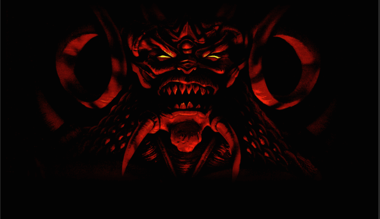

[Back](../../)

&nbsp;

    
**BackgroundArt** (*ui_art\title.pcx*)

&nbsp;

---  

&nbsp;

## Code Walkthrough <font size="-2">(After start of game - Single player -)</font>   

```c
StartGame(BOOL bNewGame, BOOL bSinglePlayer)
```
- Defined in *diablo.cpp*.   

Depending on argument *bNewGame*, multiple subfunctions are called in case of a new game:
- InitLevels()
- InitQuests()
- InitPortals()
- InitDumpMsgs()

and variable `uMsg` is set to flag `WM_DIABNEWGAME`. In case of loading a game it is set to `WM_DIABLOADGAME`.

Subsequently function `run_game_loop(uMsg)` is called.  

&nbsp;

```c
run_game_loop(unsigned int uMsg)
```
- Defined in *diablo.cpp*.   
