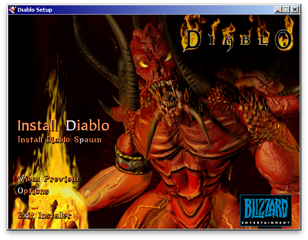

[Back](../../)

&nbsp;

    

&nbsp;

---  

<font size="-1">&rarr; Code taken from <a href="https://github.com/diasurgical/devilutionX">here.</a></font>  

&nbsp;

## Code Walkthrough  

**File**  
&nbsp;&nbsp;&nbsp;*diablo.cpp*  

**Function**:   
&nbsp;&nbsp;&nbsp; *int DiabloMain(int argc, char \*\*argv)*  

**Walkthrough**  


> diablo_parse_flags(argc, argv)

- Defined in *diablo.cpp*.  

Function parses possibly given IO Options and sets data or replies accordingly.  


> diablo_init()

- Defined in *diablo.cpp*.  

First function called is `init_create_window()`:  
- Call of subfunction `SpawnWindow(PROJECT_NAME)`.  
  - `SDL_Init(..)` is called to initialize the SDL's subsystems.
  - `DvlIntSetting(<key>, <val>)` is called multiple times with `key -> value` pairs which are set in the "diablo.ini" file.
  - Window setting functions are called (`CalculatePreferdWindowSize`/`AdjustToScreenGeometry`)  
  - In case of *upscaling*, multiple SDL flags are set and SDL functions are called
  - `SDL_CreateWindow(..)` is called and stored in variable `ghMainWnd`
  - SDL object `SDL_DisplayMode` created and SDL functions are called (`SDL_GetDisplayMode(..)` / `SDL_CreateRenderer(..)` / `SDL_CreateTexture(..)` / `SDL_RenderSetIntegerScale(..)` / `SDL_RenderSetLogicalSize(..)` / `SDL_GetWindowSize(..)`)
- Call of subfunction `dx_init(NULL);`
  - Game window is shown (functions `SDL_RaiseWindow(ghMainWnd)` and `SDL_ShowWindow(ghMainWnd)`)
  - *DirectX* connected functions (`SDL_RenderGetLogicalSize(..)` / `SDL_QueryTexture(..)` / `SDL_CreateRGBSurfaceWithFormat(..)`) are called
  - `palette_init()` is called to initialize the engines color palette.
- Setting variables *gpBufStart* ("Upper bound of back buffer.") and *gpBufEnd* ("Lower bound of back buffer.")
- Call of SDL function `SDL_DisableScreenSaver()`.  

Flag *was_window_init* is set to *true*.  

Function call `SFileEnableDirectAccess(TRUE)` results in the action that the *.mpq file* is supposed to be opened locally.  

Function `init_archives()`:  
- Reserves memory for and assigns to struct `fileinfo` the char variables, which holds the path to relevant files (e.g. `executablefile` and `originalarchivefile`).  
- All mpq-file handles (e.g. `diabdat_mpq` or `hellfire_mpq`) are set by calling the `init_test_access(..)` function (multiple calls).  
 This function itself calls function `SFileOpenArchive(..)`.  
  - A file stream object *TFileStream \*pStream*, an empty archive object *TMPQArchive \*ha* and a buffer for searching the MPQ header *LPBYTE pbHeaderBuffer* are created.
  - Function `InitializeMpqCryptography()` initializes cryptographic varibles (for decription of .mpq file)  
  - The .mpq file is opened and assigned to object *pStream* ( + multiple checks are done with the assigned .mpq file)
  - Multiple objects/variables/flags are set inside (master) archive object *TMPQArchive \*ha* (*HashStringSlash* / *pStream* / *dwFlags* / etc.)
  - .mpq file is searched for the header part. If found, the position (*pUserDataPos*) and the data (*pUserData*) is stored in object *TMPQArchive \*ha* and afterwards a conversion of the header to version 4 is done (`ConvertMpkHeaderToFormat4(..)`).
  - At the end: `listfile` (assigned to *ha->dwFileFlags1*), `attributes file` (assigned to *ha->dwFileFlags2*) and `signature` (assigned to *ha->dwFileFlags3*).  
  - > *Listfile*: contains a translation list of all files in the .mpq file (without it, an opened .mpq file is just a list of unnamed or randomly named files).
- At the end the archive handle *TMPQArchive \*ha* is returned to the mpq-file handle.  
  
Flag *was_archives_init* is set to *true*.  

Function `UiInitialize()`:  
- Function `LoadUiGFX()` is called, which loads multiple graphics and `LoadArtFonts()` which loads fonts.
- SDL function `SDL_ShowCursor()` is called to display the cursor.

Flag *was_ui_init* is set to *true*.  

Function `ReadOnlyTest()` checks that we have write access to the game install folder.  
Function `InitHash()` sets up a hashtable array.  
Function `diablo_init_screen()` sets mouse cursor to the middle of the screen and *ScrollInfo* objects variables are zeroed. `ClrDiabloMsg()` initializes the msgtable (message container) to zero.  
Function `snd_init()` initializes all sound related parts.  

Flag *was_snd_init* is set to *true*.  

`ui_sound_init()` manages that all sound effects are loaded into array `sgSFX[i].pSnd`.  

&nbsp;

```c
diablo_splash()
```
- Defined in *diablo.cpp*.  

Starts `"gendata\logo.smk"`: short 'Blizzard Logo warping in' animation.  
Depending on if started as *Diablo* (`"gendata\diablo1.smk"`) or *Hellfire* (``"gendata\Hellfire.smk"``) the respective introduction movie is started (~ 2 min).  

Function `UiTitleDialog()`  
Of class `UiItemBase` (file *ui_item.h*) an object vector (std::vector) is created (in *title.cpp*) named `vecTitleScreen`. The objects (or derivatives of that main base class `UiItemBase`) in this vector are referenced here.
- Structure of type `SDL_Rect` is created (part of SDL library) and initialized. An *SDL_Rect* defines a rectangular area of the screen.
- New objects are added to std::vector `vecTitleScreen` 
  - [Hellfire] *UiImage* object is created with a pointer to variable *ArtBackgroundWidescreen* (and afterwards *ArtBackground*) (of type *Art*, declared in *diabloui.cpp*) given to the constructor
  - [Diablo] *UiArtText* object is created with a string (*"Copyright \xA9 1996-2001 Blizzard Entertainment"*) given to the constructor
- Function `title_load()` 
  - `LoadBackgroundArt("ui_art\\title.pcx")` loads the *Diablo* background graphic (see down below on the page):
    - Function `LoadArt("ui_art\\title.pcx", &ArtBackground,..)` calls function `SBmpLoadImage(..)` which loads an image from an available archive into the graphics buffer. Additionally it saves the image in the *ArtBackground* handle.  
    - At the end `RenderPresent()` is called, which calls multiple SDL functions and finally `SDL_RenderPresent(renderer)`, which updates the screen with any rendering performed since the previous call.
  - `LoadMaskedArt("ui_art\\logo.pcx", &ArtLogos[LOGO_BIG], 15)` loads the animated *Diablo-in-flames* text onto the previously loaded *ArtBackground*. The last argument (*frames*) is the number of animation frames (*logo.pcx* consists of 15 single graphics). The single animation graphic size (``art->frame_height``) is calculated at the end (`height / frames`). Again function `LoadArt(..)` is called and the animation is loaded into the graphic buffer and its saved in handle *ArtLogos[LOGO_BIG]*.  
- Until the menu is not ended:  
  - Function `UiRenderItems(vecTitleScreen)` is called. This function goes through the vector and renders the previously loaded items (ArtBackground, Logo_Big, ArtText).  
  - Function `UiFadeIn()` is called to set the fade level and at the end `RenderPresent()` is called, which calls multiple SDL functions and finally `SDL_RenderPresent(renderer)`, which updates the screen with any rendering performed since the previous call.
  - <u>SDL Event Loop is entered:</u> Loop waits for *events* to happen. If *event != MenuAction_NONE* or (*SDL_KEYDOWN*, *SDL_MOUSEBUTTONDOWN*) happens, menu is ended.
  - If *event* happened, loop is left and function `title_Free()` is called. All previouly loaded items (ArtBackground, Logo_Big, ArtText) are un-loaded and vector `vecTitleScreen` cleared.

&nbsp;

```c
mainmenu_loop()
```
- Defined in *mainmenu.cpp*.  

Function contains main menu loop, which starts with call of function `UiMainMenuDialog(gszProductName, &menu, ...)`.  
  - Here function `mainmenu_Load(name, fnSound)`  
    - populates vector `vecMenuItems` with multiples items of type `UiListItem` (*"Single Player"+handle/"Multi Player"+handle/"Replay Intro"+handle/"Support"+handle/"Credits"+handle/"Exit Hellfire"+handle/"Show Credits"+handle/"Exit Diablo"+handle*), so one for every menu point.
    - calls function `UiAddBackground(&vecMainMenuDialog)` which, depending on the screen size (widescreen or not) populates vector `vecMainMenuDialog` with the fitting background art image. Afterwards function `UiAddLogo(&vecMainMenuDialog)` is called to set the logo art object in vector `vecMainMenuDialog`.
    - adds object vector `vecMenuItems` to vector `vecMainMenuDialog` as an element.
    - to vector `vecMainMenuDialog` another element is added (of type `UiArtText`): Diablo version number ("Diablo v1.09")

  - Small loop (waiting for click events):
    - Function `UiClearScreen()` clears current screen.
    - Function `UiPollAndRender()` renders all previously loaded items, mouse cursor, etc on screen and waits for events.

  - If an event was recognzed, function `mainmenu_Free()` is called, which unloads all background art and clears all vectors (`vecMainMenuDialog` and `vecMenuItems`).  

  - Return value is set value `menu` (which was passed by reference) which contains chosen menu item.

Depending on value for `menu` a function for a submenu is called and loop is left:
  - `mainmenu_single_player()`
  - `mainmenu_multi_player()`
  - `mainmenu_play_intro()`
  - no function call, which leads to exit of game.  

&nbsp;  

<u>Last steps before game start:</u>  
In case of `mainmenu_single_player()`, some variables are set and function `mainmenu_init_menu(SELHERO_NEW_DUNGEON)` is called. This function stops the current music and calls function `StartGame(type != SELHERO_CONTINUE, type != SELHERO_CONNECT)`.  

&nbsp;

&rarr; Further code walkthrough (start of game) [here](./code_wt_devilution_ext_01.md).

&nbsp;

```c
diablo_deinit()
```
- Defined in *diablo.cpp*.  

Function calls multiple *cleanup* functions and at the end quits SDL and the program itself.

&nbsp;

&nbsp;

[Back](../../)