{::options parse_block_html="true" /}  

[Back](../../)

&nbsp;

# Ray-Casting
---  

&nbsp;

### 1. Basics    
&nbsp;&nbsp;&nbsp;&nbsp;&nbsp; [<font size="-1">1.1 What is Ray-Casting?</font>](#ch1-1)  
&nbsp;&nbsp;&nbsp;&nbsp;&nbsp; [<font size="-1">1.2 Limitations of Ray-Casting</font>](#ch1-2)  

### 2. The process of Ray-Casting   
&nbsp;&nbsp;&nbsp;&nbsp;&nbsp; [<font size="-1">2.1 Creating a World</font>](#ch2-1)  
&nbsp;&nbsp;&nbsp;&nbsp;&nbsp; [<font size="-1">2.2 Defining project attributes</font>](#ch2-2)  
&nbsp;&nbsp;&nbsp;&nbsp;&nbsp; [<font size="-1">2.3 Finding Walls</font>](#ch2-3)  
&nbsp;&nbsp;&nbsp;&nbsp;&nbsp; [<font size="-1">2.4 Finding distance to Walls</font>](#ch2-4)  
&nbsp;&nbsp;&nbsp;&nbsp;&nbsp; [<font size="-1">2.5 Drawing Walls</font>](#ch2-5)  
&nbsp;&nbsp;&nbsp;&nbsp;&nbsp; [<font size="-1">2.6 Texture mapped Walls</font>](#ch2-6)  
&nbsp;&nbsp;&nbsp;&nbsp;&nbsp; [<font size="-1">2.7 Drawing Floors </font>](#ch2-7)  
&nbsp;&nbsp;&nbsp;&nbsp;&nbsp; [<font size="-1">2.8 Drawing Ceilings </font>](#ch2-8)  
&nbsp;&nbsp;&nbsp;&nbsp;&nbsp; [<font size="-1">2.9 Making the Player Move </font>](#ch2-9)  
&nbsp;&nbsp;&nbsp;&nbsp;&nbsp; [<font size="-1">2.10 Looking Up and Down </font>](#ch2-10)  
&nbsp;&nbsp;&nbsp;&nbsp;&nbsp; [<font size="-1">2.11 Shading </font>](#ch2-11)  

### 3. C code / OpenGL example   
&nbsp;&nbsp;&nbsp;&nbsp;&nbsp; [<font size="-1">3.1 .c file</font>](#ch3-1)  

### 4. JavaScript example   
&nbsp;&nbsp;&nbsp;&nbsp;&nbsp; [<font size="-1">4.1 .js file</font>](#ch4-1)  

### 5. C++ / Qt example  
&nbsp;&nbsp;&nbsp;&nbsp;&nbsp; [<font size="-1">5.1 .cpp file</font>](#ch5-1)  
&nbsp;&nbsp;&nbsp;&nbsp;&nbsp; [<font size="-1">5.2 .pro file</font>](#ch5-2)  
&nbsp;&nbsp;&nbsp;&nbsp;&nbsp; [<font size="-1">5.3 .qrc file</font>](#ch5-3)  

&nbsp;

---  

&nbsp;

&rarr; Content originally from [here](https://permadi.com/1996/05/ray-casting-tutorial-table-of-contents/).  

# Basics  

&nbsp; 

<a name="ch1-1"></a>
## 1.1 What is Ray-Casting?  

Ray-casting sensation began with the release of a game, Wolfenstein 3D (*iD Software*), in 1992. In Wolfenstein 3D, the player is placed on a three dimensional maze-like environment, where he/she must find an exit while battling multiple opponents. Wolfenstein 3D becomes an instant classic for its fast and smooth animation. What enables this kind of animation is an innovative approach to three dimensional rendering known as **“ray-casting.”**

Wolfenstein 3D was developed and created by Id Software. Henceforth, Id’s programmer, *John Carmack*, might well be the person who initiates the ray-casting sensation.

> Ray-casting is a technique that transform a limited form of data (a very simplified map or floor plan) into a 3D projection by tracing rays from the view point into the viewing volume.

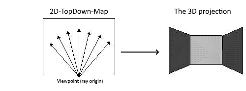

> The important point to remember is that ray-casting **“traces rays backward from viewer’s eye to objects.”**

&nbsp;

### Ray-Casting vs Ray-Tracing  

Like ray-casting, ray-tracing “determines the visibility of surfaces by tracing imaginary rays of light from viewer’s eye to the object in the scene”.  

From both definitions, it seems that ray-casting and ray-tracing is the same. Indeed, some books use both terms interchangeably. From game programmers perspective, however, ray-casting is regarded as a special implementation (subclass) of ray-tracing.  

This distinctions because is made because in general, ray-casting is faster than ray-tracing. This is possible because ray-casting utilizes some geometric constraint to speed up the rendering process. For instance: walls are always perpendicular with floors (you can see this in games such as Doom or Wolfenstein 3D). If it were not for such constraints, ray-casting will not be feasible. We would not want to ray-cast arbitrary splines for instance, because it is difficult to find a geometrical constraints on such shapes.  

> The main point to remember is that there are “less number of rays” to trace in ray-casting because of some “geometric constraints.” Or, it can also be said that ray-casting is a special purpose implementation of ray-tracing.

|Ray-Casting|Ray-Tracing|
|:---|:---|
|**Principle**: rays are cast and tracedin groups based on some geometric constraints. For instance: on a 320×200 display resolution, a ray-caster traces only 320 rays (the number 320 comes from the fact that the display has 320 horizontal pixel resolution, hence 320 vertical column).|**Principle:** each ray is tracedseparately, so that every point (usually a pixel) on the display is traced by one ray. For instance: on a 320×200 display resolution, a ray-tracer needs to trace 320×200 (64,000) rays. (That is roughly 200 times slower than ray-casting.)|  
|**Formula:** in most cases, inexact.|**Formula:** in most cases, exact.|  
|**Speed:** very fast compared to ray-tracing; suitable for real time process.|**Speed:** slow; unsuitable for real time process (at least not until we got a 500Ghz machine).|  
|**Quality:** resulting image is not very realistic. Often, they are blocky.|**Quality:** resulting image is very realistic – sometimes too realistic.|  
|**World:** limited by one or more geometric constraints (simple geometric shapes).|**World:** almost any shape can be rendered.|  
|**Storage:** small. Rendered images are not stored on disk. Normally, only the map is stored, and corresponding images are generated “on the fly.”|**Storage:** Rendered images are stored on disk and loaded when needed. Presently, no hardware is fast enough for “on the fly” rendering.|  
|**Examples:** Wolfenstein 3D (iD Software), Shadow Caster (Raven), Arena (Bethesda), Doom (iD Software), Dark Forces (LucasArts).|**Examples:** Examples: 7th Guest (Trilobyte), Critical Path (Mechadeus), 11th Hour (Trilobyte), Myst (Cyan), Cyberia (Xatrix).|  

&nbsp; 

<a name="ch1-2"></a>
## 1.2 Limitations of Ray-Casting  

Ray casting is fast because it utilizes some geometric constraints. In most cases, **walls are always at 90 degrees angle with the floor**. (Note that we are not talking about the angle between walls and another walls, but the angle between walls and floor.)  

Thus, a limitation that almost exists on a ray-casting game is that the viewpoint cannot be rotated along the Z axis (see Figure below). If this is allowed, then walls could be slanted and the benefit of drawing in vertical slices will be lost. This inability to rotate along the Z axis is one of the reason of why ray-casting environment is not regarded as a true three dimensional environment.  

> On a ray-casting environment, the player can move forward, backward, and turn left or right; but cannot rotate/swing around the Z-axis (this kind of Z-axis rotation is called a tilt).


&nbsp;

---

&nbsp;

# The process of ray-casting   

&nbsp; 

<a name="ch2-1"></a>
## 2.1 Creating a World  

To illustrate the process of ray-casting, we will create a maze world that has the following geometric constraints:  

1. Walls are always at 90° angle with the floor.  
2. Walls are made of cubes that have the same size.  
3. Floor is always flat.  

For our purpose, each cube will have the size of 64x64x64 units. (The choice of 64 is arbitrary, but it will be useful to pick a number that is a multiple of 2; because we can perform some arithmetic shift operations on such number (shift operations are faster than multiplication or division). The larger the size of the cube, the blockier the world will look like, but smaller cube will make the rendering slower.)  

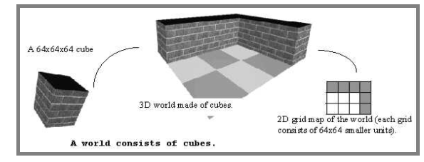

Before continuing, we will define our coordinate system so that there is no confusion.

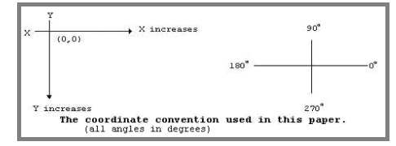  

Note: Any kind of cartesian coordinate system would work just as well. However, you do have to be consistent (don’t use the top-down coordinate system for one thing but then use the buttom-up coordinate for others).  

&nbsp; 

<a name="ch2-2"></a>
## 2.2 Defining project attributes  

Now that we have the world, we need to define some attributes before we can project and render the world. Specifically, we need to know these attributes:

1. Player/viewer’s height, player’s field of view (FOV), and player’s position.
2. Projection plane’s dimension.
3. Relationship between player and projection plane.

The player should be able to see what is in front of him/her. For this, we will need to define a **field of view (FOV)**. The FOV determines how wide the player sees the world in front of him/her (see Figure below). Most humans have a FOV of 90 degrees or more. However, FOV with this angle does not look good on screen. Therefore, we define the FOV to be 60 degrees through trial and experimentation (on how good it looks on screen). The player’s height is defined to be 32 units because this is a reasonable assumption considering that walls (the cubes) are 64 units high.

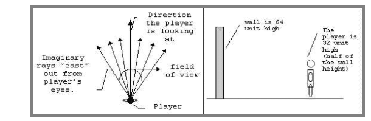  

To put the player inside the world, we need to define the **player’s X coordinate**, the **player’s Y coordinate**, and the **angle that the player is facing to**. These three attributes forms the “point of view” of the player.

Suppose that the player is put somewhere in the middle of grid coordinate (1,2) at a viewing angle of 45 degrees relative to the world, then the player’s *point of view* and FOV will be like in the figure below. (One grid consist is 64 x 64 units. Thus, we can also say that the player is in unit coordinate (96,160)).

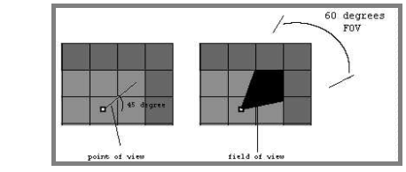  

We need to define a projection plane so that we can project what the player sees into the projection plane. A projection plane of 320 units wide and 200 units high is a good choice, since this is the resolution of most VGA video cards. (Video resolution is usually referred in pixels, so think of 1 pixel as equal to 1 unit.)  

When the player’s *point of view* is projected into the projection plane, the world should look like the scene in figure below.  

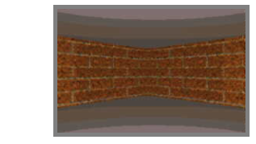  

> By knowing the *field of view* (FOV) and the dimension of the projection plane, we can calculate the angle between subsequent rays and the distance between the player and the projection plane.  

&nbsp;

**Here is what we know:**
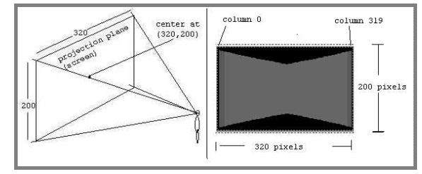  

**Here is what we can calculate** (most of these are high school level math):
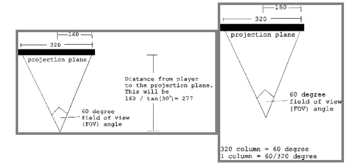  

**So now we know:**

- Dimension of the Projection Plane = 320 x 200 units  
- Center of the Projection Plane = (160,100)  
- Distance to the Projection Plane = 277 units  
- Angle between subsequent rays = 60/320 degrees  

(We will occasionally refer the “angle between subsequent rays” as the “angle between subsequent columns.” Later, this angle will be used to loop from column to column. The distance between player to the projection plane will be used for scaling.)

&nbsp; 

<a name="ch2-3"></a>
## 2.3 Finding walls  

Notice from the previous image, that the wall can be viewed as collection of 320 vertical lines (or 320 wall slices).  

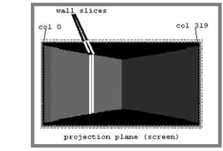  

This is precisely a form of geometrical constraints that will be suitable for ray-casting. Instead of tracing a ray for every pixel on the screen, we can trace for only every vertical column of screen. The ray on the extreme left of the FOV will be projected onto column 0 of the projection plane, and the right most ray will be projected onto column 319 of the projection plane.  

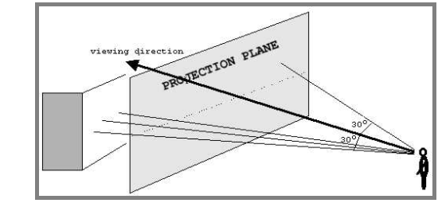  

Therefore, to render such scene, we can simply trace 320 rays starting from left to right. This can be done in a loop. The following illustrates these steps:

1. Based on the viewing angle, subtract 30 degrees (half of the FOV).  
2. Starting from column 0:  
    a. Cast a ray. (The term “cast” is a bit confusing. Imagine the player as a wizard who can “cast” rays instead of spells. The ray is just an “imaginary” line extending from the player.)  
    b. Trace the ray until it hits a wall.  
3. Record the distance to the wall (the distance is equal to the length of the ray).  
4. Add the angle increment so that the ray moves to the right (we know from Figure 10 that the value of the angle increment is 60/320 degrees).  
5. Repeat step 2 and 3 for each subsequent column until all 320 rays are cast.  

The trick to **step 2a.** is that instead of checking each pixels, we only have to check each grid. This is because a wall can only appear on a grid boundary. Consider a ray being traced as in figure below. To check whether this ray has hit a wall or not, it is sufficient to check the grid intersection points at A, B, C, D, E, and F.  

This ray intersects the grids at points A,B,C,D,E, and F:
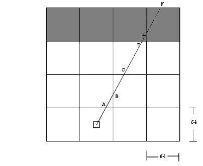  

To find walls, we need to check any grid intersection points that are encountered by the ray; and see if there is a wall on the grid or not. **The best way is to check for horizontal and vertical intersections separately.** When there is a wall on either a vertical or a horizontal intersection, the checking stops. The distance to both intersection points is then compared, and the closer distance is chosen. This process is illustrated in the following two figures.  

&nbsp;

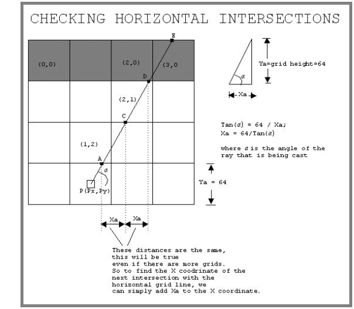  

Steps of finding intersections with **horizontal grid lines**:

1. Find coordinate of the first intersection (point A in this example).
2. Find Ya. (Note: Ya is just the height of the grid; however, if the ray is facing up, Ya will be negative, if the ray is facing down, Ya will bepositive.)
3. Find Xa using the equation given above.
4. Check the grid at the intersection point. If there is a wall on the grid, stop and calculate the distance.
5. If there is no wall, extend the to the next intersection point. Notice that the coordinate of the next intersection point -call it (Xnew,Ynew) is *Xnew=Xold+Xa*, and *Ynew=YOld+Ya*.

As an example the following is how you can get the point A:  

```c
Note: remember the Cartesian coordinate is increasing downward, and any fractional 
values will be rounded down.  

====== Finding horizontal intersection ======

1. Finding the coordinate of A.  
   If the ray is facing up      
        A.y = rounded_down(Py/64) * (64) - 1;

   If the ray is facing down
        A.y = rounded_down(Py/64) * (64) + 64;

   (In the picture, the ray is facing up, so we use the first formula.  
        A.y=rounded_down(224/64) * (64) - 1 = 191;
   
   Now at this point, we can find out the grid coordinate of y.
   However, we must decide whether A is part of the block above the line, or the 
   block below the line. Here, we chose to make A part of the block above the line, 
   that is why we subtract 1 from A.y.
   So the grid coordinate of A.y is 191/64 = 2;

        A.x = Px + (Py-A.y)/tan(α);
   In the picture, (assume α is 60 degrees), 
        A.x=96 + (224-191)/tan(60) = about 115;
   The grid coordinate of A.x is 115/64 = 1;

   So A is at grid (1,2) and we can check whether there is a wall on that grid.
   There is no wall on (1,2) so the ray will be extended to C.

2. Finding Ya
   If the ray is facing up      
        Ya=-64;
   If the ray is facing down
        Ya=64;

3. Finding Xa
        Xa = 64/tan(60) = 36;

4. We can get the coordinate of C as follows:
        C.x=A.x+Xa = 115+36 = 151;
        C.y=A.y+Ya = 191-64 = 127;

   Convert this into grid coordinate by dividing each component with 64.  

   The result is 
        C.x = 151/64 = 2 (grid coordinate), 
        C.y = 127/64 = 1 (grid coordinate) 

   So the grid coordinate of C is (2, 1).(C programmer's note: Remember we always 
   round down, this is especially true since you can use right shift by 8 to divide 
   by 64).

5. Grid (2,1) is checked.  
   Again, there is no wall, so the ray is extended to D.  

6. We can get the coordinate of D as follows:
        D.x=C.x+Xa = 151+36 = 187;
        D.y=C.y+Ya = 127-64 = 63;
   Convert this into grid coordinate by dividing each component with 64.  

   The result is 
        D.x = 187/64 = 2 (grid coordinate), 
        D.y = 63/64 = 0 (grid coordinate) 

   So the grid coordinate of D is (2, 0).  

7. Grid (2,0) is checked.  
   There is a wall there, so the process stop.
```  

Programmer’s note: You can see that once we have the value of Xa and Ya, the process is very simple. We just keep adding the old value with Xa and Ya, and perform shift operation, to find out the grid coordinate of the next point hit by the ray.  

&nbsp;

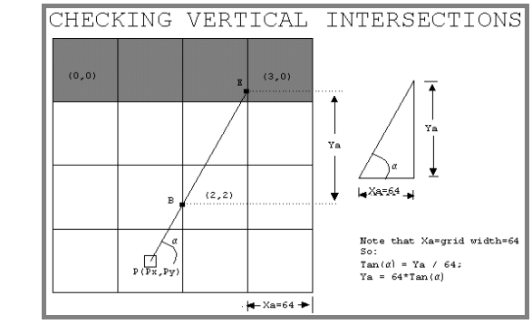  

Steps of finding intersections with **vertical grid lines**:

1. Find coordinate of the first intersection (point B in this example).
    The ray is facing right in the picture, so *B.x = rounded_down(Px/64) \* (64) + 64*.
    **If the ray had been facing left B.x = rounded_down(Px/64) \* (64) – 1.**  
        *A.y = Py + (Px-A.x)\*tan(α)*;
2. Find Xa. (Note: Xa is just the width of the grid; however, if the ray is facing right, Xa will be **positive**, if the ray is facing left, Ya will be **negative**.)
3. Find Ya using the equation given above.
4. Check the grid at the intersection point. If there is a wall on the grid, stop and calculate the distance. 
5. If there is no wall, extend the to the next intersection point. Notice that the coordinate of the next intersection point -call it (Xnew,Ynew) is just *Xnew=Xold+Xa*, and *Ynew=YOld+Ya*.  

In the picture, First, the ray hits point B. Grid (2,2) is checked. There no wall on (2,2) so the ray is extended to E. Grid (3,0) is checked. There is a wall there, so we stop and calculate the distance.

In this example, point D is closer than E. So the wall slice at D (not E) will be drawn.  

&nbsp; 

<a name="ch2-4"></a>
## 2.4 Finding distance to walls  

There are several ways to find the distance from the viewpoint (player) to the wall slice. They are illustrated below.  

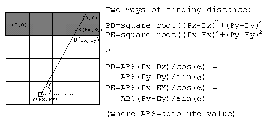  

The sine or cosine functions are cheaper to implement because they can be pre-computed and put into tables. This can be done because α (player’s POV) has to be between 0 to 360 degrees, so the number of possibilities are limited (the square root method has a virtually unlimited possible values for the x’s and y’s).  

Before drawing the wall, there is one problem that must be taken care of. This problem is known as the “fishbowl effect.” Fishbowl effect happens because ray-casting implementation mixes polar coordinate and Cartesian coordinate together. Therefore, using the above formula on wall slices that are not directly in front of the viewer will gives a longer distance. This is not what we want because it will cause a viewing distortion such as illustrated below.  

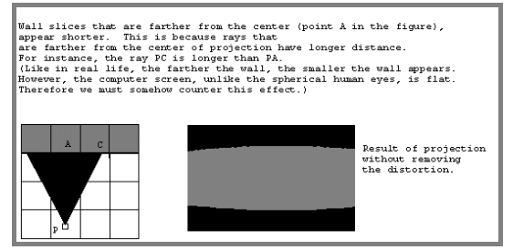  

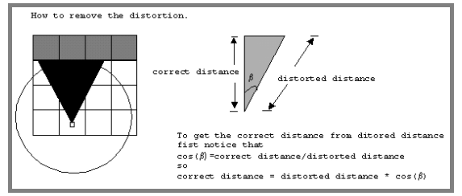  

Thus to remove the viewing distortion, the resulting distance obtained from equations must be multiplied by cos(β); where β is the angle of the ray that is being cast relative to the viewing angle. On the figure above, the viewing angle (α) is 90 degrees because the player is facing straight upward. Because we have 60 degrees field of view, β is 30 degrees for the leftmost ray and it is -30 degrees for the rightmost ray.

&nbsp; 

<a name="ch2-5"></a>
## 2.5 Drawing walls  

In the previous steps, 320 rays are casts, when each ray hits a wall, the distance to that wall is computed. Knowing the distance, the wall slice can then be projected onto the projection plane. To do this, the height of the projected wall slice need to be found. It turns out that this can be done with a simple formula:  

```c
                           Actual Slice Height
Projected Slice Height = ----------------------- * Distance to Projection Plane
                          Distance to the Slice
```

The logic behind this formula is explained in the figure below.  

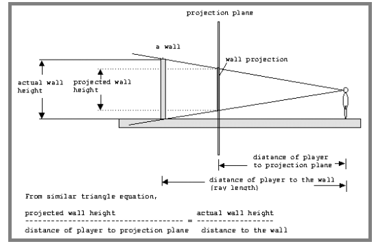  

Our world consist cubes, where the dimension of each cube is 64x64x64 units, so the wall height is 64 units. We also already know the distance of the player to the projection plane (which is 277). Thus, the equation can be simplified to:  
**Projected Slice Height = 64 / Distance to the Slice * 277**  

In an actual implementation, several things can be considered:  
- For instance, 64/277 can be pre-computed, since this will be a constant value. Once this is calculated, the wall slice can be drawn on the screen. This can be done by simply drawing a vertical line on the corresponding column on the projection plane (screen).
- Remember where the number 277 came from?  This number can actually be deviated a bit without causing any huge impact.  In fact, it will save time to use the value of 255 because the programmer can use shift operator to save computing time (shift right by 3 to multiply, shift left to divide).

For example, suppose the ray at column 200 hits a wall slice at distance of 330 units. The projection of the slice will be 64 / 330 * 277 = 54 (rounded up). Since the center of the projection plane is defined to be at 100. The middle of the wall slice should appear at this point. Hence, the top position where the wall slice should be drawn is 100-27=73. (where 27 is one half of 54). Finally, the projection of the slice will look something like the next figure.  

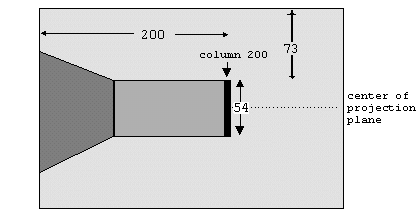  

&nbsp; 

<a name="ch2-6"></a>
## 2.6 Texture Mapped Walls  

To make the walls more attractive, the walls can be painted with texture (bitmap) using a technique known as texture mapping. (Texture mapping in general refers to a technique of painting a bitmap/texture onto a surface.) For the cube world, we use bitmaps that have the size of 64 by 64 pixels. This size is chosen because 64 by 64 is also the size of the cube facets that we are using in our world. It is possible to use different size bitmaps, but using the same size simplifies the texture mapping process.  

If we are to map a texture onto an arbitrary polygon, the texture mapping process will be complicated. Fortunately, on the ray-casting world that we are creating, texture mapping is just a matter of scaling a slice (a column) of bitmap (see figure below).  

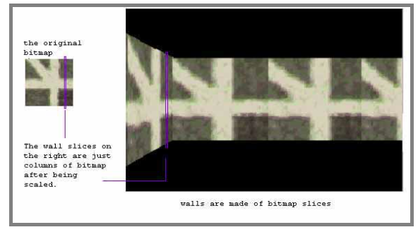  

When the ray is looking for the wall intersection, the offset (position of the ray relative to the grid) can be found easily. This offset can then be used to determine which column of the bitmap is to be drawn as the wall slice. The following figure illustrates the process of finding the offset.  

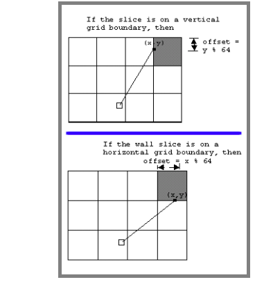  

&nbsp; 

<a name="ch2-7"></a>
## 2.7 Drawing Floors  

To draw floors, we can perform floor-casting (floor-casting refers to a techique of rendering floors). Note however, that it would be wasteful to perform floor-casting without texture mapping or shading. In other words, if the floor is not to be textured or shaded (shading will be explored later), then we can simply paint the floor with a solid color and we are done. Keeping that in mind, let us explore what is required to do floor-casting.

There are several ways to do floor-casting. However, all of them use a similar technique. The technique is explained below.  

1. Find an intersection with the floor.  
2. Determine the world coordinate of the floor that had been intersected.  
3. Calculate the distance between the player and the floor intersection.  
4. Project the floor intersection onto the projection plane.  

Note that it is not necessary to draw all the floors. We should only draw floors that are not covered by walls. For that reason, we should start the casting from the **bottom** of the wall slices. From the bottom of the slices, we then scan every pixels on the projection plane in **downward** direction (i.e.: cast rays subsequently in downward direction). This time, however, instead of looking for intersection with walls, the ray looks for intersection with the floor.

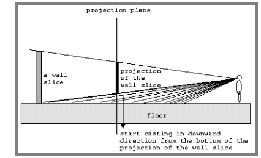  

Remember, the we do not need to cast beyond the projection plane. (Ie: cast from the bottom of the wall slice, row by row in downward direction; stop when the bottom of the projection plane is reached.)  

The math behind floor-casting is explained in the figure below.  

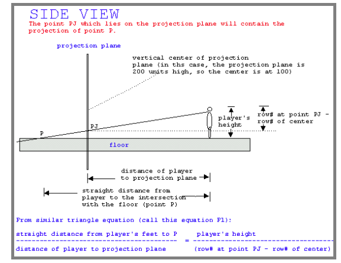  

To reiterate, take a look at the illustration while reading these steps:

\* Start from the bottom of the wall slice.

1. Take the pixel position (you have this value when you did the wall casting).  
2. Draw a line (a ray) from the pixel to the viewers eye.  
3. Extends the line so that it intersect the floor.  
4. The point where the line “intersect” the floor is the point on the texture map that is being hit by the ray.  
5. Take the pixel value of that point on the texture map (see the next figure to see how this can be done) and draw it on the screen.  

\* Repeat 1-5 until the bottom of the screen is reached.  

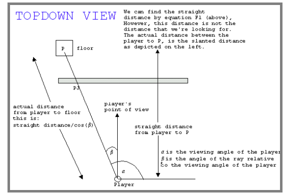  

&nbsp; 

<a name="ch2-8"></a>
## 2.8 Drawing Ceilings  

To draw the ceiling, the floor-casting process can be reversed. Instead of tracing rays from the **bottom** of a wall slice in **downward** direction, trace the ray from the **top** of the wall in the **upward** direction. This is actually pretty straightforward once the theory behind floor-casting has been grasped.  

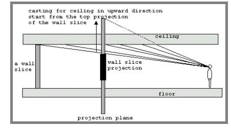  

Later, we will explain how to simulate the illusion of looking up, looking down, flying, and crouching. If the programmer does not wish to simulate these, it is possible to draw the floor and the ceiling at the same time. This is because the distance of the player’s eyes to the floor and ceiling is equal/symetrical. (Floors and ceilings are symmetrical since the player’s eyes is exactly at the midpoint between floors and ceilings.)  

&nbsp; 

<a name="ch2-9"></a>
## 2.9 Making the Player move  

The player should be able to move at least in three ways: forward, backward, and turning. The player’s position is defined by a coordinate and a viewing angle. To allow motion, two more attributes are needed. They are the **player’s movement speed**, and the **player’s turning speed**. The player’s movement speed defines how many units the player should move when he/she is moving forward or backward. The player’s turning speed (measured in angle) defines how many angle to be added or subtracted when the player is turning. We will discuss each how we use these attributes to allow motion.  

### A. Moving forward and backward.  
We define the player’s movement speed to be 10 units. (Generally, this can be any number, but the larger number, the less smooth the movement will appear.) The process of finding the x and y displacement is illustrated below. If the player is moving forward, we add the XDisplacement to the current player’s X coordinate; and add Ydisplacement to the current player’s Y coordinate. If the player is moving backward, we subtract the XDisplacement to the current player’s X coordinate; and subtract Ydisplacement to the current player’s Y coordinate. (Always check for world/wall boundaries so that the player won’t go outside the map or walk through a wall.)  

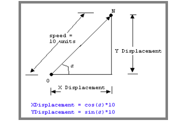  

&nbsp;

### B. Turning.  
The process of turning is very simple to implement. All we need to do is to add or subtract an angle increment (aI) to the current player’s viewing angle (wrap around whenever the turn goes to a full circle). Again, larger angle increment will cause the movement appear less smooth.  

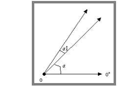  

&nbsp; 

<a name="ch2-10"></a>
## 2.10 Looking Up and Down  

It is possible to simulate the illusion of looking up and down, as well as flying and crouching on a ray-casting environment. However, note that -and this is important- the trick that is about to be explained in here does not always follow the correct three dimensional projection theories. **Ie: These are tricks, they’re not the correct way to do a “realistic” simulation.**  

### A. Looking up and down.  
Recall that the projection plane is 200 units high. And up to this point, we always set the vertical center of the projection plane to be exactly in the middle (that is, at point y=100). Thus the midpoint of any wall slice will be drawn at projection point y=100. It turns out that the effect of looking up or down can be simulated simply by changing this value.  

That is, to simulate looking up, instead of putting the center of the vertical slice at y=100, we put it at a point where y>100 (this is similar to moving the projection plane upward).  

Similarly, to simulate looking down, instead of putting the center of the vertical slice at y=100, we put it at a point where y<100 (this is similar to moving the projection plane downward).  

And why does this trick work at all? Hopefully, the following illustrations explains it.  

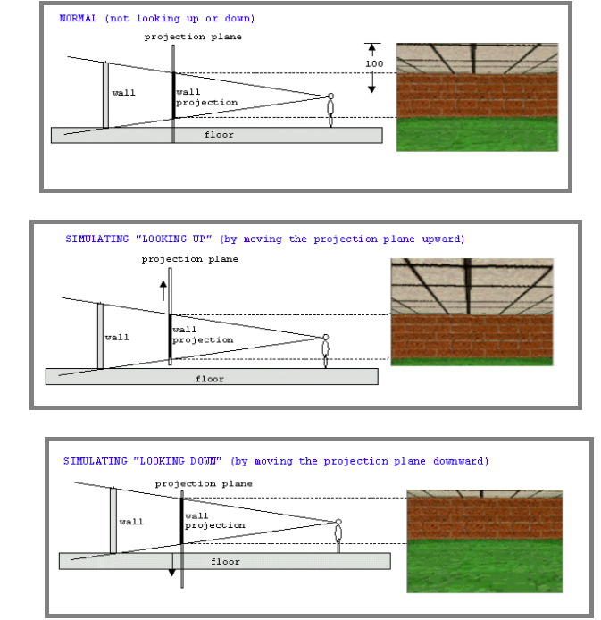  

If you’re confused, imagine holding a mirror with a wall behind you while standing straight.  When the mirror is moved up or down, different part of the wall is shown. The mirror is the projection plane. (Take a moment to imagine this before continuing.)  

&nbsp;

### B. Flying and crouching.  
Recall that the player’s height is set to be 32 units. This means that the player’s eyes (imagine the player’s eyes are exactly on top of the player’s head) are looking straight at the walls at point 32. Since 32 is one half of the walls’ height, having the player’s height at 32 makes the player’s eyes halfway between the floor and the ceiling (see next figure).  

What if we change this value? Surprisingly (or maybe not), the walls will shift either upward or downward depending on whether the player’s height is increased or decreased.  

Thus, to make the player as if he/she is flying (or leaping), we can simplyincrease the player’s height. Similarly, to make the player as if she/he iscrouching, we can decrease the player’s height. The height should not be allowed to be less than 0 or greater than walls’ height, because doing that will make the player go over the ceiling or sink into the floor.  

The next figure shows why this method works.  

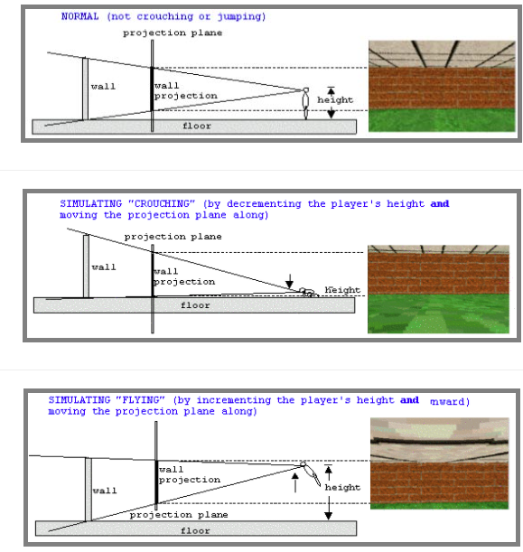  

If you’re confused, again we use the mirror method to clarify how this works. Imagine that that you are standing straight, holding a mirror on a small room. Stand facing away from the wall. Position the mirror so that it’s in front of the eye (i.e.: you do not have to turn your head to see the mirror). Now, imagine what happen if you squat and see what is in the mirror. In the mirror, you should see different part of the wall and more floor area… like 2nd image on this page …. hope you got the idea.  

The mirror is the projection plane, and the eye position is the player’s height.  

There’s one counter intuitive aspect of this vertical-motion method, which is this:  

the projection plane must always be perpendicular with the player’s eyes. (That is: the projection plane must always be parallel to the walls – they cannot be skewed in any way.) The best way to conceptualize this is to imagine a person “aiming” through a camera lens. The person always aims in forward direction at 90 degrees angle; even when he/she is crouching or standing on top of a table.  

The reason for this is that when using this method, we can not skew the projection plane like in the next figure; because if we rotate the projection plane to follow the “normal” eye direction, then the walls will be slanted (no longer parallel with the projection plane); and the rendering process must then take this into account. That means, more complex calculation will be required, and the rendering process will become terribly slow.  

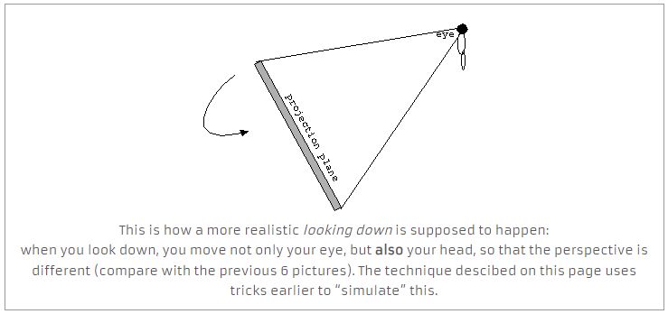  

### C. Combined effects.  
The effects explained above can be combined to create even more interesting motions such as illustrated below.  

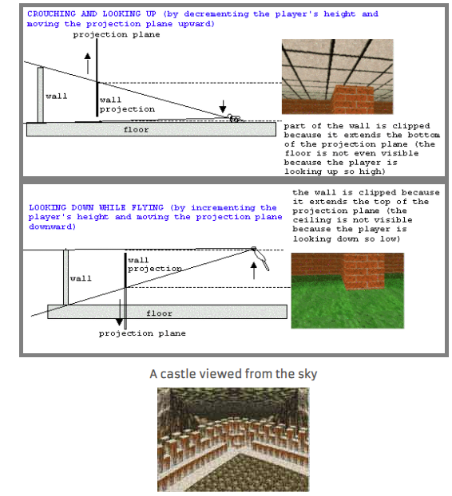  

&nbsp; 

<a name="ch2-11"></a>
## 2.11 Shading  

When an object is farther away from the viewer, the object should appear less/more bright. To accomplish this, a shading effect is needed. But first, we need to know about how colors are represented.  

The standard 256 color VGA mode registers contains three numbers between 0 to 63 for every color in the palette which are called the RGB (RedGreenBlue) values. For example, full red color has RGB components of (63,0,0); full green has (0,63,0); and full blue has (0,0,63). Color such as full yellow, can be obtained by mixing full red and full green so that (63,63,0) is yellow.  

To change the brightness of the red, green, or blue component of a color, the number representing the color component must be increased or decreased. For instance, to decrease the intensity of a color that have an RGB components (50,10,10) by one half, multiply each component by 0.5. The resulting color will be (25,5,5).  

This is quite simple, but how do we know what intensity to use on what distance? The first option is to use an exact light intensity formula which goes something like this:  

`Intensity = (kI/(d+do))*(N*L)`  

From a game programmer perspective, this formula is too complicated and will be terribly slow, so we are not going to even bother with it. Our main goal will be to make a shading effect that looks-right (or at least reasonable). We do not particularly care whether the formula that we are using is the correct text-book formula or not.  

(Side note.: For game programming, I tend to agree to this principle:  
it’s better to have something that is fast and look-resonably-right; that to have something that is exactly-right, but slow.)

Hence, the following formula is used instead (Lampton 406).  

`Intensity = Object Intensity/Distance * Multiplier`  

Here, Object Intensityis the intensity that the programmer wish to use (it should be between 0 and 1). This is actually quite simple conceptually. It basically says that as objects gets farther, the intensity of the object gets smaller. Multiplier is a number to prevent Intensity from falling off to fast with distance. This calculation can still be expensive in real time, therefore a distance table such as the following table can be used:  

|Distance to object|Intensity|
|:---|:---|
|0 to 500|1|
|501 to 1000|0.75|
|1001 to 1500|0.5|  

Ray-casting process lends itself nicely here because when we cast a ray, we also obtain the distance to the object to be rendered. In an actual implementation, we need to take into account also the number of available colors. Since most games can only use 256 colors, some acrobatics will be needed to make sure that the palette contains the correct color range. A possible solution for this is to use a color matching algorithm and map the result into an intensity table. When rendering, we simply fetch the correct color value from the appropriate table. (This is quite fast because a particular wall slice will have the same intensity for all of its pixels. So we only have to switch table between wall slices.)  

|Distance to object|Intensity|Palette Mapping Table Index|
|:---|:---|:---|
|0 to 500|1|1|
|501 to 1000|0.75|2|
|1001 to 1500|0.5|3|
|...|...|...|  

Normally, as the intensity of an object approaches zero, the object will appear darker. However, this does not have to be always the case. We can create in interesting effect, such as fog or underwater effect by altering the “target color.” For instance, to create a fog effect, we can make the palette converges to white.  

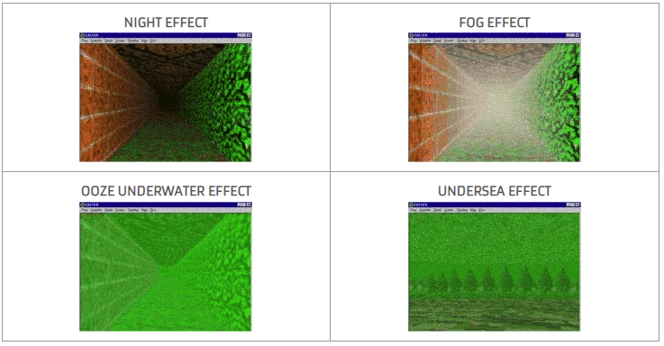  

&nbsp;

---

&nbsp;

# C code / OpenGL example  

&rarr; C code taken from video series starting [here](https://www.youtube.com/watch?v=gYRrGTC7GtA&t=3s).

<a name="ch3-1"></a>
## 3.1 .c file  

<details><summary markdown="span">Code</summary>  
  ```c

    //WADS to move player, E open door after picking up the key

    #include <stdlib.h>
    #include <GL/glut.h>
    #include <math.h>

    #include "Textures/All_Textures.ppm"
    #include "Textures/sky.ppm"
    #include "Textures/title.ppm"
    #include "Textures/won.ppm"
    #include "Textures/lost.ppm"
    #include "Textures/sprites.ppm"

    float degToRad(float a) { return a*M_PI/180.0;}
    float FixAng(float a){ if(a>359){ a-=360;} if(a<0){ a+=360;} return a;}
    float distance(ax,ay,bx,by,ang){ return cos(degToRad(ang))*(bx-ax)-sin(degToRad(ang))*(by-ay);}
    float px,py,pdx,pdy,pa;
    float frame1,frame2,fps;
    int gameState=0, timer=0; //game state. init, start screen, game loop, win/lose
    float fade=0;             //the 3 screens can fade up from black

    typedef struct
    {
        int w,a,d,s;                     //button state on off
    } ButtonKeys; ButtonKeys Keys;

    //-----------------------------MAP----------------------------------------------
    #define mapX  8      //map width
    #define mapY  8      //map height
    #define mapS 64      //map cube size

                         //Edit these 3 arrays with values 0-4 to create your own level! 
    int mapW[]=          //walls
    {
        1,1,1,1,2,2,2,2,
        6,0,0,1,0,0,0,2,
        1,0,0,4,0,2,0,2,
        1,5,4,5,0,0,0,2,
        2,0,0,0,0,0,0,1,
        2,0,0,0,0,1,0,1,
        2,0,0,0,0,0,0,1,
        1,1,1,1,1,1,1,1,	
    };

    int mapF[]=          //floors
    {
        0,0,0,0,0,0,0,0,
        0,0,0,0,2,2,2,0,
        0,0,0,0,6,0,2,0,
        0,0,8,0,2,7,6,0,
        0,0,2,0,0,0,0,0,
        0,0,2,0,8,0,0,0,
        0,1,1,1,1,0,8,0,
        0,0,0,0,0,0,0,0,	
    };

    int mapC[]=          //ceiling
    {
        0,0,0,0,0,0,0,0,
        0,0,0,0,0,0,0,0,
        0,0,0,0,0,0,0,0,
        0,0,0,0,0,0,0,0,
        0,4,2,4,0,0,0,0,
        0,0,2,0,0,0,0,0,
        0,0,2,0,0,0,0,0,
        0,0,0,0,0,0,0,0,	
    };


    typedef struct       //All veriables per sprite
    {
        int type;           //static, key, enemy
        int state;          //on off
        int map;            //texture to show
        float x,y,z;        //position
    } sprite; sprite sp[4];

    int depth[120];      //hold wall line depth to compare for sprite depth

    void drawSprite()
    {
        int x,y,s;
        if(px<sp[0].x+30 && px>sp[0].x-30 && py<sp[0].y+30 && py>sp[0].y-30){ sp[0].state=0;} //pick up key 	
        if(px<sp[3].x+30 && px>sp[3].x-30 && py<sp[3].y+30 && py>sp[3].y-30){ gameState=4;} //enemy kills

        //enemy attack
        int spx=(int)sp[3].x>>6,          spy=(int)sp[3].y>>6;          //normal grid position
        int spx_add=((int)sp[3].x+15)>>6, spy_add=((int)sp[3].y+15)>>6; //normal grid position plus     offset
        int spx_sub=((int)sp[3].x-15)>>6, spy_sub=((int)sp[3].y-15)>>6; //normal grid position subtract offset
        if(sp[3].x>px && mapW[spy*8+spx_sub]==0){ sp[3].x-=0.04*fps;}
        if(sp[3].x<px && mapW[spy*8+spx_add]==0){ sp[3].x+=0.04*fps;}
        if(sp[3].y>py && mapW[spy_sub*8+spx]==0){ sp[3].y-=0.04*fps;}
        if(sp[3].y<py && mapW[spy_add*8+spx]==0){ sp[3].y+=0.04*fps;}

        for(s=0;s<4;s++)
        {
            float sx=sp[s].x-px; //temp float variables
            float sy=sp[s].y-py;
            float sz=sp[s].z;

            float CS=cos(degToRad(pa)), SN=sin(degToRad(pa)); //rotate around origin
            float a=sy*CS+sx*SN; 
            float b=sx*CS-sy*SN; 
            sx=a; sy=b;

            sx=(sx*108.0/sy)+(120/2); //convert to screen x,y
            sy=(sz*108.0/sy)+( 80/2);

            int scale=32*80/b;   //scale sprite based on distance
            if(scale<0){ scale=0;} if(scale>120){ scale=120;}  

            //texture
            float t_x=0, t_y=31, t_x_step=31.5/(float)scale, t_y_step=32.0/(float)scale;

            for(x=sx-scale/2;x<sx+scale/2;x++)
            {
                t_y=31;
                for(y=0;y<scale;y++)
                {
                    if(sp[s].state==1 && x>0 && x<120 && b<depth[x])
                    {
                        int pixel=((int)t_y*32+(int)t_x)*3+(sp[s].map*32*32*3);
                        int red   =sprites[pixel+0];
                        int green =sprites[pixel+1];
                        int blue  =sprites[pixel+2];
                        
                        if(red!=255, green!=0, blue!=255) //dont draw if purple
                        {
                            glPointSize(8); glColor3ub(red,green,blue); glBegin(GL_POINTS); glVertex2i(x*8,sy*8-y*8); glEnd(); //draw point 
                        }
                        t_y-=t_y_step; if(t_y<0){ t_y=0;}
                    }
                }
                t_x+=t_x_step;
            }
        }
    }


    //---------------------------Draw Rays and Walls--------------------------------
    void drawRays2D()
    {	
        int r,mx,my,mp,dof,side; float vx,vy,rx,ry,ra,xo,yo,disV,disH; 
        
        ra=FixAng(pa+30);                                                              //ray set back 30 degrees
        
        for(r=0;r<120;r++)
        {
            int vmt=0,hmt=0;                                                           //vertical and horizontal map texture number 
            //---Vertical--- 
            dof=0; side=0; disV=100000;
            float Tan=tan(degToRad(ra));
                if(cos(degToRad(ra))> 0.001){ rx=(((int)px>>6)<<6)+64;      ry=(px-rx)*Tan+py; xo= 64; yo=-xo*Tan;}//looking left
            else if(cos(degToRad(ra))<-0.001){ rx=(((int)px>>6)<<6) -0.0001; ry=(px-rx)*Tan+py; xo=-64; yo=-xo*Tan;}//looking right
            else { rx=px; ry=py; dof=8;}                                               //looking up or down. no hit  

            while(dof<8) 
            { 
                mx=(int)(rx)>>6; my=(int)(ry)>>6; mp=my*mapX+mx;                     
                if(mp>0 && mp<mapX*mapY && mapW[mp]>0){ vmt=mapW[mp]-1; dof=8; disV=cos(degToRad(ra))*(rx-px)-sin(degToRad(ra))*(ry-py);}//hit         
                else{ rx+=xo; ry+=yo; dof+=1;}                                         //check next horizontal
            } 
            vx=rx; vy=ry;

            //---Horizontal---
            dof=0; disH=100000;
            Tan=1.0/Tan; 
                if(sin(degToRad(ra))> 0.001){ ry=(((int)py>>6)<<6) -0.0001; rx=(py-ry)*Tan+px; yo=-64; xo=-yo*Tan;}//looking up 
            else if(sin(degToRad(ra))<-0.001){ ry=(((int)py>>6)<<6)+64;      rx=(py-ry)*Tan+px; yo= 64; xo=-yo*Tan;}//looking down
            else{ rx=px; ry=py; dof=8;}                                                   //looking straight left or right
            
            while(dof<8) 
            { 
                mx=(int)(rx)>>6; my=(int)(ry)>>6; mp=my*mapX+mx;                          
                if(mp>0 && mp<mapX*mapY && mapW[mp]>0){ hmt=mapW[mp]-1; dof=8; disH=cos(degToRad(ra))*(rx-px)-sin(degToRad(ra))*(ry-py);}//hit         
                else{ rx+=xo; ry+=yo; dof+=1;}                                               //check next horizontal
            } 
            
            float shade=1;
            glColor3f(0,0.8,0);
            if(disV<disH){ hmt=vmt; shade=0.5; rx=vx; ry=vy; disH=disV; glColor3f(0,0.6,0);}//horizontal hit first
                
            int ca=FixAng(pa-ra); disH=disH*cos(degToRad(ca));                            //fix fisheye 
            int lineH = (mapS*640)/(disH); 
            float ty_step=32.0/(float)lineH; 
            float ty_off=0; 
            if(lineH>640){ ty_off=(lineH-640)/2.0; lineH=640;}                            //line height and limit
            int lineOff = 320 - (lineH>>1);                                               //line offset

            depth[r]=disH; //save this line's depth
            //---draw walls---
            int y;
            float ty=ty_off*ty_step;//+hmt*32;
            float tx;

            if(shade==1){ tx=(int)(rx/2.0)%32; if(ra>180){ tx=31-tx;}}  
            else        { tx=(int)(ry/2.0)%32; if(ra>90 && ra<270){ tx=31-tx;}}
            
            for(y=0;y<lineH;y++)
            {
                int pixel=((int)ty*32+(int)tx)*3+(hmt*32*32*3);
                int red   =All_Textures[pixel+0]*shade;
                int green =All_Textures[pixel+1]*shade;
                int blue  =All_Textures[pixel+2]*shade;
                glPointSize(8); glColor3ub(red,green,blue); glBegin(GL_POINTS); glVertex2i(r*8,y+lineOff); glEnd();
                ty+=ty_step;
            }
            
            //---draw floors---
            for(y=lineOff+lineH;y<640;y++)
            {
                float dy=y-(640/2.0), deg=degToRad(ra), raFix=cos(degToRad(FixAng(pa-ra)));
                tx=px/2 + cos(deg)*158*2*32/dy/raFix;
                ty=py/2 - sin(deg)*158*2*32/dy/raFix;
                int mp=mapF[(int)(ty/32.0)*mapX+(int)(tx/32.0)]*32*32;
                int pixel=(((int)(ty)&31)*32 + ((int)(tx)&31))*3+mp*3;
                int red   =All_Textures[pixel+0]*0.7;
                int green =All_Textures[pixel+1]*0.7;
                int blue  =All_Textures[pixel+2]*0.7;
                glPointSize(8); glColor3ub(red,green,blue); glBegin(GL_POINTS); glVertex2i(r*8,y); glEnd();

                //---draw ceiling---
                mp=mapC[(int)(ty/32.0)*mapX+(int)(tx/32.0)]*32*32;
                pixel=(((int)(ty)&31)*32 + ((int)(tx)&31))*3+mp*3;
                red   =All_Textures[pixel+0];
                green =All_Textures[pixel+1];
                blue  =All_Textures[pixel+2];
                if(mp>0){ glPointSize(8); glColor3ub(red,green,blue); glBegin(GL_POINTS); glVertex2i(r*8,640-y); glEnd();}
            }
            
            ra=FixAng(ra-0.5);                                                               //go to next ray, 60 total
        }
    }//-----------------------------------------------------------------------------


    void drawSky()     //draw sky and rotate based on player rotation
    {
        int x,y;

        for(y=0;y<40;y++)
        {
            for(x=0;x<120;x++)
            {
                int xo=(int)pa*2-x; if(xo<0){ xo+=120;} xo=xo % 120; //return 0-120 based on player angle
                int pixel=(y*120+xo)*3;
                int red   =sky[pixel+0];
                int green =sky[pixel+1];
                int blue  =sky[pixel+2];
                glPointSize(8); glColor3ub(red,green,blue); glBegin(GL_POINTS); glVertex2i(x*8,y*8); glEnd();
            }	
        }
    }

    void screen(int v) //draw any full screen image. 120x80 pixels
    {
        int x,y;
        int *T;
        if(v==1){ T=title;}
        if(v==2){ T=won;}
        if(v==3){ T=lost;}

        for(y=0;y<80;y++)
        {
            for(x=0;x<120;x++)
            {
                int pixel=(y*120+x)*3;
                int red   =T[pixel+0]*fade;
                int green =T[pixel+1]*fade;
                int blue  =T[pixel+2]*fade;
                glPointSize(8); glColor3ub(red,green,blue); glBegin(GL_POINTS); glVertex2i(x*8,y*8); glEnd();
            }	
        }	

        if(fade<1){ fade+=0.001*fps;} 
        if(fade>1){ fade=1;}
    }


    void init()//init all variables when game starts
    {
        glClearColor(0.3,0.3,0.3,0);
        px=150; py=400; pa=90;
        pdx=cos(degToRad(pa)); pdy=-sin(degToRad(pa));                                 //init player
        mapW[19]=4; mapW[26]=4; //close doors

        sp[0].type=1; sp[0].state=1; sp[0].map=0; sp[0].x=1.5*64; sp[0].y=5*64;   sp[0].z=20; //key
        sp[1].type=2; sp[1].state=1; sp[1].map=1; sp[1].x=1.5*64; sp[1].y=4.5*64; sp[1].z= 0; //light 1
        sp[2].type=2; sp[2].state=1; sp[2].map=1; sp[2].x=3.5*64; sp[2].y=4.5*64; sp[2].z= 0; //light 2
        sp[3].type=3; sp[3].state=1; sp[3].map=2; sp[3].x=2.5*64; sp[3].y=2*64;   sp[3].z=20; //enemy
    }


    void display()
    {  
        //frames per second
        frame2=glutGet(GLUT_ELAPSED_TIME); fps=(frame2-frame1); frame1=glutGet(GLUT_ELAPSED_TIME); 
        glClear(GL_COLOR_BUFFER_BIT | GL_DEPTH_BUFFER_BIT); 

        if(gameState==0){ init(); fade=0; timer=0; gameState=1;} //init game
        if(gameState==1){ screen(1); timer+=1*fps; if(timer>2000){ fade=0; timer=0; gameState=2;}} //start screen
        if(gameState==2) //The main game loop
        {
            //buttons
            if(Keys.a==1){ pa+=0.2*fps; pa=FixAng(pa); pdx=cos(degToRad(pa)); pdy=-sin(degToRad(pa));} 	
            if(Keys.d==1){ pa-=0.2*fps; pa=FixAng(pa); pdx=cos(degToRad(pa)); pdy=-sin(degToRad(pa));} 

            int xo=0; if(pdx<0){ xo=-20;} else{ xo=20;}                                    //x offset to check map
            int yo=0; if(pdy<0){ yo=-20;} else{ yo=20;}                                    //y offset to check map
            int ipx=px/64.0, ipx_add_xo=(px+xo)/64.0, ipx_sub_xo=(px-xo)/64.0;             //x position and offset
            int ipy=py/64.0, ipy_add_yo=(py+yo)/64.0, ipy_sub_yo=(py-yo)/64.0;             //y position and offset
            
            if(Keys.w==1)                                                                  //move forward
            {  
                if(mapW[ipy*mapX        + ipx_add_xo]==0){ px+=pdx*0.2*fps;}
                if(mapW[ipy_add_yo*mapX + ipx       ]==0){ py+=pdy*0.2*fps;}
            }

            if(Keys.s==1)                                                                  //move backward
            { 
                if(mapW[ipy*mapX        + ipx_sub_xo]==0){ px-=pdx*0.2*fps;}
                if(mapW[ipy_sub_yo*mapX + ipx       ]==0){ py-=pdy*0.2*fps;}
            } 

            drawSky();
            drawRays2D();
            drawSprite();
            if( (int)px>>6==1 && (int)py>>6==1 ){ fade=0; timer=0; gameState=3;} //Entered block 1, Win game!!
        }

        if(gameState==3){ screen(2); timer+=1*fps; if(timer>2000){ fade=0; timer=0; gameState=0;}} //won screen
        if(gameState==4){ screen(3); timer+=1*fps; if(timer>2000){ fade=0; timer=0; gameState=0;}} //lost screen

        glutPostRedisplay();
        glutSwapBuffers();  
    }

    void ButtonDown(unsigned char key,int x,int y)                                  //keyboard button pressed down
    {
        if(key=='a'){ Keys.a=1;} 	
        if(key=='d'){ Keys.d=1;} 
        if(key=='w'){ Keys.w=1;}
        if(key=='s'){ Keys.s=1;}

        if(key=='e' && sp[0].state==0)             //open doors
        { 
            int xo=0; if(pdx<0){ xo=-25;} else{ xo=25;}
            int yo=0; if(pdy<0){ yo=-25;} else{ yo=25;} 
            int ipx=px/64.0, ipx_add_xo=(px+xo)/64.0;
            int ipy=py/64.0, ipy_add_yo=(py+yo)/64.0;
            if(mapW[ipy_add_yo*mapX+ipx_add_xo]==4){ mapW[ipy_add_yo*mapX+ipx_add_xo]=0;}
        }

        glutPostRedisplay();
    }

    void ButtonUp(unsigned char key,int x,int y)                                    //keyboard button pressed up
    {
        if(key=='a'){ Keys.a=0;} 	
        if(key=='d'){ Keys.d=0;} 
        if(key=='w'){ Keys.w=0;}
        if(key=='s'){ Keys.s=0;}
        glutPostRedisplay();
    }

    void resize(int w,int h)                                                        //screen window rescaled, snap back
    {
        glutReshapeWindow(960,640);
    }

    int main(int argc, char* argv[])
    { 
        glutInit(&argc, argv);
        glutInitDisplayMode(GLUT_DOUBLE | GLUT_RGB);
        glutInitWindowSize(960,640);
        glutInitWindowPosition( glutGet(GLUT_SCREEN_WIDTH)/2-960/2 ,glutGet(GLUT_SCREEN_HEIGHT)/2-640/2 );
        glutCreateWindow("YouTube-3DSage");
        gluOrtho2D(0,960,640,0);
        init();
        glutDisplayFunc(display);
        glutReshapeFunc(resize);
        glutKeyboardFunc(ButtonDown);
        glutKeyboardUpFunc(ButtonUp);
        glutMainLoop();
    }

  ```
</details>  

&nbsp;

---

&nbsp;

# Javascript example  

<a name="ch4-1"></a>
## 4.1 .js file  

&nbsp;

---

&nbsp;

# C++ / Qt example  

&rarr; C++ code taken from [here](https://doc.qt.io/archives/qt-4.8/qt-demos-embedded-raycasting-example.html).

&nbsp; 

here: **Qt4.8**  

<a name="ch5-1"></a>
## 5.1 .cpp file  

<details><summary markdown="span">Code</summary>  
  ```c++

    #include <QtCore>
    #include <QtWidgets>
    #include <qmath.h>

    #define WORLD_SIZE 8

    int world_map[WORLD_SIZE][WORLD_SIZE] = {
        { 1, 1, 1, 1, 6, 1, 1, 1 },
        { 1, 0, 0, 1, 0, 0, 0, 7 },
        { 1, 1, 0, 1, 0, 1, 1, 1 },
        { 6, 0, 0, 0, 0, 0, 0, 3 },
        { 1, 8, 8, 0, 8, 0, 8, 1 },
        { 2, 2, 0, 0, 8, 8, 7, 1 },
        { 3, 0, 0, 0, 0, 0, 0, 5 },
        { 2, 2, 2, 2, 7, 4, 4, 4 },
    };

    #define TEXTURE_SIZE 64
    #define TEXTURE_BLOCK (TEXTURE_SIZE * TEXTURE_SIZE)

    class Raycasting: public QWidget
    {
    public:
        Raycasting(QWidget *parent = 0)
                : QWidget(parent)
                , angle(0.5)
                , playerPos(1.5, 1.5)
                , angleDelta(0)
                , moveDelta(0)
                , touchDevice(false) {
            // http://www.areyep.com/RIPandMCS-TextureLibrary.html
            textureImg.load(":/textures/Texlibnubrick2.gif");
            textureImg = textureImg.convertToFormat(QImage::Format_ARGB32);
            Q_ASSERT(textureImg.width() == TEXTURE_SIZE * 2);
            Q_ASSERT(textureImg.bytesPerLine() == 4 * TEXTURE_SIZE * 2);
            textureCount = textureImg.height() / TEXTURE_SIZE;
            watch.start();
            ticker.start(25, this);
            setAttribute(Qt::WA_OpaquePaintEvent, true);
            setMouseTracking(false);
        }

        void updatePlayer() {
            int interval = qBound(20, watch.elapsed(), 250);
            watch.start();
            angle += angleDelta * interval / 1000;
            qreal step = moveDelta * interval / 1000;
            qreal dx = cos(angle) * step;
            qreal dy = sin(angle) * step;
            QPointF pos = playerPos + 3 * QPointF(dx, dy);
            int xi = static_cast<int>(pos.x());
            int yi = static_cast<int>(pos.y());
            if (world_map[yi][xi] == 0)
                playerPos = playerPos + QPointF(dx, dy);
        }

        void showFps() {
            static QTime frameTick;
            static int totalFrame = 0;
            if (!(totalFrame & 31)) {
                int elapsed = frameTick.elapsed();
                frameTick.start();
                int fps = 32 * 1000 / (1 + elapsed);
                setWindowTitle(QString("Raycasting (%1 FPS)").arg(fps));
            }
            totalFrame++;
        }

        void render() {

            // setup the screen surface
            if (buffer.size() != bufferSize)
                buffer = QImage(bufferSize, QImage::Format_ARGB32);
            int bufw = buffer.width();
            int bufh = buffer.height();
            if (bufw <= 0 || bufh <= 0)
                return;

            // we intentionally cheat here, to avoid detach
            const uchar *ptr = buffer.bits();
            QRgb *start = (QRgb*)(ptr);
            QRgb stride = buffer.bytesPerLine() / 4;
            QRgb *finish = start + stride * bufh;

            // prepare the texture pointer
            const uchar *src = textureImg.bits();
            const QRgb *texsrc = reinterpret_cast<const QRgb*>(src);

            // cast all rays here
            qreal sina = sin(angle);
            qreal cosa = cos(angle);
            qreal u = cosa - sina;
            qreal v = sina + cosa;
            qreal du = 2 * sina / bufw;
            qreal dv = -2 * cosa / bufw;

            for (int ray = 0; ray < bufw; ++ray, u += du, v += dv) {

                // every time this ray advances 'u' units in x direction,
                // it also advanced 'v' units in y direction
                qreal uu = (u < 0) ? -u : u;
                qreal vv = (v < 0) ? -v : v;
                qreal duu = 1 / uu;
                qreal dvv = 1 / vv;
                int stepx = (u < 0) ? -1 : 1;
                int stepy = (v < 0) ? -1 : 1;

                // the cell in the map that we need to check
                qreal px = playerPos.x();
                qreal py = playerPos.y();
                int mapx = static_cast<int>(px);
                int mapy = static_cast<int>(py);

                // the position and texture for the hit
                int texture = 0;
                qreal hitdist = 0.1;
                qreal texofs = 0;
                bool dark = false;

                // first hit at constant x and constant y lines
                qreal distx = (u > 0) ? (mapx + 1 - px) * duu : (px - mapx) * duu;
                qreal disty = (v > 0) ? (mapy + 1 - py) * dvv : (py - mapy) * dvv;

                // loop until we hit something
                while (texture <= 0) {
                    if (distx > disty) {
                        // shorter distance to a hit in constant y line
                        hitdist = disty;
                        disty += dvv;
                        mapy += stepy;
                        texture = world_map[mapy][mapx];
                        if (texture > 0) {
                            dark = true;
                            if (stepy > 0) {
                                qreal ofs = px + u * (mapy - py) / v;
                                texofs = ofs - floor(ofs);
                            } else {
                                qreal ofs = px + u * (mapy + 1 - py) / v;
                                texofs = ofs - floor(ofs);
                            }
                        }
                    } else {
                        // shorter distance to a hit in constant x line
                        hitdist = distx;
                        distx += duu;
                        mapx += stepx;
                        texture = world_map[mapy][mapx];
                        if (texture > 0) {
                            if (stepx > 0) {
                                qreal ofs = py + v * (mapx - px) / u;
                                texofs = ofs - floor(ofs);
                            } else {
                                qreal ofs = py + v * (mapx + 1 - px) / u;
                                texofs = ceil(ofs) - ofs;
                            }
                        }
                    }
                }

                // get the texture, note that the texture image
                // has two textures horizontally, "normal" vs "dark"
                int col = static_cast<int>(texofs * TEXTURE_SIZE);
                col = qBound(0, col, TEXTURE_SIZE - 1);
                texture = (texture - 1) % textureCount;
                const QRgb *tex = texsrc + TEXTURE_BLOCK * texture * 2 +
                                  (TEXTURE_SIZE * 2 * col);
                if (dark)
                    tex += TEXTURE_SIZE;

                // start from the texture center (horizontally)
                int h = static_cast<int>(bufw / hitdist / 2);
                int dy = (TEXTURE_SIZE << 12) / h;
                int p1 = ((TEXTURE_SIZE / 2) << 12) - dy;
                int p2 = p1 + dy;

                // start from the screen center (vertically)
                // y1 will go up (decrease), y2 will go down (increase)
                int y1 = bufh / 2;
                int y2 = y1 + 1;
                QRgb *pixel1 = start + y1 * stride + ray;
                QRgb *pixel2 = pixel1 + stride;

                // map the texture to the sliver
                while (y1 >= 0 && y2 < bufh && p1 >= 0) {
                    *pixel1 = tex[p1 >> 12];
                    *pixel2 = tex[p2 >> 12];
                    p1 -= dy;
                    p2 += dy;
                    --y1;
                    ++y2;
                    pixel1 -= stride;
                    pixel2 += stride;
                }

                // ceiling and floor
                for (; pixel1 > start; pixel1 -= stride)
                    *pixel1 = qRgb(0, 0, 0);
                for (; pixel2 < finish; pixel2 += stride)
                    *pixel2 = qRgb(96, 96, 96);
            }
            update(QRect(QPoint(0, 0), bufferSize));
        }

    protected:
        void resizeEvent(QResizeEvent*) {
            touchDevice = false;
            if (touchDevice) {
                if (width() < height()) {
                    trackPad = QRect(0, height() / 2, width(), height() / 2);
                    centerPad = QPoint(width() / 2, height() * 3 / 4);
                    bufferSize = QSize(width(), height() / 2);
                } else {
                    trackPad = QRect(width() / 2, 0, width() / 2, height());
                    centerPad = QPoint(width() * 3 / 4, height() / 2);
                    bufferSize = QSize(width() / 2, height());
                }
            } else {
                trackPad = QRect();
                bufferSize = size();
            }
            update();
        }

        void timerEvent(QTimerEvent*) {
            updatePlayer();
            render();
            showFps();
        }

        void paintEvent(QPaintEvent *event) {
            QPainter p(this);
            p.setCompositionMode(QPainter::CompositionMode_Source);
            p.drawImage(event->rect(), buffer, event->rect());
            if (touchDevice && event->rect().intersects(trackPad)) {
                p.fillRect(trackPad, Qt::white);
                p.setPen(QPen(QColor(224, 224, 224), 6));
                int rad = qMin(trackPad.width(), trackPad.height()) * 0.3;
                p.drawEllipse(centerPad, rad, rad);
                p.setPen(Qt::NoPen);
                p.setBrush(Qt::gray);
                QPolygon poly;
                poly << QPoint(-30, 0);
                poly << QPoint(0, -40);
                poly << QPoint(30, 0);
                p.translate(centerPad);
                for (int i = 0; i < 4; ++i) {
                    p.rotate(90);
                    p.translate(0, 20 - rad);
                    p.drawPolygon(poly);
                    p.translate(0, rad - 20);
                }
            }
            p.end();
        }

        void keyPressEvent(QKeyEvent *event) {
            event->accept();
            if (event->key() == Qt::Key_Left)
                angleDelta = 1.3 * M_PI;
            if (event->key() == Qt::Key_Right)
                angleDelta = -1.3 * M_PI;
            if (event->key() == Qt::Key_Up)
                moveDelta = 2.5;
            if (event->key() == Qt::Key_Down)
                moveDelta = -2.5;
        }

        void keyReleaseEvent(QKeyEvent *event) {
            event->accept();
            if (event->key() == Qt::Key_Left)
                angleDelta = (angleDelta > 0) ? 0 : angleDelta;
            if (event->key() == Qt::Key_Right)
                angleDelta = (angleDelta < 0) ? 0 : angleDelta;
            if (event->key() == Qt::Key_Up)
                moveDelta = (moveDelta > 0) ? 0 : moveDelta;
            if (event->key() == Qt::Key_Down)
                moveDelta = (moveDelta < 0) ? 0 : moveDelta;
        }

        void mousePressEvent(QMouseEvent *event) {
            qreal dx = centerPad.x() - event->pos().x();
            qreal dy = centerPad.y() - event->pos().y();
            angleDelta = dx * 2 * M_PI / width();
            moveDelta = dy * 10 / height();
        }

        void mouseMoveEvent(QMouseEvent *event) {
            qreal dx = centerPad.x() - event->pos().x();
            qreal dy = centerPad.y() - event->pos().y();
            angleDelta = dx * 2 * M_PI / width();
            moveDelta = dy * 10 / height();
        }

        void mouseReleaseEvent(QMouseEvent*) {
            angleDelta = 0;
            moveDelta = 0;
        }

    private:
        QTime watch;
        QBasicTimer ticker;
        QImage buffer;
        qreal angle;
        QPointF playerPos;
        qreal angleDelta;
        qreal moveDelta;
        QImage textureImg;
        int textureCount;
        bool touchDevice;
        QRect trackPad;
        QPoint centerPad;
        QSize bufferSize;
    };

    int main(int argc, char **argv)
    {
        QApplication app(argc, argv);

        Raycasting w;

        w.setWindowTitle("Raycasting");
        w.resize(640, 480);
        w.show();

        return app.exec();
    }


  ```
</details>  

&nbsp;

<a name="ch5-2"></a>
## 5.2 .pro file  

```js
  QT -= gui

  CONFIG += c++11 console
  CONFIG -= app_bundle

  # The following define makes your compiler emit warnings if you use
  # any Qt feature that has been marked deprecated (the exact warnings
  # depend on your compiler). Please consult the documentation of the
  # deprecated API in order to know how to port your code away from it.
  DEFINES += QT_DEPRECATED_WARNINGS

  # You can also make your code fail to compile if it uses deprecated APIs.
  # In order to do so, uncomment the following line.
  # You can also select to disable deprecated APIs only up to a certain version of Qt.
  #DEFINES += QT_DISABLE_DEPRECATED_BEFORE=0x060000    # disables all the APIs deprecated before Qt 6.0.0

  QT += widgets

  SOURCES += \
          raycasting.cpp

  RESOURCES += raycasting.qrc

  # Default rules for deployment.
  qnx: target.path = /tmp/$${TARGET}/bin
  else: unix:!android: target.path = /opt/$${TARGET}/bin
  !isEmpty(target.path): INSTALLS += target
```

&nbsp;

<a name="ch5-3"></a>
## 5.3 .qrc file  

```js
  <!DOCTYPE RCC>
  <RCC>
      <qresource prefix="/" >
          <file>textures/Texlibnubrick2.gif</file>
      </qresource>
  </RCC>
```
