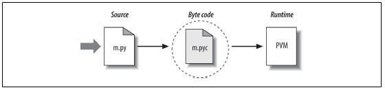
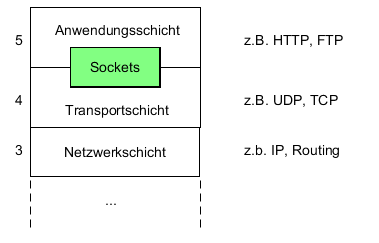
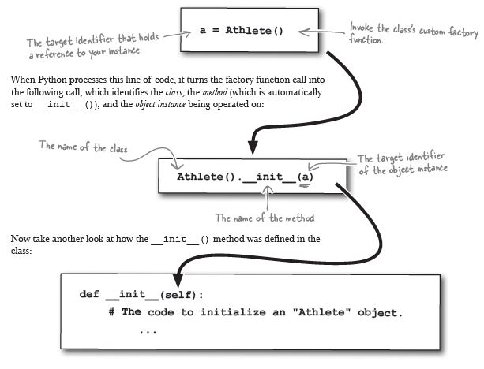
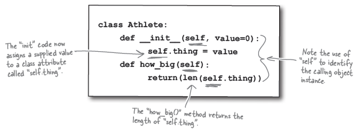
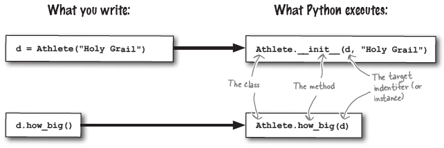

[Back](../)

&nbsp;

# Python
---

&nbsp;

### 1. Basics    
&nbsp;&nbsp;&nbsp;&nbsp;&nbsp; [<font size="-1">1.0 Schnellster Einstieg in Python Projekt ('venv' in VS Code)</font>](#ch1-0)  
&nbsp;&nbsp;&nbsp;&nbsp;&nbsp; [<font size="-1">1.1 'Pythonic' - Do's and Don'ts</font>](#ch1-1)  
&nbsp;&nbsp;&nbsp;&nbsp;&nbsp; [<font size="-1">1.2 Allgemeines</font>](#ch1-2)  
&nbsp;&nbsp;&nbsp;&nbsp;&nbsp;&nbsp;&nbsp;&nbsp;&nbsp;&nbsp; [<font size="-1">1.2.1 Geschichte</font>](#ch1-2-1)  
&nbsp;&nbsp;&nbsp;&nbsp;&nbsp;&nbsp;&nbsp;&nbsp;&nbsp;&nbsp; [<font size="-1">1.2.2 Der Interpreter, eine interaktive Shell</font>](#ch1-2-2)  
&nbsp;&nbsp;&nbsp;&nbsp;&nbsp;&nbsp;&nbsp;&nbsp;&nbsp;&nbsp; [<font size="-1">1.2.3 Problem: 'Lack of Compile time checks'</font>](#ch1-2-3)  
&nbsp;&nbsp;&nbsp;&nbsp;&nbsp; [<font size="-1">1.3 Python Virtual Machine (PVM)</font>](#ch1-3)  
&nbsp;&nbsp;&nbsp;&nbsp;&nbsp; [<font size="-1">1.4 The Object Model</font>](#ch1-4)  
&nbsp;&nbsp;&nbsp;&nbsp;&nbsp; [<font size="-1">1.5 Variablen in Python</font>](#ch1-5)  
&nbsp;&nbsp;&nbsp;&nbsp;&nbsp; [<font size="-1">1.6 Strings</font>](#ch1-6)  
&nbsp;&nbsp;&nbsp;&nbsp;&nbsp;&nbsp;&nbsp;&nbsp;&nbsp;&nbsp; [<font size="-1">1.6.1 Execute String containing Python code</font>](#ch1-6-1)  
&nbsp;&nbsp;&nbsp;&nbsp;&nbsp; [<font size="-1">1.7 Aufruf eines Python-Skripts (*.py)</font>](#ch1-7)  
&nbsp;&nbsp;&nbsp;&nbsp;&nbsp; [<font size="-1">1.8 Decorators</font>](#ch1-8)  
&nbsp;&nbsp;&nbsp;&nbsp;&nbsp; [<font size="-1">1.9 `import`</font>](#ch1-9)  
&nbsp;&nbsp;&nbsp;&nbsp;&nbsp; [<font size="-1">1.10 `call-by-value` / `call-by-reference`</font>](#ch1-10)  
&nbsp;&nbsp;&nbsp;&nbsp;&nbsp; [<font size="-1">1.11 Variable Scope</font>](#ch1-11)  
&nbsp;&nbsp;&nbsp;&nbsp;&nbsp; [<font size="-1">1.12 'Best' Program Environment Structure</font>](#ch1-12)  
&nbsp;&nbsp;&nbsp;&nbsp;&nbsp;&nbsp;&nbsp;&nbsp;&nbsp;&nbsp; [<font size="-1">1.12.1 `ci` folder — Continous Integration</font>](#ch1-12-1)  
&nbsp;&nbsp;&nbsp;&nbsp;&nbsp;&nbsp;&nbsp;&nbsp;&nbsp;&nbsp; [<font size="-1">1.12.2 `__init__.py` in every subfolder</font>](#ch1-12-2)  
&nbsp;&nbsp;&nbsp;&nbsp;&nbsp;&nbsp;&nbsp;&nbsp;&nbsp;&nbsp; [<font size="-1">1.12.3 `venv` — Creation of virtual environments</font>](#ch1-12-3)  
&nbsp;&nbsp;&nbsp;&nbsp;&nbsp; [<font size="-1">1.13 Das `if __name__ == '__main__'` Idiom</font>](#ch1-13)  


### 2. Functions
&nbsp;&nbsp;&nbsp;&nbsp;&nbsp; [<font size="-1">2.1 Basic Functions</font>](#ch2-1)  
&nbsp;&nbsp;&nbsp;&nbsp;&nbsp;&nbsp;&nbsp;&nbsp;&nbsp;&nbsp; [<font size="-1">2.1.1 Funktion id()</font>](#ch2-1-1)  
&nbsp;&nbsp;&nbsp;&nbsp;&nbsp;&nbsp;&nbsp;&nbsp;&nbsp;&nbsp; [<font size="-1">2.1.2 Funktion dir()</font>](#ch2-1-2)  
&nbsp;&nbsp;&nbsp;&nbsp;&nbsp;&nbsp;&nbsp;&nbsp;&nbsp;&nbsp; [<font size="-1">2.1.3 Funktion help()</font>](#ch2-1-3)  
&nbsp;&nbsp;&nbsp;&nbsp;&nbsp;&nbsp;&nbsp;&nbsp;&nbsp;&nbsp; [<font size="-1">2.1.4 Funktion type()</font>](#ch2-1-4)  
&nbsp;&nbsp;&nbsp;&nbsp;&nbsp; [<font size="-1">2.2 String Functions</font>](#ch2-2)  
&nbsp;&nbsp;&nbsp;&nbsp;&nbsp; [<font size="-1">2.3 OO related Functions</font>](#ch2-3)  
&nbsp;&nbsp;&nbsp;&nbsp;&nbsp;&nbsp;&nbsp;&nbsp;&nbsp;&nbsp; [<font size="-1">2.3.1 Funktion issubclass()</font>](#ch2-3-1)  
&nbsp;&nbsp;&nbsp;&nbsp;&nbsp;&nbsp;&nbsp;&nbsp;&nbsp;&nbsp; [<font size="-1">2.3.2 Funktion isinstance()</font>](#ch2-3-2)  
&nbsp;&nbsp;&nbsp;&nbsp;&nbsp;&nbsp;&nbsp;&nbsp;&nbsp;&nbsp; [<font size="-1">2.3.3 Funktion super()</font>](#ch2-3-3)  

### 3. Listen
&nbsp;&nbsp;&nbsp;&nbsp;&nbsp; [<font size="-1">3.1 Basics</font>](#ch3-1)  
&nbsp;&nbsp;&nbsp;&nbsp;&nbsp; [<font size="-1">3.2 List Functions</font>](#ch3-2)  
&nbsp;&nbsp;&nbsp;&nbsp;&nbsp; [<font size="-1">3.3 ...</font>](#ch3-3)  
&nbsp;&nbsp;&nbsp;&nbsp;&nbsp; [<font size="-1">3.4 ...</font>](#ch3-4)  

### 4. Dictionaries   
&nbsp;&nbsp;&nbsp;&nbsp;&nbsp; [<font size="-1">4.1 Basics</font>](#ch4-1)  
&nbsp;&nbsp;&nbsp;&nbsp;&nbsp; [<font size="-1">4.2 Verschachtelte Dictionaries</font>](#ch4-2)  

### 5. HowTo's
&nbsp;&nbsp;&nbsp;&nbsp;&nbsp; [<font size="-1">5.1 File handling</font>](#ch5-1)  
&nbsp;&nbsp;&nbsp;&nbsp;&nbsp; [<font size="-1">5.2 Regular Expressions</font>](#ch5-2)  
&nbsp;&nbsp;&nbsp;&nbsp;&nbsp;&nbsp;&nbsp;&nbsp;&nbsp;&nbsp; [<font size="-1">5.2.1 Basics</font>](#ch5-2-1)  
&nbsp;&nbsp;&nbsp;&nbsp;&nbsp;&nbsp;&nbsp;&nbsp;&nbsp;&nbsp; [<font size="-1">5.2.2 Syntax regulärer Ausdrücke</font>](#ch5-2-2)  
&nbsp;&nbsp;&nbsp;&nbsp;&nbsp; [<font size="-1">5.3 Sockets</font>](#ch5-3)  
&nbsp;&nbsp;&nbsp;&nbsp;&nbsp; [<font size="-1">5.4 Code Quality Metrics</font>](#ch5-4)  
&nbsp;&nbsp;&nbsp;&nbsp;&nbsp; [<font size="-1">5.5 Access Windows Applications using COM</font>](#ch5-5)  
&nbsp;&nbsp;&nbsp;&nbsp;&nbsp; [<font size="-1">5.6 pyInstaller</font>](#ch5-6)  

### 6. User-Defined Classes (OOP)  
&nbsp;&nbsp;&nbsp;&nbsp;&nbsp; [<font size="-1">6.1 Basics</font>](#ch6-1)  

### 7. GUI Development - *tkinter*  
&nbsp;&nbsp;&nbsp;&nbsp;&nbsp; [<font size="-1">7.1 Basics</font>](#ch7-1)  
&nbsp;&nbsp;&nbsp;&nbsp;&nbsp; [<font size="-1">7.2 Configuration Options</font>](#ch7-2)  
&nbsp;&nbsp;&nbsp;&nbsp;&nbsp;&nbsp;&nbsp;&nbsp;&nbsp;&nbsp; [<font size="-1">7.2.1 Coupling Widget Variables</font>](#ch7-2-1)  

### 8. Web Development  
&nbsp;&nbsp;&nbsp;&nbsp;&nbsp; [<font size="-1">8.1 Basics</font>](#ch8-1)  
&nbsp;&nbsp;&nbsp;&nbsp;&nbsp; [<font size="-1">8.2 Flask</font>](#ch8-2)  

&nbsp;

---  

&nbsp;

# Basics

&nbsp;

<a name="ch1-0"></a>  
### 1.0 Schnellster Einstieg in Python Projekt ('venv' in VS Code)

In **VS Code**  

1. Projektordner erstellen
2. In *VS Code* im erstellten Projektordner eine *virtuelle Umgebung* erstellen. Im Terminal unten in den erstellten Projektordner navigieren. Eingabe: `python -m venv env` (damit wird eine virt. Umgebung im Unterordner *env* erstellt)
3. Virtuelle Umgebung aktivieren
	- `F1` drücken
	- `'Python: Select Interpreter'` eingeben 
	- Dann .../env Pfad auswählen oder mit *Find* suchen
4. Virtuelle Umgebung im Terminal aktivieren
	- Im unteren Fenster im *Terminal* einen *Command Prompt* öffnen (mit `+` Zeichen)
	- Jetzt sollte vor dem Eingabepfad ein `env` stehenden
	- Alle hier installierten Module (mit `pip install ...`) werden jetzt in der virt. Umgebung installiert
5. `main.py` in Projektordner erstellen und Implementierung starten

&nbsp;

<a name="ch1-1"></a>  
### 1.1 *Pythonic* - Do's and Don'ts  

|Task|Don't|Better|  
|:---|:---|:---| 
|**print**|`print("Very well done, "+name+"!")`|Always use f"-strings: <br>`f"Very well done {name}!"`|
|**Manually closing file**|`f = open(filename, "w")`<br>`f.write("hello!\n")`<br>`f.close()`<br><br> Im Falle, dass der write() command eine Exception wirft, wird das nicht abgefangen!|`with open(filename) as f:`<br>`f.write("hello!\n")`|
|**Use *comprehensions***|`squares = {}`<br>`for i in range(10):`<br>`squares[i] = i * i`|`odd_squares = {i: i*i for i in range(10)}`<br><br> Aber nicht immer nutzen, Lesbarkeit!|
|**Check for *None*, *True* and *False***|`if x == None:`<br>`if x == True:`<br>`If x == False:`|`if x is None:`<br>`if x is True:`<br>`If x is False:` <br><br> Nicht auf Gleichheit sondern auf Identität prüfen.|
|**Get values from container**|`a = [1, 2, 3]`<br>`for i in range(len(a))`<br>`v = a[i]`|`a = [1, 2, 3]`<br>`for v in a:`<br>`...`<br><br>Direkt das Element rausziehen, nicht über den Index gehen.|
|**Looping over keys of an dictionary**|`d = {"a":1, "b":2, "c":3}`<br>`for key in d.keys():`|`d = {"a":1, "b":2, "c":3}`<br>`for key in d:`<br>|
|**Get value from key in dictionary**|`d = {"a":1, "b":2, "c":3}`<br>`for key in d:`<br>`val=d[key]`|`d = {"a":1, "b":2, "c":3}`<br>`for key, val in d.items():`|
|**Creating index counter variable**|`l = [1,2,3]`<br>`i = 0`<br>`for x in l:`<br>`...`<br>`i+=1`|`l = [1,2,3]`<br>`for i, x in enumerate(l):`|
|**Measure how much time code runs**|`start = time.time()`<br>`time.sleep(1)`<br>`end=time.time()`<br>`runtime = end - start`|`start=time.perf_counter()`<br>`time.sleep(1)`<br>`end = time.perf_Counter()`<br>`runtime = end - start`|
|...|||

&nbsp;

<a name="ch1-2"></a>
### 1.2 Allgemeines  

<a name="ch1-2-1"></a>
#### 1.2.1 Geschichte  
Die Sprache wurde Anfang der 1990er Jahre von Guido van Rossum am Zentrum für Mathematik (Centrum voor Wiskunde en Informatica) in Amsterdam entwickelt. Ursprünglich war sie als Nachfolger für die Lehrsprache ABC entwickelt worden und sollte auf dem verteilten Betriebssystem Amoeba laufen. Guido van Rossum hatte auch an der Entwicklung der Sprache ABC mitgewirkt, so dass seine Erfahrungen mit ABC auch in Python einflossen. 

<a name="ch1-2-2"></a>
#### 1.2.2 Der Interpreter, eine interaktive Shell  
Im Englischen steht das Wort "shell" für eine Schale, einen Panzer oder ganz allgemein eine Hülle oder Schutzhülle. "Shell" bezeichnet auch ein Schneckenhaus und das Gehäuse, das eine Muschel umschließt. Ebenso liegt eine Shell auch zwischen einem Betriebssystem und dem Benutzer. Wie eine Muschelschale schützt sie zum einen das Betriebssystem vor dem Benutzer und gleichzeitig erspart sie dem Benutzer die Benutzung der "primitiven" und schwer verständlichen Basisfunktionen, indem sie ihm komfortable Befehle zur Kommunikation mit dem Computer zur Verfügung stellt.  

Auch die Programmiersprache Python bietet dem Anwender eine komfortable Kommandozeilen-Schnittstelle, die sogenannte Python-Shell, die man manchmal auch als interaktive Python-Shell bezeichnet. Man könnte meinen, dass es sich bei dem Begriff "interaktive Shell" um eine Tautologie handelt, da ja, so wie wir es oben beschrieben haben, Shells immer interaktiv sind. Dies ist jedoch nicht so: Es gibt auch vor allem im Umfeld von Linux und Unix Shells, die als Subshell aufgerufen werden und nicht interaktiv ausgeführt werden.  

Man kann Python im interaktiven Modus aufrufen, indem man den Interpreter in einer Linux-Shell (Bash-Shell) ohne Parameter aufruft. Also  
```js
>>> python
```

&nbsp;

Weitere Möglichkeit der interaktiven Arbeit ist der Online-Interpreter:  
[&rarr; &nbsp; Link](http://www.python-online.ch/pyonline/PyOnline.php)  

&nbsp;

<a name="ch1-2-3"></a>
#### 1.2.3 Problem: 'Lack of Compile time checks'  
As Python code is not generally compiled prior to execution, there is no general mechanism in place to check the code for certain types of errors before executing the program. <u>This means that errors will only be detectable during runtime, requiring sophisticated and extensive testing strategies before publishing code.</u> However, it may well be impossible to test every single path through the code under all circumstances, in particular if user input is involved, potentially leaving an arbitrary number of undetected errors in the code. While this is true to some degree for compiled languages as well, a significant number of errors would already be detected at compile time, while all errors in Python code exclusively occur during runtime.

&nbsp;

<a name="ch1-3"></a>
### 1.3 Python Virtual Machine (PVM)  
Ruft man das Skript in der Kommandozeile direkt auf, dann wird das Skript in Bytecode übersetzt und ausgeführt. Diesen Byte-Code bekommt die Anwenderin oder der Anwender nicht zu Gesicht.

Das ändert sich, wenn man in einem anderen Python-Skript oder auch in der Python-Shell dieses Skript mittels dem Kommando "import" importiert. In diesem Fall wird eine in Bytecode übersetzte Version des Python-Programmes abgespeichert. Diese ist nicht mehr so einfach zu finden, wie dies in Python2 der Fall war. Die Datei befindet sich nun in einem Unterverzeichnis ``__pycache__``.

   

Bei einem späteren "import" in einem anderen Programmlauf, wird dann direkt die Datei mit dem Byte-Code geladen. Importiert man die gleiche Datei mehrmals im gleichen Skript wird sie nur beim ersten Mal geladen.  

Bei dem Byte-Code handelt es sich um einen maschinenunabhängigen Code, der mittels einer virtuellen Maschine (PVM, ``Python Virtual Machine``) ausgeführt wird.  

&nbsp;

<a name="ch1-4"></a>
### 1.4 The Object Model  

**Everything in python is an object**. Every variable you make is an object, every operation you execute is between objects.  `int`, `float`, functions, and anything else you can thing of: all objects inherit from python's base object class, unsurprisingly named object. What does this mean?  
> In Python, primitive data types are in fact not very primitive at all, and are instead feature rich in comparison to their counterparts in lower level languages.  

Let's explore this a little bit by just looking at an integer. We'll create an `int`, then see what attributes it has by calling the `dir` function. When `dir` is called on an object, it recursively searches all the attributes of the argument and it's parents or base classes.  
```py
>>> n = 1
>>> dir(n)
['__abs__', '__add__', '__and__', '__bool__', '__ceil__', '__class__', '__delattr__', '__dir__', '__divmod__', '__doc__', '__eq__', '__float__', '__floor__', '__floordiv__', '__format__', '__ge__', '__getattribute__', '__getnewargs__', '__gt__', '__hash__', '__index__', '__init__', '__init_subclass__', '__int__', '__invert__', '__le__', '__lshift__', '__lt__', '__mod__', '__mul__', '__ne__', '__neg__', '__new__', '__or__', '__pos__', '__pow__', '__radd__', '__rand__', '__rdivmod__', '__reduce__', '__reduce_ex__', '__repr__', '__rfloordiv__', '__rlshift__', '__rmod__', '__rmul__', '__ror__', '__round__', '__rpow__', '__rrshift__', '__rshift__', '__rsub__', '__rtruediv__', '__rxor__', '__setattr__', '__sizeof__', '__str__', '__sub__', '__subclasshook__', '__truediv__', '__trunc__', '__xor__', 'bit_length', 'conjugate', 'denominator', 'from_bytes', 'imag', 'numerator', 'real', 'to_bytes']
```
There's a lot more to an integer than just a value. In lower level languages, like C, C++, or Java, primitive types refer to sections of memory, designated to contain a specifc value that can be directly manipulated in assembly code or even transistor level logic in CPUs. Python sits at a much higher abstraction level. Though python is slower than the aforementioned languages, the programmer doesn't have to deal with problems like overflow, underflow, or invalid type casting as all of this is abstracted away through objects. Some of the attributes listed through `dir(int)` are class specific to `int`, and some are inherited from `object`. Let's see what attributes object by calling `dir` on the static type itself.  
```py
>>> dir(object)
['__class__', '__delattr__', '__dir__', '__doc__', '__eq__', '__format__', '__ge__', '__getattribute__', '__gt__', '__hash__', '__init__', '__init_subclass__', '__le__', '__lt__', '__ne__', '__new__', '__reduce__', '__reduce_ex__', '__repr__', '__setattr__', '__sizeof__', '__str__', '__subclasshook__']
```

&nbsp;

**Getters and Setters**  
Python additionally has a set of built in set of methods for getting, setting, and deleting attributes. The `object` base class has the following getter and setter methods which are wrapped by built-in python functions.

|Object Method|Built-in Function|Description|  
|:---|:---|:---|  
|`object.__getattribute__('name')`|`getattr(object, 'name')`|Gets attribute|
|`object.__setattr__('name', value)`|`setattr(object, 'name', value)`|Sets attribute to value|
|`object.__delattr('name')`|`delattr(object, 'name')`|Deletes attribute|
|N/A|`hasattr(object, 'name')`|Checks if an object has an attribute.|  

&nbsp;

**Special Object Functions**  
In order to enable consistent usage across all of the different objects in Python, they all utilize the same special methods denoted with two underscores on either side `__func__`. Overriding these objects in your own implementations can lead to neat and concise code for complex functions. They can be overriden by defining the `__func__(self, [args])` function within an object. These functions are often refered to as **"magic" functions**.  

The first thing to know about *special object functions* is that they are meant to be called by the Python interpreter, and not by you. You don’t write `my_object.__len__()`. You write `len(my_object)` and, if `my_object` is an instance of a user-defined class, then Python calls the `__len__` instance method you implemented.  

More often than not, the special method call is implicit. For example, the statement `for i in x:` actually causes the invocation of `iter(x)`, which in turn may call `x.__iter__()` if that is available.  

Normally, your code should not have many direct calls to special methods. Unless you are doing a lot of metaprogramming, you should be implementing special methods more often than invoking them explicitly. The only special method that is frequently
called by user code directly is `__init__`, to invoke the initializer of the superclass in your own `__init__` implementation.  

If you need to invoke a special method, it is usually better to call the related built-in function (e.g. `len`, `iter`, `str`, etc). These built-ins call the corresponding special method, but often provide other services and — for built-in types — are faster than method calls.  

|Attribute|Built-In Accessor|Description|  
|:---|:---|:---|  
|`__new__`|N/A|Called when creating a new instance of an object|  
|`__init__`|N/A|Called when instantiating a new instance of an object, after `__new__`|  
|`__class__`|`type(obj)`|Returns the type of a given object.|  
|`__str__`|`str(obj)`|Converts object to a string. This is called when printed.|  
|`__repr__`|`repr(obj)`|Returns a representation of the object used in the python shell.|  
|`__doc__`|`help(obj)`|Gives documentation for the given type.|  
|`__hash__`|`hash(obj)`|Custom hash function for the object.|  
|`__get__`|N/A|Invoked every time an object is accessed. Used by function objects to make them callable. Similar definition for `__set__`|  
|`__eq__`|`==`|Provides comparison binary operator. Other comaprison operators are `__lt__`, `__le__`, `__ne__`, `__ge__`, `__gt__`|  
|`__add__`|`add(a, b)`, `+`|Overrides math functionality. Others are `__sub__`, `__mul__`, `__abs__`, `__floordiv__`, `__truediv__`, `__pow__`, etc.|  
|`__getitem__`|`object[ind]`|Returns value of an object at a certain index|  
|`__and__`|`and`|Returns logical and. Other logical operators are `__or__`, `__not__`, `__xor__`, `__lshift__`, etc.|  
|`__contains__`|`val in obj`|Checks to see if an object contains a value using `in` keyword.|  
|`__next__`|`next(obj)`|Yields next value of an object.|  
|`__yield__`|`iter(obj)`, `for _ in obj`|Returns an iterator over the values of the object.|  

You can find more operator attributes here: [https://docs.python.org/3/library/operator.html](https://docs.python.org/3/library/operator.html).

&nbsp;

<a name="ch1-5"></a>
### 1.5 Variablen in Python  
Es gibt gravierende Unterschiede in der Art wie Python und C bzw. C++ Variablen behandeln. Vertraute Datentypen wie Ganzzahlen (Integer), Fließkommazahlen (floating point numbers) und Strings sind zwar in Python vorhanden, aber auch hier gibt es wesentliche Unterschiede zu C und C++.

In Programmiersprachen wie C, C++ oder Java hat jede Variable einen eindeutigen Datentyp. Das bedeutet, dass falls beispielsweise eine Variable vom Typ Integer ist, sie nur Integer-Werte aufnehmen kann. In diesen Programmiersprachen müssen Variablen auch vor ihrer Benutzung deklariert werden. Deklaration bedeutet Bindung an einen Datentyp, der dann für den gesamten Programmablauf unveränderlich ist.  

In Python haben wir eine gänzlich andere Situation. Zunächst einmal bezeichnen Variablen in Python keinen bestimmten Typ und deshalb benötigt man auch in Python keine Typdeklaration. Benötigt man im Programm beispielsweise eine Variable i mit dem Wert 42, so erreicht man dies einfach mit der folgenden Anweisung:  
```
>>> i = 42
```

In Python kann zur Laufzeit sowohl der Wert einer Variablen geändert werden, als auch der Typ einer Variablen. Präziser: Ein neues Objekt eines beliebigen Typs wird der Variablen zugewiesen. Wir verdeutlichen dies in folgendem Beispiel:  
```
i = 42        # Typ wird implizit auf Integer gesetzt
i = 41 + 0.11	# Typ wird in float geändert
i = "fünfzig"	# Jetzt ist es ein string

```

&nbsp;

>  Variablen referenzieren Objekte in Python. Die eigentlichen Daten sind jedoch im Objekt enthalten.

&nbsp;

```
>>> x = 42  # Variable x zeigt auf ein Int-Objekt
>>> y = x   # Eine zweite Variable referenziert jetzt das gleiche Objekt wie x
```

Was wird passieren, wenn wir nun die Zuweisung y = 78 ausführen?  
**Python wird zuerst ein neues Integer-Objekt mit dem Inhalt '78' erzeugen und dann wird die Referenz von y auf dieses Objekt geändert. Wichtig ist dabei, dass x nach wie vor das alte Objekt referenziert, d.h. der Wert ist nach wie vor '42'.**  
(&rarr; s. Kapitel 2.1: Funktion id() zum Prüfen der Identität)

Wird x jetzt ein String zugewiesen, wäre das Integer-Objekt '42' verwaist. Es muss von Python entfernt werden, da es von keiner anderen Variable referenziert wird.

&nbsp;

<a name="ch1-6"></a>
### 1.6 Strings  
Strings are an example of what in Python we call a *sequence* — a positionally ordered collection of other objects. Strictly speaking, strings are sequences of one-character strings; other, more general sequence types include *lists* or *tuples*.  

Jedes einzelne Zeichen eines Strings, kann über einen Index angesprochen werden:  

```
>>> s = "Python"
>>> print(s[0])
P
>>> print(s[3])
h
```

&nbsp;  

**Achtung:**
> Wie in Java aber nicht wie in C oder C++, können Strings in Python nicht verändert werden. Versucht man eine indizierte Position zu ändern, erzeugt man eine Fehlermeldung.

**Workaround:** You can change text-based data in place if you either expand it into a *list* of individual characters and join it back together with nothing between:

```python
>>> S = 'shrubbery'
>>> L = list(S)                                   # Expand to a list: [...]
>>> L
['s', 'h', 'r', 'u', 'b', 'b', 'e', 'r', 'y']

>>> L[1] = 'c'                                    # Change it in place
>>> ''.join(L)                                    # Join with empty delimiter
'scrubbery'

```

&nbsp;

<a name="ch1-6-1"></a>
#### 1.6.1 Execute String containing Python code  

For statements use `exec(string)` (Python 2/3) or `exec string` (Python 2):  

```py
>>> mycode = 'print "hello world"'
>>> exec(mycode)
'hello world'
```
When you need the value of an expression, use `eval (string)`:  

```py
>>> x=eval("2+2")
>>> x
4
```

&nbsp;

<a name="ch1-7"></a>
### 1.7 Aufruf eines Python-Skripts (\*.py)

Von der cmd shell  
```
python someFile.py
```

Im Python Interpreter (2.x)  
```
execfile('someFile.py')
```

Im Python Interpreter (3.x)  
```
exec(open('someFile.py').read())
```
&nbsp;

<a name="ch1-8"></a>
### 1.8 Decorators
The Python language provides a simple yet powerful syntax called ‘decorators’. A decorator is a function or a class that wraps (or decorates) a function or a method. The ‘decorated’ function or method will replace the original ‘undecorated’ function or method. Because functions are first-class objects in Python, this can be done ‘manually’, but using the `@decorator` syntax is clearer and thus preferred.  

```
def foo():
    # do something

def decorator(func):
    # manipulate func
    return func

foo = decorator(foo)  # Manually decorate

@decorator
def bar():
    # Do something
# bar() is decorated
```
**This mechanism is useful for separating concerns and avoiding external unrelated logic ‘polluting’ the core logic of the function or method.**  

A good example of a piece of functionality that is better handled with decoration is memoization or caching: you want to store the results of an expensive function in a table and use them directly instead of recomputing them when they have already been computed. This is clearly not part of the function logic.

**Examples:**

`@staticmethod`  
The *staticmethod* decorator modifies a method function so that it does not use the self variable. The method function will not have access to a specific instance of the class. It behaves like a plain function except that you can call it from an instance or the class.  

`@classmethod`  
The *classmethod* decorator modifies a method function so that it receives the class object as the first parameter instead of an instance of the class. This method function will have access to the class object itself.  
The 'classmethod' decorator is used to create singleton classes. This is a python technique for defining an object which is also the one and only instance. This gives us a very handy, easy-to-read way to segregate attributes into a separate part of a class declaration.  
Generally, a function decorated with *@classmethod* is used for introspection of a class. An introspection method looks at the structure or features of the class, not the values of the specific instance.

&nbsp;

<a name="ch1-9"></a>
### 1.9 `import`  
- Use classes & functions defined in another file  
- A python module is a file with the same name (plus the *.py* extension)  

Three formats of the command:  
1. `import somefile`
   - Everything in *somefile.py* gets imported.
   - To refer to sth in the file, append the text 'somefile.' to the front of its name, e.g.  
     ```py
     somefile.className.method('abc')
     somefile.myFunc('123')
     somefile.var123
     ```
   &nbsp;
2. `from somefile import *`
   - Everything in *somefile.py* gets imported.
   - To refer to sth in the module, just use its name. Everything in the module is now in the current namespace, e.g.  
     ```py
     className.method('abc')
     myFunc('123')
     var123
     ```
   &nbsp;  
3. `from somefile import className`  
   - Only the item 'className' gets imported.  
   - After import only 'className' can be used without module prefix.

&nbsp;  

*Where does python look for module files?*  
The list of directories where Python will look for the files to be imported is *sys.path*. This is just a variable named 'path' stored inside the 'sys' module, i.e.  
```py
import sys
sys.path
   => ["", /Library/Frameworks/..., ...]
```  

To add a directory of your own to this list, append it to the list:  
```py
sys.path.append('/my/new/path')
```

&nbsp;

**Hint: Testing imported function**  
Start your interactive interpreter in the *cmd* line and import the module.
Afterwards call any functions of the module in the shell for testing, e.g.

```
>>> import os
>>> os.getcwd()   
'c:\\code'
```


&nbsp;

<a name="ch1-10"></a>
### 1.10 `call-by-value` / `call-by-reference`  
Je nach Programmiersprache gibt es unterschiedliche Möglichkeiten wie Argumente übergeben werden:

**call-by-value**: Hier wird funktionsintern mit Kopien der als Parameter übergebenen Instanzen gearbeitet.

*Vor- Nachteile*: Eine Funktion kann keine Änderungen von Instanzen aus dem Hauptprogramm bewirken, erzeugt jedoch unter Umständen einen erheblichen Overhead.

**call-by-reference**: Dabei wird funktionsintern mit Referenzen (Pointer) auf die im Hauptprogramm befindlichen Instanzen gearbeitet.

*Vor- Nachteile*: “Schlanke” Calls da keine Daten erzeugt werden, jedoch besteht die Gefahr, dass eine Funktion Instanzen aus dem Hauptprogramm ändern kann.

Python verwendet diesbezüglich eine <u>Mischform</u>.

Eine **call-by-reference** gibt es bei <u>veränderbaren Datentypen</u> (==**mutable objets**) (z.B. `list` oder `dict` aber auch den meisten anderen Objekten).  

```py
>>> def test(liste):
...     liste += [5,6,7]
...
>>> zahlen = [1,2,3]
>>> print zahlen
[1, 2, 3]
>>> test(zahlen)
>>> print zahlen
[1, 2, 3, 5, 6, 7]
>>>
```
Man sieht die (ungewollte) Veränderung der Liste im Hauptprogramm. Vermeidung einfach durch Kopieren beim Funktionsaufruf:
```py
>>> test(zahlen[:])
>>> print zahlen
[1, 2, 3]
```

Bei <u>unveränderbaren Datentypen</u> (z.B. Zahlen, Strings oder Tupel) wird ein **call-by-value** verwendet.
```py
>>> def test_zahl(zahl):
...    zahl += 2
...
>>> a = 2
>>> print a
2
>>> test_zahl(a)
>>> print a
2
```
**call-by-value** also bei den Datentypen `int`, `float`, `complex`, `string`, `tuple`, `frozen set`, `bytes` (== **immutable objects**).  

&nbsp;

<a name="ch1-11"></a>
### 1.11 Variable scope  

In python, scopes are defined by `dict` like namespaces, similar to those found in objects. Within objects (and thus within functions), different namespaces are applied than the global python namespace. When python looks up the value attributed to a variable name, it first looks up the name in it's immediate scope by checking the namespace of the object the function is in. If it doesn't find the given variable there, it proceeds down the call stack searching for it, until it finds the variable or reaches the global scope and can't find it.  

```py
x = "global"

def fn1():
    x = "local"
    print(x)

def fn2():
    print(x)

print(x)    # global
fn1()       # local
fn2()       # global
```
You can access the local namespace by calling the `locals()` function, or the global namespace by calling the `globals()` function, both of which return key attribute dictionaries.  

&nbsp;

**`nonlocal` keyword**  
The `nonlocal` keyword in python can be used in nested functions to make a given variable refer to one that is used in a different scope. This essentially binds the variable in local scope to the variable in the next higher level scope where it is defined.  
```py
def outer():

    x = "outer"

    def inner():
        nonlocal x
        x = "inner"
        print("From Inner:", x)

    inner()
    print("From Outer:", x)

outer()

# Output:
# From Inner: inner
# From Outer: inner
```
This is because the variable `x` is set to refer to the namespace of `outer` with the `nonlocal` keyword. Thus, `x` gets set to `"inner"` in the namespace of `outer`. If `nonlocal` was not present, we would instead get the expected result of `"inner"` from `inner` and `"outer"` from `outer`.  

&nbsp;  

**`global` keyword**  
While `nonlocal` can refer to external scopes, the keyword `global` can be used to make variables refer to their versions in the global namespace. The `global` key word makes a given variable refer to the global scope. Be careful though the `global` and `nonlocal` descriptors only take effect in a given scope. The following example demonstrates this.  

```py
x = "global"

def outer():
    x = "outer"
    def inner():
        global x
        x = "inner"
        print("From Inner:", x)
    inner()
    print("From Outer:", x)

outer()
print("From Global:", x)

# Output:
# From Inner: inner
# From Outer: outer
# From Global: inner
```
Note that in the scope of `outer` the variable is unchanged. This is because the binding of `global` only takes effect within the scope it is used. As expected, in `inner`, x will refer to the global variable and change it to `"inner"`.

&nbsp;

<a name="ch1-12"></a>
### 1.12 'Best' Program Environment Structure  

Folder Layout
  
```
<project_name>
            |
            |- .venv/
                   |- Lib/
                   |- Scripts/
                   |- .gitignore
                   |- pyvenv.cfg
            |- build/
            |- ci/
                |- build_setup/
                             |- scripts/
                                      |- __init__.py
                                      |- build_console_app.bat
                                      |- build_gui_app.bat
                                      |- freeze.bat
                             |- specs/
                                    |- __init__.py
                                    |- console.spec
                                    |- gui.spec
                             |- __init__.py
                             |- <project>.ico
                | -tc/
                    |- scripts/
                             |- __init__.py
                             |- build_environment_manual.bat
                             |- build_environment_manual_no_proxy.bat
                |- __init__.py
            |- dist/
            |- <project_name>/
                            |- utils/
                                   |- apps/
                                         |- gui/
                                              |- __init__.py
                                              |- app.py
                                         |- __init__.py
                                   |- __init__.py
                            |- __init__.py
                            |- core.py
                            |- version.py
            |- test/
            |- .gitattributes
            |- .gitignore
            |- requirements.txt
            |- requirements_develop.txt
```
  
&nbsp;
  
**Core features**  
  - Development is always done in a virtual environment (`venv`) to make sure packages are used in specific versions (and are used in this versions also when on the global level the version changed!)
  - Created .py files (==modules) are placed in the folder `<project_name>/utils` and its subfolders  
  - `namespaces` are realised by importing files from subfolders (or from external packages) with `import <utils/package/file> as <namespaceName>` or just `import <utils/package/file>` (so the name of the *namespace* is preserved)  
  - In a GUI project, the folder `<project_name>/utils/apps/gui` contains the `app.py` file with the startup code  

&nbsp;
  
**Files**  

`./requirements.txt`  
A *pip requirements file* should be placed at the root of the repository. It should specify the dependencies required to contribute to the project: testing, building, and generating documentation. *Requirements files* are files containing a list of items to be installed using `pip install`.  
  
`./requirements_develop.txt`  
A *pip requirements development file* contains the pacakges/modules which are needed for the development environment, e.g. *pyInstaller*.
  
&nbsp;

<a name="ch1-12-1"></a>
#### `ci` **folder — Continous Integration**  

**build_setup/scripts/build_gui_app.bat**  
Contains the batch code for creating the .exe file from python script using *pyInstaller*.  
Last command is the call for *pyInstaller* by using the *gui.spec* file from folder `build_setup/specs`.  

**build_setup/specs/gui.spec**  
*.spec* file for the *pyInstaller*. Used in `build_setup/scripts/build_gui_app.bat`. The *.spec* file tells PyInstaller how to process the script.  

**build_setup/tc/build_environment_manual_no_proxy.bat**  
Contains the batch code for creating 
  - the virtual environment (`venv`) for this project, 
  - the required project packages/modules (given in `requirements.txt`)
  - the required development packages/modules (given in `requirements_develop.txt`, e.g. *pyInstaller*)

&nbsp;
  
<a name="ch1-12-2"></a>
#### `__init__.py` **in every subfolder**  
The `__init__.py` files are required to make Python treat directories containing the file as packages (*include* paths in C language).  
This prevents directories with a common name, such as `string`, unintentionally hiding valid modules that occur later on the module search path. In the simplest case, `__init__.py` can just be an empty file, but it can also execute initialization code for the package or set the `__all__` variable.  
  
```
sound/
     |- __init__.py
     |- formats/
               |- __init__.py
               |- wavread.py
     |- effects/
               |- __init__.py
               |- echo.py
     |- filters/
               |- __init__.py
               |- equalizer.py
```

Users of the package can import individual modules from the package, for example:  
```
import sound.effects.echo as see
```

This loads the submodule `sound.effects.echo`, which can be referenced with  
```
see.echofilter(input, output, delay=0.7, atten=4)
```
  
&nbsp;
  
<a name="ch1-12-3"></a>
#### `venv` **— Creation of virtual environments**  
The `venv` module supports creating lightweight “virtual environments”, each with their **own independent set of Python packages** installed in their `site` directories. A virtual environment is created on top of an existing Python installation, known as the virtual environment’s "base" Python, and may optionally be isolated from the packages in the base environment, so only those explicitly installed in the virtual environment are available.  
  
> When used from within a virtual environment, common installation tools such as pip will install Python packages into a virtual environment without needing to be told to do so explicitly. 
  
&nbsp;    
  
Creation of virtual environments is done by executing the command `venv`:  
```
python3 -m venv /path/to/new/virtual/environment
```
  
Running this command creates the target directory (creating any parent directories that don’t exist already) and places a `pyvenv.cfg` file in it with a `home` key pointing to the Python installation from which the command was run (a common name for the target directory is `.venv`).  
&nbsp;

**Creation of virtual environment with .bat file from former project**  
1. Create root folder with project name
2. Copy file `ci/tc/build_environment_manual_no_proxy.bat`, `requirements.txt` and `requirements_develop.txt` to root folder (keeping path strucutre)
3. Add additionally needed packages to `requirements.txt` and `requirements_develop.txt`
4. Execute `ci/tc/build_environment_manual_no_proxy.bat`
5. Done!

> Repeat step 4. every time you add a new package to `requirements.txt` or `requirements_develop.txt`!

**Additionally...**  
1. Copy folder `ci/build_setup` to the same place in new project
2. Create project folder with same name as \<root_folder\> under \<root_folder\>
3. Create files in \<root_folder\>/\<root_folder\>: `core.py`, `__init__.py`
4. Create folder in \<root_folder\>/\<root_folder\>: `utils`

&nbsp;
  
**How venvs work**  
When a Python interpreter is running from a virtual environment, `sys.prefix` and `sys.exec_prefix` point to the directories of the virtual environment, whereas `sys.base_prefix` and `sys.base_exec_prefix` point to those of the base Python used to create the environment. It is sufficient to check `sys.prefix == sys.base_prefix` to determine if the current interpreter is running from a virtual environment.
  
&nbsp;

<a name="ch1-13"></a>
## 1.13 Das `if __name__ == '__main__'` Idiom  

Es gibt zwei Möglichkeiten für die Nutzung eines Files mit Python-Code:
- als **für sich stehendes Skript**, oder als
- **Library, die später in ein anderes Skript eingebunden wird**.

&nbsp;

Es hat sich als *good practice* erwiesen, bei einem **für sich stehenden Skript**, das folgende Idiom zu nutzen:

```python
def main():
   ...

if __name__ == '__main__':
   main()
```

Diese Art des Aufbaus zeigt einem User direkt, dass es sich um ein selbstständiges Skript handelt.

&nbsp;

#### Warum separate *main()* Funktion?

```python
# Schlechter Code ohne main() als eigene Funktion
if __name__ == '__main__':
   for i in range(7):
      ... do sth with i...
```
An diesem Beispiel sieht man direkt, was schief geht, wenn man keine separate *main()*-Funktion hat: **Man erzeugt ungewollt eine globale Variable *i*.** 
 Im schlimmsten Fall wird das File in ein anderes File importiert und es kann zu Fehlverhalten in einer anderen Funktion kommen.


&nbsp;
  
# Functions

&nbsp;

<a name="ch2-1"></a>
### 2.1 Basic Functions  

<a name="ch2-1-1"></a>
### 2.1.1 Funktion *id()*  
Die Identität einer Instanz dient dazu, sie von allen anderen Instanzen zu unterscheiden. Die Identität ist eine Ganzzahl, und sie ist innerhalb eines Programmes eindeutig. Die ``Identitätsfunktion id()`` liefert die Identität. So kann man prüfen, ob es sich um eine bestimmte Instanz handelt und nicht nur um eine mit dem gleichen Wert und Typ.

```
>>> x = 42
>>> id(x)
10107136
>>> y = x
>>> id(x), id(y)
(10107136, 10107136)
>>> y = 78
>>> id(x), id(y)
(10107136, 10108288)
```
Wir stellen fest, dass sich die Identität erst ändert, nachdem wir y einen neuen Wert zugewiesen haben. Die Identität von x bleibt gleich, d.h. der Speicherort von x wird nicht geändert.  

&nbsp;

<a name="ch2-1-2"></a>
### 2.1.2 Funktion *dir()*  
You can use the built-in 'dir()' function to list  the identifiers that a module defines. The identifiers are the functions, classes and variables defined in that module.  

When you pass a module name to the *dir()* function, it returns  the list of the names defined in that module. When no argument is applied to it, it returns the list of names defined in the current module.  

```
>>> import sys
>>> dir(sys)
['__doc__', '__stderr__', '__stdin__', '__stdout', '__getframe', 'api_version', 'argv', ...]
```

```
>>> s = 'random_string'
>>> dir(s)
['__add__', '__class__', '__contains__', '__delattr__', '__dir__', '__doc__',
'__eq__', '__format__', '__ge__', '__getattribute__', '__getitem__',
'__getnewargs__', '__gt__', '__hash__', '__init__', '__iter__', '__le__',
'__len__', '__lt__', '__mod__', '__mul__', '__ne__', '__new__', '__reduce__',
'__reduce_ex__', '__repr__', '__rmod__', '__rmul__', '__setattr__', '__sizeof__',
'__str__', '__subclasshook__', 'capitalize', 'casefold', 'center', 'count',
'encode', 'endswith', 'expandtabs', 'find', 'format', 'format_map', 'index',
'isalnum', 'isalpha', 'isdecimal', 'isdigit', 'isidentifier', 'islower',
'isnumeric', 'isprintable', 'isspace', 'istitle', 'isupper', 'join', 'ljust',
'lower', 'lstrip', 'maketrans', 'partition', 'replace', 'rfind', 'rindex',
'rjust', 'rpartition', 'rsplit', 'rstrip', 'split', 'splitlines', 'startswith',
'strip', 'swapcase', 'title', 'translate', 'upper', 'zfill']
```

The names with double underscores in this list represent the implementation of the string object and are available to support customization. The **\_\_add\_\_** method of strings, for example, is what really performs concatenation; Python maps the first of the following to the second internally, though you shouldn’t usually use the second form yourself (it’s less intuitive, and might even run slower):

```
>>> S + 'NI!'
'spamNI!'
>>> S.__add__('NI!')
'spamNI!'
```

In general, leading and trailing double underscores is the naming pattern Python uses for implementation details. The names without the underscores in this list are the callable methods on string objects.

&nbsp;

<a name="ch2-1-3"></a>
### 2.1.3 Funktion *help()*  
This function invoked the built-in help system.  
If the argument is a string, then the string is looked up as the name of a module, function, class, method, keyword or documentation topic and a help page is printed on the console.  

This function is added to the built-in namespace by the *site* module.

&nbsp;

<a name="ch2-1-4"></a>
### 2.1.4 Funktion *type()*
Die Funktion *type(obj)* liefert die Klasse der Instanz 'obj' zurück.  

```
>>> x = [4,5,9]
>>> print type(x)
<type 'list'>

>>> y = "Hello"
>>> print type(y)
<type 'str'>

>>> v = 10
>>> print type(v)
<type 'int'>

>>> z = {'a':1, 'b':2}
>>> print type(z)
<type 'dict'>
```

&nbsp;

<a name="ch2-2"></a>
## 2.2 String Functions   
&nbsp;

**Konkatenation** (englisch: Concatenation)  

&nbsp;&nbsp;&nbsp; ``"Hello" + "World" -> "HelloWorld"``

**Indexing**  

&nbsp;&nbsp;&nbsp; ``"Python"[0] -> "P"``  

**Slicing**  
[2:4] bedeutet im folgenden Ausdruck, dass wir aus dem String "Python" einen Teilstring herausschneiden, der mit dem Zeichen des Index 2 (inklusive) beginnt und bis zum Index 4 (exklusive) geht:  

&nbsp;&nbsp;&nbsp; ``"Python"[2:4] -> "th"``

**Länge eines Strings**  

&nbsp;&nbsp;&nbsp; `len("Python") -> 6`  

&nbsp;


<a name="ch2-3"></a>
## 2.3 Object Oriented related Functions  

All of the basic factory functions (str, int, float, long, complex, unicode, tuple, list, dict, set) are effectively class names. You can therefore, use a test like `isinstance(myParam, int)` to confirm that the argument value provided to this parameter is an integer. An additional class, `basestring` is the parent class of both 'str' and 'unicode'.  

<a name="ch2-3-1"></a>
### 2.3.1 Funktion *issubclass(sub, sup)*  
Boolean function returns 'true' if the given subclass ``sub`` is a subclass of the upper-class ``sup``.

&nbsp;

<a name="ch2-3-2"></a>
### 2.3.2 Funktion *isinstance(obj, class)*  
Boolean function returns 'true' if ``obj`` is an instance of class ``class`` or is an instance of a subclass of `class`.  

&nbsp;

<a name="ch2-3-3"></a>
### 2.3.3 Funktion *super(type)*  
Function returns the superclass of the given type.

&nbsp;

# Listen

<a name="ch3-1"></a>
## 3.1 Basics

The list is a most versatile datatype available in Python which can be written as a list of comma-separated values (items) between square brackets. Important thing about a list is that items in a list need <u>not</u> be of the same type.  

```
>>> list1 = ['physics', 'chemistry', 1997, 2000];
>>> list2 = [1, 2, 3, 4, 5];
>>> list3 = ["a", "b", "c", "d"];
```

Similar to string indices, list indices start at 0 and lists can be sliced, concatenated and so on.  

```
>>> print "list1[0]: ", list1[0];
list1[0]: physics
>>> print "list2[1:5]: ", list2[1:5];
list2[1:5]: [2,3,4,5]
```

&nbsp;

<a name="ch3-2"></a>
## 3.2 *List* Functions

  - Delete list element  
     To remove a list element, you can use either the 'del' statement if you know exactly which element(s) you are deleting (by index) or the 'remove()' method if you do not know.  
     ```
      >>> del list[2]         ;# deleted the third items
      >>> list1.remove(2000)  ;# also deletes the third item
     ```
     **(!)** 'remove()' only deletes the <u>first appearance</u> of the item in the brackets.

  - Basic list operations  

     |Function   |Python expression   |Result   |  
     |:---|:---|:---:|  
     |Length   | **len([1,2,3])**  | 3  |  
     |Concatenation   | **[1,2,3]+[4,5,6]**   | [1,2,3,4,5,6]  |  
     |Repetition   | **['Hi!']*4**  | ['Hi!','Hi!','Hi!','Hi!']  |  
     |Membership   | **3 in [1,2,3]**  | True  |  
     |Iteration   | **for x in [1,2,3]: print x**  | 1,2,3  |   

  - Further functions  

     |Function   |description   |  
     |:---|:---|  
     |**max(list)**   | Returns item from list with max value  |  
     |**min(list)**   | Returns item from list with min value  |  
     |**list.append(obj)**   | Appends object 'obj' to list  |  
     |**list.count(obj)**   | Returns number of how many times 'obj' occurs in list  |  
     |**list.index(obj)**   | Returns the lowest index in list that 'obj' occurs  |  
     |**list.indert(index,obj)**   | Inserts object 'obj' into list at offset 'index'  |   

  - Copy/Compare List  
     ```
     >>> a = [1,2,3]
     >>> b = a        ;# Achtung: keine Kopie! Zeiger auf Inhalt von 'a'
     >>> b = a[:]     ;# Kopie von 'a' in 'b' (neuer Speicher wird angelegt)
     >>> a == b  
     True
     ```  

  - Looping through list
     ```
     for <var> in <list> :
          print <var>
     ```

  - Sorting list  
     ```
     >>> a = [1,4,3]
     >>> sorted(a)
     [1,3,4]
     >>> sorted(a, reverse=true)
     [4,3,1]
     ```  

  - String aus Liste / Liste aus String  
     ```
     >>> a = [1,2,3]
     >>> '.'.join(a)
     '1.2.3'
     >>> ':'.join(a)
     '1:2:3'

     >>> b = 'aa:bb:cc'
     >>> b.split(':')
     ['aa', 'bb', 'cc']
     ```

&nbsp;

# Dictionaries

<a name="ch4-1"></a>
## 4.1 Basics

Ein 'Dictionary' besteht aus Schlüssel-Objekt-Paaren, zu einem bestimmten Schlüssel gehört immer ein Objekt.  
```
>>> mydict = {}                          ;# leeres Dictionary
>>> mydict = {"key_01":"value_01"}       ;# Wert setzen
>>> mydict = {"key_x":"val_x", "key_y":"val_y"}

>>> len(mydict)                          ;# Anzahl der Schlüssel-Wert-Paaren
>>> del mydict[key_01]                   ;# Löschen Schlüssel+Objekt
>>> "k" in mydict                        ;# Prüfen auf Schlüssel
>>> "k" not in mydict

>>> mydict.clear()                       ;# Entfernt alle Elemente im dictionary
>>> mydict.get(key)                      ;# Gibt den 'Value' für 'key zurück
>>> mydict.has_key(key)                  ;# Gibt 'true' zurück falls 'key' vorhanden
>>> mydict.items()                       ;# Gibt Liste mit (key, value)-Paaren zurück
>>> mydict.keys()                        ;# Gibt Liste aller key's zurück
>>> mydict.values()                      ;# Gibt Liste aller value's zurück
```
&nbsp;

Iteration über ein Dictionary
```
>>> for key in mydict
        print mydict[key]
```
&nbsp;

### Alternativer Weg ('defaultdict')

**Defaultdict** ist eine Unterklasse der in Python integrierten *dict*-Klasse.  
Sie überschreibt die Methode **__missing__** , um einen Standardwert für fehlende Schlüssel bereitzustellen und so *KeyError* zu verhindern.  
Wenn ein Schlüssel nicht im Wörterbuch gefunden wird, fügt *defaultdict* ihn automatisch mit einem Standardwert ein.

```python
from collections import defaultdict 

# als dict of lists anlegen 
d = defaultdict(list)
for i in range(5):
    d[i].append(i)

# als dict of int anlegen
d = defaultdict(int)
L = [1, 2, 3, 4, 2, 4, 1, 2]
for i in L:
    d[i] += 1
```

&nbsp;

<a name="ch4-2"></a>
## 4.2 Verschachtelte Dictionaries
```
# Anlegen:
>>> d = {}
>>> d['dict1'] = {}
>>> d['dict1']['innerkey'] = 'value'
oder
>>> d['key1']['innerkey'].append('value')

# Auslesen:
>>> d = {'dict1' : {'innerkey' : 'value'}}
>>> d = {'dict1' : {'inkey1': val, 'inkey2' : val2}}
oder
>>> d.get('key1', {}).get('innerkey')
# Sicherer, da bei Fehlen eines der 'keys' kein Fehler geworfen wird, sondern
# 'None' zurückgegeben wird.

```

### Alternativer Weg ('defaultdict')

**Defaultdict** ist eine Unterklasse der in Python integrierten *dict*-Klasse.  
Sie überschreibt die Methode **__missing__** , um einen Standardwert für fehlende Schlüssel bereitzustellen und so *KeyError* zu verhindern.  
Wenn ein Schlüssel nicht im Wörterbuch gefunden wird, fügt *defaultdict* ihn automatisch mit einem Standardwert ein.

```python
from collections import defaultdict 

# als dict of int of dict anlegen
d = defaultdict(lambda : defaultdict(int))
>>> print d[0]
defaultdict(<type 'int'>, {})
>>> print d[0]["x"]
0
```

&nbsp;

# How To's

<a name="ch5-1"></a>
## 5.1 File handling  

`open()` returns a file object and is most commonly used with two arguments:  
```
>>> open(filename, mode)
```

The first arguement is the ``filename``.  
The second argument describes in which way the file will be used. `mode` can be `r` when the file will only be read, `w` for only writing (an existing file with the same name will be erased) and `a` opens the file for appending.  
&nbsp;

For reading lines from a file, you can loop over the file object. This is memory efficient, fast, and leads to simple code:   
```
>>> f = open('workfile', 'r')
    for line in f:
       print line
```
&nbsp;


If you want to read all lines of the file in a list you can also use `f.readlines()`.
```
>>> lines = f.readlines()
```
&nbsp;

If you want to read in all lines of a file into one big string, you can use `f.read()`.
```
>>> text = f.read()
```
&nbsp;

To write the content of a string to the file you use `f.write(string)`  
```
>>> f.write(string)
```

&nbsp;

<a name="ch5-2"></a>
## 5.2 Regular Expressions  

<a name="ch5-2-1"></a>
### 5.2.1 Basics    

Das Modul `re` der Standardbibliothek bietet umfangreiche Möglichkeiten zum Arbeiten mit sogenannten 'regulären Ausdrücken'. In einem solchen regulären Ausdruck wird durch eine spezielle Syntax ein Textmuster beschrieben, das dann auf verschiedene Texte oder Textfragmente angewendet werden kann. Grundsätzlich gibt es zwei große Anwendungsbereiche von regulären Ausdrücken:  
1. Im ersten Bereich, beim sog. ``Matching`` wird geprüft, ob ein Textabschnitt auf das Muster des regulären Ausdruck passt oder nicht.  
2. Die zweite Einsatzmöglichkeit von regulären Ausdrücken ist das sog. ``Searching``, bei dem innerhalb eines größeren Textes nach Textfragmenten gesucht wird, die auf einen regulären Ausdruck passen.  

Innerhalb von regulären Ausdrücken haben zahlreiche Zeichen Sonderbedeutungen, so wie auch der Backslash ("\\"). Prinzipiell werden reguläre Ausdrücke in Python als Strings dargestellt. Bei Strings werden aber Backslashes als Escape-Zeichen benutzt. Das bedeutet aber, dass sie aus unserem regulären Ausdruck entfernt werden, bzw. mit dem folgenden Zeichen einer Sonderbedeutung zugeführt werden. Die beste Lösung besteht darin, 'Raw-Strings' zu verwenden, also einen String mit einem vorgestellten `r` zu markieren:  
```
>>> r"^a.*\.html$"
   # oder
>>> r"cat"
```

Im Beispiel verwenden wir die Methode `search` aus dem Modul `re`. Es ist die wohl am wichtigsten und am häufigsten benutzte Methode. Mittels `search(expr, s)` wird ein String s nach dem Vorkommen eines Teilstrings untersucht, der auf den regulären Ausdruck 'expr' passt. Der erste gefundene Teilstring wird zurückgeliefert. Im positiven Fall wird ein sog. Matching-Objekt zurückgeiefert, im negativen Fall ein 'none'.  

```
>>> if re.search("cat", "A cat and a rat can't be friends."):
        print "Der Ausdruck passt."  
   else:  
        print "Der Ausdruck passt nicht."
# Output: "Der Ausdruck passt."
```

&nbsp;

<a name="ch5-2-2"></a>
### 5.2.2 Syntax regulärer Ausdrücke  

Zeichenliterale innerhalb regulärer Ausdrücke sind case sensitive, d.h. dass der Ausdruck `r"python"` nicht auf den String "Python" passen würde.  

In regulären Ausdrücken können eine ganze Reihe von **Steuerungszeichen** verwendet werden:  

**(a) Beliebige Zeichen**  
Die einfachste Verallgemeinerung, die innerhalb eines regulären Ausdrucks verwendet werden kann, ist die Kennzeichnung eines beliebigen Zeichens durch einen Punkt. So passt der Ausdruck `r".ython"` sowohl auf "python", "Python" als auch "Jython", nicht jedoch auf "Blython", da es sich nur um ein einzelnes beliebiges Zeichen handelt.  

**(b) Zeichenklassen**  
Abgesehen davon, ein Zeichen ausdrücklich als beliebig zu kennzeichnen, ist es auch möglich, eine Klasse von Zeichen  vorzugeben, die an dieser Stelle vorkommen dürfen.  

`r"[jp]ython"`  
Der Ausdruck lässt nur die Buchstaben 'j' und 'p' als erstes Zeichen des Wortes zu.  

`r"[A_Z]ython"`  
Der Ausdruck lässt den Bereich zwischen A und Z in Großbuchstaben zu.  

`r"[A_Ra-r]ython"`  
Um mehrere Bereiche zuzulassen, werden diese hintereinander geschrieben.  

`r"[0-9]ython"`  
Auch Ziffernbereiche können als Zeichenklasse verwendet werden.  

`r"[pP]ython"`  
Zeichen oder Zeichenbereiche können auch ausgeschlossen werden. Hier ist jedes Zeichen erlaubt, außer p und P.  

Innerhalb einer Zeichenklasse gibt es, abgesehen vom Bindestrich und Zirkumflex, keine Zeichen mit spezieller Bedeutung.  
Ein Punkt in einer Zeichenklasse ist tatsächlich ein Punkt und nicht etwa ein beliebiges Zeichen.  

**(c) Quantatoren**  
Quantatoren sind spezielle Zeichen, die hinter ein einzelnes Zeichenliteral oder eine Zeichenklasse geschrieben werden und kennzeichnen, wie oft diese auftreten dürfen.  


|Quantator   |Beschreibung   |  
|:---|:---|  
|? |Das vorangegangene Zeichen bzw. die vorangeganene Zeichenklasse darf entweder keinmal oder einmal vorkommen. |  
|* |...darf beliebig oft hintereinander vorkommen, das heißt unter anderem, dass sie auch weggelassen werden kann. |  
|+ |...darf beliebig oft hintereinander vorkommen, mindestens aber einmal. |   
|{anz} |...muss exakt 'anz'-mal vorkommen. |  
|{min,} |...muss mindestens 'min'-mal vorkommen. |  
|{,max} |...darf maximal 'max'-mal vorkommen. |  
|{min, max} |...muss mindestens 'min'-mal und darf 'max'-mal vorkommen. |   

&nbsp;

```
r"P[Yy]?thon"
```
&rarr; Ausdruck erwartet an der zweiten Stelle des Wortes ein höchstens einmaliges Auftreten des großen oder kleinen 'Y'.  

```
r"P[Yy]{,2}thon"
```
&rarr; Ausdruck erwartet an der zweiten Stelle des Wortes maximal zwei jeweils große oder kleine 'Y'.  

&nbsp;

**(d) Weitere Sonderzeichen**  
Für gewisse Einsatzgebiete wird es unbedingt verlangt, Regeln aufzustellen zu können, die über bloße Zeichenebene hinausgehen. Die hier gezeigten Sonderzeichen beziehen sich hauptsächlich auf das Matching von regulären Ausdrücken.  


|Zeichen   |Beschreibung   |  
|:---|:---|  
|\A |Passt nur am Anfang eines Strings. |  
|\b |Passt nur am Anfang oder Ende eines Wortes. |  
|\B |Passt nur, wenn es sich nicht um den Anfang oder das Ende eines Worted handelt. |  
|\Z |Passt nur am Ende eines Strings. |  
|^ |Passt nur am Anfang eines Strings. |  
|$ |Passt nur am Ende eines Strings. |  

&nbsp;

```
r"\APython\Z"
```
&rarr; Reg. Ausdruck passt auf die Strings "Python", nicht jedoch bei den Strings "abcPython" oder "Pythonabc".  
&nbsp;  


|Zeichen   |Beschreibung   |  
|:---|:---|  
|\d |Passt auf alle Zeichen, die Ziffern des Dezimalsystems sind. Äquivalent zu \[0-9\]. |  
|\D |Passt auf alle Zeichen, die nicht Ziffern des Dezimalsystems sind. Äquivalent zu \[^0-9\]. |  
|\s |Passt auf alle Whitespace-Zeichen. Äquivalent zu [\t \n \r \f \v]. |  
|\S |Passt auf alle Zeichen die kein Whitespace sind. Äquivalent zu [^ \t \n \r \f \v]. |  
|\w |Passt auf alle alphanumerischen Zeichen und den Unterstrich. Äquivalent zu [a-zA-Z0-9_]. |  
|\W |Passt auf alle Zeichen die nicht alphanumerischen und kein Unterstrich sind. Äquivalent zu [^a-zA-Z0-9_]. |   

&nbsp;  

```
r"P\w*yth\dn"
```
&rarr; Reg. Ausdruck passt auf die Wörter "Pyth0n" oder "P_th1n", bspw jedoch nicht auf "Python".  
&nbsp;  

&nbsp;

<a name="ch5-3"></a>
## 5.3 Sockets  

Das Modul *socket* der Standardbibliothek bietet grundlegende Funktionalität zur Netzwerkkommunikation.  

Die Idee, die hinter der *socket* API steckt, ist die, dass das Programm, das Daten über die Netzwerkschnittstelle senden oder empfangen möchte, dies beim Betriebssystem anmeldet und von diesem einen sogenannten 'Socket' (dt. Steckdose) bekommt. Über diesen Socket kann das Programm jetzt eine Netzwerkverbindung zu einem anderen Socket aufbauen. Dabei spielt es keine Rolle, ob sich der Zielsocket auf demselben Rechner, einem Rechner im lokalen Netzwerk oder einem Rechner im Internet befindet.  

&nbsp;

  

&nbsp;

Eine Kommunikation zwischen zwei Rechnern A und B (genauer: zwischen Prozessen auf diesen Rechnern) benötigt die IP-Adressen der beteiligten Rechner sowie die Ports:  
**A** (IP-Adresse, Port) &harr; **B** (IP-Adresse, Port)  

Ein Server ist unter einer bestimmten Adresse im Netzwerk erreichbar und operiert passiv, das heißt, er wartet auf eingehende Verbindungen. Sobald eine Verbindungsanfrage eines Clients eintrifft, wird, sofern der Server die Anfrage akzeptiert, ein neuer Socket erzeugt, über den die Kommunikation mit diesem speziellen Client läuft.  

*client endpoints* : endpoint of a conversation  
*server socket* : more like a switchboard operator  

- Socket vs Webservice
  In a nutshell sockets are what web services use to communicate with their client. You can send any random bytes over a socket. When you use a web service, data is sent usding a standard format that makes it easy for the client to parse the data. Additionally using raw sockets gives you the benefit of control.  

&nbsp;

- Ablauf **Verbindungsaufbau**  
  Zunächst wird im Serverprogramm der sogenannte *Verbindungssocket* erzeugt. Das ist ein Socket der ausschließlich dazu gedacht ist, auf eingehende Verbindungen zu horchen und diese ggfs. zu akzeptieren. Über den Verbindungssocket läuft keine Kommunikation. Durch Aufruf der Methoden *bind* und *listen* wird der Verbindungssocket an eine Netzwerkadresse gebunden und dazu instruiert, nach einkommenden Verbindungsanfragen zu lauschen.  

  Nachdem eine Verbindungsanfrage eingetroffen ist und mittels *accept* akzeptiert wurde, wird ein neuer Socket, der sog. 'Kommunikationssocket' erzeugt. Über einen solchen Kommunikationssocket wird die vollständige Kommunikation zwischen Server und Client über Methoden wie *send* und *recv* abgewickelt. Beachten Sie, dass ein Kommunikationssocket immer nur für einen verbundenen Client zuständig ist.  

  Die Struktur des Client ist vergleichsweise einfach. So gibt es bspw. nur einen Kommunikationssocket, über den mithilfe der Methode *connect* eine Verbindungsanfrage an einen bestimmten Server gesendet werden kann. Danach erfolgt, ähnlich wie beim Server, die tatsächliche Kommunikation über Methoden wie *send* oder *recv*.  
  &nbsp;

  (1) Server
  ```py
  import socket

  host=''
  port=45000

  s=socket.socket(socket.AF_INET, socket.SOCK_STREAM)
  s.bind((host,port))
  s.listen(1)

  try:
      while True:
         komm, addr = s.accept()
         while True
            data=komm.recv(1024)

            if not data
               komm.close()
               break
            
            print "[%s]%s % (addr[0], data)
            nachricht = raw_input("Antwort:")
            komm.send(nachricht)
   finally:
      s.close()
  ```

  - Es wird "AF_INET" für das IPv4-Protokoll und "SOCK_STREAM" für die Verwendung von TCP übergeben. Damit ist der Socket nur in seiner Reinform instanziiert. Der Socket muss an eine IP-Adresse und einen Port gebunden werden.
  &nbsp;

  (2) Client
  ```py
  import socket

  ip=raw_input("IP-Adresse: ")
  s=socket.socket(socket.AF_INET, socket.SOCK_STREAM)
  s.connect((ip,50000))

  try
     while True:
        nachricht=raw_input("Nachricht:")
        s.send(nachricht)
        antwort=s.recv(1024)
        print "[%s] %s" % (ip,antwort)
   finally
      s.close()
  ```  
  - Auf der Clientseite wird der instanziierte Socket s  durch Aufruf der Methode *connect* mit dem Verbindungspartner verbunden. Die Methode *connect* verschickt genau die Verbindungsanfrage, die beim Server durch *accept* akzeptiert werden kann. Wenn die Verbindung abgelehnt wurde, wird eine Exception geworfen.  
  - In Python, you use `socket.setblocking(0)` to make it <u>non-blocking</u>. The major mechanical difference is that *send*, *recv*, *connect* and *accept* can return without having done anything.
&nbsp;

&nbsp;

<a name="ch5-4"></a>
## 5.4 Code Quality Metrics  
There are several popular Python tools that measure various metrics for Python developes, ranging from general code quality to specific metrics, like duplicated code or complexity. You can measure the cyclomatic complexity of your code with either *pygenie* or *pymetrics*.  

*What is your cyclomatic complexity?*  
Cyclomatic complexity is a software metric, developed by Thomas J. McCabe in 1976, to determine a program's complexity. The metric measures the number of linearly independent paths, or branches, through source code. According to McCabe, it is best to keep the complexity of a method below 10. This is important because research into human memory has determined that 7 (plus or minus 2) is the magical number of items that a human can hold in short term memory.  

If a developer is working on code that has 50 linearly independent paths, then they are roughly exceeding five times the capacity of short term memory in keeping track of what is occuring in that method.  Simpler methods that don't tax all of a human's short term memory are easier to work with  and have been proven to be less error prone. You can find a strong correlation between cyclomatic complexity and faultiness.  

&nbsp;

<a name="ch5-5"></a>
## 5.5 Access Windows Applications using COM  
Python has the "Python for Windows Extension" package known as *pywin32* that allows us to easily access Window's component object model (COM) and control Microsoft applications via Python.  

All of these applications start with similar imports and process for activating an application. Here is a short example of opening up Excel:  

```py
# Importieren des COM-Moduls
import win32com.client as win32    

# Erstellen eines COM-Objekts
excel=win32.gencache.EnsureDispatch ("Excel.Application")

# Excel startet sichtbar auf
excel.visible=True

# Erstellen eines neuen 'Workbooks'
wb=excel.Worksbooks.Add()
ws=wb.Worksheets("<name_tab>")

# Öffnen Workbook
wb=excel.Workbooks.Open("test_file.xlsx")

# Speichern+Schließen
wb.SaveAs("test_file.xlsx")
excel.Application.Quit()

# Neues Worksheet
ws_new=wb.Worksheets.Add()  # Werden vorne eingefügt
ws_new.Name="MyNewSheet"    # Worksheet umbenennen

# Zellenwert ändern
ws_new.Cells(2,2).Value="Eintrag xy"

# Farbe in Zelle ändern
ws_new.Cells(3,3).Interior.ColorIndex=#000000

# Zellenwert auslesen
value=ws_new.Cells(2,2).Value
```

&nbsp;

<a name="ch5-6"></a>
## 5.6 pyInstaller  

### Basics

PyInstaller bundles a Python application and all its dependencies into a single package (.exe). The user can run the packaged app without installing a Python interpreter or any modules. PyInstaller supports Python 3.7 and newer.  

The work process with *pyInstaller* is pre-defined in chapter 1.12 (*Best Program Structure*). Here we have a virtual environment with a working version of *pyInstaller* + a batch file (+gui.spec file) which performs the whole build process with one click.

&nbsp;

### pyInstaller and *param.ini* files  

When a single executable file (created by *PyInstaller*) is executed, what happens is that a directory structure of the required library modules (Python VM, libraries and packages, etc.) **is extracted from that single executable to a temporary directory, and then the application is started from there**.  

> This means that `__file__` in your Python code is not going to be the path to the single executable file, so the application won't find the *params.ini* file lying in the same folder as the .exe.  

Possibilities for parameter file access:
- make path to `params.ini` hard coded (not always possible)
- write app in a way, that it accepts the path as an argument (*command line argument*)

&nbsp;

# User-Defined Classes (OOP)

&nbsp;

<a name="ch6-1"></a>
## 6.1 Basics  

### Example class

```
>>> class Worker:
        def __init__(self, name, pay):                   # Initialize when created
            self.name = name                             # self is the new object
            self.pay = pay
        def lastName(self):
            return self.name.split()[-1]                 # Split string on blanks
        def giveRaise(self, percent):
            self.pay *= (1.0 + percent)                  # Update pay in place
```

This class defines a new kind of object that will have *name* and *pay* attributes (sometimes called *state information*), as well as two bits of behavior coded as functions (normally called *methods*). Calling the class like a function generates instances of our new type, and the class’s methods automatically receive the instance being processed by a given method call (in the *self* argument):

```
>>> bob = Worker('Bob Smith', 50000)    # Make two instances
>>> sue = Worker('Sue Jones', 60000)    # Each has name and pay attrs
>>> bob.lastName()                      # Call method: bob is self
'Smith'
>>> sue.lastName()                      # sue is the self subject
'Jones'
>>> sue.giveRaise(.10)                  # Updates sue's pay
>>> sue.pay
66000.0
```

> The implied “self” object is why we call this an *object-oriented* model: there is always an implied subject in functions within a class. In a sense, though, the class-based type simply builds on and uses core types—a user-defined *Worker* object here, for example, is just a collection of a string and a number (*name* and *pay*, respectively), plus functions for processing those two built-in objects.  

The larger story of classes is that their inheritance mechanism supports software hierarchies that lend themselves to customization by extension. We extend software by writing new classes, not by changing what already works. You should also know that classes are an optional feature of Python, and simpler built-in types such as lists and dictionaries are often better tools than user-coded classes.  

&nbsp;

### The importance of <u>self</u>  

To confirm: when you define a class you are, in effect, defining a *custom factory function* that you can then use in your code to create instances:  

  

&nbsp;

Check out what Python turns your object creation invocation into.  

> The target identifer is assigned to the self argument.
  
*This is a very important argument assignment.* Without it, the Python interpreter can’t work out which object instance to apply the method invocation to. Note that the class code is designed to be shared among all of the object instances: the methods are shared, the attributes are not. The self argument helps identify which object instance’s data to work on.  

> Every method’s first argument is *self*.  

In fact, not only does the *\_\_init\_\_()* method require *self* as its first argument, but *so does every other method defined within your class.*

Python arranges for the first argument of every method to be the invoking (or *calling*) object instance. Let’s extend the sample class to store a value in a object attribute called thing with the value set during initialization. Another method, called *how_big()*, returns the length of *thing* due to the use of the *len()* BIF:  
  

&nbsp;

When you invoke a class method on an object instance, Python arranges for the first argument to be the invoking object instance, which is *always* assigned to each method’s self argument. This fact alone explains why *self* is so important and also why self needs to be the *first argument to every object method you write*:  
  

&nbsp;

# GUI Development - *tkinter*

&nbsp;

<a name="ch7-1"></a>
## 7.1 Basics  
The `tkinter` package (“Tk interface”) is the standard Python interface to the Tcl/Tk GUI toolkit. Both Tk and `tkinter` are available on most Unix platforms, including macOS, as well as on Windows systems.  

Running `python -m tkinter` from the command line should open a window demonstrating a simple Tk interface, letting you know that `tkinter` is properly installed on your system, and also showing what version of Tcl/Tk is installed, so you can read the Tcl/Tk documentation specific to that version.  

When your Python application uses a class in Tkinter, e.g., to create a widget, the `tkinter` module first assembles a Tcl/Tk command string. It passes that Tcl command string to an internal *_tkinter* binary module, which then calls the Tcl interpreter to evaluate it. The Tcl interpreter will then call into the Tk and/or Ttk packages, which will in turn make calls to Xlib, Cocoa, or GDI.  
&nbsp;

Support for Tkinter is spread across several modules. Most applications will need the main `tkinter` module, as well as the `tkinter.ttk` module, which provides the modern themed widget set and API:
```
from tkinter import *
from tkinter import ttk
```  
&nbsp;

> class tkinter.Tk (screenName=None, baseName=None, className='Tk', useTk=1)  

The `Tk` class is instantiated without arguments. This creates a toplevel widget of Tk which usually is the main window of an application. Each instance has its own associated Tcl interpreter.

&nbsp;

**The modules that provide Tk support include**  

`tkinter`  
Main Tkinter module.

`tkinter.colorchooser`  
Dialog to let the user choose a color.  

`tkinter.commondialog`  
Base class for the dialogs defined in the other modules listed here.  

`tkinter.filedialog`  
Common dialogs to allow the user to specify a file to open or save.  

`tkinter.font`  
Utilities to help work with fonts.  

`tkinter.messagebox`  
Access to standard Tk dialog boxes.  

`tkinter.scrolledtext`  
Text widget with a vertical scroll bar built in.  

`tkinter.simpledialog`  
Basic dialogs and convenience functions.  

`tkinter.ttk`  
Themed widget set introduced in Tk 8.5, providing modern alternatives for many of the classic widgets in the main tkinter module.  

&nbsp;

**Important Tk Concepts**  

`widgets`  
A Tkinter user interface is made up of individual widgets. Each widget is represented as a Python object, instantiated from classes like ttk.Frame, ttk.Label, and ttk.Button.  

`widget hierarchy`  
Widgets are arranged in a hierarchy. The label and button were contained within a frame, which in turn was contained within the root window. When creating each child widget, its parent widget is passed as the first argument to the widget constructor.  

`configuration options`  
Widgets have configuration options, which modify their appearance and behavior, such as the text to display in a label or button. Different classes of widgets will have different sets of options.  

`geometry management`  
Widgets aren’t automatically added to the user interface when they are created. A geometry manager like grid controls where in the user interface they are placed.  

`event loop`  
Tkinter reacts to user input, changes from your program, and even refreshes the display only when actively running an event loop. If your program isn’t running the event loop, your user interface won’t update.  

&nbsp;

<a name="ch7-2"></a>
## 7.2 Configuration Options  

Options control things like the color and border width of a widget. Options can be set in three ways:  

1. At object creation time, using keyword arguments  
   ``` 
   fred = Button(self, fg="red", bg="blue")
   ```
2. After object creation, treating the option name like a dictionary index  
   ```
   fred["fg"] = "red"
   fred["bg"] = "blue"
   ```
3. Use the config() method to update multiple attrs subsequent to object creation
   ```
   fred.config(fg="red", bg="blue")
   ```

&nbsp;

To find out what configuration options are available on any widget, call its `configure()` method, which returns a dictionary containing a variety of information about each object, including its default and current values. Use `keys()` to get just the names of each option.  

```
btn = ttk.Button(frm, ...)
print(btn.configure().keys())
```

&nbsp;

### 7.2.1 Coupling Widget Variables 
The current-value setting of some widgets (like text **entry** widgets) can be connected directly to application variables by using special options. These options are `variable`, `textvariable`, `onvalue`, `offvalue`, and `value`. This connection works both ways: if the variable changes for any reason, the widget it’s connected to will be updated to reflect the new value.

Unfortunately, in the current implementation of `tkinter` it is not possible to hand over an arbitrary Python variable to a widget through a `variable` or `textvariable` option. The only kinds of variables for which this works are variables that are subclassed from a class called Variable, defined in `tkinter`.

There are many useful subclasses of Variable already defined: `StringVar`, `IntVar`, `DoubleVar`, and `BooleanVar`. To read the current value of such a variable, call the `get()` method on it, and to change its value you call the `set()` method. If you follow this protocol, the widget will always track the value of the variable, with no further intervention on your part.

```
   ...

   # Create the application variable.
   self.contents = tk.StringVar()
   
   # Set it to some value.
   self.contents.set("this is a variable")
   
   # Tell the entry widget to watch this variable.
   self.entrythingy["textvariable"] = self.contents

   def print_contents(self, event):
         print("Hi. The current entry content is:", self.contents.get())
   ...
```

&nbsp;

# Web Development  

&nbsp;

<a name="ch8-1"></a>
## 8.1 Basics  

&nbsp;

<a name="ch8-2"></a>
## 8.2 Flask  


&nbsp;

[Back](../)
