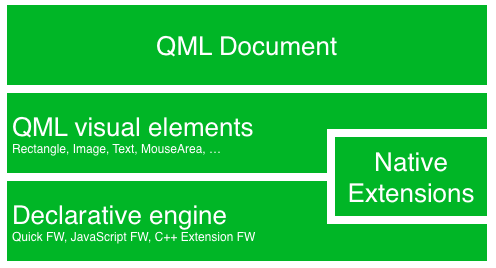
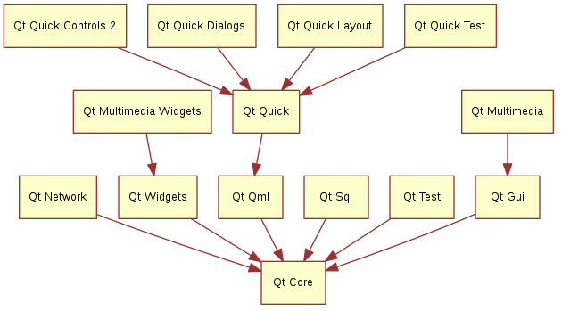
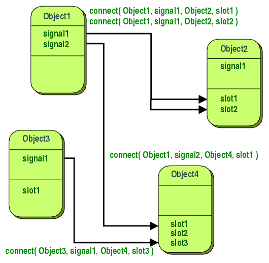
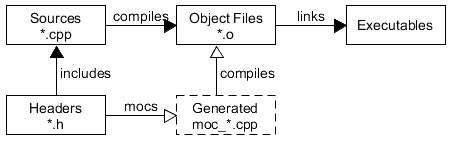

[Back](../)

&nbsp;

# Qt und QML
---

&nbsp;

### 1. Basics   
&nbsp;&nbsp;&nbsp;&nbsp;&nbsp; [<font size="-1">1.1 Qt5 / Qt Quick / QML</font>](#ch1-1)  
&nbsp;&nbsp;&nbsp;&nbsp;&nbsp;&nbsp;&nbsp;&nbsp;&nbsp;&nbsp; [<font size="-1">1.1.1 Basic QML concepts</font>](#ch1-1-1)  
&nbsp;&nbsp;&nbsp;&nbsp;&nbsp;&nbsp;&nbsp;&nbsp;&nbsp;&nbsp; [<font size="-1">1.1.2 Properties</font>](#ch1-1-2)  
&nbsp;&nbsp;&nbsp;&nbsp;&nbsp;&nbsp;&nbsp;&nbsp;&nbsp;&nbsp; [<font size="-1">1.1.3 `Signals` and `Slots`</font>](#ch1-1-3)  
&nbsp;&nbsp;&nbsp;&nbsp;&nbsp; [<font size="-1">1.2 Application Basics</font>](#ch1-2)  

### 2. How To's   
&nbsp;&nbsp;&nbsp;&nbsp;&nbsp; [<font size="-1">2.1 Importing a JS resource from another JS resource</font>](#ch2-1)  
&nbsp;&nbsp;&nbsp;&nbsp;&nbsp; [<font size="-1">2.2 Deploying a `static` Application on Windows</font>](#ch2-2)  
&nbsp;&nbsp;&nbsp;&nbsp;&nbsp; [<font size="-1">2.3 Registering C++ Types with the QML Type System</font>](#ch2-3)  
&nbsp;&nbsp;&nbsp;&nbsp;&nbsp; [<font size="-1">2.4 Embedding C++ Objects into QML with Context Properties</font>](#ch2-4)  
&nbsp;&nbsp;&nbsp;&nbsp;&nbsp; [<font size="-1">2.5 Dynamic QML element creation</font>](#ch2-5)  
&nbsp;&nbsp;&nbsp;&nbsp;&nbsp; [<font size="-1">2.6 Typecast in Qt</font>](#ch2-6)  
&nbsp;&nbsp;&nbsp;&nbsp;&nbsp; [<font size="-1">2.7 Access QML properties from C++</font>](#ch2-7)  
&nbsp;&nbsp;&nbsp;&nbsp;&nbsp; [<font size="-1">2.8 Animation with `Behaviour`</font>](#ch2-8)  
&nbsp;&nbsp;&nbsp;&nbsp;&nbsp; [<font size="-1">2.9 Farbverläufe</font>](#ch2-9)  

### 3. QML Elements   
&nbsp;&nbsp;&nbsp;&nbsp;&nbsp; [<font size="-1">3.1 `Repeater`</font>](#ch3-1)  
&nbsp;&nbsp;&nbsp;&nbsp;&nbsp; [<font size="-1">3.2 `ApplicationWindow`</font>](#ch3-2)  
&nbsp;&nbsp;&nbsp;&nbsp;&nbsp; [<font size="-1">3.3 `QThread` (*Best Use*)</font>](#ch3-3)  
&nbsp;&nbsp;&nbsp;&nbsp;&nbsp; [<font size="-1">3.4 `WorkerScript` (=Script in 2nd Thread)</font>](#ch3-4)  
&nbsp;&nbsp;&nbsp;&nbsp;&nbsp; [<font size="-1">3.5 `Text` element</font>](#ch3-5)  

&nbsp;

---  

&nbsp;

# Basics  

> "Qt is a cross platform development framework written in C++."  

- Qt was originally for user interfaces - now for everything (e.g. databases, XML, WebKits, multimedia, networking, OpenGL, scripting, etc.)
- Qt extends C++ with macros and introspection  

  ````c
  foreach (int value, intList) {...}     // macro

  QObject *o = new QPushButton;
  o->metaObject()->classObject();        // introspection (returns "QPushButton")

  connect(button, SIGNAL(clicked()), window, SLOT (close()));    // macro
  ````

&nbsp; 

<a name="ch8-1"></a>
### 1.1 Qt5 / Qt Quick / QML  
**Qt5** is a complete refreshing of the very successful Qt4 release. Qt5 is focusing on the following:  

- Outstanding graphics:  
  Qt Quick 2 is based on OpenGL using a scene graph implementation. The recomposed graphics stack allows a new level of graph effects combined with an ease of use never seen before in this field.
- Developer productivity:  
  QML and JavaScript are the primary means for UI creation. The back-end will be driven by C++. The split between JavaScript and C++ allows a fast iteration for front-end developers concentrating on creating beautiful user interfaces and back-end C++ developers concentrating on stability, performance and extending the runtime.  
- Cross-platform portability:  
  It is now possible to port Qt to a wider range of platforms easier and faster. Qt 5 is structured around the concept of Qt Essentials and Add-ons, which allows OS developer to focus on the essentials modules and leads to a smaller runtime altogether.  

&nbsp; 

**Qt Quick** is the umbrella term for the user interface technology used in Qt 5. Qt Quick itself is a collection of several technologies:  
- QML - Markup language for user interfaces  
- JavaScript - The dynamic scripting language  
- Qt C++ - The highly portable enhanced c++ library  

&nbsp; 

  

&nbsp; 

Similar to HTML, QML is a markup language. It is composed of tags, called types in Qt Quick, that are enclosed in curly brackets: *Item {}*. It was designed from the ground up for the creation of user interfaces, speed and easier reading for developers. The user interface can be enhanced further using JavaScript code. Qt Quick is easily extendable with your own native functionality using Qt C++. In short, the declarative UI is called the front-end and the native parts are called the back-end. This allows you to separate the computing intensive and native operation of your application from the user interface part.  

In a typical project, the front-end is developed in QML/JavaScript. The back-end code, which interfaces with the system and does the heavy lifting, is developed using Qt C++. This allows a natural split between the more design-oriented developers and the functional developers.  

&nbsp; 

The **Qt Essentials modules** are mandatory for any Qt-enabled platform. They offer the foundation to develop modern Qt 5 Applications using Qt Quick 2.  

|Module|Description|
|:---|:---|
|Qt Core|Core non-graphical classes used by other modules.|
|Qt GUI|Base classes for graphical user interface (GUI) components. Includes OpenGL.|
|Qt Multimedia|Classes for audio, video, radio and camera functionality.|
|Qt Multimedia Widgets|Widget-based classes for implementing multimedia functionality.|
|Qt Network|Classes to make network programming easier and more portable.|
|Qt QML|Classes for QML and JavaScript languages.|
|Qt Quick|A declarative framework for building highly dynamic applications with custom user interfaces.|
|Qt Quick Controls 2|Provides lightweight QML types for creating performant user interfaces for desktop, embedded, and mobile devices. These types employ a simple styling architecture and are very efficient.|
|Qt Quick Dialogs|Types for creating and interacting with system dialogs from a Qt Quick application.|
|Qt Quick Layouts|Layouts are items that are used to arrange Qt Quick 2 based items in the user interface.|
|Qt Quick Test|A unit test framework for QML applications, where the test cases are written as JavaScript functions.|
|Qt SQL|Classes for database integration using SQL.|
|Qt Test|Classes for unit testing Qt applications and libraries.|
|Qt Widgets|Classes to extend Qt GUI with C++ widgets.|

&nbsp; 

  

&nbsp; 

#### \<QtGlobal\>  
The *\<QtGlobal\>* header file includes the fundamental global declarations. It is included by most other Qt header files.  

The global declarations include *types*, *functions* and *macros*.  

1. The *types* are partly convenience definitions for basic types (e.g. *qint8*, which is a signed char guaranteed top be 8-bit on all platforms supported by Qt).
2. The *functions* are related to generating messages, Qt version handling and comparing or adjusting object values.  
   E.g. `bool qputenv(*varName, &value)`  
   This function sets the \<value\> of the environment variable named \<varName\>. It will create the variable if it does not exist.  
3. Some of the declared *macros* enable programmers to add compiler or platform specific code to their applications, while others are convenience macros for larger operations.  

&nbsp; 

<a name="ch1-1-1"></a>
#### 1.1.1 Basic QML Concepts  

```js
Image {
    id: root
    ...
    Image {
        id: pole
        anchors.horizontalCenter: parent.horizontalCenter
        anchors.bottom: parent.bottom
        source: "images/pole.png"
    }

    Image {
        id: wheel
        anchors.centerIn: parent
        source: "images/pinwheel.png"
    }
    ...
}
```

Placing an image as a child type of our root type (the *Image*) illustrates an important concept of a declarative language. You describe the visual appearance of the user interface in the order of layers and grouping, where the topmost layer (our background image) is drawn first and the child layers are drawn on top of it in the local coordinate system of the containing type.  

```
Image {
    id: root
    ...
    MouseArea {
        anchors.fill: parent
        onClicked: wheel.rotation += 90
    }
    ...
}
```

The mouse area emits signals when the user clicks inside the area it covers. You can connect to this signal by overriding the *onClicked* function.  

This technique works for every signal, with the naming convention being  
```js
on + SignalName
```


Also, all properties emit a signal when their value changes. For these signals, the naming convention is:
```js
on + PropertyName + Changed
```

For example, if a width property is changed, you can observe it with ``onWidthChanged: print(width)``.  

&nbsp; 

<a name="ch1-1-2"></a>
#### 1.1.2 Properties  
Elements are declared by using their element name but are defined by using their properties or by creating custom properties. A property is a simple key-value pair, e.g. *width : 100*, *text: 'Greetings'*, *color: '#FF0000'*. A property has a well-defined type and can have an initial value.  

```js
Text {
    // (1) identifier
    id: thisLabel

    // (2) set x- and y-position
    x: 24; y: 16

    // (3) bind height to 2 * width
    height: 2 * width

    // (4) custom property
    property int times: 24

    // (5) property alias
    property alias anotherTimes: thisLabel.times

    // (6) set text appended by value
    text: "Greetings " + times

    // (7) font is a grouped property
    font.family: "Ubuntu"
    font.pixelSize: 24

    // (8) KeyNavigation is an attached property
    KeyNavigation.tab: otherLabel

    // (9) signal handler for property changes
    onHeightChanged: console.log('height:', height)

    // focus is need to receive key events
    focus: true

    // change color based on focus value
    color: focus?"red":"black"
}
```

Let’s go through the different features of properties:  

1. *id* is a very special property-like value, it is used to reference elements inside a QML file (called “document” in QML). The *id* is not a string type but rather an identifier and part of the QML syntax. An *id* needs to be unique inside a document and it can’t be reset to a different value, nor may it be queried. (It behaves much like a reference in the C++ world.)  
&nbsp; 
2. A property can be set to a value, depending on its type. If no value is given for a property, an initial value will be chosen. You need to consult the documentation of the particular element for more information about the initial value of a property.  
&nbsp; 
3. A property can depend on one or many other properties. This is called binding. A bound property is updated when its dependent properties change. It works like a contract, in this case, the *height* should always be two times the *width*.  
&nbsp; 
4. Adding own properties to an element is done using the *property* qualifier followed by the type, the name and the optional initial value (*property \<type\> \<name\> : \<value\>*). If no initial value is given a system initial value is chosen.  
&nbsp; 
5. Another important way of declaring properties is using the *alias* keyword (*property alias \<name\>: \<reference\>*). The *alias* keyword allows us to forward a property of an object or an object itself from within the type to an outer scope. We will use this technique later when defining components to export the inner properties or element ids to the root level. A property alias does not need a type, it uses the type of the referenced property or object.  
&nbsp; 
6. The *text* property depends on the custom property *times* of type int. The *int* based value is automatically converted to a *string* type. The expression itself is another example of binding and results in the text being updated every time the *times* property changes.  
&nbsp; 
7. Some properties are grouped properties. This feature is used when a property is more structured and related properties should be grouped together. Another way of writing grouped properties is *font { family: "Ubuntu"; pixelSize: 24 }*.  
&nbsp; 
8. Some properties are attached to the element itself. This is done for global relevant elements which appear only once in the application (e.g. keyboard input). The writing is *\<Element\>.\<property\>: \<value\>*.  
&nbsp; 
9. For every property, you can provide a signal handler. This handler is called after the property changes. For example, here we want to be notified whenever the height changes and use the built-in console to log a message to the system.  
&nbsp; 

You can also declare one property to be the default property if no property name is given by prepending the property declaration with the *default* keyword. This is used for example when you add child elements, the child elements are added automatically to the default property *children* of type list if they are visible elements.  

&nbsp; 

**Property Aliases**  
Unlike a property definition, which allocates a new, unique storage space for the property, a property alias connects the newly declared property, called the aliasing property as a direct reference to an existing property, the aliased property. Read or write operations on the aliasing property results in a read or write operations on the aliased property, respectively.  

A property alias declaration is similar to an ordinary property definition:  

``[default] property alias <name>: <alias reference>``  

As the aliasing property has the same type as the aliased property, an explicit type is omitted, and the special *alias* keyword is before the property name. Instead of a default value, a property alias has a compulsory alias reference. Accessing the aliasing property is similar to accessing a regular property. In addition, the optional default keyword indicates that the aliasing property is a default property.  

```js
property alias buttonLabel: label.text
Text {
    id: label
    text: "empty label"
}
```  

When importing the component as a *Button*, the *buttonlabel* is directly accessible through the *label* property.  

```js
Button {
    id: textbutton
    buttonLabel: "Click Me!"
}
```  

In addition, the *id* property may also be aliased and referred outside the component.  

```js
Rectangle {
    property alias buttonImage: image

    Image {id: image}
}
```  

The *imagebutton* component has the ability to modify the child Image object and its properties.

```js
Button {
    id: imagebutton
    buttonImage.source: "http://qt.nokia.com/logo.png"
    buttonLabel: buttonImage.source
}
```  

&nbsp; 

> Using aliases, properties may be exposed to the top level component. Exposing properties to the top-level component allows components to have interfaces similar to Qt widgets.  

> (!) Aliases are only activated once the component completes its initialization. An error is generated when an uninitialized alias is referenced. Likewise, aliasing an aliasing property will also result in an error.

&nbsp; 

**Property Binding (to a JS variable)**  

A property with a binding in QML is automatically updated as necessary (e.g. `width: height*2`).  

However, if the property is later assigned a value **from JavaScript side**, the value is not automatically updated when the value in JavaScript changes.  

To bind a QML property to a JavaScript variable \<js_var\>, it must be wrapped in the `Qt.binding()` function, e.g.  

```js
height: Qt.binding(function() {return <js_var>})
```

&nbsp; 

<a name="ch1-1-3"></a>
#### 1.1.3 `Signals` and `Slots`  

Signals and slots are used for communication between objects. The signals and slots mechanism is a central feature of Qt and probably the part that differs most from the features provided by other frameworks. Signals and Slots are made possible by Qt's *meta-object system*.  

**Introduction**  

In GUI programming, when we change one widget, we often want another widget to be notified. More generally, we want objects of any kind to be able to communicate with one another. For example, if a user clicks a Close button, we probably want the window's close() function to be called.

Older toolkits achieve this kind of communication using callbacks. A callback is a pointer to a function, so if you want a processing function to notify you about some event you pass a pointer to another function (the callback) to the processing function. The processing function then calls the callback when appropriate. Callbacks have two fundamental flaws: Firstly, they are not type-safe. We can never be certain that the processing function will call the callback with the correct arguments. Secondly, the callback is strongly coupled to the processing function since the processing function must know which callback to call.  

**Signals and Slots**  

In Qt, we have an alternative to the callback technique: We use signals and slots. A signal is emitted when a particular event occurs. Qt's widgets have many predefined signals, but we can always subclass widgets to add our own signals to them. A slot is a function that is called in response to a particular signal. Qt's widgets have many pre-defined slots, but it is common practice to subclass widgets and add your own slots so that you can handle the signals that you are interested in.  

&nbsp; 

  

&nbsp; 

The signals and slots mechanism is type safe: The signature of a signal must match the signature of the receiving slot. (In fact a slot may have a shorter signature than the signal it receives because it can ignore extra arguments.) Since the signatures are compatible, the compiler can help us detect type mismatches. Signals and slots are loosely coupled: A class which emits a signal neither knows nor cares which slots receive the signal. Qt's signals and slots mechanism ensures that if you connect a signal to a slot, the slot will be called with the signal's parameters at the right time. Signals and slots can take any number of arguments of any type. They are completely type safe.

All classes that inherit from QObject or one of its subclasses (e.g., QWidget) can contain signals and slots. Signals are emitted by objects when they change their state in a way that may be interesting to other objects. This is all the object does to communicate. It does not know or care whether anything is receiving the signals it emits. This is true information encapsulation, and ensures that the object can be used as a software component.

Slots can be used for receiving signals, but they are also normal member functions. Just as an object does not know if anything receives its signals, a slot does not know if it has any signals connected to it. This ensures that truly independent components can be created with Qt.

You can connect as many signals as you want to a single slot, and a signal can be connected to as many slots as you need. It is even possible to connect a signal directly to another signal. (This will emit the second signal immediately whenever the first is emitted.)

Together, signals and slots make up a powerful component programming mechanism.  

&nbsp;

**Signals**  

Signals are emitted by an object when its internal state has changed in some way that might be interesting to the object's client or owner. Only the class that defines a signal and its subclasses can emit the signal.

When a signal is emitted, the slots connected to it are usually executed immediately, just like a normal function call. When this happens, the signals and slots mechanism is totally independent of any GUI event loop. Execution of the code following the emit statement will occur once all slots have returned. The situation is slightly different when using queued connections; in such a case, the code following the emit keyword will continue immediately, and the slots will be executed later.

If several slots are connected to one signal, the slots will be executed one after the other, in the order they have been connected, when the signal is emitted.

Signals are automatically generated by the moc and must not be implemented in the .cpp file. They can never have return types (i.e. use void).

A note about arguments: Our experience shows that signals and slots are more reusable if they do not use special types. If QScrollBar::valueChanged() were to use a special type such as the hypothetical QScrollBar::Range, it could only be connected to slots designed specifically for QScrollBar. Connecting different input widgets together would be impossible.  

&nbsp;

**Slots**

A slot is called when a signal connected to it is emitted. Slots are normal C++ functions and can be called normally; their only special feature is that signals can be connected to them.

Since slots are normal member functions, they follow the normal C++ rules when called directly. However, as slots, they can be invoked by any component, regardless of its access level, via a signal-slot connection. This means that a signal emitted from an instance of an arbitrary class can cause a private slot to be invoked in an instance of an unrelated class.

You can also define slots to be virtual, which we have found quite useful in practice.

Compared to callbacks, signals and slots are slightly slower because of the increased flexibility they provide, although the difference for real applications is insignificant. In general, emitting a signal that is connected to some slots, is approximately ten times slower than calling the receivers directly, with non-virtual function calls. This is the overhead required to locate the connection object, to safely iterate over all connections (i.e. checking that subsequent receivers have not been destroyed during the emission), and to marshall any parameters in a generic fashion. While ten non-virtual function calls may sound like a lot, it's much less overhead than any new or delete operation, for example. As soon as you perform a string, vector or list operation that behind the scene requires new or delete, the signals and slots overhead is only responsible for a very small proportion of the complete function call costs.

The same is true whenever you do a system call in a slot; or indirectly call more than ten functions. On an i586-500, you can emit around 2,000,000 signals per second connected to one receiver, or around 1,200,000 per second connected to two receivers. The simplicity and flexibility of the signals and slots mechanism is well worth the overhead, which your users won't even notice.

Note that other libraries that define variables called signals or slots may cause compiler warnings and errors when compiled alongside a Qt-based application. To solve this problem, #undef the offending preprocessor symbol.  

&nbsp; 

**A Small Example**  

A minimal C++ class declaration might read:
```c
class Counter
{
public:
    Counter() { m_value = 0; }

    int value() const { return m_value; }
    void setValue(int value);

private:
    int m_value;
};
```

A small QObject-based class might read:  

```c
#include <QObject>

class Counter : public QObject
{
    Q_OBJECT

public:
    Counter() { m_value = 0; }

    int value() const { return m_value; }

public slots:
    void setValue(int value);

signals:
    void valueChanged(int newValue);

private:
    int m_value;
};
```

The QObject-based version has the same internal state, and provides public methods to access the state, but in addition it has support for component programming using signals and slots. This class can tell the outside world that its state has changed by emitting a signal, **valueChanged()**, and it has a slot which other objects can send signals to.

All classes that contain signals or slots must mention Q_OBJECT at the top of their declaration. They must also derive (directly or indirectly) from QObject.

Slots are implemented by the application programmer. Here is a possible implementation of the **Counter::setValue()** slot:

```c
void Counter::setValue(int value)
{
    if (value != m_value) {
        m_value = value;
        emit valueChanged(value);
    }
}
```

The **emit** line emits the signal **valueChanged()** from the object, with the new value as argument.

In the following code snippet, we create two **Counter** objects and connect the first object's **valueChanged()** signal to the second object's **setValue()** slot using QObject::connect():

```c
    Counter a, b;
    QObject::connect(&a, SIGNAL(valueChanged(int)),
                     &b, SLOT(setValue(int)));

    a.setValue(12);     // a.value() == 12, b.value() == 12
    b.setValue(48);     // a.value() == 12, b.value() == 48
```

Calling **a.setValue(12)** makes **a** emit a **valueChanged(12)** signal, which **b** will receive in its **setValue()** slot, i.e. **b.setValue(12)** is called. Then **b** emits the same **valueChanged()** signal, but since no slot has been connected to b's **valueChanged()** signal, the signal is ignored.

Note that the **setValue()** function sets the value and emits the signal only if **value != m_value**. This prevents infinite looping in the case of cyclic connections (e.g., if **b.valueChanged()** were connected to **a.setValue()**).

By default, for every connection you make, a signal is emitted; two signals are emitted for duplicate connections. You can break all of these connections with a single disconnect() call. If you pass the Qt::UniqueConnection type, the connection will only be made if it is not a duplicate. If there is already a duplicate (exact same signal to the exact same slot on the same objects), the connection will fail and connect will return false

This example illustrates that objects can work together without needing to know any information about each other. To enable this, the objects only need to be connected together, and this can be achieved with some simple QObject::connect() function calls, or with uic's automatic connections feature.

&nbsp;

**Building the Example**  

The C++ preprocessor changes or removes the **signals**, **slots**, and **emit** keywords so that the compiler is presented with standard C++.

By running the moc on class definitions that contain signals or slots, a C++ source file is produced which should be compiled and linked with the other object files for the application. If you use qmake, the makefile rules to automatically invoke moc will be added to your project's makefile.

&nbsp;

**A Real Example**  

Here is a simple commented example of a widget.

```c
#ifndef LCDNUMBER_H
#define LCDNUMBER_H

#include <QFrame>

class LcdNumber : public QFrame
{
    Q_OBJECT
```

LcdNumber inherits QObject, which has most of the signal-slot knowledge, via QFrame and QWidget. It is somewhat similar to the built-in QLCDNumber widget.

The Q_OBJECT macro is expanded by the preprocessor to declare several member functions that are implemented by the moc; if you get compiler errors along the lines of "undefined reference to vtable for LcdNumber", you have probably forgotten to run the moc or to include the moc output in the link command.

```c
public:
    LcdNumber(QWidget *parent = 0);
```

It's not obviously relevant to the moc, but if you inherit QWidget you almost certainly want to have the parent argument in your constructor and pass it to the base class's constructor.

Some destructors and member functions are omitted here; the moc ignores member functions.

```c
signals:
    void overflow();
```

LcdNumber emits a signal when it is asked to show an impossible value.

If you don't care about overflow, or you know that overflow cannot occur, you can ignore the overflow() signal, i.e. don't connect it to any slot.

If on the other hand you want to call two different error functions when the number overflows, simply connect the signal to two different slots. Qt will call both (in the order they were connected).

```c
public slots:
    void display(int num);
    void display(double num);
    void display(const QString &str);
    void setHexMode();
    void setDecMode();
    void setOctMode();
    void setBinMode();
    void setSmallDecimalPoint(bool point);
};

#endif
```

A slot is a receiving function used to get information about state changes in other widgets. LcdNumber uses it, as the code above indicates, to set the displayed number. Since display() is part of the class's interface with the rest of the program, the slot is public.

Several of the example programs connect the valueChanged() signal of a QScrollBar to the display() slot, so the LCD number continuously shows the value of the scroll bar.

Note that display() is overloaded; Qt will select the appropriate version when you connect a signal to the slot. With callbacks, you'd have to find five different names and keep track of the types yourself.

Some irrelevant member functions have been omitted from this example.  

&nbsp;

**Signals And Slots With Default Arguments**  

The signatures of signals and slots may contain arguments, and the arguments can have default values. Consider QObject::destroyed():

```c
void destroyed(QObject* = 0);
```

When a QObject is deleted, it emits this QObject::destroyed() signal. We want to catch this signal, wherever we might have a dangling reference to the deleted QObject, so we can clean it up. A suitable slot signature might be:

```c
void objectDestroyed(QObject* obj = 0);
```

To connect the signal to the slot, we use QObject::connect() and the SIGNAL() and SLOT() macros. The rule about whether to include arguments or not in the SIGNAL() and SLOT() macros, if the arguments have default values, is that the signature passed to the SIGNAL() macro must not have fewer arguments than the signature passed to the SLOT() macro.

All of these would work:

```c
connect(sender, SIGNAL(destroyed(QObject*)), this, SLOT(objectDestroyed(Qbject*)));
connect(sender, SIGNAL(destroyed(QObject*)), this, SLOT(objectDestroyed()));
connect(sender, SIGNAL(destroyed()), this, SLOT(objectDestroyed()));
```

But this one won't work:

```c
connect(sender, SIGNAL(destroyed()), this, SLOT(objectDestroyed(QObject*)));
```

...because the slot will be expecting a QObject that the signal will not send. This connection will report a runtime error.

&nbsp;

**Advanced Signals and Slots Usage**  

For cases where you may require information on the sender of the signal, Qt provides the QObject::sender() function, which returns a pointer to the object that sent the signal.

The QSignalMapper class is provided for situations where many signals are connected to the same slot and the slot needs to handle each signal differently.

Suppose you have three push buttons that determine which file you will open: "Tax File", "Accounts File", or "Report File".

In order to open the correct file, you use QSignalMapper::setMapping() to map all the clicked() signals to a QSignalMapper object. Then you connect the file's QPushButton::clicked() signal to the QSignalMapper::map() slot.

```c
    signalMapper = new QSignalMapper(this);
    signalMapper->setMapping(taxFileButton, QString("taxfile.txt"));
    signalMapper->setMapping(accountFileButton, QString("accountsfile.txt"));
    signalMapper->setMapping(reportFileButton, QString("reportfile.txt"));

    connect(taxFileButton, SIGNAL(clicked()),
        signalMapper, SLOT (map()));
    connect(accountFileButton, SIGNAL(clicked()),
        signalMapper, SLOT (map()));
    connect(reportFileButton, SIGNAL(clicked()),
        signalMapper, SLOT (map()));
```

Then, you connect the mapped() signal to readFile() where a different file will be opened, depending on which push button is pressed.

```c
    connect(signalMapper, SIGNAL(mapped(QString)),
        this, SLOT(readFile(QString)));
```

Note: The following code will compile and run, but due to signature normalization, the code will be slower.

```c
    //slower due to signature normalization at runtime

    connect(signalMapper, SIGNAL(mapped(const QString &)),
        this, SLOT(readFile(const QString &)));
```

&nbsp;

&nbsp;

<a name="ch1-2"></a>
### 1.2 Application Basics  
 
````c
#include <QApplication>
#include <QLabel>

int main (int argc, char **argv) {
  QApplication app(argc, argv);
  QLabel l("Hello World!");
  l.show();
  return app.exec();
}
````

**QApplication**  
Jede Applikation enthält genau eine (!) Instanz dieser Klasse. Sie hält das Ganze zusammen und bewerkstelligt die Kommunikation zwischen Benutzer und den Objekten. Wichtig: am Ende der Main-Methode der *exec()* - Aufruf.  

**QObject**  
QObject ist die Basisklasse von nahezu allen QT-Klassen und allen Widgets. Sie enthält viele der Machanismen die Qt ausmachen, z.b. Events, *Signals&Slots* oder Speichermanagement.  

**QWidget**  
abgeleitet von der 'Urklasse' *QObject*, stellt eine Instanz der Klasse QWidget ein grafisches Element dar. Die Klasse Widget bringt viele der Methoden mit, um das Aussehen, Größe, Position auf dem Bildschirm, etc. zu verändern. Mit *show()* wird das Widget angezeigt, mit *hide()* versteckt. Jedes Widget wird innerhalb dessen Vater-Widgets dargestellt.  

&nbsp;

**[Meta Data]**  
- Qt implements introspection in C++  
    - every QObject has a meta object
    - the meta object knows about  
        - class name (QObject::className)
        - inheritance (QObject::inherits)
        - properties
        - signals and slots
        - general information (QObject::classInfo)
- The meta data is gathered at compile time by the *meta object compiler* (moc)
- The *moc* harvests data from the header  

&nbsp;

  

&nbsp;

- What does *moc* look for?  

&nbsp;

&nbsp;


# How To's

<a name="ch2-1"></a>
### 2.1 Importing a JS resource from another JS resource  

1. A JavaScript resource may import another in the following way:  
    ```js
    .import "filename.js as <qualifier>"
    ``` 
    (!) Dieser Weg ist nicht praktikabel, wenn zwischen den Files wechselseitige Abhängigkeiten bestehen (z.B. Methodenaufrufe), da die Files sich gegenseitig importieren müssten (&rarr; Schleife!).  
    &nbsp;  
2. It is possible to make functions available in the importing context (in the QML file) without needing to qualify them. In this circumstance the `Qt.include(<js_file>)` function may be used to include one JavaScript file from another. This copies all functions from the other file into the current files namespace, but ignores all *pragmas* and *imports* defined in that file.  
    ```js
    Qt.include(<js_file>)
    ```

&nbsp;  

<a name="ch2-2"></a>
### 2.2 Deploying a `static` Application on Windows

By default the Qt5 libraries distributed from qt.io are dynamically linked. This means that every Qt app dynamically references and uses the Qt prebuild libraries (.dll or so). To build a standalone executable with all libraries included, you need to include a static version of the Qt libraries.  

1. Step: Qt source files need to be installed (&rarr; `QT Maintenance tool`)  
2. Step: Edit `qmake.conf` (in folder *.../Qt/5.x/Src/qtbase/mkspecs/win32-g++/*)  
   Add:  
   ```c
   QMAKE_FLAGS += -static -static-libgcc
   QMAKE_CFLAGS_RELEASE -= -O2
   QMAKE_CFLAGS_RELEASE += -Os -momit-leaf-frame-pointer
   DEFINES += QT_STATIC_BUILD
   ```
3. Step: Open *Qt environment prompt* from StartMenu and go to 'Src' folder  
4. Step: Configure the new static Qt5 build with the commands  
   `configure -static -platform win32-g++ -prefix "C:\Qt\Qt5_static" -debug-and-release -opensource -confirm-license -nomake examples -nomake tests -nomake tools -opengl desktop -no-angle -qt-sql-sqlite -make libs -qt-zlib -qt-pcre -qt-libpng -qt-libjpeg -qt-freetype`
5. Step: Run commands: `mingw32-make -k -j4` and `mingw32-make -k install`  

&nbsp;  

<a name="ch2-3"></a>
### 2.3 Registering C++ Types with the QML Type System  

A *QObject*-derived class can be registered with the QML type system to enable the type to be used as a data type from within QML code.  

Registering an instantiable type enables a C++ class to be used as the definition of a QML object type, allowing it to be used in object declarations from QML code to create objects of this type. For example, suppose there is a *MessageClass* class with *author* and *creationDate* properties:  

```js
class MessageClass : public QObject
{
    Q_OBJECT
    Q_PROPERTY(QString author READ author WRITE setAuthor NOTIFY authorChanged)
    Q_PROPERTY(QDateTime creationDate READ creationDate WRITE setCreationDate NOTIFY creationDateChanged)
    // ...
public:
    // ...
};
```

The following registers a C++ class *MessageClass* as a QML type named *Message* for version 1.0 of a type namespace called "message_NS":  
```js
qmlRegisterType<MessageClass>("message_NS", 1, 0, "Message");   
```

The type can be used in an object declaration from QML, and its properties can be read and written to, as per the example below:  
```js
Message {
    author: "Amelie"
    creationDate: new Date()
    //...
}
```

&nbsp;  

<a name="ch2-4"></a>
### 2.4 Embedding C++ Objects into QML with Context Properties  

When loading a QML object into a C++ application, it can be useful to directly embed some C++ data that can be used from within the QML code. This makes it possible, for example, to invoke a C++ method on the embedded object, or use a C++ object instance as a data model for a QML view.  

The ability to inject C++ data into a QML object is made possible by the QQmlContext class. This class exposes data to the context of a QML object so that the data can be referred to directly from within the scope of the QML code.

```js
class ApplicationData : public QObject
{
    Q_OBJECT
public:
    Q_INVOKABLE QDateTime getCurrentDateTime() const {
        return QDateTime::currentDateTime();
    }
};
```

```js
int main(int argc, char *argv[]) {
    QGuiApplication app(argc, argv);

    QQmlApplicationEngine engine(Q_NULLPTR);

    ApplicationData data;
    engine.rootContext()->setContextProperty("applicationData", &data);

    engine.load("qrc:/qml/main.qml");

    return app.exec();
}
```

```js
// MyItem.qml
import QtQuick 2.0

Text { text: applicationData.getCurrentDateTime() }
```

&nbsp;  

<a name="ch2-5"></a>
### 2.5 Dynamic QML element creation  

```js
// Rect.qml

Rectangle {
    width: 100
    height: 50
    color: "blue"

    property string name "";
    ...
}
```

```js
...
function createRect()
{
    var component = Qt.createComponent("Rect.qml");
    var rect = component.createObject(parent, {"x":50, "y":10});

    if (rect != null) {
        rect.name = "test";
        rect.x = ...
        rect.y = ...
    }
}
```

&nbsp;  

<a name="ch2-6"></a>
### 2.6 Typecast in Qt  

In computer programming, run-time type information or run-time type identification (RTTI) is a feature of the C++ programming language that exposes information about an objects data type at runtime. Run-time type information can apply to simple data types, such as integers and characters, or to generic types.  

*[C++]*  
RTTI in C++ can be used to do safe typecasts using the `dynamic_cast<>` operator, and to manipulate type information at runtime, using the `typeid` operator and `std::type_info` class. RTTI is available only for classes that are polymorphic, which means they have at least one virtual method.  

*[Qt]*  
`qobject_cast<>` is the same thing as `dynamic_cost<>` but works only for children of `QObject`. It doesn't require RTTI and it works much faster, because it is not possible to use 'QObject' in multiple inheritance.  

&nbsp;  

<a name="ch2-7"></a>
### 2.7 Access QML properties from C++  

Two steps:  
1. Get the root object of your QML scene through the 'QQMLApplication' object.  
2. This step can be omitted for 'root' objects, but for 'QML objects', in general, you will need to have the `objectName` property set and then you can find any children with the following method:  
    ```js
    QList QObject::findChildren(const QString &name = QString(), QT::FindChildOptions options=Qt::FindChildrenRecursively())
    ```

&nbsp;  

On *[C++]* side  
```js
#include ...

int main(int argc, char* argv[]) {
    QGuiApplication app(argc,argv);
    QQmlApplicationEngine engine;
    engine.load(QUrl(QStringLiteral("qrc://main.qml")));

    // Get access to the root object
    QObject *rootObject = engine.rootObject().first();
    QObject *qmlObject = rootObject->findChild<QObject*>("mainWindow");

    // Set or Get the property value from root object
    rootObject->setProperty("visible", true);
    qDebug() << rootObject->property("visible");

    // Set or Get the property value from any qml object
    qmlObject->setProperty("visible", true);
    qDebug() << qmlObject->property("visible");
    return app.exec();
}
```

&nbsp;  

On *[QML]* side  
You will also need to have the `objectName` property of your qml objects set if you wish to access more than just the root item as follows:
```js
import QtQuick 2.2
import QtQuick.Window 2.1

Window {
    id: mainWindow
    objectName: "mainWindow"
    ...
}
```

This can be done for any QML object. The key is `objectName` in here.
&nbsp;

**Special Case: Access QML properties in a loaded QML widget using C++**  
> The loaded object can be accessed using the 'item' property.

Subsearch for an object (here called "testItem") inside a loaded item can be done with:  
```js
QObject *loader = engine.rootObject().at(0)->findChild<QObject*>("loader");
QObject *item = qvariant_cast<QObject*>(QQmlProperty::read(loader, "item"));
QObject *testItem = item->findChild<QObject*>("testItem");
```

&nbsp;  

<a name="ch2-8"></a>
### 2.8 Animation with `Behaviour`  

> This is only one of several ways of decalring an animation in QML.  

An animation defines how a property change is distributed over a duration. To enable this, we use an anmiation type called property behaviour. The 'Behaviour' does specify an animation for a defined property for every change applied to that property.  

In short: Every time the property changes, the animation is run.  

```c
Image {
    id: root
    Image {
        id: wheel
        Behaviour on rotation {
            NumberAnimation {
                duration: 250
            }
        }
    }

}
```

Now whenever the property `rotation` of the wheel changes, it will be animated using a `NumberAnimation` with a duration of 250ms. So each 90 degree turn will take 250ms.  

&nbsp;  

<a name="ch2-9"></a>
### 2.9 Farbverläufe  

Besides a fill color and a border, the rectangle also supports custom gradients.  

A gradient is defined by a series of gradient stops. Each stop has a position and a color. The position marks the position on the y-axis (0=top, 1=bottom). The color of the ``GradientStop`` marks the color at that position.  

```c
Rectangle {
    id: rect1
    x: 12; y: 12
    width: 176; height: 96
    gradient: Gradient {
        GradientStop{position:0.0;color:"white"}
        GradientStop{position:1.0;color:"black"}
    }
    border.color: "slategray"
}
```
Note: A rectange with no width/height set will not be visible. This happens often when you have several rectangles width (height) dependending on each other and something went wrong in your composition logic. So watch out!

&nbsp;

&nbsp;


# QML Elements

<a name="ch3-1"></a>
### 3.1 `Repeater`  

The repeater is used to create a large number (here: 15) of the same kind (here: Rectangle).

```js
Repeater {
    model: 15
    Rectangle {
        ...
    }

}
```

&nbsp;  

<a name="ch3-2"></a>
### 3.2 `ApplicationWindow`  

*ApplicationWindow* is a window that adds convenience for positioning items such as *MenuBar*, *ToolBar* or *StatusBar* in a platform independent manner.  

```js
ApplicationWindow {
    id: window
    ...
}
```

&nbsp;  

<a name="ch3-3"></a>
### 3.3 `QThread` (*Best Use*)  

The main thing to keep in mind when using a QThread is that it's not  a thread. It's a wrapper around a thread object. This should immediately show why the recommended way of using QThreads in the documentation, namely to sub-class it and implement your own `run()` command is very wrong. A QThread should be used much like a regular thread instance:  
1. Prepare an object (QObject) class with all your desired functionality in it.  
2. Create a new QThread instance, push the QObject onto it using `moveToThread(QThread*)` of the QObject instance.  
3. Call `start()` on the QThread instance.  

That's all. You set up the proper signal/slot connections to make it quit properly and such and that's it.  

Basic example:  
```c
class Worker : public QObject {
    QOBJECT

public:
    Worker();
    ~Worker();
public slots:
    void process();
signals:
    void finished();
    void error(QString err);
private:
    // add your variables here    
}
```

We add at least one public slot which will be used to trigger the instance and make it start processing data once the thread has started. Now, let's see what the implementation for this basic class look like.  

```c
Worker::Worker() {
    // you could copy data from constructor
    // arguments to internal variables here
}

Worker::~Worker() {
    // free resources
}

//Start processing data
void Worker::process(){
    // allocate resources using "new" here
    qDebug("Hello World!");
    emit finished();
}
```

While this worker class doesn't do anything special, it nevertheless contains all the required elements. It starts processing when its main function, in this case `process()`, is called and when it is  done it emits the signal ``finished()`` which will then be used to trigger the shutdown of the QThread instance it is contained in.  

One extremely important thing to note here is that you should NEVER allocate heap objects (using `new`) in the  constructor of the QObject class as this allocation is then performed on the main thread and not on the QThread instance! This will make your code fail to work. Instead, allocate such resources in the main function slot such as `process()`. In this case, when that is called, the object will be in the new thread instance and thus it will own the resource.  

Now let's see how to use this new construction by creating a new *Worker* instance and putting it on a *QThread* instance:  
```c
QThread* thread = new QThread;
Worker* worker = new Worker();
worker->moveToThread(thread);

connect(worker, SIGNAL(error(QString)), this, SLOT(errorString(QString)));
connect(thread, SIGNAL(started()), worker, SLOT(process()));
connect(worker, SIGNAL(finished()), thread, SLOT(quit()));
connect(worker, SIGNAL(finished()), worker, SLOT(deleteLater()));
connect(thread, SIGNAL(finished()), thread, SLOT(deleteLater()));

thread->start();
```

The `connect()` series here is the most crucial part. The first `connect()` line hooks up the error message signal from the worker to an error processing function in the main thread. The second connects the thread's `started()` signal to the `processing()` slot in the worker, causing it to start.  

Then the clean-up: when the worker instance emits `finished()`, as we did in the example. it will signal the thread to quit, i.e. shut down. We then mark the worker instance using the same `finished()` signal for deletion. Finally, to prevent nasty crashes because the thread hasn't fully shut down yet when it's deleted, we connect `finished()` of the thread (not the worker!) to its own `deleteLater()` slot. This will cause the thread to be deleted only after it has fully shut down.  

- **Per-thread event loop**  
  QThread objects can start thread-local event loops running in th threads they represent. Therefore, we say that the main event loop is the one created by the thread which invoked `main()` and started with `QCoreApplication::exec()` (which must be called from that thread). This is also called the GUI thread, because it's the only thread in which GUI-related operations are allowed. A QThread local event loop can be started by calling  
  ```c
  QThread::exec()
  ```
  &nbsp;
  Exactly like *QCoreApplication* `QThread` has also the `QThread::quit()` and `QThread::exit()` methods to stop the event loop.  
  &nbsp;
  A thread event loop delivers events for all QObjects that are <u>living</u> in that thread; this includes by default, all objects that are created into that thread, or that were moved to that thread.  
  &nbsp;
  Use `QThread::exec()` when you want to run the event loop Qt provides for you in the QThread class. If you don't call `exec()`, you need to create your own event loop that processes Qt events.  

- **Inter-Thread communication**  
  With Qt, the easiest way to send information between threads is to use signals and slots. Qt automatically uses queued signals for connections between threads which ensures that a signal can be emitted from one thread, but the slot will be executed in the thread of the receiver object.  
  &nbsp;
  If the data being sent between threads (work to be done or status information) is something that Qt can automatically queue (e.g. QStrings, built-in types like 'int' or 'double'), then passing the info as the arguments to the signal/slot is the best way to send the info.  
  &nbsp;
  If large or complex data is being shared, then you either need to use `qRegisterMetaType` to allow Qt to copy the data, or pass a pointer to a thread-safe object. The threads do share an address space, so you can share pointers; just make sure that one thread's interaction with the shared object won't interfere with another thread's interaction (&rarr; 'thread-safe' objects).  
  &nbsp;
  You should never access members or directly call functions of an object which is in another thread. The only safe way is to access them through signal/slots mechanism. You can have a signal in `Thread B` and convert it to a slot in *Thread A* which returns the value:  
  ```c
  connect(objInThrB, SIGNAL(getFinished()), objInThrA, SLOT(isFinished(), Qt::BlockQueuedConnection));
  ```
  This way when you emit the signal in 'Thread B' like  
  `bool ret = getFinished();`  
  the slot in 'Thread A' would be called when control returns to the event loop of 'Thread A' and the value would be returned. 'Thread B' waits for the slot to be called because of the connection type `BlockQueuedConnection`. So be aware not to block the application main thread using this kind of blocking connection.  

&nbsp;  

<a name="ch3-4"></a>
### 3.4 `WorkerScript` <font size="-1">(=Script runs in 2nd Thread)</font>  

This QML type enables the use of Threads in a Qt Quick Application. Use 'WorkerScript' to run operations in a new thread. This is useful for running operations in the background so that the main GUI thread is not blocked.  

Messages can be passed between the new thread and the parent thread using `sendMessage()` and the `onMessage()` handler.  
&nbsp;

**Example**  

File ``ListModel.qml``  
```c
import Qt.Quick 2.0  

Rectangle {
    ...
    ListView {
        model: listModel
        delegate: Component {
            Text {text: time}
        }
        ListModel {id: ListModel}
        WorkerScript {
            id: worker
            source: "dataLoader.js"
        }
        Timer {
            id: Timer
            interval: 2000; repeat: true
            running: true

            onTriggered: {
                var msg={'action':'appendCurrentTime',
                         'model' : ListModel};
                worker.sendMessage(msg);
            }
        }
    }
}
```
File `dataLoader.js`  (== 2nd Thread)  
```js
WorkerScript.onMessage = function(msg) {
    if (msg.action == 'appendCurrentTime') {
        var data = {'time':new Date().toTimeString()};
        msg.model.append(data);
        msg.model.sync();        //updated the changes to list
    }
}
```
&nbsp;

**Restrictions**  
Since the WorkerScript.onMessage() function is run in a separate thread, the JAvaScript file is evaluated in a context separate from the main QML engine. This means that unlike an ordinary JavaScript file that is imported into QML, the script <u>cannot</u> access the properties, methods or other attributes of the QML item, nor can it access any context properties set on the QML object through 'QQMLContext'.  

Worker scripts that are plain JavaScript sources can not use `.import` syntax.  

There are restrictions on the types of values that can be passed to and from the worker script:  
- The 'message' object may only contain values of the following types:  
  - boolean, number, strings
  - JavaScript objects and arrays
  - 'ListModel' objects (any other type of `QObject*` is <u>not</u> allowed)

> All objects and arrays are copied to the 'message'. With the exception of 'ListModel' objects, any modifications by the other thread to an object passed in 'message' will not be reflected in the original object.  

**Example**  

```c
import QT.Quick 2.0

...
WorkerScript {
    id: myWorker
    source: "workerscript.js"

    onMessage: { //3. Inhalt wird aufgerufen von Aktion im 2nd Thread ('workerscript.js')
        if (messageObject.result == -1) {
            resultText.text = "..";
        else
            resultText.text = messageObject.result;
        }
    }
}
...
MouseArea {
    onValueChanged:{
        resultText.text = ".."
        myWorker.sendMessage(row: .., column: ..); //1. Aufruf geht an 'workerscript.js'
    }
}

Text {
    id: ResultText
    ...
}
```

`workerscript.js`  (== 2nd Thread)  
```js
function triangle (row, column) {
    ...
    return triangle(row-1, column-1)+triangle(row-1,column);
}

WorkerScript.onMessage = function(message) {  //2. Send result back to main thread ('onMessage' part)
    var calcResult = triangle(message.row, message.column);
    WorkerScript.sendMessage({row: message.row,
                              column: message.column,
                              result: calcResult});
}
```

&nbsp;  

<a name="ch3-5"></a>
### 3.5 `Text` element  
To display text you can use the text element. Its most notable property is the text property of type string. The element calculates its initial width and height based on the given text and the font used. The font can be influenced using the 'font' property group (e.g. `font.family`, `font.pixelSize`,...). To change the colour of the text just use the 'color' property.  

```c
Text {
    width: 40; height: 120
    color: "#303030"
    font.family: "Ubuntu"
    font.PixelSize: 28
    text 'A very long text'

    style: Text.sunken                 // sunken text
    styleColor: "#FF4444"              // red text

    verticalAlignment: Text.AlignTop   // align text to the top
}
```

To further enhance the text rendering you can use the style and styleColor property which allows you to render the text in outline, raised and sunken mode.  

A text element only displays the given text. It does not render any background decoration. Besides the rendered text, the Text element is transparent. It's part of your overall design to provide a sensible background to the text element.

&nbsp;  

[Back](../)
