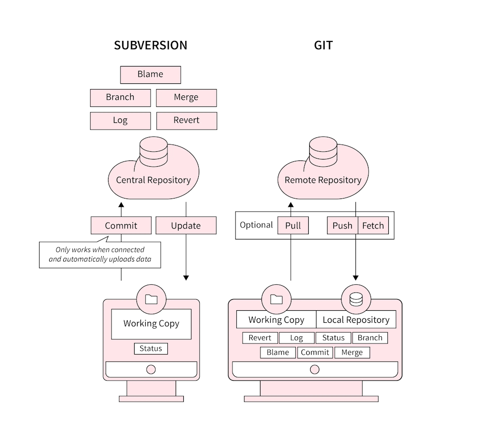

[Back](../)

&nbsp;

# SVN Grundlagen

&nbsp;

`Grundsätzliches Konzept`

Versionskontrolle ist die Kunst, die Kontrolle über Änderungen an Informationen zu behalten. Es ist seit langer Zeit ein unverzichtbares Hilfsmittel für Programmierer, die üblicherweise ihre Zeit damit verbringen, kleine Änderungen an Software vorzunehmen, um diese dann am nächsten Tag zurücknehmen oder zu prüfen. `SVN` verwaltet Dateien und Ordner im Laufe der Zeit. Dateien werden in einem zentralen Projektarchiv gespeichert. Das Projektarchiv entspricht einem normalen Dateiserver mit der Besonderheit, dass sämtliche Änderungen protokolliert werden. Dies erlaubt es, ältere Versionen von Dateien zurückzuholen und Änderungen mit der Zeit zu verfolgen.

SVN ist ein `zentralisiertes Versionskontrollsystem`. In SVN haben wir einen zentralen Server, der das gesamte Repository speichert, und die Entwickler können die erforderlichen Dateien abrufen und daran arbeiten. Man könnte SVN mit GitHub vergleichen, man muss häufig auf den zentralen Server zurückgreifen. SVN stellt außerdem den gesamten Arbeitsverlauf nur auf unserem lokalen System bereit, was unsere Arbeit ebenfalls einschränkt. Für SVN sind im Grunde nur die folgenden Befehle relevant:

- commit
- diff
- log
- branch
- merge
- file annotations, etc.

&nbsp;

Kerneigenschaften von SVN:  

- SVN verwendet einen zentralisierten Ansatz.
- Durch die Verwendung eines zentralisierten Ansatzes wird das gesamte Repository auf dem zentralen Server gespeichert.
- SVN benötigt weniger lokalen Speicherplatz und Nutzung.
- SVN verwendet ein globales Reversionssystem.
- SVN speichert seine Inhalte in Form von Dateien.
- SVN ist etwas älter als Git, bietet aber auch eine gute Unterstützung.

&nbsp;

`Vergleich mit Git`

Git ein Projektmanagement-Tool, das auf unserem lokalen System verwendet wird, um die Entwicklung und die an unserem Projekt vorgenommenen Änderungen zu verfolgen. Da Git nun auf unserem System installiert ist, benötigen wir keine Internetverbindung. SVN unterscheidet sich hier deutlich von Git. Die Dateien, an denen der Entwickler arbeitet, werden nur auf dem lokalen System gespeichert, während die restlichen Dateien auf dem Remote-System gespeichert werden, sodass auf dem lokalen System sehr wenig Speicher verbraucht wird. Hier muss der Entwickler online sein, um arbeiten zu können, da die restlichen Dateien nicht auf unserem System gespeichert sind.

&nbsp;

Übersicht über die Eigenschaften beider Systeme:

**Git** | **SVN**
-------- | --------
Git verwendet einen dezentralen Ansatz.   | SVN verwendet einen zentralisierten Ansatz.
Der Inhalt von Git ist sicherer.  | Der Inhalt von SVN ist weniger sicher.
Git benötigt mehr lokalen Speicherplatz und Nutzung. | SVN benötigt weniger lokalen Speicherplatz und Nutzung.
Git verwendet sowohl lokale als auch globale Reversionssysteme. | SVN verwendet ein globales Reversionssystem.
Git speichert seinen Inhalt in Form von Dateien und Verzeichnissen. | SVN speichert seine Inhalte in Form von Dateien.
Für Anfänger ist die Arbeit mit Git schwieriger. | Mit SVN lässt sich einfacher arbeiten.
Git benötigt keine Internetverbindung. | SVN benötigt eine Internetverbindung.
In Git werden die gesamten Dateien (Repository) auf unserem lokalen System gespeichert. | Bei SVN wird nicht das gesamte Repository auf dem lokalen System gespeichert, der Entwickler kann die benötigten Dateien auf das lokale System herunterladen.
Git arbeitet mit Binärdateien langsamer als SVN. | SVN kann eine große Anzahl Binärdateien einfach und schnell verwalten.
Git unterstützt geklonte Repositories. | SVN unterstützt keine geklonten Repositories.
In Git haben wir ein `.git`-Repository, das die Metadaten unseres Repositorys oder Projekts enthält. | In SVN haben wir ein `.svn`-Repository, das die Metadaten unseres Repositorys oder Projekts enthält.
Der Befehl zum Erstellen eines neuen Repository lautet: `git init`. | Der Befehl zum Erstellen eines neuen Repository lautet: `svnadmin create`.
Der Befehl zum Kopieren von Dateien in den Client-Arbeitsbereich lautet: `git clone` oder `git fetch`. | Der Befehl zum Kopieren von Dateien in den Client-Arbeitsbereich lautet: `svn checkout "URL" "target_name"`.
Der Befehl zum Commit lautet: `git commit`. | Der Befehl zum Commit lautet: `svn commit`.
Der Befehl zum Hinzufügen einer neuen Datei lautet: `git add`. | Der Befehl zum Hinzufügen einer neuen Datei lautet: `svn import`.
Der Befehl zum Vergleichen von Änderungen an Dateien lautet: `git diff`. | Der Befehl zum Vergleichen von Änderungen an Dateien lautet: `svn diff`.
