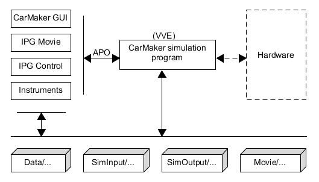

[Back](../)  

&nbsp;

# Tcl
---  

&nbsp;

### 1. Basics    
&nbsp;&nbsp;&nbsp;&nbsp;&nbsp; [<font size="-1">1.1 Tcl Interpreter</font>](#ch1-1)  
&nbsp;&nbsp;&nbsp;&nbsp;&nbsp; [<font size="-1">1.2 Packages</font>](#ch1-2)  
&nbsp;&nbsp;&nbsp;&nbsp;&nbsp; [<font size="-1">1.3 Regular Expressions</font>](#ch1-3)  
&nbsp;&nbsp;&nbsp;&nbsp;&nbsp; [<font size="-1">1.4 `VARIANT` data type</font>](#ch1-4)  
&nbsp;&nbsp;&nbsp;&nbsp;&nbsp; [<font size="-1">1.5 Tcl modules (.tm files)</font>](#ch1-5)  
&nbsp;&nbsp;&nbsp;&nbsp;&nbsp; [<font size="-1">1.6 ...</font>](#ch1-6)  

### 2. Tcl - Tk
&nbsp;&nbsp;&nbsp;&nbsp;&nbsp; [<font size="-1">2.1 Fenster aufsetzen</font>](#ch2-1)  
&nbsp;&nbsp;&nbsp;&nbsp;&nbsp; [<font size="-1">2.2 Befehle zum Ermitteln von GUI-Inhalten</font>](#ch2-2)  
&nbsp;&nbsp;&nbsp;&nbsp;&nbsp;&nbsp;&nbsp;&nbsp;&nbsp;&nbsp; [<font size="-1">2.2.1 Fenster-bezogene Informationen ermitteln - `winfo`</font>](#ch2-2-1)  
&nbsp;&nbsp;&nbsp;&nbsp;&nbsp;&nbsp;&nbsp;&nbsp;&nbsp;&nbsp; [<font size="-1">2.2.2 Widget-bezogene Informationen ermitteln - `cget`</font>](#ch2-2-2)  
&nbsp;&nbsp;&nbsp;&nbsp;&nbsp;&nbsp;&nbsp;&nbsp;&nbsp;&nbsp; [<font size="-1">2.2.3 Menü-bezogene Informationen ermitteln - `entrycget`</font>](#ch2-2-3)  
&nbsp;&nbsp;&nbsp;&nbsp;&nbsp;&nbsp;&nbsp;&nbsp;&nbsp;&nbsp; [<font size="-1">2.2.4 Menü-Eintrag hinzufügen</font>](#ch2-2-4)  
&nbsp;&nbsp;&nbsp;&nbsp;&nbsp; [<font size="-1">2.3 Unterdrückung des leeren `wish`-Fensters</font>](#ch2-3)  
&nbsp;&nbsp;&nbsp;&nbsp;&nbsp; [<font size="-1">2.4 `grid` Layout Manager</font>](#ch2-4)  
&nbsp;&nbsp;&nbsp;&nbsp;&nbsp; [<font size="-1">2.5 Darstellung dynamischer Daten (2D-Plot)</font>](#ch2-5)  
&nbsp;&nbsp;&nbsp;&nbsp;&nbsp; [<font size="-1">2.6 Tk `canvas`</font>](#ch2-6)  

### 3. Functions  
&nbsp;&nbsp;&nbsp;&nbsp;&nbsp; [<font size="-1">3.1 `scan` command</font>](#ch3-1)  
&nbsp;&nbsp;&nbsp;&nbsp;&nbsp; [<font size="-1">3.2 `binary scan` command</font>](#ch3-2)  
&nbsp;&nbsp;&nbsp;&nbsp;&nbsp; [<font size="-1">3.3 Befehle für Tcl-Programm-Interna</font>](#ch3-3)  
&nbsp;&nbsp;&nbsp;&nbsp;&nbsp; [<font size="-1">3.4 `after` command</font>](#ch3-4)  
&nbsp;&nbsp;&nbsp;&nbsp;&nbsp; [<font size="-1">3.5 `clipboard` (Windows-Zwischenspeicher)</font>](#ch3-4)  

### 4. HowTo's  
&nbsp;&nbsp;&nbsp;&nbsp;&nbsp; [<font size="-1">4.1 Konsolenfenster manuell öffnen</font>](#ch4-1)  
&nbsp;&nbsp;&nbsp;&nbsp;&nbsp; [<font size="-1">4.2 Windows-Prozesse beenden</font>](#ch4-2)  
&nbsp;&nbsp;&nbsp;&nbsp;&nbsp; [<font size="-1">4.3 .zip compression</font>](#ch4-3)  
&nbsp;&nbsp;&nbsp;&nbsp;&nbsp; [<font size="-1">4.4 Tcl <-> Python Interface (`sockets`)</font>](#ch4-4)  
&nbsp;&nbsp;&nbsp;&nbsp;&nbsp; [<font size="-1">4.5 Erstellen neuer Tcl-Funktionen (über .dll)</font>](#ch4-5)   
&nbsp;&nbsp;&nbsp;&nbsp;&nbsp; [<font size="-1">4.6 Call file in same folder</font>](#ch4-6)   
&nbsp;&nbsp;&nbsp;&nbsp;&nbsp; [<font size="-1">4.7 Increment Characters</font>](#ch4-7)   
&nbsp;&nbsp;&nbsp;&nbsp;&nbsp; [<font size="-1">4.8 XML Handling</font>](#ch4-8)   
 
### 5. IPG CarMaker
&nbsp;&nbsp;&nbsp;&nbsp;&nbsp; [<font size="-1">5.1 Basics</font>](#ch5-1)  
&nbsp;&nbsp;&nbsp;&nbsp;&nbsp; [<font size="-1">5.2 XCP</font>](#ch5-2)  
&nbsp;&nbsp;&nbsp;&nbsp;&nbsp; [<font size="-1">5.3 CarMaker-interne Funktion verändern</font>](#ch5-3)  
&nbsp;&nbsp;&nbsp;&nbsp;&nbsp; [<font size="-1">5.4 CM Namespace ::Appl</font>](#ch5-4)  
&nbsp;&nbsp;&nbsp;&nbsp;&nbsp; [<font size="-1">5.5 CM Namespace ::TestMgr</font>](#ch5-5)  
&nbsp;&nbsp;&nbsp;&nbsp;&nbsp; [<font size="-1">5.6 CM Namespace ::SessionLog</font>](#ch5-6)  
&nbsp;&nbsp;&nbsp;&nbsp;&nbsp; [<font size="-1">5.7 Logging Module</font>](#ch5-7)  
&nbsp;&nbsp;&nbsp;&nbsp;&nbsp; [<font size="-1">5.8 Editing KValue/NValue</font>](#ch5-8)  
&nbsp;&nbsp;&nbsp;&nbsp;&nbsp; [<font size="-1">5.9 InfoFile Handling</font>](#ch5-9)  
&nbsp;&nbsp;&nbsp;&nbsp;&nbsp;&nbsp;&nbsp;&nbsp;&nbsp;&nbsp; [<font size="-1">5.9.1 Parameter Access</font>](#ch5-9-1)  
&nbsp;&nbsp;&nbsp;&nbsp;&nbsp;&nbsp;&nbsp;&nbsp;&nbsp;&nbsp; [<font size="-1">5.9.2 C Functions</font>](#ch5-9-2)  

### 6. Incr Tcl    
&nbsp;&nbsp;&nbsp;&nbsp;&nbsp; [<font size="-1">6.1 Fundamental Expressions</font>](#ch6-1)  
&nbsp;&nbsp;&nbsp;&nbsp;&nbsp; [<font size="-1">6.2 Debug-Befehle</font>](#ch6-2)  
&nbsp;&nbsp;&nbsp;&nbsp;&nbsp; [<font size="-1">6.3 Pointer</font>](#ch6-3)  

&nbsp;

---  
&nbsp;


# Basics  

<a name="ch1-1"></a>
### 1.1 Tcl Interpreter  

**1.1.1 System Startup / Interpreter Files**  
1. `init.tcl` (in "lib/tcl8.6")  
The main file sourced by a Tcl interpreter when starting up (during 'Tcl_init'). When Tcl starts up, it searches for a directory that contains its 'init.tcl' startup script. You can short-circuit the search by defining the 'TCL_LIBRARY' environment variable (not needed in Tcl 8.0.5 or later).  
The primary thing defined by 'init.tcl' is the implementation of the 'unknown' procedure. It also initializes 'auto_path' to contain '$tcl_library' and the parent directory added to 'auto_path' depending on the compiled in value of 'tcl_pkgPath'.  

2. `auto_path` variable  
Contains a valid Tcl list giving directories to search during auto-load operations. Variable is initialized during startup. Additional locations to look for files and packages indices should normally be added to this variable using 'lappend'. 'auto_path' init settings are set in 'init.tcl'. To add initial paths, one can set the environment variable 'TCLLIBPATH'. The following code can be added therefore in 'init.tcl':  
```js
if {[info exists env(TCLLIBPATH)]} {set env(TCLLIBPATH) [list <path>]}
```

3. `env` variable  
This variable is maintained by Tcl as an array whose elements are the environment variables for the process.  
   - **env(HOME)**  
   This environment variable, if set, gives the location of the directory considered to be the current user's home directory.  
   - **env(TCL_LIBRARY)**  
   If set, then it specifies the location of the directory containing library scripts (the value of this variable will be assigned to the 'tcl_library' variable and therefore returned by the command ``[info library]``)  
   - **env(TCLLIBPATH)**  
   If set, then it must contain a valid Tcl list giving directories to search during auto-load operations. Directories must be specified in Tcl format, using "/" as path seperator, regardless of platform. This variable is only used when initializing the "auto_path" variable.

&nbsp;

**1.1.2 Action-Oriented vs. Object-Oriented**  
In Tcl there are two approaches when defining commands in an application.
> In the **action-oriented approach** there is one command for each action that can be taken on an object, and the command takes an object name as an argument. For example Tcl's file commands are action-oriented: there are separate commands for opening files, reading, writing, closing, etc.  
In the **object-oriented approach** there is one command for each object, and the name of the command is the name of the object. When the command is invoked its first argument specifies the operation to perform on the object. Tk's widget work this way: if there is a button widget .b, there is also a command named .b you can invoke: '.b flash' to flash the widget or '.b invoke' to evaluate its Tcl script.  
The action-oriented approach works well when there are many objects or the objects are unpredictable or short-lived.  
The object-oriented approach works well when the number of objects isn't too great and the objects are well defined and exist for at least moderate amounts of time. The object-oriented approach has the advantage that it doesn't pollute the command name space with lots of commands for individual actions.

&nbsp;

<a name="ch1-2"></a>
### 1.2 Packages  
**1.2.1 Einbinden eines Packages**  
(1) Erstellen des Packages mit Zeile `package provide <package_name>`  
(2) Hinzufügen des neuen Package in (neues oder bestehendes) "pkgIndex.tcl" File:  
```js  
package ifneeded <package_name> <version> [list source [file join $dir <directory>]]  
```
(3) Die globale Variable "auto_path" sammelt alle Pfade in denen sich die pkgIndex.tcl (und damit die Packages) befinden können.  
(4) Nutzen eines Packages indem man im jeweiligen File die Zeile `package require <package_name> <version>` einfügt.  

Nützliche Kommandos:  
  a) ``package names``: Listet alle geladenen Packages auf  
  b) ``Log $auto_path``: Gibt alle gelisteten Verzeichnisse aus  

> 'tcllib' runterladen! Enthält zusätzliche Packages die nicht im Standard-Interpreter enthalten sind.  

&nbsp;

<a name="ch1-3"></a>
### 1.3 Regular Expressions  

``^`` (called 'anchor') is used to search for pattern at the beginning of a string  
``$`` (called 'dollar') is used to search for pattern at the end of a string  

To search for the exact pattern *\<pattern\>* in a string use the following command   
```js
regexp {^<pattern>$}
```
If the string contains other characters, the return value is 0.

`[]` are used to specify a range in search patterns  
`+` symbol indicated the range specified in [] to occur 1 or more times  

E.g. to look for small alphabetical characters in the string stored in variable e, type
```js
regexp {[a-z]+ $e}

// Other search patterns
regexp {\d+} $e     // searches for digits
regexp {\D+} $e     // searches for not digits
regexp {\s+} $e     // searches for spaces
regexp {\S+} $e     // searches for not spaces
```
&nbsp;

<a name="ch1-4"></a>
### 1.4 `VARIANT` data type  
Variables in **VisualBasic (VBA)** tend to be of type "variant".  

To construct a variable in Tcl of type "variant" (with subtype <type>) the following needs to be done:  
```js
::tcom::variant <type> <data>
```  
*\<type\>* is: 'bstr', 'error', 'bool', 'variant', 'decimal', 'i1', 'ui1', 'ui2', 'ui4', 'i8', 'ui8', int, 'uint'  
*\<data\>* is the data to be converted.  

&nbsp;

<a name="ch1-5"></a>
### 1.5 Tcl modules (.tm files)  
In brief , "modules" is a vastly simplified approach to software packaging. A Tcl module is a package in a single file that can be sourced/imported. There is no 'pkgIndex.tcl' file. The package name and version are expressed in the module filename itself, so e.g. for a package 'foo' with version 3.14 the file must be named `foo-3.14.tm`.  

What are the benefits?  
- simplified deployment of packages (with some necessary formalization of layout)  
- speed: no filesystem search in subdirectories of '$auto_path' directories  
- speed: no need to read/parse 'pkgIndex.tcl'  

**Beispiel:** Import von 'fileutil' (*fileutil-1.14.x.tm*)  

- zu finden unter "...\Tcl\lib\teapot\package\tcl\teapot\tcl8\8.2\fileutil-1.14.8.tm"
- .tm files können durch bekanntmachen ihres Ordners importiert werden:  
  `::tcl::tm::path add <path>`  
  \<path\>: der oben genannte absolute Pfad **ohne** den Dateinamen (*.tm)  
- Import der Funktionalität dann mit  
  `package require fileutil`  
  (=> Output: '1.14.8')


&nbsp;

# Tcl - Tk
<font size="+2">- Grafische Anwendungsprogrammierung -</font>  
&nbsp;

<a name="ch2-1"></a>
### 2.1 Fenster aufsetzen

```js   
set w . <window_name>             // Aufsetzen Fenster (Name: <window_name>)
toplevel $w   
wm title $w "<name_title>"        // Name des Fensters in Titelzeile
wm geometry $w 300x200+300+300    // Fenster-Größe und Fenster-Startposition

wm resizable $w 0 0               // feste Fenstergröße
```

&nbsp;

<a name="ch2-2"></a>
### 2.2 Befehle zum Ermitteln von GUI-Inhalten  

<a name="ch2-2-1"></a>
#### 2.2.1 Fenster-bezogene Informationen ermitteln - `winfo`  
The *winfo* command is used to retrieve information about windows managed by Tk. It can take any number of different forms, depending on the *option* argument.  
```c
winfo <option> ?arg...arg?
```  

Commands:  

`winfo children <windows>`  
Returns a list containing the path names of all children of the window.  

`winfo geometry <window>`  
Returns the geometry for \<window\> in the form *width x height + x + y*. All dimensions are in pixels.  

`winfo exists <window>`  
Returns '1' if there exists a window named \<window\>, '0' if no such window exists.  

`winfo height <window>`/`winfo width <window>`  
Returns a decimal string giving \<window\>'s height and width in pixels.  

`winfo id <window>`  
Returns a hexadecimal string goving a low-level identifier for \<window\> (in Windows: *HWND*)  

`winfo x <window>`  
Returns a decimal string giving \<window\>'s x-coordinate (upper-left corner)  

`winfo y <window>`  
Returns a decimal string giving \<window\>'s y-coordinate (upper-left corner)  

`winfo class <window>`  
Returns the class name for \<window\>, i.e. it returns the kind of widget (e.g. 'label')  
&nbsp;  

<a name="ch2-2-2"></a>
#### 2.2.2 Widget-bezogene Informationen ermitteln - `cget`  
Um widget-Parameter zu ermitteln (z.B. '-text' oder '-command') wird der einfache *cget*-Befehl verwendet:  
```c
<window> cget -<param>
```  
\<window\> := Fenster handle, z.B. *.f.btn.start*  
\<param\> := Parameter handle, z.B. *command* oder *text*  
&nbsp;  

<a name="ch2-2-3"></a>
#### 2.2.3 Menü-bezogene Informationen ermitteln - `entrycget`  
Um Informationen über Menüeinträgen zu ermitteln (z.B. '-label' oder '-command') wird der *entrycget*-Befehl verwendet:  
```c
<menu_handle> entrycget <index> -<param>
```  
\<menu_handle\> := Menu handle, z.B. *.mbar.file.m*  
\<index\> := Integerwert (0,1,..), bezeichnet Stelle im Menü  
\<param\> := Parameter handle, z.B. *command* oder *label*  

z.B `.mbar.rts.m entrycget 4 -command`  (am Beispiel IPG CarMaker)  
liefert die Funktion die im DropDown-Menü "Realtime System" an vierter Stelle hinterlegt ist.  
&nbsp;  

<a name="ch2-2-4"></a>
#### 2.2.4 Menü-Eintrag hinzufügen  
Um einen neuen Menüpunkt an beliebiger Stelle im Untermenü hinzuzufügen:  
```c
<menu_handle> insert <index> <type> -lab <name> -comm <befehl>
```  
\<type\> := Typ des Eintrags (z.B. *command* (Standard) / *checkbutton* / *radiobutton*)  
\<name\> := gewünschter Name im Menü  
\<befehl\> := aufzurufendes Tcl-File oder Tcl-Proc  

&nbsp;  

<a name="ch2-3"></a>
### 2.3 Unterdrückung des leeren `wish`-Fensters  

Starten des Skripts mit
```c
wm withdraw .
```
schließt das leere 'wish'-Fenster.  

&nbsp;  

<a name="ch2-4"></a>
### 2.4 `grid` Layout Manager  
'grid' geht von einem "Schachbrettmuster" aus auf dem die einzelnen "widgets" verteilt werden. Die Größe der Felder hängt von der Höhe/Breite der genutzten widgets ab.  

Optionen:  
`-column <n>  /  -row <n>`  
Insert the widget in the n-th column/row (starting from 0)  

`-columnspan <n>  /  -rowspan <n>`  
Arrange for the widget to span n clumns/rows. Default is one column/row.  

`padx <n>  / pady <n>`  
Horizontal ('x') <u>external</u> padding and Vertical ('y') <u>external</u> padding  

`ipadx <n>  / ipady <n>`  
Horizontal ('x') <u>internal</u> padding and Vertical ('y') <u>internal</u> padding  

`-sticky <side(s)>`  
How the widget should be positioned and stretched within its cell. *\<side(s)\>* contains one or more of the character n,s,e or w. Each letter refers to the side to which the widget will stick.  

`rowconfigure <master> <index> <option value>`  
(&rarr; same for 'columnfigure')  
Set the row properties of the <index> row in <master>. Valid option are:  
   - `-pad <amount>`: Units in padding on the top and bottom of the tallest window in row  
   - `-weight <int>`: Every row (and column) has a 'weight' grid option associated with it, which tells it how much it should grow if there is extra room in the <master> to fill. By default, the 'weight' of each column or row is '0' meaning don't expand to fill space.

> "grid" und "place" lassen sich kombinieren!

&nbsp;  

<a name="ch2-5"></a>
### 2.5 Darstellung dynamischer Daten (2D-Plot)  

1. Möglichkeit: `canvas` - widget  
Funktion `xview scroll <number> <what>` gibt die Möglichkeit einer scrollenden Darstellungsfläche (z.B. ``.c xview scroll 1 unit``). Probleme bei sehr dynamischen Charts: Canvas erzeugt keine Linien mehr zwischen den Punkten (&rarr; Unbrauchbar).  

2. Möglichkeit: `vector`/`strip-chart` in BLT  
Veränderung in einer 'Vector'-Variable wird automatisch in einem Graph, der diese Werte enthält, übernommen. D.h. in die Lap muss nur die Neuberechnung der 'Vector'-Punkte, nicht das Zeichnen des 'strip-charts' selber,´.  
'Strip-chart' hat bereits alle nötigen Features integriert (parametrierbares 2D-Chart, parametrierbare Axen, parametrierbare Legende, usw.). Ist in der Lage auch hochdynamische Daten dazustellen (über Vektoren).

&nbsp;  

<a name="ch2-6"></a>
### 2.6 Tk `canvas`  
 The 'canvas' widget is Tk's workhorse for 2D graphical display and can handle both bitmap and vector graphics.  
 A canvas is one of the most powerful concepts in Tk. It acts as a drawing plane for lines, rectangles, ovals, polygones, text, arcs as well as container widget to group other widgets and it provides the ability to group elements together for creation, deletion, moving, etc.  

 [...] Es können externe Grafiken angezeigt und manipuliert werden (jedoch nur im GIF-,PPM-,PGM- und X-Bitmap-Format). Alle Objekte auf dem canvas-Widget haben die Möglichkeit, Nutzereingaben wie Mausbewegungen, -klick und Tastendrücke zu verarbeiten.  

<u>Widgets for drawing</u>  

&nbsp;&nbsp;&nbsp;`Line` - Draws a line  
&nbsp;&nbsp;&nbsp;`Arc` - Draws an Arc  
&nbsp;&nbsp;&nbsp;`Rectangle` - Draws a rectangle  
&nbsp;&nbsp;&nbsp;`Oval` - Draws an Oval  
&nbsp;&nbsp;&nbsp;`Polygon` - Draws a Polygon  
&nbsp;&nbsp;&nbsp;`Text` - Draws a Text  
&nbsp;&nbsp;&nbsp;`Bitmap` - Draws a Bitmap  
&nbsp;&nbsp;&nbsp;`Image` - Draws an Image  

```
canvas .myCanvas .background red -width 200 - height 200  
pack .myCanvas  
.myCanvas create arc 10 10 50 50 -fill yellow
.myCanvas create line 10 30 50 50 100 10 -arrow both -fill yellow
.myCanvas create oval 50 50 100 80 -fill yellow
.myCanvas create polygon 50 150 100 80 120 120 100 190 -fill yellow
.myCanvas create rectangle 150 150 170 170 -outline green
.myCanvas create text 170 20 -text "Hello" -font [Helvetica -18 bold]
.myCanvas create bitmap 180 50 -bitmap info
```

&nbsp;  

<u>Item *Id* or *Tags*</u>  

Items in a canvas widget may be named either of two ways: by **Id** or by **tag**. Each item has a unique identifying number, which is assigned to that item when it is created. The *Id* of an item never changed and id numbers are never re-used within the lifetime of a canvas widget.  

Each item may also have any number of *tags* associated with it. A tag is just a string of characters and it may take any form except that of an integer. The same tag may be associated with many different items. This is commonly done to group items in various interesting ways: for example, all selected items might be given the tag 'selected'.  
[...] You can use tags to correlate canvas items to particular objects in your application (so i.e. tag all canvas items that are part of the robot with id \#37 with the tag "robot37"). With tags, you don't have to keep track of the id's of canvas items to refer to groups of items later, tags let Tk do that for you.  

You can assign tags when creating an item using the "tags" item configuration option. You can add tags later with the ``addtag`` method or remove them with the ``dtags`` method. You can get the list of tags for an item with the ``gettags`` method or return a list of item id numbers having the given tag with the ``find`` command.  

The tag `current` is managed automatically by Tk; it applies to the current item, which is the top-most item whose drawn area covers the position of the mouse cursor. If the mouse is not in the canvas widget or is not over an item, then no item has the `current` tag.  

```
canvas .c  
.c create line 10 10 20 20 -tags "first line drawing"  //Ausgabe: 1 (==Id des Item)
.c create rectangle 30 30 40 40 -tags "drawing"        //Ausgabe: 2 (==Id des Item)  
.c addtag rectangle withtag 2
.c addtag polygon withtag rectangle  
.c gettags 2                                   //Ausgabe: drawing rectangle polygon
.c dtags 2 polygon                                     //Ausgabe: drawing rectangle
.c find withtag drawing                            //Ausgabe: 1 2 (=Liste der Id's)
```

```
set id [.c withtag current]
```
&rarr; &nbsp; Befehl schreibt in Variable 'id' die canvas widget id von dem Item über dem gerade der Mauszeiger liegt.  

As you can see, things like `withtag` will take either an individual item or tag; in the latter case, they will apply to all items having that tag (which could be none). The `addtag` and `find`  have many other optins, allowing you to specify items near a point, overlapping a particular area and more.  

&nbsp;

<u>Bindings</u>  

The canvas widget as a whole, like any other Tk widget can capture events using the `bind` command.  
You can also attach bindings to individual items in the canvas (or groups of them). So if you want  to know whether or not a particular item has been clicked on, you don't need to watch for mouse click events for the canvas as a whole, Tk will take care of all this for you.  
To capture these events, you use a bind command built into the canvas. It works exactly like the regular bind command, taking an event pattern and a callback. The only difference is you specify the canvas item this bind applies to.  

```
.c bind <tag_id> <1> "proc01 par1; set ::var 1"
```
&rarr; &nbsp; 'bind' für das Klicken mit Mouse-Button1 auf widget item mit tag oder id \<tag_id\>. Bei Klick wird "proc01 par1" ausgeführt und ::var 1 gesetzt.  

```
.c bind <tag_id> <Enter> "proc02 par1"
.c bind <tag_id> <Leave> {set ::var ""}
```
&rarr; &nbsp; 'bind' für mouseover über widget item mit tag oder id \<tag_id>. Beim Eintritt über die Widget-Fläche wird "proc02 par1" ausgeführt, bei Austritt wird Variable ::var "" gesetzt.  

&nbsp;

<u>Modifying Items</u>  

To delete items, use the `delete` method. To change an item's size and position, you can use the `coords` method; this allows you to provide new coordinates for the item, specified the same way when you first created the item. Calling this method without a new set of coordinates will return the current coordinates of the item. To move one or more items by a particular horizontal or vertical amount from their current location, you can use the `move` method.  

```
.c move <tag_id> 2c 2c
```

All items are ordered from top to bottom in what's called the stacking order. If an item later in the stacking order overlaps the coordinates of an item below it, the item on top will be drawn on top of the later item. The `raise` and `lower` methods allow you to adjust an item's position in the stacking order.  

```
.c raise <tag_id>
```

&nbsp;

<u>'canvas' Options</u>  

`-background <color>`  
Used to set background color for widget.

`-closeenough <distance>`  
Sets the closeness of mouse cursor to a displayable item. The default is 1.0 pixel. This value may be a fraction and must be positive.  

`-scrollregion <boundingBox>`  
The bounding box for the total area of this canvas.  

`-height <number>`  
Used to set height for widget.  

`-width <number>`  
Sets the width for widget.   


&nbsp;  

# Functions  

<a name="ch3-1"></a>
### 3.1 `scan` command  

```  
scan <string> <format> <varName> ?varName?  
```  

This command parses substrings from an input string *\<string\>* in a fashion similar to the ANSI C **sscanf** procedure and returns a count of the number of conversions performed. *\<string\>* gives the input to be parsed and *\<format\>* indicates how to parse it, using ``%`` as a conversion specifier. Each *\<varName\>* gives the name of a variable; when a field is scanned from *\<string\>*, the result is converted back into a string and assigned to the corresponding variable.  
When a '%' is encountered in *\<format\>*, it indicates the start of a conversion specifier. It converts the next input character according to the conversion specifier and stores the result in the variable given by the next argument to 'scan'.

The following "conversion characters" are supported (and more):  
`d` - The input field must be a decimal integer. It is read in and the value is stored in the variable as a decimal string.  
`o` - The input field must be an octal integer. It is read in and the value is stored in the variable as a decimal string.  
`x` - The input field must be a hexadecimal integer. Read in and stored in variable as a decimal string.  
`c` - A single character is read in and its binary value is stored in the variable as a decimal string.  

&nbsp;

<a name="ch3-2"></a>
### 3.2 `binary scan` command  

```  
binary scan <string> <formatString> ?varName varName ...?  
```  
Extracts data from a binary string and returns it as ordinary Tcl string values. Return value is the number of conversions performed. *\<string\>* gives the input to be parsed and *\<formatString\>* indicates how to parse it. When a field is scanned from *\<string\>*, the result is assigned to the corresponding variable in *\<varName\>*.  

```js
binary scan \x01\x02\x03\x04 x2H* var1
    // Rückgabewert: '1'
    // var1 = '0304'
```

`x` - moves the cursor forward 'count' bytes in *\<string\>* (hier: 2). If 'count' is '\*' or is larger than the number of bytes after the current cursor position, then the cursor is positioned after the last byte in *\<string\>*. If 'count' is omitted, then the cursor is moved forward one byte.

`H` - data is turned into a string of 'count' (hier: \*) hexadecimal digits in high-to-low order within each byte. The data bytes are scanned in first to last order. Any extra bits in the last byte are ignored. If 'count' is '\*', then all of the remaining hex digits in *\<string\>* will be scanned. If 'count' is omitted, then one hex digit will be scanned.  

'count' := number after the indicator (x<u>2</u>H<u>\*</u>)

&nbsp;

<a name="ch3-3"></a>
### 3.3 Befehle für Tcl-Programm-Interna  
- `namespace children <namespace>`  
Gibt eine Liste aller Unter-Namespaces zurück  

- `info proc <namespace>::*`  
Gibt eine Liste aller proc's im <namespace> zurück  

- `info body <namespace>::<proc>`  
Gibt den proc-Körper (=Code) zurück  

- `info args <namespace>::<proc>`  
Gibt die Argumente von \<proc\> zurück  

- `info vars <namespace>::*`  
Gibt eine Liste aller Variablen im <namespace> zurück   

&nbsp;

<a name="ch3-4"></a>
### 3.4 `after` command  

This command is used to *delay execution of the program* (1) or to *execute a command in the background in the future* (2).  

For (1): `after <ms>`  
\<ms\> must be an integer giving a time in milliseconds. While the command is sleeping, the application dose not respond to events.  

For (2): `after <ms> ?script?`  
In this form the command returns immediately, but it arranges for a Tcl command to be executed \<ms\> milliseconds later as an event handler. The command will be executed exactly once, at the given time.  

&nbsp;

<a name="ch3-5"></a>
### 3.5 `clipboard` (Windows-Zwischenspeicher)  
```c  
clipboard <option> ?arg...arg?  
```  

This command provides a Tcl interface to the Windows clipboard ("Zwischenablage"), which stores data for later retrieval. In order to copy data (=Strg+C) into the clipboard, *clipboard clear* must be called followed by a sequence of one or more calls to *clipboard append*.  

`clipboard append ?-format <format>? <data>`  
Appends \<data\> to the clipboard on Window's display with the representation given by \<format\> (optional)  

`clipboard clear`  
Removes any previous contents from clipboard.  

`clipboard get`  
Retrieves data from clipboard and returns it.

&nbsp;

# HowTo's  

<a name="ch4-1"></a>
### 4.1 Konsolenfenster manuell öffnen  
```js
catch {console show}
```  
Befehl öffnet ein eigenes Konsolenfenster in dem alle getätigten Ausgaben erscheinen (z.B. per "puts").

&nbsp;

<a name="ch4-2"></a>
### 4.2 Windows-Prozesse beenden
  - Liste aller aktiven COM-Objekte:
    ```js
    info commands ::tcom::handle*
    ```
  - Liste aller PID's (process Id's) in Windows (twapi package):
    ```js
    twapi::get_process_ids
    ```  
  - Abfragen, welches Programm zur jew. PID gehört:  
    ```js
    exec {*}[auto_execok tasklist] /fi "pid eq <pid_no>"      // <pid_no> ist Integer
    ```    
  - Prozesse beenden:
    - über PID:
      ```js
      exec [auto_execok taskkill] /PID $pid
      ```     
    - über PID (twapi):
      ```js
      twapi::end_process -force $pid
      ```       
    - **Best Use:** über Name:
      ```js
      exec {*}[auto_execok taskkill] /IM "Excel.exe" /T /F
      ```    
      **/T** = kills child process, **/F** = forceful termination

&nbsp;

<a name="ch4-3"></a>
### 4.3 .zip compression

Simplest way to create a .zip-archive is to call the program "7-zip" with the command `eval exec`.  

```
eval exec -- <path/to/7z.exe> a -tzip <path/to/targetfile> <path/to/file2zip>
```  

**<path/to/targetfile>** : Path and file name (with .zip extension) to the target .zip file  
**<path/to/file2zip>** : Path and file or directory which is supposed to be zipped

&nbsp;

<a name="ch4-4"></a>
### 4.4 Tcl <-> Python Interface (`sockets`)  

**In Python &rarr; call Tcl code**  
Suppose you have a Tcl file (*foo.tcl*) with a proc called 'main' that requires a single filename as an argument. 'main' returns a string derived from reading *foo.tcl*.  

```
from tkinter import Tcl_init
MYFILE = 'bar.txt'
tcl = Tcl()                  ;# oder 'tcl=tkinter.Tcl()'
  # Execute proc main from foo.tcl within  (*²)
  # MYFILE as the argument
tcl.eval('source foo.tcl')
tcl_str = tcl.eval('main %s' %MYFILE)
  # Access the contents of a Tcl variable  (*³)
  # ($tclVar) from Python
tcl.eval ('set tclVar foobarname')
tclVar = tcl.eval('return $tclVar')
```
\*² : Aufruf eines Tcl proc's aus Python heraus mit Rückgabe eines Wertes  
\*³ : Auslesen einer Tcl-Variable bzw. Setzen einer Tcl-Variable  

&nbsp;

**In Tcl &rarr; call Python code**  
Aufruf des Python-Interpreters mit Python-Skript ('rdn_skript.py') als Parameter mit dem `[exec]`-Befehl, z.B.  
```
set output [exec python rdn_skript.py]
puts $output
```

Die `exec`-Funktion gibt als Rückgabewert den Output des aufgerufenen Python-Skripts zurück.  
Die Rückgabe im Python-Skript wird über `print(x,y,...)` realisiert. Der übergebene Wert ist dann eine Liste mit den Werten x,y,...  

Übergabe von Werten in das Python-Skript, kann über 'command line arguments' realisiert werden. Jedes Argument das  übergeben wird. ist dann in der Liste `sys.arg` verfügbar und kann im Python-Skript verarbeitet werden.  

```
import sys 

def test_func():
...
    new_var = int(sys.argv[1]+10)
    print(sys.argv[1], new_var)
...

test_func()
```

Aufruf (in Tcl):  
```
set val [exec python test.py 10]
puts $val

# Ausgabe: '10 20'
```

&nbsp;

**Kommunikation über Sockets**  

Tcl is based on a concept of channels. A channel is conceptually similar to a ``File*`` in C or a stream in Shell programming. The difference is that a channel may be either a stream device like a file or a connection oriented construct like a socket.  

A stream based channel is created with the `open` command. A socket based channel is created with a `socket` command. A socket can be opened either as a client or as a server.

If a socket channel is opened as a server, then the Tcl program will `listen` on that channel for another task to attempt to connect with it. When this happens, a new channel is created for that link (server&rarr;new client), and the Tcl program continues to listen for connections on the original port number. In this way, a single Tcl server could be talking to several clients simultaneously.  

&nbsp;

```
socket -server <command> ?options? <port>
```

The 'socket' command with the `-server` flag starts  a server socket listening on port `<port>`. When a connection occurs on `<port>`, the proc `<command>` is called with the arguments  
&nbsp;&nbsp;&nbsp;\<channel\>  :  the channel for the new client  
&nbsp;&nbsp;&nbsp;\<address\>  :  the IP address of this client  
&nbsp;&nbsp;&nbsp;\<port\> :  the port that is assigned to this client  

&nbsp;

```
socket ?options? <host> <port>
```
The 'socket' command without the `-server` option opens a client connection to the system with IP address ``<host>`` and the port addredd `<port>`. The IP address may be given as a numeric string or as a fully qualified domain address. To connect to the local host, use the address 127.0.0.1 (the loopback address) or 'localhost'.   

&nbsp;  

When a channel exists, a handler can be defined that will be invoked when the channel is available for reading or writing. This handler is defined with the `fileevent` command. When a Tcl procedure does a `gets` or `puts` to a blocking device and the device isn't ready for I/O, the program will block until the device is ready. This may be a long while if the other end of the I/O channel has gone off line. Using the `fileevent` command, the program only accesses an I/O channel when it is ready to move data.  

```
fileevent <channelId> readable ?script?

fileevent <channelId> writable ?script?
```

The `fileevent` command defines a handler to be invoked when a condition occurs. The conditions are `readable` which invokes `script` when data is ready to be read on ``<channelId>``, and `writable` when \<channelID\> is ready to receive data. Note that end-of-life must be checked for by the 'script'.  

&nbsp;  

Finally, there is a command to wait until an event happens. The `vwait` command will wait until a variable is set. This can be used to create a semaphore style functionality for the interaction betweeen client and server and let a controlling procedure know that an event has occured.  

```
vwait <varName>
```

The `vwait` command pauses the execution of a script until some background action sets the value of `<varName>`. A background action can be a proc invoked by a fileevent or a socket connection or an event from a Tk widget.  

&nbsp;  

1. Tcl server &harr; Tcl client
  ```c
  proc serverOpen {channel addr port} {
      global connected
      set connected 1
      fileevent $channel readable "readline server $channel"
      puts "OPENED"
  }

  proc readLine {who channel} {
      global didRead
      if {[gets $channel line] < 0} {
        fileevent $channel readable {}
        after idle "close $channel; set out 1"
      } else {
        puts "Read Line: $line"
        puts $channel "This is a return."
        flush $channel
        set didRead 1
      }
  }

  set connected 0
  set server [socket -server serverOpen 33000]
  after 100 update

  set sock [socket -async 127.0.0.1 33000]
  vwait connected

  puts $sock "A Test Line"
  flush $sock

  vwait didRead
  set len [gets $sock line]
  puts "Return line: $len -- $line"

  catch {close $sock}
  vwait out
  close server
  ```

&nbsp;  

2. Python server &harr; Tcl client
  ```py
  import socket

  host = ''
  port 45000
  s=socket.socket
  s.bind(host,port)
  s.listen(1)
  print "Listening on port %d" % port

  while 1:
    try:
      sock, addr = s.accept()
      print "Connection from", sock.getpeername()
      while 1:
        data=sock,recv(4096)
        # check if still alive
        if len(data) == 0:
          break
        # ignore new lines
        req = data.strip()
        if len(req) == 0
          continue
        # point the request
        print 'Received <-- %s' % req
        # Do something with it
        resp = "Hello Tcl, this is your response: %s\n" % req.encode('hex')
        print 'Sent --> %s' %resp
        sock.sendall(resp)
    except socket.error, ex:
      ...
  ```

  ```c
  set host "127.0.0.1"
  set port 45000

  # connect to server
  set my_sock [socket $host $port]

  # disable line buffering
  fconfigure $my_sock -buffering none
  set i 0

  while {1} {
    # send data
    set request "Hello Python #$i"
    puts "Sent --> $request"
    puts $my_sock "$request"

    # wait for a response
    gets $my_sock response
    puts "Received <-- $response"
    after 500
    incr i
    puts " "
  }
  ```

  ```c
  fconfigure <channelId> <name> <value>
  ```

The `fconfigure` command sets and retrieves options for channels (in this case for a 'socket').

```c
-buffering <value>
```
If `<value>` is 'full', then the I/O system will buffer output until its internal buffer is full or until the `flush` command is invoked. If `<value>` is 'none', the I/O system will flush automatically after every output operation.  

&nbsp;

Tcl also supports **non-blocking reads and writes**, and allows you to configure the sizes of the I/O buffers, and how lines are terminated.  

A **non-blocking** read or write means that instead of a `gets` call waiting until data is available, it will return immediately. If there was data available, it will be read and if no data is available, the `gets` call will return a 0 length.  
The `fblocked` and `fconfigure` commands provide more control over the behaviour of a channel.

The `fblocked` command checks whether a channel has returned all available input. It is useful when you are working with a channel that has been set to non-blocking mode and you need to determine if there should be data available, or if the channel has been closed from the other end.  

```c
...
set blocked [fblocked $channel]
...
set len [gets $channel line]
...
if {$len<0} {
  if {$blocked} {
    puts "Input is blocked"
  } else {
    puts "The socket was closed"
    close $channel
  }
}
```

&nbsp;

<a name="ch4-5"></a>
### 4.5 Erstellen neuer Tcl-Funktionen (über .dll)  

3 Gründe Funktionalität in C zu implementieren  

1. Arbeit auf niedriger Ebene (hardwarenah), z.B. direkter Zugriff auf 'sockets'.  
2. Performance: bei langwierigen, numerischen Berechnungen oder Arbeit auf einem sehr großen Datenbestand.  
3. Komplexität: bei sehr komplexen Datenstrukturen oder sehr umfangreichen Applikation-Source-Code.  

Um eine Tcl Applikation so flexibel und leistungsstark wie möglich zu gestalten, sollte man zu neu implementierten Funktionalitäten stets eine klare und einfache Schnittstelle durch eine Menge von C-Funktionen schaffen, die jeweils einen neuen Tcl-Befehl für **eine primitive Operation** implementieren. Diese primitiven Operationen kann man später viel einfacher in Tcl-Skripten zu mächtigen und vielseitigen Funktionen kombinieren.  

Die zentrale Datenstruktur, um die sich nahezu alles in der Tcl-Library dreht, ist eine C-Struktur vom Typ `Tcl_Interp`. Nahezu jede Funktion der Tcl-Library erwartet einen solchen Zeiger auf 'Tcl_Interp' als Argument. Der Grund dafür ist, dass Interpreter sämtliche Informationen über den aktuellen Zustand bei der Evaluierung eines Tcl-Skriptes enthalten, sie "kennen" alle Befehle, die von einer Applikation durch C-Funktionen implementiert werden, sie "wissen" erlche Tcl-Prozeduren definiert sind und welche Variablen gerade welche Werte enthalten und sie verwalten den "Execution-Stack", der den Zustand in Ausführung befindlicher Befehle und Prozeduren widerspiegelt. Auch wenn die meisten Applikationen nur einen einzigen Tcl-Interpreter verwenden, ist es durchaus möglich, mehrere voneinander unabhängige Interpreter in einem Prozess zu verwalten.  

In Tcl werden sämtliche  Befehle durch eine in C geschriebene 'Befehlsprozedur' implementiert. Wann immer ein Befehl von einem Skript aufgerufen wird, bedient sich Tcl seiner Befehlsprozedur, um die gewünschte Operation auszuführen.  

**Konkreter Ablauf:**  
(a) `Befehlsprozeduren`  
Die Schnittstelle zu einer Befehlsprozedur wird in Tcl durch den Funktionsprototypen (hier: 'Tcl_CmdProc') genauestens definiert:  
```c
int Tcl_CmdProc(ClientData cData, Tcl_Interp *interp, int argc, char *argv[])
```
Die Befehlsprozedur wird von Tcl mit vier Argumenten aufgerufen wann immer der Befehl den sie implementiert in einem Interpreter ausgeführt wird.  

Beispiel: Befehlsprozedur für einen Tcl-Befehl `eq` der seine beiden Argumente auf Gleichheit prüft:  
```c
int EqCmd (ClientData cData, Tcl_Interp *interp, int argc, char *argv[]) {
  if (argc != 3) {
    interp->result = "wrong #args";
    return TCL_ERROR;
  }
  if(strcomp(argv[1], argv[2]) == 0) {
    interp->result = "1";
  } else {
    interp->result = "0";
  }
  return TCL_OK;
}
```

Die Befehlsprozedur "EqCmd" überprüft zunächst ob sie mit exakt zwei Argumenten aufgerufen wurde und weist jeden anderen Versuch ab, indem sie eine Fehlermeldung "TCL_ERROR" zurückgibt. Stimmt sie Anzahl, prüft sie sie auf Gleichheit und zeigt über einen Completion-Code von "TCL_OK" die erfolgreiche Ausführung der Operation an.  

&nbsp;  

(b) `Anmeldung`  
Um Tcl einen neuen Befehl bekannt zu machen, müssen Sie eine Befehlsprozedur zunächst beim Interpreter über die Funktion `Tcl_CreateObjCommand` (veraltet: 'Tcl_CreateCommand') unter dem gewünschten Namen registrieren.  
```c
#include <stdio.h>
#include <tcl.h>

main(int argc, char *argv[]) {
  Tcl_Interp *interp;
  interp = Tcl_CreateInterp();
  int code;
  
  Tcl_CreateObjCommand(interp, "eq", EqCmd, (ClientData) NULL, (Tcl_CmdDeleteProc) NULL);
  Tcl_PkgProvide(interp, "Equality", "1.0");
  code = Tcl_EvalFile(interp, argv[1]);

  if (*interp-> result != 0) {
    printf("%s\n", interp->result);
  }
  if (code != TCL_OK) { exit(1) };
  exit(0);
}
```  

Das erste Argument zu "Tcl_CreateObjCommand" spezifiziert dem Tcl-Interpreter, in dem der neue Befehl zur Verfügung stehen soll. Die beiden nächsten Argumente geben den Namen des Befehls und die ihn implementierende Befehlsprozedur an. Die letzten beiden Argumente der Funktion, können für so einfache Befehle wie "eq" mit 'NULL' angegeben werden. Wann immer nun der Befehl "eq" in 'interp' eingesetzt wird, ruft Tcl die C-Funktion "EqCmd" auf, um die gewünschte Operation auszuführen. Falls bereits ein Befehl dieses Namens existiert, wird er stillschweigend gelöscht und durch den neuen ersetzt.  
Die Funktion "Tcl_PckProvide" ist optional und ist dafür gedacht, der oder den neuen Funktion(en) eine Package zuzuordnen. Dadurch wird es möglich die Funktionalität später über `package require` einzubinden.  

&nbsp;

(c) `Kompilieren und Erstellen der .dll`  

&nbsp;

(d) `Eintrag in pkgIndex.tcl`  
Um die neue Funktionalität als Package nutzen zu können wird ein 'pkgIndex.tcl' erstellt (oder ein vorhandenes genutzt) und darin der Unterordner vermerkt aus dem die .dll geladen werden soll:  
```c
package ifneeded "Equality" 1.0 [list load [file join $dir <libeq> [info sharelibextension]]]
```
`libeq` ist der Unterordner mit der .dll.  
Anschließend muss der Pfad der 'pkgIndex.tcl'-Datei im "auto_path" bekannt gemacht werden.

&nbsp;

<a name="ch4-6"></a>
### 4.6 Call file in same folder  
To get the path to a \<file\> that is in the same directory as the currently executing script, use  
```c
file join [file dirname[info script]] <file>  
```

&nbsp;

<a name="ch4-7"></a>
### 4.7 Increment Characters  
The `incr` command only accepts integers. To count up the alphabet use the following proc:
```c
proc next char {
  scan $char %c i
  format %c [expr $i + 1]
}

next a

==> Output: 'b'
```

&nbsp;

<a name="ch4-8"></a>
### 4.8 XML handling  

1. **XML-Datei-Handler anlegen**  
   `tDOM::xmlOpenFile` expects a filename and returns a file channel handle. This handle gets feeded into a `dom parse -channel ...`.  
   ```c
   set xmlfd [tDOM::xmlOpenFile $filename]
   set doc [dom parse -channel $xmlfd]
   close $xmlfd
   ```

2. **XML namespace**  
   Durch ":" getrennte Bezeichner sind 'namespace'-Bereiche, d.h. der Wert vor dem ":" bezeichnet den namespace. Um aus dem namespace-Unterbereich Werte auszulesen, ist es nötig im Vorfeld ein *namespace prefix* mapping durchzuführen.  
   Namespace-Bereiche im XML-File beginnen (normalerweise) mit einem Mapping  
   `xmlns:<ns-name> = <adresse>`  
   Hier wird \<ns-name\> der angegebenen \<adresse\> zugeordnet. Dieses Mapping muss in den Tcl-Code überführt werden durch Anlegen einer entsprechenden Variable, z.B.  
   `set nsmap {<ns_name> <adresse>}`  
&nbsp;
3. **XML-Wert auslesen**  
   Will man einen Variablenwert aus einem XML-Unterbereich auslesen, gilt (nach Erstellen des handle):  
   `$doc selectNodes -namespace $nsmap <XML-Pfad zur Variable>`  
   &nbsp;
   ```xml
   <faList>
      <id name="F40_0130_EKE_LL_0719">
         <ns1:fa xmlns:ns1="http://bmw.com">
            <ns1:header createdBy="qxi9921">
               <ns1:saCodes>
                  <ns1:saCode>240</ns1:saCode>
                  <ns1:saCode>249</ns1:saCode>
                  <ns1:saCode>548</ns1:saCode>
               </ns1:saCodes>
    ...
   ```
   &nbsp;
   ```c
   set nsmap [ms1 http://bmw.com]
   set a [$doc selectNodes -namespace $nsmap {string(/faList/id/@name)}]

   => a:= "F40_0130_EKE_LL_0719"
   ```
   **Einzelnen Wert auslesen**
   ```c
   set a [$doc selectNodes -namespace $nsmap {string(/faList/id/ns1:fa/ns1:header/@createdBy)}]

   => a:= "qxi9921"
   ```
   **Wertebereich auslesen (hier: alle 'saCodes')**
   ```c
   set node [$doc selectNodes -namespace $nsmap /faList/id/ns1:fa/ns1:header/ns1:saCodes/ns1:saCode]

   => "node" enthält jetzt 'handle' für alle Einträge 'saCode'.

   foreach _node $node {Log [$node text]}

   => Ausgabe: 240
               249
               248
   ```

&nbsp;

# IPG CarMaker  

<a name="ch5-1"></a>
### 5.1 Basics  

#### 5.1.1 Architektur  

- CM consists of several programs. *IPG Movie*, *IPG Control* and *Instruments* are all implemented as individual programs that can be started from the CarMaker GUI.  
- 'CM simulation program' VVE  
  Task is not to provide any kind of elaborate user interface but to perform the actual simulation of a TestRun and to interface with external hardware (e.g. a real controller unit).  

&nbsp;

  

&nbsp;  

For the purpose of program interaction and coordination between them, the CarMaker simulation program plays a central role. It must react to commands sent by the CarMaker interface tools. It must register quantities that tools might want to receive on a regular basis, e.g. the quantity that contains the current simulation time or physical quantities calculated by the vehicle module inside the simulation program.  

Communication between the CarMaker program is done using standard network communication mechanisms. A special CarMaker module, the APO library, implements communication services for the CarMaker programs and defines the "language" being used between them. (APO := Applications Online).  

&nbsp;

#### 5.1.2 Quantities / Data Dictionary  

Inside the CarMaker simulation program the DataDict modules stores important variables (quantities) of the program in a data dictionary. This dictionary is the basis for the following functionality in the CarMaker environment:  

- Storage of simulation results (&rarr; *IPG Control*)  
- Availability of online data during a simulation  

General Implementation  
- The relevant `#include` file is 'DataDict.h'. It contains all necessary type definitions and function prototypes.  
- For each basic C type (double, float, int,...) of a variable there is a corresponding function 'DDefxxx()' to register this variable in the data dictionary  
- Variables whose values are monotonically increasing over time or whose ranges span only a limited number of discrete states should be marked accordingly using functions like 'DDefAttrib()' and 'DDEfStates()'. Visualization tools like *IPGControl* rely heavily on the correct specification of these attributes.  
- Registering a variable in the dictionary means that you have to specify a name and a unit for the variable, and its address in memory. Furthermore the DVA write access place has to be set. If the quantity is read-only, place should be assigned *DVA_None*. Otherwise one of *DVA_IO_In*, *DVA_DM*, *DVA_VC* or *DVA_IO_Out* should be assigned as the DVA write access place.  
- In case of success a handle to the resulting dictionary entry is returned, *NULL* otherwise. The handle may be used e.g. in subsequent calls to functions like 'DDefStates()' or 'DDefAttrib()'.  
- Zugriff auf Quantity im Manöver erfolgt einfach über Namen, z.B. "IO_CAN1_ECMChasFr02_DLC" oder "WL.ABSWarningLamp".  


&nbsp;

<a name="ch5-2"></a>
### 5.2 XCP

1. Einstellungen unter `Realtime System` &rarr; `XCP Configuration`
2. Dort werden benötigte ASAP's einer Gruppe ("Sample Group") zugeordnet. "Sample Rate" auf 10ms setzen und dahinter den Haken setzen, anschließend speichern.  
3. Rechts-Klick im Fenster unten auf "Connect" klicken. Erscheint kein Fehler, sollte Verbindung funktionieren. Zusätzlicher  Test durch Rechts-Klick und "Start DAQ" möglich. Es sollte Messung starten, Stoppen der Messung mit "Stop DAQ".

&nbsp;

<a name="ch5-3"></a>
### 5.3 CarMaker-interne Funktion verändern  

Funktion/proc: `PatchProc`  

```js
PatchProc <CarMaker_Func> {<Code-Zeile aus CarMaker_Func>} {<eigener Code>}
               (1)                     (2)                      (3)
```
(1) CarMaker-internes Programm, dem eigener Code hinzugefügt werden sollte  
(2) Code-Zeile im CarMaker-Programm, die anzeigt, wo eigener Code hinzugefügt werden soll  
(3) Eigener Code: meist ein selbst erstelltes 'proc', das aufgerufen werden soll  

Der Aufruf der 'PatchProc'-Funktion steht dann in einem tcl-Skript, das mit 'source' in File `.CarMaker.tcl` aufgerufen wird.

&nbsp;

<a name="ch5-4"></a>
### 5.4 CM Namespace ::Appl  

#### 5.4.1 *proc* Übersicht  

|proc|Beschreibung|  
|:---|:---|
|::SelectExe|Abhängig vom Array 'Pgm()'-Inhalt, wird die richtige Exe (bei HiL: .xeno) für das System gewählt|  
|::Disconnect|Trennt CM vom HiL (=> 'Disconnect' button)|  
|::Reboot|Neu booten des HiL Systems (=> 'Reboot' button)|  
|::Shutdown|Fährt das HiL-Sytem runter (=> 'Shutdown System' button)|  
|::Popup|Code, der die GUI ``Application Configuration`` schreibt. (!) Gute Quelle für hinterlegtes Verhalten|  
|::Terminate|Beendet laufendes Simulationsprogramm *²|  
|::ArchStr|Gibt bei Aufruf einen String zurück, der das jeweilige System angibt (z.B. 'Office' für SiL, 'xeno' für HiL)|  
|::Connect|Verbindet HiL mit CM (=> 'Connect' button)|  
|::Update|Proc updatet den 'ApplicationStatus'-Tab im 'ApplicationConfiguration'-Fenster|  
|::IPGRTHost|Gibt einen String zurück, der den jeweiligen HiL-Namen angibt ('SimX..')|  
|::Start|Funktionalität hinter `Start&Connect`|  
|::CMDir|Gibt den Pfad zurück, von wo aus die aktuelle HiL-Exe gestartet wurde|  

\*² : Funktion hinter `Terminate Application` button:
```
Appl::SilentConnect
Appl::Terminate 1
```

&nbsp;

<a name="ch5-5"></a>
### 5.5 CM Namespace ::TestMgr  

#### 5.5.1 *proc* Übersicht  

|proc|Beschreibung|  
|:---|:---|
|::GetResult|Liefert das aktuelle Test-Resultat zurück ('good', 'bad', etc).|  
|::SetResult \<res\>|Setzt aktiv das Resultat des TestRuns auf \<res\>|  
|::SkipToEnd \<kind\>|Macht es möglich ans Ende von \<kind\> zu springen (\<kind\> = TestSeries, Group, TestRunGroup oder TestRun)|  
|::DoSetting \<name\> \<type\> \<val\>|Setzt Werte vom Typ \<type\> (z.B. KValue, NValue) mit Namen \<name\> und Wert \<val\>|  
|::Save \<file\>|Speichert \<file\> im angegebenen Pfad|  
|::Load \<file\>|Lädt \<file\> aus angegebenen Pfad|  
|::ClearResults|Löscht alle Test-Resultate aus aktuellem TestManager file|  
|::PopUp|Enthält den Code der das 'TestManager'-Fenster erstellt mit allen Inhalten|  
|::Start|dem `Start` button hinterlegter Code|  
|::Stop|dem `Stop` button hinterlegter Code|  
|::New|dem `New` button hinterlegter Code|  
|::ClearTS|Löscht den Inhalt des namespace ::TS|  

#### 5.5.2 *var* Übersicht  

|var|Beschreibung|  
|:---|:---|
|::FName|Gibt das aktuell geladene TS file zurück|  
|::Data|Enthält den Inhalt des TS files als dictionary|  
|::TestRunFName|Gibt den Namen des zuletzt gefahrenen TestRun zurück|  
|::tc|Ist der String 'tm.tc' hinterlegt. Hieraus lassen sich Befehle erstellen, die direkt auf (aktuelle, dynamische) Inhalte des TestManagers zugreifen:|
||**$TestMgr::tc selection get** : Gibt den aktuell ausgewählten, d.h. blau hinterlegten Punkt (als Zeilennummer) im TestManager Fenster zurück.|  
||**$TestMgr::tc item text <zeilennummer>** : Gibt Infos zur \<zeilennummer\>-Zeile zurück (Text in Zeile, Zeilennummer, u.a.).|  
||**$TestMgr::tc item parent <zeilennummer>** : Gibt die Zeilennummer des zu Zeile \<zeilennummer\> übergeordneten Elementes zurück.|  
||**$TestMgr::tc selection clear** : Entfernt alle ausgewählten (d.h. blau hinterlegten) Punkte im 'Test-Manager'-Fenster.|  
||**$TestMgr::tc selection add \<zeilennummer\>** : Fügt an der Stelle \<zeilennummer\> eine Auswahl hinzu (blau hinterlegter Punkt).|  
|::Result|Enthält das letzte Resultat ('good', 'bad', etc.).|  
|::LastChange|Gibt Datum/Uhrzeit/Nutzer bei letzter Änderung des TS files an.|  
|::tw|Ist der String '.tm' hinterlegt (= handle für 'TestManager'-Fenster)|  

&nbsp;

<a name="ch5-6"></a>
### 5.6 CM Namespace ::SessionLog  

#### 5.6.1 *proc* Übersicht  

|proc|Beschreibung|  
|:---|:---|
|::Load|Fktn. macht ersten Check von akt. LogFile (\<fn\>). Anschließend Aufruf der Fktn. "Reload" (in 'SimOutput/\<hil\>/log/...')|  
|::Reload|Fktn. macht zweiten Check von akt. LogFile und speichert handler in ::fd-Variable + Aufruf der Fktn. "Poll".|  
|::Poll|Fktn. geht in "::fd"-Variable hinterlegte Liste durch und ruft Fktn. "HandleLogLine" mit jeweiliger Zeile als Parameter auf.|  
|::HandleLogLine|Fktn. extrahiert den Text aus der Zeile und schaut ob Text einen TAG enthält (switch-case).Anschließend wird Text (entsprechend des TAGs formattiert) in letzte Zeile im SessionLog-Textfeld geschrieben.| 
|::Popup|Fktn. ruft die Fktn. "CreateDialog" auf|  
|::CreateDialog|Fktn. baut das SessionLog-Fenster. Es werden die TAG-Mappings erstellt mit Hilfe dieser später im Textfeld der Text farbig gemacht bzw eingerückt wird.|  
|::Disconnect|Fktn. graut den bisherigen Text im Textfeld aus.|  
|::Close|Fktn. schließt das SessionLog-Fenster.|  

#### 5.6.2 *var* Übersicht  

|var|Beschreibung|  
|:---|:---|
|::Title|Name des SessionLog Fensters|  
|::Title2|Namen der oben in blau im SessionLog-Fenster erscheint (enthält akt. LogFile-Namen)|  
|::FName|Pfad zum akt. Log-File('SimOutput/.../\<LogFile\>)|  
|::fd|File-Handle für das aktuelle Log-File|  
|::w_text|Handle für Textfeld im SessionLog-Fenster|  
|::nWarnings|Anzahl der aktuell im SessionLog-Fenster angezeigten Warnings|  
|::nErrors|Anzahl der aktuell im SessionLog-Fenster angezeigten Errors|  
|::tw|Handle für SessionLog-Fenster|  

&nbsp;

<a name="ch5-7"></a>
### 5.7 Logging Module  
In general it seems useful to keep a history of important or unusual situations and events during the simulation of a TestRun, that does not disappear when the simulation is finished or the user turns off his computer.  

Each time a CarMaker simulation program is started, it creates a new log file in the `SimOutput` subdirectory of the CarMaker project directory. Log messages are recorded in the log file with a time stamp relative to the start of the current simulation.  

Log messages fall into one of the following three categories:

- `Error`  
  Issuing an error log message causes the current simulation to be aborted, so messages of this category should be reserved for cases where the program code is unable to cope with the current situation.  
- `Warning`  
  This category should be used for situations that are unnormal, but not critical. It means that the program code is able to handle the situation.  
- *Purely informational messages*  
  Use this category to inform about special events or conditions, like e.g. an ABS controller that is deactivated. It is also intended for debugging purposes.  

&nbsp;

<a name="ch5-8"></a>
### 5.8 Editing KValue/NValue  
Setting a key value / named value: `KeyValue/NamedValue set <name> <value>`  
Getting a key value / named value: `KeyValue/NamedValue get <name>`  
Check for existence of variable: `KeyValue/NamedValue exists <name>`  
Return a list of all current KeyValues/NamedValues: `KeyValue/NamedValue names`  
Delete single element: `KeyValue/NamedValue del <name>`  
Delete whole list: `KeyValue/NamedValue reset`  

&nbsp;

<a name="ch5-9"></a>
### 5.9 InfoFile Handling

<a name="ch5-9-1"></a>
#### 5.9.1 Parameter Access  

- `String` key := (key with equal (=) sign)  
  e.g. 'CarLoad.0.mass = 50'  
- `Text` key := (key with a colon (:), spanning multiple lines)  
  e.g. SuspRSrping:  
  &nbsp;&nbsp;&nbsp;&nbsp;&nbsp;&nbsp;&nbsp;&nbsp;&nbsp;&nbsp;&nbsp;&nbsp;&nbsp; 0.01   -250.0  
  &nbsp;&nbsp;&nbsp;&nbsp;&nbsp;&nbsp;&nbsp;&nbsp;&nbsp;&nbsp;&nbsp;&nbsp;&nbsp; 0.00   0.00  

- Reading Infofile key  
  for `String` key:  
  &nbsp;&nbsp;&nbsp;&nbsp;`IFileRead <paramfile> key`  
  for `Text` key:  
  &nbsp;&nbsp;&nbsp;&nbsp;`IFileReadTxt <paramfile> key`  
- Modifying InfoFile key  
  for `String` key:  
  &nbsp;&nbsp;&nbsp;&nbsp;`IFileModify <fileparam> key value`  
  for `Text` key:  
  &nbsp;&nbsp;&nbsp;&nbsp;`IFileModifyTxt <fileparam> key value`  

The \<paramfile\>/\<fileparam\> is a placeholder for the requested Infofile.  

(!) Do not forget to invoke `IFileFlush` before starting.  

- Writing the changes to InfoFile  
  &nbsp;&nbsp;&nbsp;&nbsp;`IFileFlush`  
  Writes the changes made to Infofiles by the 'IFileModify' commands to the actual files.

&nbsp;

<a name="ch5-9-2"></a>
#### 5.9.2 C functions  

`InfoNew()`  
Creates a new instance of type 'tInfos' (=Infofile handle). Returns the newly created Infofile handle.  
Bsp.: `TestIOIFile = InfoNew();`  

`InfoDelete(tInfos *inf)`  
Deletes the specified Infofile handle, i.e. deallocates all data associated with it. Returns 0 in case of success, -1 otherwise.  

`InfoRead(tErrorMsg **perrors, tInfos *inf, const char *filename)`  
Reads the file 'filename' and stores the Infofile data read in handle 'inf'.  

'perrors' := pointer to an array that will contain any errors generated during the reading of the infofile date  
'inf' := Infofile handle that will be used to store the information read  
'filename' := name of the Infofile to be read  

```c
tErrorMsg *pMessage = NULL;  
InfoRead(&pMessage, TestIOIFile, "Data/Misc/ConfigFile")
```

`InfoWrite(tInfos *inf, const char *filename)`  
Writes the information contained in Infofile handle 'inf' to the file specified by 'filename'. Returns 0 on success, any other value indicates error.  

`InfoGetStr(char **pval, tInfos *inf, const char *key)`  
Gets the string value of 'key' located in the InfoFile buffer that is specified with the handle 'inf'. Returns 0 on success, -1 otherwise.  

'pval' := pointer to the value that is read from the infofile buffer  
'inf' := tInfos handle to the Infofile buffer  
'key' := Name of the key to read  

Bsp: `InfoGetStr(&VehConf.Variant, TestIOIFile, "VehicleConfig.Variant");`  

`InfoGetLong(long **pval, tInfos *inf, const char *key)`  
Gets the long int value of 'key'.  

`InfoGetDbl(double *pval, tInfos *inf, const char *key)`  
Gets the double value of 'key'.  

`InfoGetTxt(char ***pval, tInfos *inf, const char *key)`  
Gets the text string value of 'key'.  

`InfoSetStr(tInfos *inf, const char *key, const char *val)`  
Set the value of 'val' to 'key'. If the specified key does not exist then one will be created. Returns 0 on success, -1 otherwise.  

'inf' := tInfos handle to the Infofile buffer  
'key' := Name of the key to be set  
'val' := New value to be written to the key  

`InfoSetLong(tInfos *inf, const char *key, long val)`  
Set the value of 'val' to 'key'.  

`InfoSetDbl(tInfos *inf, const char *key, double val)`  
Set the value of 'val' to 'key'.  

`InfoSetTxt(tInfos *inf, const char *key, char **val)`  
Set the value of 'val' to 'key'.  

&nbsp;

&nbsp;

# Incr Tcl  

<a name="ch6-1"></a>
### 6.1 Fundamental Expressions  

```
itcl_class <class_name> {
  inherit <base_class> ?base_class?  
  constructor args body  
  destructor body  
  method <name> args body  
  proc <name> args body  
  public <var_Name> ?init? ?config?  
  protected <var_name> ?init?  
  common <var_name> ?init?  
}
```

&nbsp;

<a name="ch6-2"></a>
### 6.2 Debug-Befehle  

1. Ausgabe des proc-Körpers
    ```c
    # Erstellen Objekt der Klasse
    <class> rdn_obj
    ```
    ```c
    # Komplettes proc (mit Argumenten)
    rdn_obj info function <proc>
    ```
    oder  
    ```c
    # nur proc body
    rdn_obj info function <proc> -body
    ```  

2. iTcl-Objekt auf Herkunft prüfen  
    ```c
    # Prüft ob <obj> ein Objekt der Klasse <class> ist
    itcl::is object -class <class> <obj>
    ```   

    ```c
    # Prüft ob Variable <obj> ein Objekt ist bzw ob überhaupt vorhanden
    itcl::is object <obj>
    ```       

&nbsp;

<a name="ch6-3"></a>
### 6.3 Pointer  

Each object must have a unique name. When we use the object name as a command, there is no question about which object we are talking to. In effect, the object name in iTcl is like the memory address of an object in C++. It uniquely identifies the object.  

> We can create a "pointer" to an object by saving its **name** in a variable.

```c
class obj01
set ptr_obj01 "obj01"
```

Mit `$ptr_obj01` kann nun auf Methoden/Variablen/etc. der Klasse `class01` zugegriffen werden.  

Das heisst um in einer Klasse A Objekte einer Klasse B zu kapseln, wird in Klasse A lediglich eine public-Variable erstellt (kein Objekt). Anschließend kann dann, z.B. der Konstruktor so ausgelegt werden, dass er ein oder mehrere Parameter entgegennimmt, die Objekte erwarten und diese dann den internen (Objekt-)Variablen zuweisen.  

```c
class class_02 {
  public variable var02 2
  ...
}

class class_03 {
  ...
}

class class_01 {
  public variable obj_var01
  public variable obj_var02

  constructor {obj_01 ob_j02} {
    set obj_var01 $obj01
    set obj_var02 $obj02
  }
}

class_02 obj_02
class_03 obj_03

class_01 obj_01 obj_02 obj_03

set val [[obj_01 cget -obj_var01] cget -var02]

puts "value: $val"

==> Output: "value: 2"
```  

&nbsp;

[Back](../)
