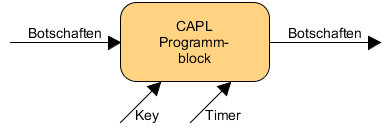

[Back](../)  

&nbsp;

# Vector
---  

&nbsp;

### 1. CAPL Programmierung     
&nbsp;&nbsp;&nbsp;&nbsp;&nbsp; [<font size="-1">1.1 Basics</font>](#ch1-1)  
&nbsp;&nbsp;&nbsp;&nbsp;&nbsp; [<font size="-1">1.2 Einbinden von CAPL-Programmen</font>](#ch1-2) 
&nbsp;&nbsp;&nbsp;&nbsp;&nbsp; [<font size="-1">1.3 Deklaration von Botschaften</font>](#ch1-3)
&nbsp;&nbsp;&nbsp;&nbsp;&nbsp; [<font size="-1">1.4 Auf Botschaften reagieren</font>](#ch1-4)  
 
&nbsp;

---

&nbsp;

## CAPL

&nbsp;

<a name="ch1-1"></a>
### 1.1 Basics

CAPL-Programme haben einen Eingang, über den Botschaften als Events in den Programmblock gehen. Am Ausgang erscheinen alle Botschaften die durch das Programm weitergegeben oder erzeugt werden. Der Programmblock kann zusätzlich auf *Tastatureingaben* (Key), *Zeitereignisse* (Timer) und - bei CANoe - auf *Änderungen von Umgebungsvariablen* wie Schalter oder Schiebereglerpositionen reagieren.



CAPL-Programme verwenden spezifische Datenbanken (z.B. ein .dbc file) für die Konzepte des aktuell betrachteten Systems. **Botschaften und Signale erhalten dort Namen und können direkt mit diesem im Programmcode verwendet werden.**  

Eine wichtige Eigenschaft, die CAPL mit C verbindet: **CAPL wird immer kompiliert, also in effizient ausführbaren, flexiblen Maschinencode übersetzt.**  

Ein wichtiger Unterschied zwischen CAPL und C sowie C++ ergibt sich aus der Vorgehensweise, wann und wie Programmelemente aufgerufen werden. In C beginnen beispielsweise alle Verarbeitungsabläufe mit der zentralen Startfunktion *main()*. **In CAPL hingegen enthält ein Programm eine ganze Sammlung gleichberechtigter Prozeduren, die jeweils auf externe Ereignisse reagieren.**  

&nbsp;

CAPL-Programme sind event-orientiert. Das heißt, sie bestehen aus einzelnen Funktionen, die jeweils auf ein Event innerhalb des aktuell betrachteten Systems reagieren:
- den **Empfang einer Botschaft**, 
  - Die Ereignisprozeduren, die durch Busereignisse wie Kommunikation oder Fehlerbehandlung auftreten, sind vielfältig und stark bustypabhängig. Beispiele sind hier 
    - ``on message`` und ``on busOff`` bei CAN oder  
    - ``on frFrame`` und ``on frStartCycle`` bei FlexRay.  
  So wird z.B. auf die Botschaft „EngineState“ reagiert: ``„On message EngineState“``.
- die **Änderung eines Signals**,  
  - Hierbei handelt es sich einerseits um System- und Umgebungsvariablen, die in CANoe/CANalyzer global zur Verfügung stehen, sowie andererseits um Signalwerte, die einer Dateninterpretation der Buskommunikation entsprechen. Das Interpretieren führen spezielle Datenbanken aus.  
- das **Ablaufen eines Timers/Tastatureingabe**,  
  - z.B. die Zeitsteuerungs- und Tastaturereignisse 
    - ``on timer`` und 
    - ``on key``.
- eine **Änderung in der „Umgebung“**
  - Diese Ereignisse sind die zur Initialisierung und Nachbereitung des Messungslaufs nutzbaren Ereignisse 
    - ``on preStart``, 
    - ``on start``, 
    - ``on preStop`` und 
    - ``on stopMeasurement``.

&nbsp;

- Hinzufügen eines Event Handler im CAPL Browser:


&nbsp;

- Wichtige Event Handler:


&nbsp;

#### Examining a CAPL program  

```c
includes {
    #include "D:\..."           
                                Additional CAPL files that contain generic code
                                that can be reused in other programs
}

variables {
    int i;                      Variables defined here are accessible
    char nameArray[255];        throughout the CAPL program (global variables)
}

on key 'A' {
    int j;                      Multiple pre-defined event handlers exist for
    j=25;                       your use within CAPL. The code in this handler 
                                will only be executed when the event occurs.

    write ("The value of j is %d", j);
}

void myFunction (int input1, int input2) {

    // Custom code here
                                You can create your own functions (special 
                                handler) that contain related code to be
                                executed frequently
}
```

&nbsp;

- CAPL Datentypen:


&nbsp;

<a name="ch1-2"></a>
### 1.2 Einbinden von CAPL-Programmen  

Ein CAPL-Programm kann im Meßaufbau an allen Hot-Spots und zusätzlich im Simulationsaufbau von CANoe direkt am Bussymbol eingefügt werden. Wählen Sie dazu im Kontextmenü des Hot-Spots den Menüpunkt *Füge CAPL-Knoten ein* und geben Sie im Konfigurationsdialog den Namen der CAPL-Programmdatei an, die Sie diesem Knoten zuordnen wollen. Wenn Sie ein neues CAPL-Programm erstellen wollen, können Sie hier auch den Namen einer noch nicht vorhandenen Datei eintragen. Beim Editieren wird diese Datei dann automatisch angelegt. 

Mit der Schaltfläche *Edit...* im Konfigurationsdialog oder mit einem Doppelklick auf einen CAPL-Knoten öffnen Sie den CAPL-Browser, mit dem Sie CAPL-Programme erstellen und modifizieren können.

Bevor Sie die Messung starten, müssen Sie alle CAPL-Programme der Konfiguration compilieren. Sie können den CAPL-Compiler aus dem CAPL-Browser oder aus dem Konfigurationsdialog heraus starten. Um alle Knoten auf einmal zu compilieren, wählen Sie einfach dem Hauptmenüeintrag *Konfiguration\|Alle Knoten compilieren*.  

**Beachten Sie, daß ein CAPL-Programme durchaus unterschiedlich reagiert, je nachdem an welcher Stelle im Meßaufbau Sie es einfügen**. So lassen  ich in einem CAPL-Programm rechts vom Sendezweig zwar Botschaften generieren, aber nicht auf den Bus senden. Da der Datenfluß von links nach rechts gerichtet ist, werden diese Botschaften nur in die Funktionsblöcke rechts vom CAPL-Programm weitergeleitet. Auf den Bus können  Botschaften nur von CAPL-Programmen aus gesendet werden, die sich im Sendezweig des CANalyzers bzw. im Simulationsaufbau von CANoe befinden. Dieses zunächst überraschende, aber durchaus logische Verhalten gilt genauso für den Generatorblock, der im rechten Teil des Meßaufbaus ebenfalls Botschaften generiert, ohne den Bus zu beeinflussen.  

Im allgemeinen bietet es sich daher an, CAPL-Programmblöcke, die ausschließlich der Analyse dienen, auf der rechten Seite des Meßaufbaus einzufügen, während Programmblöcke zum Senden von CAN-Botschaften im Sendezweig des CANalyzers bzw. im Simulationsaufbau von CANoe eingefügt werden müssen.  

&nbsp;

<a name="ch1-3"></a>
### 1.3 Deklaration von Botschaften 

Mit dem Schlüsselwort ``message`` werden Botschaften deklariert, die aus dem CAPLProgramm ausgegeben werden sollen. Zur vollständigen Deklaration gehört der Botschafts-Identifier bzw. beim Arbeiten mit symbolischen Datenbasen der Botschaftsname. Schreiben Sie also z.B.  

```c
message 0xA m1;             // Botschaftsdeklaration (hex)
message 100 m2;             // Botschaftsdeklaration (dec)
message Motordaten m3;      // symbolische Deklaration
message * wcrd;             // Deklaration ohne Id
...
output(m1);                 // Sende Botschaft m1
output(m2);                 // Sende Botschaft m2
output(m3);                 // Sende Botschaft m3
wcrd.id = 0x1A0;            // Id festlegen ...
output(wcrd);               // ... und Botschaft senden
```

um die Botschaften mit den Identifier A (hex) und 100 (dec) sowie die in der Datenbasis definierte Botschaft EngineData auf den Bus auszugeben.  

Als Bezeichnung von Botschaften wird also die Botschaftskennung (BotschaftsIdentifier) als Zahl (integer) in dezimaler oder hexadezimaler Darstellung angegeben. Für Extended Identifier wird an den Identifier ein **x** angehängt. Die Angabe von **\*** bedeutet, daß diese Variable zunächst noch keine Botschaftskennung enthält. Diese muß dann in anderer Weise vor dem Versenden des Objektes festgelegt werden. Solche Objekte dienen z.B. bei Filteraufgaben zur Speicherung aller Objekte, die unverändert weitergereicht werden sollen. (Die empfangene Botschaft wird dann
einschließlich des Botschafts-Identifiers kopiert.)  

Der Zugriff auf den Datenbereich einer Botschaft erfolgt über die Angabe das Datentyps als Datenselektor und den byte-wertigen Offset (bei 0  beginnend). Als Datenselektoren können *long*, *dword*, *int*, *word*, *char* und *byte* verwendet werden.  

Beispielsweise senden Sie mit:

```c
message 100 msg;
msg.DLC = 1;
msg.BYTE(0) = 0xff
output(msg);
```

eine Botschaft 100 mit DLC = 1 und dem ersten Datenbyte 0xFF auf den Bus.

> **Hinweis:** CAPL-Programme, mit denen Sie Botschaften auf den CAN-Bus senden wollen, müssen im CANalyzer immer im Sendezweig des Meßaufbaus  bzw. in CANoe im Simulationsaufbaufenster einfügt werden. Botschaften, die von CAPLProgrammen weiter rechts im Meßaufbau gesendet werden, werden nicht auf den Bus ausgegeben.

Der Zugriff auf die Komponenten der Objekte erfolgt über Komponenten-Selektoren. Wollen Sie ein Objekt (bei CAN-Karten mit mehr als einem  CAN-Chip) für einen bestimmten Chip definieren, so stellen Sie den entsprechenden Selektor (CAN1 bzw. CAN2) gefolgt von einem Punkt (.) der Botschaft voran.

Mit den folgenden Komponenten-Selektoren greifen Sie auf die Kontrollinformationen
der CAN-Botschaftsobjekte zu:

|Objekt|Beschreibung|
|:---|:---|
|**ID**|Botschafts-Identifier|
|**CAN** |Bausteinnummer|
|**DLC** |Data-Length-Code|
|**DIR** |Übertragungsrichtung, mögliche Werte: RX, TX, TXREQUEST.|
|**RTR** |Remote-Transmission-Request; mögliche Werte: 0 (kein RTR), 1 (RTR)|
|**TYPE** |Kombination aus DIR und RTR für effiziente Auswertung. (TYPE = (RTR << 8) \| DIR )|
|**TIME** |Zeitpunkt, Einheit: 10 Mikrosekunden|

&nbsp;

**Hinweis für CANoe-Anwender:**  
Mit Hilfe des DIR-Selektors können Sie im Meßaufbau unterscheiden, ob eine Botschaft von einem externen Netzknoten *(DIR == RX)* oder aber aus einem CAPLProgramm im Simulationsaufbau *(DIR == TX)* gesendet worden ist.

Da die Netzknoten in CANoe jedoch als unabhängige Einheiten simuliert werden, ist diese Semantik im Simulationsaufbau von CANoe geändert: CAPL-Knoten im Simulationsaufbau empfangen (bis auf den Sender) alle Botschaften mit **DIR == RX**, unabhängig davon, ob der Sender real ist oder von CANoe simuliert wird. Zur Unterscheidung, ob die empfangene Botschaft von einer realen oder von einer simulierten Komponente gesendet wurde, steht Ihnen der Selektor **SIMULATED** zur Verfügung.  

```c
on message LightState {
    if (this.dir == RX) {
        if (!this.SIMULATED) {
            write("LightState von realem System empfangen");
        }
        putValue(Bulb,this.OnOff);
    }
}
```

&nbsp;

<a name="ch1-4"></a>
### 1.4 Auf Botschaften reagieren  

Um in den CAPL-Knoten auf das Empfangen von CAN-Botschaften zu reagieren, steht Ihnen in der Ereignisprozedurtyp **on message** zur Verfügung.

|Code|Beschreibung|
|:---|:---|
|**on message 123**|Reagiere auf Botschaft 123 (dec), Empfangschip wird nicht berücksichtigt
|**on message 0x123** |Reagiere auf Botschaft 123 (hex), Empfangschip wird nicht berücksichtigt|
|**on message EngineData** |Reagiere auf Botschaft *EngineData*|
|**on message CAN1.123** |Reagiere auf Botschaft 123, wenn sie von Chip CAN1 empfangen wird|
|**on message \*** |Reagiere auf alle Botschaften|
|**on message CAN2.\*** |Reagiere auf alle Botschaften die von Chip CAN2 empfangen werden|
|**on message 100-200** |Reagiere auf alle Botschaften mit Identifiern zwischen 100 und 2|

Innerhalb einer on message-Prozedur steht Ihnen das Schlüsselwort **this** zur Verfügung, um auf die Daten der gerade empfangenen Botschaft zuzugreifen.  

Im folgenden Beispiel wird mit CAPL ein einfaches Gateway programmiert. Das Gateway soll alle Botschaften zwischen Bus 1 und Bus 2 in beiden  Richtungen übertragen, die Botschaft mit Id 34 jedoch verfälschen, indem Byte 4 auf 0 gesetzt wird.  

```c
on message CAN1.34 {
    message CAN2.34 sendMsg;    // lokale Botschaftsvariable mit
                                // Namen sendMsg, Identifier 34,
                                // Zielcontroller CAN 2
    sendMsg = this;             // Alle Daten und Attribute von
                                // empfangener Botschaft (this)
                                // in die zu sendende kopieren
    sendMsg.byte(4) = 0;        // Byte 4 verfälschen,
                                // stets 0 eintragen
    output(sendMsg);            // Botschaft senden
}
```

Beachten Sie, daß es an dieser Stelle nicht reichen würde, das vierte Byte direkt an der empfangenen Boschaft **this** zu verändern. Wie in Abschnitt 3.2.5 beschrieben, sind alle Änderungen von **this** lokal und werden daher in der Funktion output() nicht berücksichtigt. **this** muß folglich hier in eine lokale Botschaftsvariable umkopiert werden.

Für alle weiteren Botschaften wird eine Bridge-Funktion implementiert: Alle Botschaften von Bus 1 werden zu Bus 2 übertragen und umgekehrt.

```c
on message CAN1.* { // mit ’*’ werden alle Botschaften
                    // bezeichnet, die in keiner anderen
                    // Prozedur verarbeitet werden.
    message CAN2.* sendMsg;
    if (this.dir != rx) return;   // Important!
    sendMsg = this;
    output(sendMsg);
}

on message CAN2.* {
    message CAN1.* sendMsg;
    if (this.dir != rx) return;   // Important!
    sendMsg = this;
    output(sendMsg);
}
```

CAPL-Programme sind defaultmäßig für Busereignisse nicht durchlässig. Dies bedeutet, daß Sie mit einem CAPL-Knoten im Auswertezweig des Meßaufbaus den Datenfluß auf der rechten Seite des Knotens sperren. Sie müssen das Weiterreichen von Botschaften in CAPL-Knoten im Auswertezweig explizit programmieren.

&nbsp;

