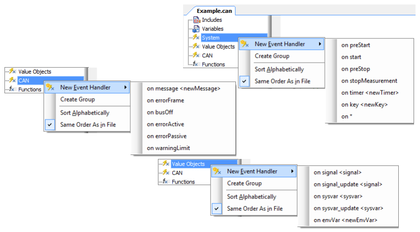
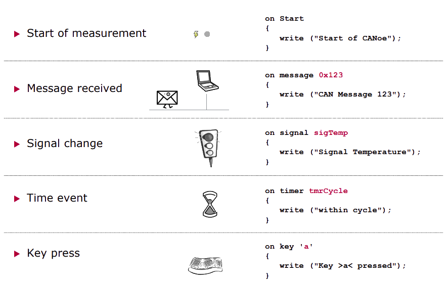
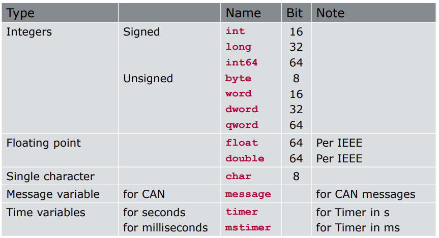

[Back](../)  

&nbsp;

# Vector
---  

### 1. CAPL Programmierung     
&nbsp;&nbsp;&nbsp;&nbsp;&nbsp; [<font size="-1">1.1 Basics</font>](#ch1-1)  
&nbsp;&nbsp;&nbsp;&nbsp;&nbsp; [<font size="-1">1.2 ...</font>](#ch1-2)  
 
---

&nbsp;

## CAPL

&nbsp;

<a name="ch1-1"></a>
### 1.1 Basics

CAPL-Programme verwenden spezifische Datenbanken (z.B. ein .dbc file) für die Konzepte des aktuell betrachteten Systems. **Botschaften und Signale erhalten dort Namen und können direkt mit diesem im Programmcode verwendet werden.**  

Eine wichtige Eigenschaft, die CAPL mit C verbindet: **CAPL wird immer kompiliert, also in effizient ausführbaren, flexiblen Maschinencode übersetzt.**  

Ein wichtiger Unterschied zwischen CAPL und C sowie C++ ergibt sich aus der Vorgehensweise, wann und wie Programmelemente aufgerufen werden. In C beginnen beispielsweise alle Verarbeitungsabläufe mit der zentralen Startfunktion *main()*. **In CAPL hingegen enthält ein Programm eine ganze Sammlung gleichberechtigter Prozeduren, die jeweils auf externe Ereignisse reagieren.**  

&nbsp;

CAPL-Programme sind event-orientiert. Das heißt, sie bestehen aus einzelnen Funktionen, die jeweils auf ein Event innerhalb des aktuell betrachteten Systems reagieren:
- den **Empfang einer Botschaft**, 
  - Die Ereignisprozeduren, die durch Busereignisse wie Kommunikation oder Fehlerbehandlung auftreten, sind vielfältig und stark bustypabhängig. Beispiele sind hier 
    - ``on message`` und ``on busOff`` bei CAN oder  
    - ``on frFrame`` und ``on frStartCycle`` bei FlexRay.  
  So wird z.B. auf die Botschaft „EngineState“ reagiert: ``„On message EngineState“``.
- die **Änderung eines Signals**,  
  - Hierbei handelt es sich einerseits um System- und Umgebungsvariablen, die in CANoe/CANalyzer global zur Verfügung stehen, sowie andererseits um Signalwerte, die einer Dateninterpretation der Buskommunikation entsprechen. Das Interpretieren führen spezielle Datenbanken aus.  
- das **Ablaufen eines Timers/Tastatureingabe**,  
  - z.B. die Zeitsteuerungs- und Tastaturereignisse 
    - ``on timer`` und 
    - ``on key``.
- eine **Änderung in der „Umgebung“**
  - Diese Ereignisse sind die zur Initialisierung und Nachbereitung des Messungslaufs nutzbaren Ereignisse 
    - ``on preStart``, 
    - ``on start``, 
    - ``on preStop`` und 
    - ``on stopMeasurement``.

&nbsp;

- Hinzufügen eines Event Handler im CAPL Browser:



&nbsp;

- Wichtige Event Handler:



&nbsp;

#### Examining a CAPL program  

```c
includes {
    #include "D:\..."           Additional CAPL files that contain generic code
                                that can be reused in other programs
}

variables {
    int i;                      Variables defined here are accessible
    char nameArray[255];        throughout the CAPL program (global variables)
}

on key 'A' {
    int j;                      Multiple pre-defined event handlers exist for
    j=25;                       your use within CAPL. The code in this handler 
                                will only be executed when the event occurs.

    write ("The value of j is %d", j);
}

void myFunction (int input1, int input2) {
                                You can create your own functions (special 
    // Custom code here         handler) that contain related code to be
                                executed frequently
}
```

&nbsp;

- CAPL Datentypen:




&nbsp;

