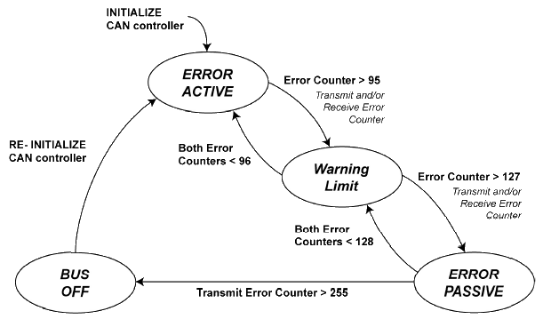

[Back](../)  

&nbsp;

# Vector
---  

&nbsp;

### 1. CAPL Programmierung     
&nbsp;&nbsp;&nbsp;&nbsp;&nbsp; [<font size="-1">1.1 Basics</font>](#ch1-1)  
&nbsp;&nbsp;&nbsp;&nbsp;&nbsp; [<font size="-1">1.2 Einbinden von CAPL-Programmen</font>](#ch1-2)  
&nbsp;&nbsp;&nbsp;&nbsp;&nbsp; [<font size="-1">1.3 Deklaration von Botschaften</font>](#ch1-3)  
&nbsp;&nbsp;&nbsp;&nbsp;&nbsp; [<font size="-1">1.4 Auf Botschaften reagieren</font>](#ch1-4)  
&nbsp;&nbsp;&nbsp;&nbsp;&nbsp; [<font size="-1">1.5 CAN Protocol Functions</font>](#ch1-5)  
&nbsp;&nbsp;&nbsp;&nbsp;&nbsp; [<font size="-1">1.6 Keyword *this* in Event Procedures</font>](#ch1-6)  
&nbsp;&nbsp;&nbsp;&nbsp;&nbsp; [<font size="-1">1.7 Using CAN Protocol Controller Events</font>](#ch1-7)  
 
&nbsp;

---

&nbsp;

## CAPL

&nbsp;

<a name="ch1-1"></a>
### 1.1 Basics

CAPL-Programme haben einen Eingang, über den Botschaften als Events in den Programmblock gehen. Am Ausgang erscheinen alle Botschaften die durch das Programm weitergegeben oder erzeugt werden. Der Programmblock kann zusätzlich auf *Tastatureingaben* (Key), *Zeitereignisse* (Timer) und - bei CANoe - auf *Änderungen von Umgebungsvariablen* wie Schalter oder Schiebereglerpositionen reagieren.


CAPL-Programme verwenden spezifische Datenbanken (z.B. ein .dbc file) für die Konzepte des aktuell betrachteten Systems. **Botschaften und Signale erhalten dort Namen und können direkt mit diesem im Programmcode verwendet werden.**  

Eine wichtige Eigenschaft, die CAPL mit C verbindet: **CAPL wird immer kompiliert, also in effizient ausführbaren, flexiblen Maschinencode übersetzt.**  

Ein wichtiger Unterschied zwischen CAPL und C sowie C++ ergibt sich aus der Vorgehensweise, wann und wie Programmelemente aufgerufen werden. In C beginnen beispielsweise alle Verarbeitungsabläufe mit der zentralen Startfunktion *main()*. **In CAPL hingegen enthält ein Programm eine ganze Sammlung gleichberechtigter Prozeduren, die jeweils auf externe Ereignisse reagieren.**  

&nbsp;

CAPL-Programme sind event-orientiert. Das heißt, sie bestehen aus einzelnen Funktionen, die jeweils auf ein Event innerhalb des aktuell betrachteten Systems reagieren:
- den **Empfang einer Botschaft**, 
  - Die Ereignisprozeduren, die durch Busereignisse wie Kommunikation oder Fehlerbehandlung auftreten, sind vielfältig und stark bustypabhängig. Beispiele sind hier 
    - ``on message`` und ``on busOff`` bei CAN oder  
    - ``on frFrame`` und ``on frStartCycle`` bei FlexRay.  
  So wird z.B. auf die Botschaft „EngineState“ reagiert: ``„On message EngineState“``.
- die **Änderung eines Signals**,  
  - Hierbei handelt es sich einerseits um System- und Umgebungsvariablen, die in CANoe/CANalyzer global zur Verfügung stehen, sowie andererseits um Signalwerte, die einer Dateninterpretation der Buskommunikation entsprechen. Das Interpretieren führen spezielle Datenbanken aus.  
- das **Ablaufen eines Timers/Tastatureingabe**,  
  - z.B. die Zeitsteuerungs- und Tastaturereignisse 
    - ``on timer`` und 
    - ``on key``.
- eine **Änderung in der „Umgebung“**
  - Diese Ereignisse sind die zur Initialisierung und Nachbereitung des Messungslaufs nutzbaren Ereignisse 
    - ``on preStart``, 
    - ``on start``, 
    - ``on preStop`` und 
    - ``on stopMeasurement``.

&nbsp;

- Hinzufügen eines Event Handler im CAPL Browser:


&nbsp;

- Wichtige Event Handler:


&nbsp;

#### Examining a CAPL program  

```c
includes {
    #include "D:\..."           
                                Additional CAPL files that contain generic code
                                that can be reused in other programs
}

variables {
    int i;                      Variables defined here are accessible
    char nameArray[255];        throughout the CAPL program (global variables)
}

on key 'A' {
    int j;                      Multiple pre-defined event handlers exist for
    j=25;                       your use within CAPL. The code in this handler 
                                will only be executed when the event occurs.

    write ("The value of j is %d", j);
}

void myFunction (int input1, int input2) {

    // Custom code here
                                You can create your own functions (special 
                                handler) that contain related code to be
                                executed frequently
}
```

&nbsp;

- CAPL Datentypen:


&nbsp;

<a name="ch1-2"></a>
### 1.2 Einbinden von CAPL-Programmen  

Ein CAPL-Programm kann im Meßaufbau an allen Hot-Spots und zusätzlich im Simulationsaufbau von CANoe direkt am Bussymbol eingefügt werden. Wählen Sie dazu im Kontextmenü des Hot-Spots den Menüpunkt *Füge CAPL-Knoten ein* und geben Sie im Konfigurationsdialog den Namen der CAPL-Programmdatei an, die Sie diesem Knoten zuordnen wollen. Wenn Sie ein neues CAPL-Programm erstellen wollen, können Sie hier auch den Namen einer noch nicht vorhandenen Datei eintragen. Beim Editieren wird diese Datei dann automatisch angelegt. 

Mit der Schaltfläche *Edit...* im Konfigurationsdialog oder mit einem Doppelklick auf einen CAPL-Knoten öffnen Sie den CAPL-Browser, mit dem Sie CAPL-Programme erstellen und modifizieren können.

Bevor Sie die Messung starten, müssen Sie alle CAPL-Programme der Konfiguration compilieren. Sie können den CAPL-Compiler aus dem CAPL-Browser oder aus dem Konfigurationsdialog heraus starten. Um alle Knoten auf einmal zu compilieren, wählen Sie einfach dem Hauptmenüeintrag *Konfiguration\|Alle Knoten compilieren*.  

**Beachten Sie, daß ein CAPL-Programme durchaus unterschiedlich reagiert, je nachdem an welcher Stelle im Meßaufbau Sie es einfügen**. So lassen  ich in einem CAPL-Programm rechts vom Sendezweig zwar Botschaften generieren, aber nicht auf den Bus senden. Da der Datenfluß von links nach rechts gerichtet ist, werden diese Botschaften nur in die Funktionsblöcke rechts vom CAPL-Programm weitergeleitet. Auf den Bus können  Botschaften nur von CAPL-Programmen aus gesendet werden, die sich im Sendezweig des CANalyzers bzw. im Simulationsaufbau von CANoe befinden. Dieses zunächst überraschende, aber durchaus logische Verhalten gilt genauso für den Generatorblock, der im rechten Teil des Meßaufbaus ebenfalls Botschaften generiert, ohne den Bus zu beeinflussen.  

Im allgemeinen bietet es sich daher an, CAPL-Programmblöcke, die ausschließlich der Analyse dienen, auf der rechten Seite des Meßaufbaus einzufügen, während Programmblöcke zum Senden von CAN-Botschaften im Sendezweig des CANalyzers bzw. im Simulationsaufbau von CANoe eingefügt werden müssen.  

&nbsp;

<a name="ch1-3"></a>
### 1.3 Deklaration von Botschaften 

Mit dem Schlüsselwort ``message`` werden Botschaften deklariert, die aus dem CAPLProgramm ausgegeben werden sollen. Zur vollständigen Deklaration gehört der Botschafts-Identifier bzw. beim Arbeiten mit symbolischen Datenbasen der Botschaftsname. Schreiben Sie also z.B.  

```c
message 0xA m1;             // Botschaftsdeklaration (hex)
message 100 m2;             // Botschaftsdeklaration (dec)
message Motordaten m3;      // symbolische Deklaration
message * wcrd;             // Deklaration ohne Id
...
output(m1);                 // Sende Botschaft m1
output(m2);                 // Sende Botschaft m2
output(m3);                 // Sende Botschaft m3
wcrd.id = 0x1A0;            // Id festlegen ...
output(wcrd);               // ... und Botschaft senden
```

um die Botschaften mit den Identifier A (hex) und 100 (dec) sowie die in der Datenbasis definierte Botschaft EngineData auf den Bus auszugeben.  

Als Bezeichnung von Botschaften wird also die Botschaftskennung (BotschaftsIdentifier) als Zahl (integer) in dezimaler oder hexadezimaler Darstellung angegeben. Für Extended Identifier wird an den Identifier ein **x** angehängt. Die Angabe von **\*** bedeutet, daß diese Variable zunächst noch keine Botschaftskennung enthält. Diese muß dann in anderer Weise vor dem Versenden des Objektes festgelegt werden. Solche Objekte dienen z.B. bei Filteraufgaben zur Speicherung aller Objekte, die unverändert weitergereicht werden sollen. (Die empfangene Botschaft wird dann
einschließlich des Botschafts-Identifiers kopiert.)  

Der Zugriff auf den Datenbereich einer Botschaft erfolgt über die Angabe das Datentyps als Datenselektor und den byte-wertigen Offset (bei 0  beginnend). Als Datenselektoren können *long*, *dword*, *int*, *word*, *char* und *byte* verwendet werden.  

Beispielsweise senden Sie mit:

```c
message 100 msg;
msg.DLC = 1;
msg.BYTE(0) = 0xff
output(msg);
```

eine Botschaft 100 mit DLC = 1 und dem ersten Datenbyte 0xFF auf den Bus.

> **Hinweis:** CAPL-Programme, mit denen Sie Botschaften auf den CAN-Bus senden wollen, müssen im CANalyzer immer im Sendezweig des Meßaufbaus  bzw. in CANoe im Simulationsaufbaufenster einfügt werden. Botschaften, die von CAPLProgrammen weiter rechts im Meßaufbau gesendet werden, werden nicht auf den Bus ausgegeben.

Der Zugriff auf die Komponenten der Objekte erfolgt über Komponenten-Selektoren. Wollen Sie ein Objekt (bei CAN-Karten mit mehr als einem  CAN-Chip) für einen bestimmten Chip definieren, so stellen Sie den entsprechenden Selektor (CAN1 bzw. CAN2) gefolgt von einem Punkt (.) der Botschaft voran.

Mit den folgenden Komponenten-Selektoren greifen Sie auf die Kontrollinformationen
der CAN-Botschaftsobjekte zu:

|Objekt|Beschreibung|
|:---|:---|
|**ID**|Botschafts-Identifier|
|**CAN** |Bausteinnummer|
|**DLC** |Data-Length-Code|
|**DIR** |Übertragungsrichtung, mögliche Werte: RX, TX, TXREQUEST.|
|**RTR** |Remote-Transmission-Request; mögliche Werte: 0 (kein RTR), 1 (RTR)|
|**TYPE** |Kombination aus DIR und RTR für effiziente Auswertung. (TYPE = (RTR << 8) \| DIR )|
|**TIME** |Zeitpunkt, Einheit: 10 Mikrosekunden|

&nbsp;

**Hinweis für CANoe-Anwender:**  
Mit Hilfe des DIR-Selektors können Sie im Meßaufbau unterscheiden, ob eine Botschaft von einem externen Netzknoten *(DIR == RX)* oder aber aus einem CAPLProgramm im Simulationsaufbau *(DIR == TX)* gesendet worden ist.

Da die Netzknoten in CANoe jedoch als unabhängige Einheiten simuliert werden, ist diese Semantik im Simulationsaufbau von CANoe geändert: CAPL-Knoten im Simulationsaufbau empfangen (bis auf den Sender) alle Botschaften mit **DIR == RX**, unabhängig davon, ob der Sender real ist oder von CANoe simuliert wird. Zur Unterscheidung, ob die empfangene Botschaft von einer realen oder von einer simulierten Komponente gesendet wurde, steht Ihnen der Selektor **SIMULATED** zur Verfügung.  

```c
on message LightState {
    if (this.dir == RX) {
        if (!this.SIMULATED) {
            write("LightState von realem System empfangen");
        }
        putValue(Bulb,this.OnOff);
    }
}
```

&nbsp;

<a name="ch1-4"></a>
### 1.4 Auf Botschaften reagieren  

Um in den CAPL-Knoten auf das Empfangen von CAN-Botschaften zu reagieren, steht Ihnen in der Ereignisprozedurtyp **on message** zur Verfügung.

|Code|Beschreibung|
|:---|:---|
|**on message 123**|Reagiere auf Botschaft 123 (dec), Empfangschip wird nicht berücksichtigt|
|**on message 0x123** |Reagiere auf Botschaft 123 (hex), Empfangschip wird nicht berücksichtigt|
|**on message EngineData** |Reagiere auf Botschaft *EngineData*|
|**on message CAN1.123** |Reagiere auf Botschaft 123, wenn sie von Chip CAN1 empfangen wird|
|**on message \*** |Reagiere auf alle Botschaften|
|**on message CAN2.\*** |Reagiere auf alle Botschaften die von Chip CAN2 empfangen werden|
|**on message 100-200** |Reagiere auf alle Botschaften mit Identifiern zwischen 100 und 2|

Innerhalb einer on message-Prozedur steht Ihnen das Schlüsselwort **this** zur Verfügung, um auf die Daten der gerade empfangenen Botschaft zuzugreifen.  

Im folgenden Beispiel wird mit CAPL ein einfaches Gateway programmiert. Das Gateway soll alle Botschaften zwischen Bus 1 und Bus 2 in beiden  Richtungen übertragen, die Botschaft mit Id 34 jedoch verfälschen, indem Byte 4 auf 0 gesetzt wird.  

```c
on message CAN1.34 {
    message CAN2.34 sendMsg;    // lokale Botschaftsvariable mit
                                // Namen sendMsg, Identifier 34,
                                // Zielcontroller CAN 2
    sendMsg = this;             // Alle Daten und Attribute von
                                // empfangener Botschaft (this)
                                // in die zu sendende kopieren
    sendMsg.byte(4) = 0;        // Byte 4 verfälschen,
                                // stets 0 eintragen
    output(sendMsg);            // Botschaft senden
}
```

Beachten Sie, daß es an dieser Stelle nicht reichen würde, das vierte Byte direkt an der empfangenen Boschaft **this** zu verändern. Wie in Abschnitt 3.2.5 beschrieben, sind alle Änderungen von **this** lokal und werden daher in der Funktion output() nicht berücksichtigt. **this** muß folglich hier in eine lokale Botschaftsvariable umkopiert werden.

Für alle weiteren Botschaften wird eine Bridge-Funktion implementiert: Alle Botschaften von Bus 1 werden zu Bus 2 übertragen und umgekehrt.

```c
on message CAN1.* { // mit ’*’ werden alle Botschaften
                    // bezeichnet, die in keiner anderen
                    // Prozedur verarbeitet werden.
    message CAN2.* sendMsg;
    if (this.dir != rx) return;   // Important!
    sendMsg = this;
    output(sendMsg);
}

on message CAN2.* {
    message CAN1.* sendMsg;
    if (this.dir != rx) return;   // Important!
    sendMsg = this;
    output(sendMsg);
}
```

CAPL-Programme sind defaultmäßig für Busereignisse nicht durchlässig. Dies bedeutet, daß Sie mit einem CAPL-Knoten im Auswertezweig des Meßaufbaus den Datenfluß auf der rechten Seite des Knotens sperren. Sie müssen das Weiterreichen von Botschaften in CAPL-Knoten im Auswertezweig explizit programmieren.

&nbsp;

<a name="ch1-5"></a>
### 1.5 CAN Protocol Functions  

Vector has many hardware interface cards and cables (known as CANcabs) to connect the software to the physical CAN bus. Often, a particular card and cable will be more suitable for the characteristics of a particular CAN bus. If the wrong hardware is used, there could be no CAN communication. Software like CANalyzer and CANoe recognize these hardware interface cards and cables, and allow the user to adjust the baud rate settings, sampling point percentage, and other important protocol control settings.

|Function|Purpose|
|:---|:---|
|**canSetChannelAcc**|Sets channel acceptance|
|**canSetChannelMode** |Activates/deactivates TX and TXRQ display of a channel|
|**canSetChannelOutput** |Activates/deactivates acknowledgement bit|
|**getCardType** |Determines the type of CAN platform being used|
|**getChipType** |Determines the type of CAN controller being used|
|**resetCAN** |Resets all CAN Controllers|
|**resetCANEx** |Resets a specific CAN Controller|
|**setBtr** |Sets the baud rate for a particular channel in the Bit Timing Register (BTR)|
|**setCanCabsMode** |Sets a mode for a CANcab|
|**setOcr** |Sets the Output Control Register|

In some cases, the hardware settings may require a change while the software measurement is running. CAPL has
built-in functions to determine the type of hardware being used and to configure the hardware settings. The type of
hardware interface cards accessed by CANalyzer or CANoe (CANcardXL, CAN-AC2-PCI, and so on) is returned by the **getCardType()** function and the CAN controllers (Philips PCA82C200, INTEL 82526, and so on) identified by the
**getChipType()** function. To change the acceptance filter on the card (to accept only certain messages), you would call the **canSetChannelAcc()** function. Blocking messages only makes sense if you do not want the application to process those messages. The blocked messages will still be acknowledged by the controller. To disable acknowledgement and make a CAN channel like a spy on the bus, use the **canSetChannelOutput()** function.  

For applications implemented to test a node or multiple nodes on a CAN bus, numerous error frames may be encountered. Eventually, the CAN controller on the interface card could go into the Bus Off condition if an excess number of error frames are encountered. To reset the CAN Controller due to error frames, you can use either the **resetCAN()** or **resetCANEx()** function. CAN interface cards, such as the AC2-PCI, may first require invoking the **setBtr()** and **setOcr()** functions before the controller is reset. The **setBtr()** function sets a new baud rate on a CAN channel.

Some Vector CANcabs enclosing a specific CAN transceiver support network sleep / wakeup capability and transitions from high-speed mode to low-speed mode, or vice versa. For example, if a module requires so-called ‘high-voltage wakeup’ to enable communication, the CANcab has to be set to a high-voltage mode before transmitting a message. The function that makes these mode transition possible is the **setCanCabsMode()** function.

&nbsp;

<a name="ch1-6"></a>
### 1.6 Keyword *this* in Event Procedures  

The keyword **this** is only used on a number of CAPL event procedures. The keyword **this** acts like a pointer, and
essentially points at data related to the current event where the keyword is used. The following table shows the CAPL event procedures which use the keyword this and how they are used.  

|CAPL Event|Event Procedure|Value of "this"|
|:---|:---|:---|
|**Timer**|on timer *name*|not used|
|**Keyboard** |on key *name*|the key pressed|
|**CAN Message** |on message *name*|the message received|
|**Error Frame** |on errorFrame|CAN channel|
|**Bus Off detected** |on busOff|error counts|
|**Error Active detected** |on errorActive|error counts|
|**Error Passive detected** |on errorPassive|error counts|
|**Warning Limit detected** |on warningLimit|error counts|
|**Initialization** |on preStart|not used|
|**Start** |on start|not used|
|**Stop** |on stopMeasurement|not used|
|**Environment Variable** |on envVar name|the value of the environment variable|

Because the **this** keyword can be used in many events, what it references will be different in every event, including the same type of event (such as two on **key** events). This is simply because once an event is done executing, the **this** keyword is initialized to null. If another event has used the **this** keyword, it will have a new reference.  

You do not have to reference and release every time you use the keyword. It automatically references the event that
the keyword is used in, and release once the event is done.

&nbsp;

<a name="ch1-7"></a>
### 1.7 Using CAN Protocol Controller Events  

A CAN protocol controller is the hardware device used to transmit and receive CAN messages. The typical CAN bus interface used with CANalyzer or CANoe contains one or more CAN controllers, so as to permit interconnection to CAN networks. While it is beyond the scope of this text to describe how a CAN controller operates, the reader must be aware that CAPL supports controller-level events. These events generally cause error frames, and error frames affect
the state of a CAN controller. Error frames and the state of the CAN controller have tremendous impact on CAN communication; therefore, CAPL has system events defined, each representing the state of the CAN controller.  

The detectable CAN controller events used within the CAPL program environment include the three primary CAN protocol error states and the optional CAN controller interrupt called "warning limit ". Each CAN channel accessible in CAPL corresponds to a CAN controller in one of the possible four states.  

&nbsp;

1.7.1 CAN controller States  

The CAN protocol controllers error states detected (from all active CAN protocol controllers) in CAPL as events are
  - Error Active
  - Warning Limit
  - Error Passive
  - Bus Off

Each state is determined by the accumulated count values within the CAN controller’s Transmit Error Counter and
Receive Error Counter. These error states occur under the following conditions:  

|State|Description|
|:---|:---|
|**Error Active**|When the CAN controller is initialized, and whenever the transmit and<br /> receive error counts are less than or equal to 95|
|**Warning Limit** |Whenever the transmit or receive error count equals or exceeds 96|
|**Error Passive** |Whenever the transmit or receive error count equals or exceeds 128|
|**Bus Off** |Whenever the transmit error count is greater than or equal to 256|

The following shows these different error states and the counter values that cause a transition from one state to another:  



&nbsp;

1.7.2 CAN controller Events  

|CAN Controller Event|Occurs When|Procedure Executed|
|:---|:---|:---|
|**Bus Off detected**|CAN Controller error state changes to Bus Off state|on busOff|
|**Error Active detected** |CAN Controller error state changes to Error Active state|on errorActive|
|**Error Passive detected** |CAN Controller error state changes to Error Passive state|on errorPassive|
|**Warning Limit detected** |CAN Controller error state changes to Warning Limit|on warningLimit|

When a CAN Controller is powered and initialized, the internal CAN Controller error state always begins as Error Active, with both the Transmit Error Counter and the Receive Error Counter set to zero. Only errors detected on the CAN network will cause the error counters to increase.  

If enough errors are detected, the CAN Controller error state will transition to the Error Passive state. If an Error Passive event procedure has been established to do something when this condition occurs, that procedure will now be executed. If CAN communication transfer conditions improve, either by successful transmissions or receptions in the Error Passive state, causing the error counters to decrease, then the error state will transition back to the Error Active state.  

The Bus Off condition occurs when the CAN Controller's internal Transmit Error Counter is greater than or equal to a count of 256. Because the error count that triggers Bus Off (256) only applies to a transmitter, a receiver cannot go Bus Off, because the receive error counter can only reach 128, or the Passive state. During a CAN-based module’s normal operation, Bus Off is considered to be a serious condition that needs to be  reported.  

The event that corresponds to the Warning Limit condition is not specifically associated with a CAN Controller error state change, but is a detectable condition that is optionally included in some CAN Controllers. The Warning Limit condition occurs when either the receive error count or transmit error count exceeds 96.  

The this keyword is used in CAN Controller event procedures to access the CAN Controller’s error counters. Both the Transmit Error Counter and the Receive Error Counter are accessible. To access the value of the Transmit Error Counter, use the variable name **this.errorCountTX**. Use **this.errorCountRX** to access the value of the Receive Error Counter.  

&nbsp;

**Bus Off Condition**  

There are many reasons why an error frame could be present on the bus. CAN controllers always detect an error frame, but often cannot specify what caused it. The best approach to determine the cause of error frames is to use an oscilloscope (or CANscope from Vector). At the application level, what causes error frames is really unimportant. What is important is to know how many error frames have been received and what state the CAN controller is in. The CAN controller can go from the Error Active state to Error Warning to Error Passive, and finally Bus Off. In the Bus Off state, the CAN controller does not communicate. This condition is true to all Vector interface peripherals because they all use the Phillips SJA1000 CAN controller. To make the CAN controller active again, it must be reset.  

Typically, the CAN controller must be reset by the local microcontroller. However, some CAN controllers handle the bus off condition a little bit differently. A CAN controller may be reset externally or permitted to reset after certain conditions are met.

For CANoe, the user has full control. In most situations, the user restarts the CANoe measurement to reset the CAN Controllers. If you do not want the measurement to be restarted, implement the bus off event procedure to have the CAN controller(s) reset itself, as seen in the code below:  

```c
on busOff
{
  setBtr (1, 0x01, 0x14);   // set the baud rate for channel 1
  resetCanEx (1);           // reset channel 1
}
```

The **setBtr()** function allows you to set or reset the baud rate for a channel. This function is optional before you reset the CAN controller. If the baud rate has to be changed, this function must be called before the **resetCanEx()** function. If you want to reset all the CAN controllers at once instead of one at a time, use the **resetCan()** function.  


&nbsp;
